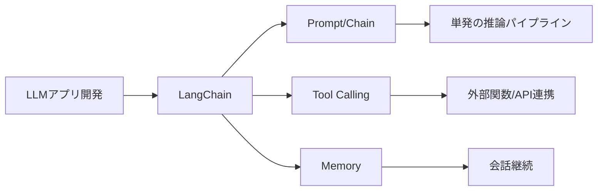
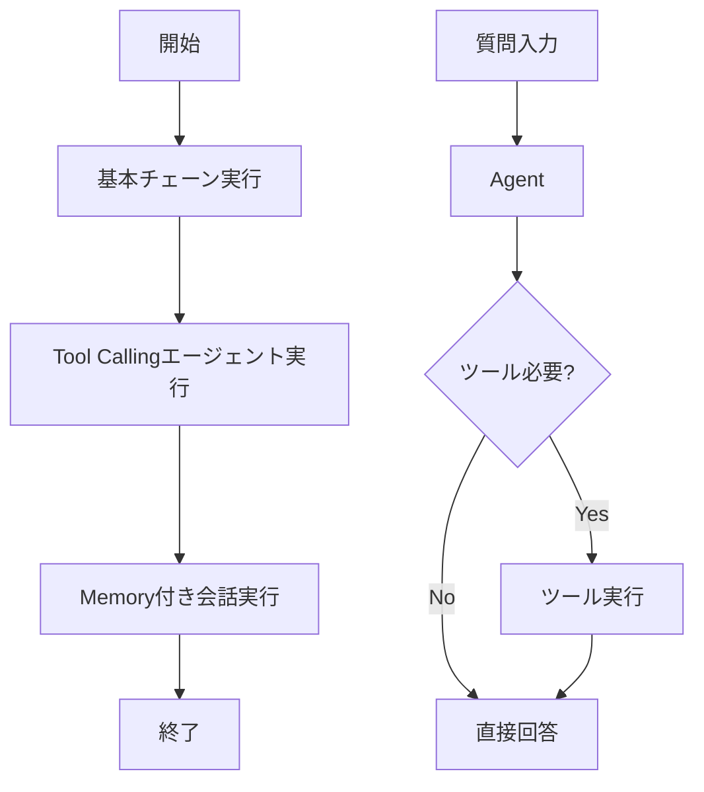

# LangChain - LLMアプリ開発の標準ライブラリ

> 📖 中級（概念・実践） | 前提: Python基礎 / LLMアプリの基本概念

## この教材で身につくこと

- 複数のLLMやツール操作を組み合わせた処理パイプライン
- LLMに関数実行やAPI呼び出しを命令
- 会話履歴やコンテキストを自動管理
- OpenAI、Anthropic、Ollama等に対応

## 概要

**LangChain** は、LLMアプリ開発を簡単にするPython/JS ライブラリです。

**バージョン**: OSS Docs準拠（2026-05時点）  
**公式ドキュメント**: https://docs.langchain.com/oss/python/langchain/overview

### メリット

✅ 学習曲線が緩い（初心者向け）  
✅ ドキュメント充実  
✅ 複数LLM同時対応  
✅ コミュニティが大きい  

### デメリット

❌ 本番運用時にはオーバーヘッドがある  
❌ 設定項目が多い  
❌ バージョン更新が頻繁  

## 位置づけ

この例では、LangChain - LLMアプリ開発の標準ライブラリ の基本的な利用手順を示します。サンプルコードの意図と、実行時に何が起こるのかを確認しながら読み進めると理解しやすくなります。



LangChain は、LLMアプリの共通部品（Prompt、Model、Parser、Tool、Memory）を統一的に扱うための標準レイヤーです。まずは基本チェーン、次にツール呼び出し、最後に会話メモリへ進むと理解しやすくなります。

## 実行フロー



この教材では、同じユースケースを Python と JavaScript で比較しながら、LangChain の中核機能を順に確認します。

処理の流れ:

1. プロンプトをテンプレート化して入力を構造化する
2. モデル呼び出しを標準化して複数プロバイダを切り替える
3. ツール呼び出しで外部データや関数実行を連携する
4. 会話履歴を保持して複数ターンの文脈を維持する
5. 出力パーサで最終形式を整えて後続処理へ渡す

## 最小セットアップ

### 必須スキル

- Python 基本（3.10以上推奨）
- 仮想環境の操作
- API キーの管理

### 環境

- Python 3.10+
- pip
- 仮想環境（venv推奨）

### インストール

```bash
pip install -U "langchain[openai]" python-dotenv
```

### API キーの設定

`.env`
```bash
OPENAI_API_KEY=sk-your-key-here
```

### セキュリティ注意（必読）

- APIキーは `.env` で管理し、ソースコードや教材本文に直接書かない
- `.env` は Git にコミットしない（`.gitignore` に含める）
- APIキーを誤って共有した場合は、OpenAI 側で即時ローテーションする
- 共有や画面投影の前に、ターミナル履歴へキーが残っていないか確認する

### 推奨実行（再現性あり）

この教材には、実行検証用のスクリプトが同梱されています。

```powershell
# Python サンプル一括実行
./examples/run-python-samples.ps1 `
  -ApiKey "<YOUR_KEY>"

# JavaScript サンプル一括実行
./examples/run-js-samples.ps1 `
  -ApiKey "<YOUR_KEY>" `
  -CleanupNodeModules
```

## 実ソースコード（言語別に記載）

### 実行手順と検証

```bash
python 01_basic-chain.py
python 02_tool-use.py
python 03_memory-persistence.py
```

検証ポイント:

- 同じ質問でツールなし回答とツール利用回答を比較する
- 複数ターン会話で前回の文脈が反映されるか確認する

成功時の期待結果（要約）:

- 01_basic-chain: 2つのトピック（生成AI / ベクトル検索）に対して日本語説明が返る
- 02_tool-use: `AAPL` の株価と、`1000 -> 1200` の収益率 `20%` が返る
- 03_memory-persistence: 1回目で伝えた名前を2回目で正しく復唱できる

典型エラーと対処:

- `OPENAI_API_KEY is not set`
  対処: `.env` または環境変数へ `OPENAI_API_KEY` を設定して再実行
- `UnicodeEncodeError`（主に Windows の対話入力/パイプ入力）
  対処: 同梱の `run-python-samples.ps1` を使うか、`PYTHONUTF8=1` を設定して実行
- `LangChainPendingDeprecationWarning`（`allowed_objects`）
  対処: 現時点では動作に致命的影響なし。将来版で警告がエラー化された場合は `langgraph` の更新ノートに従い `allowed_objects` の明示設定を追加

### Python: 01_basic-chain.py

- 役割: Prompt -> LLM -> Parser の最小チェーン
- 入力: topic
- 出力: 生成テキスト
- 実行: `python 01_basic-chain.py`

```python
"""LangChain Basic Chain Example.

実行前に .env へ OPENAI_API_KEY を設定してください。
"""

from dotenv import load_dotenv
from langchain.chat_models import init_chat_model
from langchain_core.prompts import ChatPromptTemplate
from langchain_core.output_parsers import StrOutputParser

# 環境変数読み込み
load_dotenv()

# 1. LLMモデルの初期化
# init_chat_model: プロバイダを抽象化した初期化
llm = init_chat_model(
    "openai:gpt-4o-mini",
    temperature=0.7,
)

# 2. プロンプトテンプレートの作成
# {topic} 部分が動的に置き換わる
prompt_template = ChatPromptTemplate.from_template(
    "以下のトピックについて、日本語で3行程度説明してください: {topic}"
)

# 3. チェーン構築
# Prompt -> LLM -> Output Parser の流れ
chain = prompt_template | llm | StrOutputParser()

# 4. チェーン実行
if __name__ == "__main__":
    topic = "生成AI"
    print(f"Topic: {topic}")
    print("-" * 50)

    result = chain.invoke({"topic": topic})

    print(f"Answer:\n{result}")
    print("-" * 50)

    # 別のトピックでも試す
    topic2 = "ベクトル検索"
    print(f"\nTopic: {topic2}")
    print("-" * 50)

    result2 = chain.invoke({"topic": topic2})
    print(f"Answer:\n{result2}")
```

### Python: 02_tool-use.py

- 役割: ツールを使うエージェント実装
- 入力: question
- 出力: ツール実行を含む最終回答
- 実行: `python 02_tool-use.py`

```python
"""LangChain tool calling example (new agent API)."""

from dotenv import load_dotenv
from langchain.agents import create_agent

load_dotenv()

# ========== ツール定義 ==========
def get_stock_price(symbol: str) -> str:
    """株価を取得する（デモ用）。"""
    prices = {"AAPL": 180.5, "MSFT": 320.0, "7203": 1500.0}
    price = prices.get(symbol, "Not found")
    return f"株価情報: {symbol} = {price}"

def calculate_portfolio_return(
    initial: float,
    final: float,
) -> str:
    """収益率を計算する。"""
    if initial <= 0:
        return "初期投資額が不正です"

    return_rate = ((final - initial) / initial) * 100
    return f"収益率: {return_rate:.2f}%"

# ========== エージェント構築 ==========

tools = [get_stock_price, calculate_portfolio_return]
agent = create_agent(
    model="openai:gpt-4o-mini",
    tools=tools,
    system_prompt=(
        "あなたは金融アシスタントです。"
        "必要ならツールを使ってください。"
    ),
)

# ========== 実行 ==========

if __name__ == "__main__":
    questions = [
        "AAPLの現在の株価を教えてください",
        "1000ドル投資して1200ドルになった場合、収益率は何%ですか？",
    ]

    for question in questions:
        print(f"\nQuestion: {question}")
        print("-" * 60)

        result = agent.invoke(
            {
                "messages": [
                    {"role": "user", "content": question}
                ]
            }
        )

        print(f"\nAnswer: {result['messages'][-1].content}")
        print("=" * 60)
```

### Python: 03_memory-persistence.py

- 役割: 会話履歴付きチェーンの実装
- 入力: question（複数ターン）
- 出力: 履歴を反映した回答
- 実行: `python 03_memory-persistence.py`

```python
"""LangChain memory example (new agent API + checkpointer)."""

from dotenv import load_dotenv
from langchain.agents import create_agent
from langgraph.checkpoint.memory import InMemorySaver

load_dotenv()

memory = InMemorySaver()

agent = create_agent(
    model="openai:gpt-4o-mini",
    tools=[],
    system_prompt=(
        "あなたは親切なAIアシスタントです。"
        "会話履歴を参照して回答してください。"
    ),
    checkpointer=memory,
)

# ========== 実行 ==========

if __name__ == "__main__":
    print("Chat bot with memory")
    print("=" * 60)
    print("同じ thread_id で会話すると履歴を保持します。")
    print("'exit' で終了します。")
    print("=" * 60)

    config = {"configurable": {"thread_id": "demo-thread"}}

    while True:
        user_input = input("\nYou: ").strip()

        if user_input.lower() == "exit":
            print("Bye")
            break

        if not user_input:
            continue

        result = agent.invoke(
            {
                "messages": [
                    {"role": "user", "content": user_input}
                ]
            },
            config=config,
        )

        print(f"Assistant: {result['messages'][-1].content}")
```

### JavaScript: 01_basic-chain.js

- 役割: Node.js版の最小チェーン
- 入力: topic
- 出力: 生成テキスト
- 実行: `node 01_basic-chain.js`

```javascript
/**
 * LangChain JS Basic Chain Example
 *
 * Node.js での LangChain 基本使用法を示します。
 *
 * 実行方法:
 * npm install
 * npm start
 */

import "dotenv/config";
import { ChatOpenAI } from "@langchain/openai";
import { ChatPromptTemplate } from "@langchain/core/prompts";
import { StringOutputParser } from "@langchain/core/output_parsers";

async function main() {
  // 1. LLM の初期化
  const llm = new ChatOpenAI({
    model: "gpt-4o-mini",
    temperature: 0.7,
  });

  // 2. プロンプトテンプレート作成
  const prompt = ChatPromptTemplate.fromTemplate(
    "以下のトピックについて、日本語で3行程度説明してください: {topic}"
  );

  // 3. チェーン構築
  const chain = prompt.pipe(llm).pipe(new StringOutputParser());

  // 4. チェーン実行
  const topic = "生成AI";
  console.log(`Topic: ${topic}`);
  console.log("-".repeat(50));

  const result = await chain.invoke({ topic });

  console.log(`Answer:\n${result}`);
  console.log("-".repeat(50));

  // 別のトピック
  const topic2 = "ベクトル検索";
  console.log(`\nTopic: ${topic2}`);
  console.log("-".repeat(50));

  const result2 = await chain.invoke({ topic: topic2 });
  console.log(`Answer:\n${result2}`);
}

// エラーハンドリング付き実行
main().catch((error) => {
  console.error("❌ エラーが発生しました:", error.message);
  process.exit(1);
});
```

### JavaScript: 02_tool-use.js

- 役割: JS版ツール呼び出しエージェント
- 入力: input
- 出力: ツール結果を反映した回答
- 実行: `node 02_tool-use.js`

```javascript
/**
 * LangChain JS Tool Use Example (new agent API)
 *
 * LLMにツール（関数）実行を命令する方法を示します。
 *
 * 実行方法:
 * npm install
 * node 02_tool-use.js
 */

import "dotenv/config";
import { createAgent, tool } from "langchain";
import * as z from "zod";

// ========== ツール定義 ==========

const getStockPriceTool = tool(
  ({ symbol }) => {
    // デモ用：ダミーデータ
    const prices = { AAPL: 180.5, MSFT: 320.0, "7203": 1500.0 };
    const price = prices[symbol] || "Not found";
    return `株価情報: ${symbol} = $${price}`;
  },
  {
    name: "get_stock_price",
    description: "銘柄コードから株価を取得します。",
    schema: z.object({
      symbol: z.string().describe("銘柄コード (例: AAPL, 7203)"),
    }),
  }
);

const calculateReturnTool = tool(
  ({ initial, final }) => {
    if (initial <= 0) return "初期投資額が不正です";
    const returnRate = ((final - initial) / initial) * 100;
    return `収益率: ${returnRate.toFixed(2)}%`;
  },
  {
    name: "calculate_return",
    description: "投資の収益率を計算します。",
    schema: z.object({
      initial: z.number().describe("初期投資額"),
      final: z.number().describe("最終価値"),
    }),
  }
);

// ========== エージェント構築 ==========

async function main() {
  const tools = [getStockPriceTool, calculateReturnTool];

  const agent = createAgent({
    model: "gpt-4o-mini",
    tools,
    systemPrompt: [
      "You are a helpful financial assistant.",
      "Use tools when needed.",
    ].join(" "),
  });

  // ========== 実行 ==========

  const questions = [
    "AAPLの現在の株価は？",
    "1000ドル投資して1200ドルになった収益率は？",
  ];

  for (const question of questions) {
    console.log(`\nQuestion: ${question}`);
    console.log("-".repeat(60));

    const result = await agent.invoke({
      messages: [{ role: "user", content: question }],
    });

    const last = result.messages[result.messages.length - 1];
    console.log(`Answer: ${last.content}`);
    console.log("=".repeat(60));
  }
}

main().catch((error) => {
  console.error("❌ エラー:", error.message);
  process.exit(1);
});
```

### JavaScript: 03_memory-persistence.js

- 役割: JS版の会話履歴管理
- 入力: input（複数ターン）
- 出力: 履歴を反映した回答
- 実行: `node 03_memory-persistence.js`

```javascript
/**
 * LangChain JS Memory Example (new agent API)
 *
 * 会話履歴を持つシンプルなチャットループ。
 * 実行前に .env へ OPENAI_API_KEY を設定してください。
 */

import "dotenv/config";
import { createAgent } from "langchain";
import { MemorySaver } from "@langchain/langgraph";

async function main() {
  const checkpointer = new MemorySaver();

  const agent = createAgent({
    model: "gpt-4o-mini",
    tools: [],
    systemPrompt: [
      "あなたは丁寧な日本語アシスタントです。",
      "会話履歴を参照して答えてください。",
    ].join(""),
    checkpointer,
  });

  const questions = [
    "私の名前は佐藤です。覚えてください。",
    "私の名前は何ですか？",
    "この会話でやったことを2行でまとめてください。",
  ];

  const config = {
    configurable: {
      thread_id: "js-memory-demo",
    },
  };

  for (const q of questions) {
    const result = await agent.invoke(
      {
        messages: [{ role: "user", content: q }],
      },
      config
    );

    const last = result.messages[result.messages.length - 1];

    console.log(`\nQ: ${q}`);
    console.log(`A: ${last.content}`);
  }

  const state = await agent.getState(config);
  console.log(`\n履歴メッセージ数: ${state.values.messages.length}`);
}

main().catch((e) => {
  console.error("Error:", e.message);
  process.exit(1);
});
```

### JavaScript: 依存関係メモ

- 役割: JS サンプル実行時の最小依存
- 実行: `npm install langchain @langchain/openai @langchain/langgraph zod dotenv`

```json
{
  "type": "module",
  "dependencies": {
    "@langchain/langgraph": "latest",
    "@langchain/openai": "latest",
    "dotenv": "latest",
    "langchain": "latest",
    "zod": "latest"
  }
}
```

---

## 演習課題

1. `LangChain` を使う想定ユースケースを1つ定義し、入力・出力の例を記録してください。
2. 最小構成で動かし、デフォルトから設定を1つ変えて挙動の差分を確認してください。
3. `LangChain` を使わない場合の代替手段と比較し、選ぶ基準をまとめてください。


### 解答の目安

1. まず課題の目的を一文で明確化し、入力・出力を対応づけて記述します。
   確認ポイント: 何を変えて何を確認する課題かを第三者が読んで理解できること。
2. 最小構成で一度実行し、設定や条件を1つ変更して差分を比較します。
   確認ポイント: 変更前後の挙動差を具体的に説明できること。
3. 適用条件と代替手段を整理し、選択基準を短くまとめます。
   確認ポイント: なぜその手段を選ぶかを根拠付きで示せること。

## 理解度チェック

1. `LangChain` の主な役割を1文で説明してください。
2. `LangChain` を導入する際の最大のメリットと注意点は何ですか？
3. `LangChain` が向かないユースケースとして、どのようなケースが考えられますか？


### 解説の要点

1. 主な役割は、その技術がどの工程を担い、何を改善するかで説明します。
2. メリットは再現性・拡張性・運用性の観点で整理し、注意点は導入コストや複雑性として示します。
3. 使い分けは要件、実装コスト、運用体制の3観点で判断します。

## 補足

**Q. Langchainだけで本番環境運用できますか？**  
A. 基本的なアプリには十分ですが、本番向けには LangGraph や別のオーケストレーションツールとの組み合わせを推奨。

**Q. Llamaindex との違いは？**  
A. LangChain は汎用ライブラリ、LlamaIndex は RAG 特化。組み合わせて使うことが多いです。

**Q. ローカルLLMでも動きますか？**  
A. はい。Ollama + LangChain で完全ローカル環境構築可能。

---

## 参考リンク

- [LangChain 公式ドキュメント（Python）](https://docs.langchain.com/oss/python/langchain/overview)
- [LangChain 公式ドキュメント（JavaScript）](https://docs.langchain.com/oss/javascript/langchain/overview)
- [GitHub Repository](https://github.com/langchain-ai/langchain)

---

[← 前へ](00-README.md) | [次へ →](02-langgraph.md)
