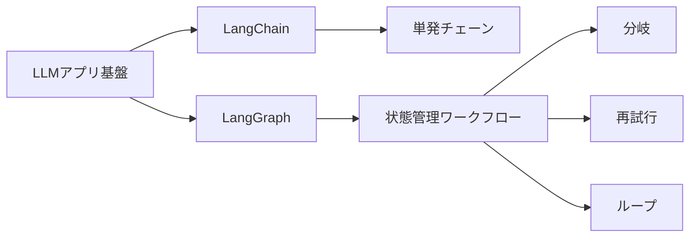
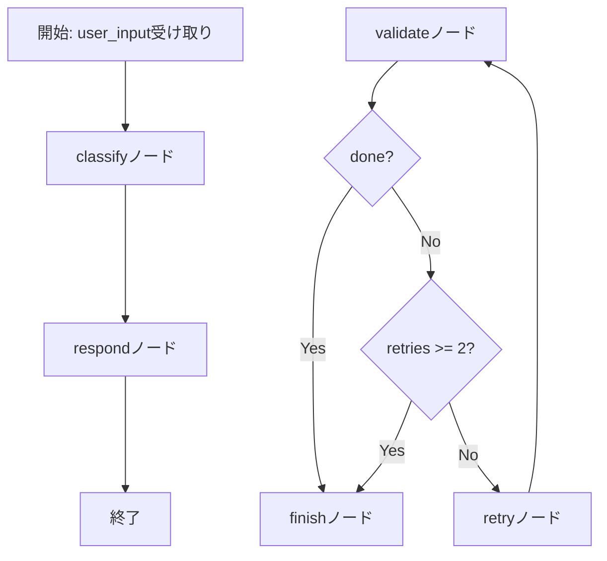

# LangGraph 入門

> 📖 中級（概念・実践） | 前提: Python基礎 / LLMアプリの基本概念

## この教材で身につくこと

- ノードごとに処理を分割
- 条件分岐と再試行
- 状態オブジェクトを持ちながら処理

## 概要

LangGraph は、状態を持つエージェントワークフローをグラフとして定義するライブラリです。複数ステップの分岐やループを明示できるので、実運用の対話フローに向きます。

**バージョン**: 0.1.0+ / OSS準拠（2026-05時点）  
**公式ドキュメント**: https://langchain-ai.github.io/langgraph/

実行の仕組み:

1. 状態オブジェクトを定義して、ノード間で共有します。
2. 各ノードは状態を受け取り、更新した状態を返します。
3. エッジで処理順を固定し、条件分岐で次ノードを選択します。
4. 再試行やループをグラフとして明示し、制御を再現可能にします。
5. 実行結果の状態を見れば、どの分岐を通ったか追跡できます。

## 位置づけ



LangGraph は、LangChain の上位で「状態を持つ処理の流れ」を設計したいときに使います。単発のプロンプト実行ではなく、条件分岐や再試行を含む実運用フローに向いています。

## 実行フロー



この教材では、まず単純な classify -> respond を作り、その後 validate/retry/finish の条件分岐付きワークフローへ拡張します。

## 最小セットアップ

- Python 3.10+
- Node.js 18+（JS版を試す場合）

### インストール

```bash
pip install -r 00_requirements.txt
pip install langchain-openai
```

### API キーの設定

```bash
# macOS/Linux
export OPENAI_API_KEY=your_api_key

# Windows
set OPENAI_API_KEY=your_api_key
```

## 実ソースコード（言語別に記載）

### 実行手順と検証

```bash
cd 02_langgraph-python
python 01_basic-workflow.py
python 01_basic-workflow-llm.py
python 02_state-management.py
```

```bash
cd 02_langgraph-js
npm install
node 01_basic-workflow.js
```

検証ポイント:

- 入力を変えて intent が期待どおりに分岐するか確認する
- retries の上限で finish へ遷移するか確認する

### Python: 01_basic-workflow.py

- 役割: 最小の状態遷移グラフ（classify -> respond）を構築
- 入力: user_input
- 出力: intent, answer
- 実行: `python 01_basic-workflow.py`

```python
"""
LangGraph Basic Workflow

状態を1つ持つシンプルなグラフ。
input -> classify -> respond の流れを体験します。
"""

from typing import TypedDict
from langgraph.graph import StateGraph, END


class GraphState(TypedDict):
	user_input: str
	intent: str
	answer: str


def classify_intent(state: GraphState) -> GraphState:
	text = state["user_input"]
	if "株" in text or "投資" in text:
		intent = "finance"
	elif "天気" in text:
		intent = "weather"
	else:
		intent = "general"

	state["intent"] = intent
	return state


def generate_answer(state: GraphState) -> GraphState:
	intent = state["intent"]
	if intent == "finance":
		msg = "金融カテゴリとして処理します。最初は長期分散投資から学ぶのがおすすめです。"
	elif intent == "weather":
		msg = "天気カテゴリとして処理します。地域名を指定すると詳しく答えられます。"
	else:
		msg = "一般質問として処理します。具体的な前提を入れると精度が上がります。"

	state["answer"] = msg
	return state


def build_graph():
	graph = StateGraph(GraphState)
	graph.add_node("classify", classify_intent)
	graph.add_node("respond", generate_answer)

	graph.set_entry_point("classify")
	graph.add_edge("classify", "respond")
	graph.add_edge("respond", END)

	return graph.compile()


if __name__ == "__main__":
	app = build_graph()

	samples = [
		"投資初心者は何から始めるべき？",
		"明日の天気は？",
		"生成AIの学習順を教えて",
	]

	for s in samples:
		result = app.invoke({"user_input": s, "intent": "", "answer": ""})
		print("\nQ:", s)
		print("Intent:", result["intent"])
		print("A:", result["answer"])
```

### Python: 01_basic-workflow-llm.py

- 役割: classify と respond の両ノードで LLM を呼び出す最小構成
- 前提: OpenAI API キーを環境変数 `OPENAI_API_KEY` に設定済み
- 入力: user_input
- 出力: intent, answer
- 実行: `python 01_basic-workflow-llm.py`

```python
"""
LangGraph Basic Workflow with LLM

ノード内でLLMを呼び、intent判定と応答生成を行う最小例。
OpenAI API を使用します。
"""

from typing import Literal, TypedDict
from langgraph.graph import END, StateGraph
from langchain_openai import ChatOpenAI


class GraphState(TypedDict):
	user_input: str
	intent: str
	answer: str


# モデルは用途に応じて変更可能（例: gpt-4.1-mini, gpt-4o-mini）
llm = ChatOpenAI(model="gpt-4o-mini", temperature=0)


def classify_intent(state: GraphState) -> GraphState:
	prompt = (
		"次のユーザー入力を finance / weather / general のいずれか1語だけで分類してください。\n"
		f"入力: {state['user_input']}"
	)
	out = llm.invoke(prompt).content.strip().lower()

	allowed = {"finance", "weather", "general"}
	intent: Literal["finance", "weather", "general"]
	intent = out if out in allowed else "general"

	state["intent"] = intent
	return state


def generate_answer(state: GraphState) -> GraphState:
	prompt = (
		"あなたは簡潔な日本語アシスタントです。\n"
		f"intent: {state['intent']}\n"
		f"user_input: {state['user_input']}\n"
		"2文以内で回答してください。"
	)

	state["answer"] = llm.invoke(prompt).content.strip()
	return state


def build_graph():
	graph = StateGraph(GraphState)
	graph.add_node("classify", classify_intent)
	graph.add_node("respond", generate_answer)

	graph.set_entry_point("classify")
	graph.add_edge("classify", "respond")
	graph.add_edge("respond", END)

	return graph.compile()


if __name__ == "__main__":
	app = build_graph()

	samples = [
		"投資初心者は何から始めるべき？",
		"明日の天気は？",
		"生成AIの学習順を教えて",
	]

	for s in samples:
		result = app.invoke({"user_input": s, "intent": "", "answer": ""})
		print("\nQ:", s)
		print("Intent:", result["intent"])
		print("A:", result["answer"])
```

### Python: 02_state-management.py

- 役割: 状態（retries, logs, done）を持ち、条件分岐と再試行を実装
- 入力: user_input, retries, logs, done
- 出力: 更新後の状態
- 実行: `python 02_state-management.py`

```python
"""
LangGraph State Management

状態に履歴を持ち、条件分岐を行う例。
"""

from typing import TypedDict, List
from langgraph.graph import StateGraph, END


class WorkflowState(TypedDict):
	user_input: str
	retries: int
	logs: List[str]
	done: bool


def validate_input(state: WorkflowState) -> WorkflowState:
	text = state["user_input"].strip()
	if len(text) < 5:
		state["logs"].append("入力が短すぎるため再入力が必要")
		state["done"] = False
	else:
		state["logs"].append("入力検証OK")
		state["done"] = True
	return state


def retry_or_finish(state: WorkflowState) -> str:
	if state["done"]:
		return "finish"
	if state["retries"] >= 2:
		return "finish"
	return "retry"


def retry_step(state: WorkflowState) -> WorkflowState:
	state["retries"] += 1
	state["user_input"] = state["user_input"] + " (補足)"
	state["logs"].append(f"再試行 {state['retries']} 回目")
	return state


def finish_step(state: WorkflowState) -> WorkflowState:
	state["logs"].append("処理完了")
	return state


def build_graph():
	g = StateGraph(WorkflowState)
	g.add_node("validate", validate_input)
	g.add_node("retry", retry_step)
	g.add_node("finish", finish_step)

	g.set_entry_point("validate")
	g.add_conditional_edges("validate", retry_or_finish, {
		"retry": "retry",
		"finish": "finish",
	})
	g.add_edge("retry", "validate")
	g.add_edge("finish", END)

	return g.compile()


if __name__ == "__main__":
	app = build_graph()
	result = app.invoke({
		"user_input": "AI",
		"retries": 0,
		"logs": [],
		"done": False,
	})

	print("最終入力:", result["user_input"])
	print("再試行回数:", result["retries"])
	print("ログ:")
	for l in result["logs"]:
		print("-", l)
```

### JavaScript: 01_basic-workflow.js

- 役割: JavaScript版の最小状態遷移グラフ
- 入力: user_input
- 出力: intent, answer
- 実行: `node 01_basic-workflow.js`

```javascript
import { StateGraph, END } from "@langchain/langgraph";

function classify(state) {
  const text = state.user_input || "";
  let intent = "general";

  if (text.includes("株") || text.includes("投資")) {
	intent = "finance";
  } else if (text.includes("天気")) {
	intent = "weather";
  }

  return { ...state, intent };
}

function respond(state) {
  const map = {
	finance: "金融カテゴリです。リスク許容度を先に決めましょう。",
	weather: "天気カテゴリです。地域を指定すると精度が上がります。",
	general: "一般カテゴリです。文脈を追加するとより具体化できます。",
  };

  return { ...state, answer: map[state.intent] ?? map.general };
}

const graph = new StateGraph({
  channels: {
	user_input: null,
	intent: null,
	answer: null,
  },
});

graph.addNode("classify", classify);
graph.addNode("respond", respond);
graph.setEntryPoint("classify");
graph.addEdge("classify", "respond");
graph.addEdge("respond", END);

const app = graph.compile();

const samples = [
  "投資を学びたい",
  "天気を教えて",
  "生成AIの勉強法は？",
];

for (const s of samples) {
  const out = await app.invoke({ user_input: s, intent: "", answer: "" });
  console.log("\nQ:", s);
  console.log("Intent:", out.intent);
  console.log("A:", out.answer);
}
```

## 演習課題

1. `LangGraph` を使う想定ユースケースを1つ定義し、入力・出力の例を記録してください。
2. 最小構成で動かし、デフォルトから設定を1つ変えて挙動の差分を確認してください。
3. `LangGraph` を使わない場合の代替手段と比較し、選ぶ基準をまとめてください。


### 解答の目安

1. まず課題の目的を一文で明確化し、入力・出力を対応づけて記述します。
   確認ポイント: 何を変えて何を確認する課題かを第三者が読んで理解できること。
2. 最小構成で一度実行し、設定や条件を1つ変更して差分を比較します。
   確認ポイント: 変更前後の挙動差を具体的に説明できること。
3. 適用条件と代替手段を整理し、選択基準を短くまとめます。
   確認ポイント: なぜその手段を選ぶかを根拠付きで示せること。

## 理解度チェック

1. `LangGraph` の主な役割を1文で説明してください。
2. `LangGraph` を導入する際の最大のメリットと注意点は何ですか？
3. `LangGraph` が向かないユースケースとして、どのようなケースが考えられますか？


### 解説の要点

1. 主な役割は、その技術がどの工程を担い、何を改善するかで説明します。
2. メリットは再現性・拡張性・運用性の観点で整理し、注意点は導入コストや複雑性として示します。
3. 使い分けは要件、実装コスト、運用体制の3観点で判断します。

## 補足

**Q. LangGraph と LangChain の使い分けは？**  
A. LangChain は単発のチェーン（Prompt → LLM → Parser）向け。LangGraph は条件分岐・再試行・ループなど、複数ステップの制御フローが必要な場面向け。

**Q. グラフ設計の際の注意点は？**  
A. ノードが行う処理を小さく保ち、状態の構造をシンプルに設計すること。複雑な分岐は人間にとって保守しにくくなります。

**Q. エラーハンドリングはどう実装する？**  
A. ノード内で例外をキャッチして状態に書き込むか、条件分岐で「エラー分岐」を用意するのが一般的です。

---

## 参考リンク

- [LangGraph 公式ドキュメント](https://langchain-ai.github.io/langgraph/)
- [LangChain JS ドキュメント](https://docs.langchain.com/oss/javascript/langchain/overview)
- [GitHub: LangGraph](https://github.com/langchain-ai/langgraph)
- [State Management ガイド](https://langchain-ai.github.io/langgraph/concepts/agentic_concepts/#state-management)

---

[← 前へ](01-langchain.md) | [次へ →](03-autogen.md)
