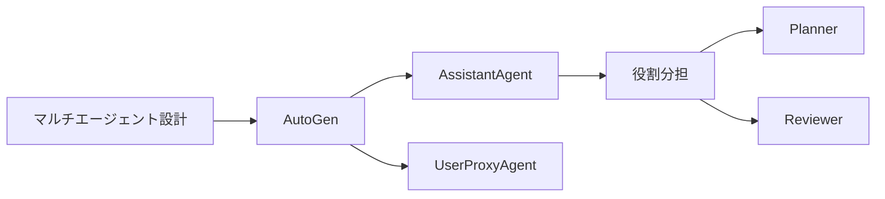
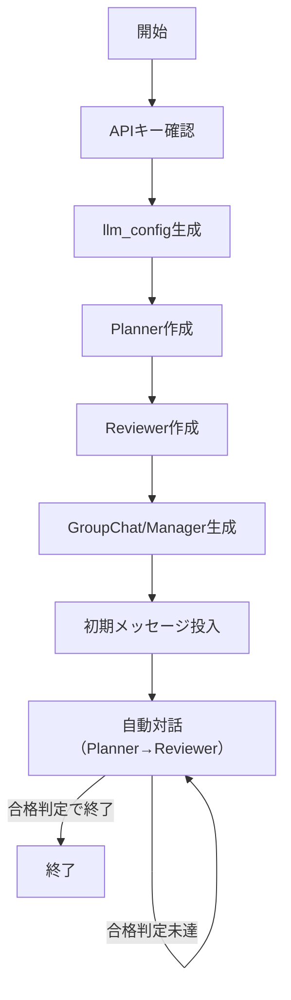

# AutoGen 入門

> 📖 中級（概念・実践） | 前提: Python基礎 / LLMアプリの基本概念

## この教材で身につくこと

- AutoGen 入門 の主な役割と適用場面を説明できる
- AutoGen 入門 を最小構成で動かす手順を実行できる
- 導入時のメリットと注意点を整理できる

## コンセプト
AutoGen は複数エージェントが協調してタスクを進めるフレームワークです。役割を分けた対話を作れるため、レビュー付き生成や議論型の自動化に向きます。

**バージョン**: pyautogen 0.2.34+ / OSS準拠（2026-05時点）  
**公式ドキュメント**: https://microsoft.github.io/autogen/


## 仕組み・実行フロー（サンプルに準拠）

AutoGenの典型的な実行フローは以下の通りです：

1. **APIキー確認**：OpenAI互換APIキーが設定されているか確認
2. **LLM設定**：llm_configを生成し、モデルやパラメータを指定
3. **エージェント生成**：Planner（計画担当）・Reviewer（レビュー担当）など役割ごとにエージェントを作成
4. **対話開始**：初期メッセージを与え、エージェント間で対話を進行
5. **判定**：Reviewerが「合格」と判定したら終了

この流れは、サンプルコードや下記のmermaid図とも対応しています。

## 前提条件
- Python 3.12+
- OpenAI 互換 API キー

## 位置づけ



AutoGen は、エージェント間の対話を直接設計したい場面で有効です。実装担当とレビュー担当を分けることで、1回の生成よりも品質を上げやすくなります。

## 実行フロー（サンプルと対応）




この教材のサンプルは「GroupChat/GroupChatManager」を使い、Planner/Reviewerの2エージェントが自動で対話し、Reviewerが「合格」と判定した時点で終了します。


## 実ソースコード（言語別に記載）
### Python: requirements.txt

- 役割: 実行に必要な依存関係を固定
- 入力: なし
- 出力: uvでインストール可能なパッケージ一覧
- 実行:
	- uv推奨: `uv pip install -r requirements.txt`
		（uv未導入の場合は `pip install uv` で導入）
	- pipも利用可: `pip install -r requirements.txt`

```txt
pyautogen==0.2.34
python-dotenv==1.0.0
```


### Python: 01_two-agents-chat.py（GroupChat/GroupChatManager版）

- 役割: Planner/Reviewer の2エージェント対話を自動で進行
- 入力: タスク文（例: AWSトレーニング計画）
- 出力: 計画案とレビュー結果（全ログ）
- 実行: `python 01_two-agents-chat.py`


```python
"""
AutoGen Two Agents Chat (GroupChat版)

【実行フロー】
1. APIキー確認
2. LLM設定（llm_config生成）
3. Planner/Reviewerエージェント生成
4. GroupChat/Manager生成
5. 対話開始（初期メッセージ投入）
6. Reviewerが「合格」と判定したら自動終了
"""

import os
from dotenv import load_dotenv
import autogen

load_dotenv()

def main() -> None:
    api_key = os.getenv("OPENAI_API_KEY")
    if not api_key:
        raise RuntimeError("OPENAI_API_KEY が未設定です。.env を確認してください。")

    llm_config = {
        "config_list": [
            {
                "model": "gpt-4o-mini",
                "api_key": api_key,
            }
        ],
        "temperature": 0.2,
    }

    planner = autogen.AssistantAgent(
        name="Planner",
        llm_config=llm_config,
        system_message=(
            "あなたは実装計画担当です。"
            "初心者にも分かる箇条書きで、短い計画を作成してください。"
        ),
    )

    reviewer = autogen.AssistantAgent(
        name="Reviewer",
        llm_config=llm_config,
        system_message=(
            "あなたはレビュー担当です。"
            "計画が基準を満たしていれば必ず『合格』と明記し、"
            "そうでなければ欠落点を2つまで指摘し、改善案を提案してください。"
        ),
    )


    from autogen import GroupChat, GroupChatManager

    groupchat = GroupChat(
        agents=[planner, reviewer],
        messages=[],
        max_round=10,
    )
    manager = GroupChatManager(groupchat=groupchat, human_input_mode="NEVER")
    initial_message = [{
        "content": "会社の新入社員向けに、3時間で完結するAWSトレーニング計画（セッションごとのテーマ・時間・内容）を作成してください。各セッションのテーマ・所要時間・学習内容を箇条書きで示してください。",
        "role": "user"
    }]

    # --- 合格判定で自動終了するラッパー ---
    def run_until_pass(manager, groupchat, initial_message, planner, reviewer):
        messages = initial_message
        for i in range(groupchat.max_round):
            # run_chatは1ターンずつ進める設計ではないため、会話履歴を都度確認
            manager.run_chat(messages=messages, config=groupchat, sender=planner)
            # Reviewerの最新発言を取得
            reviewer_msgs = [m for m in groupchat.messages if m.get("name") == reviewer.name]
            if reviewer_msgs and "合格" in reviewer_msgs[-1].get("content", ""):
                print("\n基準を満たしました。終了します。")
                break
            # Plannerの最新発言を次ターンのmessagesに渡す
            planner_msgs = [m for m in groupchat.messages if m.get("name") == planner.name]
            if planner_msgs:
                messages = [planner_msgs[-1]]
            else:
                break

    run_until_pass(manager, groupchat, initial_message, planner, reviewer)

if __name__ == "__main__":
    main()
```

## 実行
```bash
cd 03_autogen-python
uv pip install -r requirements.txt  # uv推奨
.venv\Scripts\activate  # 仮想環境を使う場合（Windows例）
python 01_two-agents-chat.py
```

### サンプル実行結果例（抜粋）

```plaintext
[autogen.oai.client: 05-22 23:52:07] {164} WARNING -
The API key specified is not a valid OpenAI format;
it won't work with the OpenAI-hosted model.
[autogen.oai.client: 05-22 23:52:08] {164} WARNING -
The API key specified is not a valid OpenAI format;
it won't work with the OpenAI-hosted model.

Next speaker: Reviewer

Reviewer (to chat_manager):

合格

以下は新入社員向けの3時間で完結するAWSトレーニング計画です。

### トレーニング計画

#### セッション1: AWSの基本概念 (30分)
- **テーマ**: AWSとは何か
- **所要時間**: 30分
- **学習内容**:
  - クラウドコンピューティングの概要
  - AWSのサービスとその利点
  - AWSのグローバルインフラストラクチャ

#### セッション2: AWS管理コンソールの使い方 (30分)
- **テーマ**: AWS管理コンソールのナビゲーション
- **所要時間**: 30分
- **学習内容**:
  - AWS管理コンソールへのログイン方法
  - 基本的なサービスの探し方
  - リソースの作成と管理

#### セッション3: EC2の基本 (1時間)
- **テーマ**: Amazon EC2の概要と利用方法
- **所要時間**: 1時間
- **学習内容**:
  - EC2インスタンスの種類と用途
  - インスタンスの起動と設定
  - セキュリティグループの設定

#### セッション4: S3の基本 (30分)
- **テーマ**: Amazon S3の利用
- **所要時間**: 30分
- **学習内容**:
  - S3の基本概念とユースケース
  - バケットの作成とオブジェクトのアップロード
  - アクセス管理とセキュリティ

#### セッション5: AWSの料金体系とコスト管理 (30分)
- **テーマ**: AWSの料金モデル
- **所要時間**: 30分
- **学習内容**:
  - AWSの料金体系の概要
  - コスト管理ツールの紹介
  - 無料利用枠の活用方法

### 合計所要時間: 3時間

この計画は新入社員がAWSの基本を理解し、実際に操作するための基礎を築くことを目的としています。

--------------------------------------------------------------------------------

Next speaker: Planner

Planner (to chat_manager):

### AWSトレーニング計画 (3時間)

#### セッション1: AWSの基本概念 (30分)
- **目的**: AWSの全体像を理解する
- **内容**:
  - クラウドコンピューティングとは
  - AWSの主要サービスと利点
  - AWSのインフラストラクチャの概要

#### セッション2: AWS管理コンソールの使い方 (30分)
- **目的**: AWS管理コンソールの操作を学ぶ
- **内容**:
  - 管理コンソールへのログイン方法
  - サービスの検索方法
  - リソースの作成と管理方法

#### セッション3: EC2の基本 (1時間)
- **目的**: EC2の基本を理解し、操作する
- **内容**:
  - EC2インスタンスの種類と用途
  - インスタンスの起動手順
  - セキュリティグループの設定方法

#### セッション4: S3の基本 (30分)
- **目的**: S3の使い方を学ぶ
- **内容**:
  - S3の基本概念とユースケース
  - バケットの作成とオブジェクトのアップロード方法
  - アクセス管理とセキュリティの設定

#### セッション5: AWSの料金体系とコスト管理 (30分)
- **目的**: AWSの料金モデルを理解する
- **内容**:
  - AWSの料金体系の概要
  - コスト管理ツールの紹介
  - 無料利用枠の活用方法

### 合計所要時間: 3時間

この計画は新入社員がAWSの基本を理解し、実際に操作するための基礎を築くことを目的としています。

--------------------------------------------------------------------------------

Next speaker: Reviewer

Reviewer (to chat_manager):

合格

改訂版のAWSトレーニング計画は、非常に充実した内容になっています。事前準備、ハンズオン、Q&A、ケーススタディ、フォローアップの要素が組み込まれており、参加者が実践的に学び、理解を深めるための良い環境が整っています。

### さらなる提案
特に欠落点は見受けられませんが、以下の点を考慮するとさらに良いトレーニング計画になるかもしれません。

1. **グループディスカッションの導入**:
   - 各セッションのケーススタディ後に、参加者を小グループに分けてディスカッションを行う時間を設けることで、異なる視点やアイデアを共有し、理解を深めることができます。

2. **実践的なプロジェクトの提案**:
   - トレーニング終了後に、参加者が自分の学びを活かせるような小規模なプロジェクトを提案し、実際にAWSを使ってみる機会を提供すると良いでしょう。

これらの提案を取り入れることで、トレーニングの効果をさらに高め、参加者の学習体験をより豊かにすることができるでしょう。全体として、非常に良いトレーニング計画です！

--------------------------------------------------------------------------------

基準を満たしました。終了します。
```

> ※実際の出力はAPIやプロンプト内容により異なりますが、「合格」判定が複数回現れる場合があるのはAutoGenのGroupChatManagerの仕様によるものです。

## 補足

**Q. run_until_passで「合格」が1回目で出ても、なぜ複数ターン分の会話が記録されるの？**  
A. AutoGenのGroupChatManagerのrun_chatは、messages引数を起点に
複数ターン分のやりとりを一度に自動進行します。
そのため、Reviewerが1回目で「合格」と出力しても、
run_chat実行時にPlanner→Reviewerの会話が複数回分まとめて進み、
結果として複数ターン分の会話が履歴に記録されます。
現状のAPI仕様では、1ターンごとに厳密に制御することは難しいため、
この挙動は仕様上の制約です。

**Q. 合格判定はどのように行われる？**  
A. Reviewerのsystem_messageで「合格」と明記するよう指示し、出力に「合格」が含まれるか人間が確認します。AutoGen本体は自動判定しません。

**Q. AutoGen と LangGraph の使い分けは？**  
A. AutoGen は「エージェント間の自然な対話」を重視する設計。LangGraph は「状態とグラフで厳密に制御」したい場面向け。AutoGen の方が実装が簡単ですが、ログ解析やデバッグは手間がかかります。

**Q. max_consecutive_auto_reply の値を大きくしても大丈夫？**  
A. API 呼び出し回数が増え、コストが嵩みます。3～5 程度に抑え、ループのリスクを低くするのが推奨。

**Q. code_execution_config を有効にできる？**  
A. はい。`{"last_n_messages": 2, "work_dir": "./code"}` のように設定すれば、エージェントが生成コードを実行できます。セキュリティリスクに注意。

---

## 参考リンク

- [AutoGen 公式ドキュメント](https://microsoft.github.io/autogen/)
- [AutoGen GitHub](https://github.com/microsoft/autogen)
- [Agent Configuration Guide](https://microsoft.github.io/autogen/docs/Use-Cases/agent_chat)
- [LLM Configuration](https://microsoft.github.io/autogen/docs/Getting-Started/Installation)

---

## 演習課題

1. ``AutoGen 入門`` を使う想定ユースケースを1つ定義し、入力・出力の例を記録してください。
2. 最小構成で動かし、デフォルトから設定を1つ変えて挙動の差分を確認してください。
3. ``AutoGen 入門`` を使わない場合の代替手段と比較し、選ぶ基準をまとめてください。


### 解答の目安

1. まず課題の目的を一文で明確化し、入力・出力を対応づけて記述します。
   確認ポイント: 何を変えて何を確認する課題かを第三者が読んで理解できること。
2. 最小構成で一度実行し、設定や条件を1つ変更して差分を比較します。
   確認ポイント: 変更前後の挙動差を具体的に説明できること。
3. 適用条件と代替手段を整理し、選択基準を短くまとめます。
   確認ポイント: なぜその手段を選ぶかを根拠付きで示せること。

## 理解度チェック

1. ``AutoGen 入門`` の主な役割を1文で説明してください。
2. ``AutoGen 入門`` を導入する際の最大のメリットと注意点は何ですか？
3. ``AutoGen 入門`` が向かないユースケースとして、どのようなケースが考えられますか？


### 解説の要点

1. 主な役割は、その技術がどの工程を担い、何を改善するかで説明します。
2. メリットは再現性・拡張性・運用性の観点で整理し、注意点は導入コストや複雑性として示します。
3. 使い分けは要件、実装コスト、運用体制の3観点で判断します。
---

[← 前へ](01-agent-orchestration/02-langgraph.md) | [次へ →](01-agent-orchestration/04-crewai.md)


