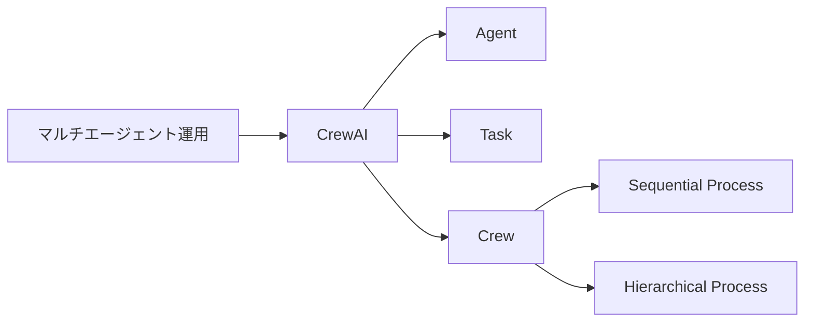
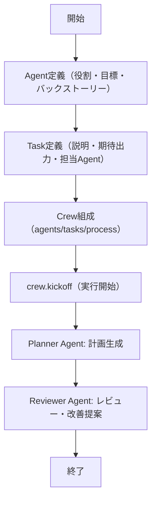

# CrewAI - 役割分担型マルチエージェント協調フレームワーク

> 📖 中級（概念・実践） | 前提: Python基礎 / LLMアプリの基本概念

## この教材で身につくこと

- Agent/Task/Crew/Process の明示的な設計パターン
- 順次（sequential）と階層（hierarchical）プロセスの使い分け
- 役割分担によるレビュー・品質向上フローの実装

## 概要

CrewAI は、役割分担型のマルチエージェント協調フレームワークです。タスク分割・責務明確化・再現性ある自動化に強みを持ちます。

**バージョン**: 0.41.1+（2026-05時点）  
**公式ドキュメント**: https://docs.crewai.com/

### 構成要素

- **Agent**: 役割・目標・個別プロンプトを持つ実行主体
- **Task**: 期待出力・説明・担当Agentを持つ作業単位
- **Crew**: Agent/Task/Processを束ねるチーム
- **Process**: 実行順序（sequential/hierarchical）

### プロセス設計

- **sequential**: タスクを順番に実行。前段の出力を次段へ渡す。
- **hierarchical**: マネージャーAgentが全体を統括し、サブタスクを動的に割り当て。

### 他フレームワークとの違い

| フレームワーク | 構造 | 柔軟性 | 適用例 |
|---|---|---|---|
| CrewAI | 役割・タスク・プロセスを先に定義 | 高い再現性・運用性 | 本番運用・品質管理 |
| AutoGen | エージェント間の対話を柔軟に設計 | 柔軟な対話・探索 | 研究・PoC・対話型 |

## 位置づけ



CrewAI は、再現性・品質・分業・レビュー重視の本番運用や段階的改善に向いています。柔軟な対話・動的な探索が主目的の場合は AutoGen を検討してください。

## 実行フロー



CrewAI は Agent/Task/Crew を先に宣言し、`kickoff()` で実行を開始します。sequential プロセスでは前段の出力が次のタスクへ自動的に渡されます。

## 最小セットアップ

### 環境要件

- Python 3.12+（必須）
- OpenAI API キー

### 仮想環境の作成

```bash
uv venv .venv
# Windowsの場合
.venv\Scripts\activate
# macOS/Linuxの場合
source .venv/bin/activate
```

### 依存パッケージのインストール

```bash
uv pip install -r requirements.txt
```

### API キーの設定

`.env`
```bash
OPENAI_API_KEY=sk-your-key-here
```

### 文字化け・cp932エラー対策（Windows）

CrewAIの出力にはUnicode文字が含まれるため、Windows標準のcp932環境ではエンコードエラーが発生します。下記のいずれかを実施してください。

```powershell
chcp 65001
$env:PYTHONIOENCODING="utf-8"
```

## 実ソースコード（言語別に記載）

### 実行手順と検証

```bash
python 01_basic-crew.py
```

成功時の期待結果（抜粋）:

```console
Crew Execution Started
Name: crew
ID: a1a466a3-9e02-4629-97c9-de6aa1df25af

Task Started
Name:
会社の新入社員向けに、3時間で完結するAWSトレーニング計画を作成してください。
各セッションのテーマ・所要時間・学習内容を箇条書きで示してください。

Agent Started: AWS Professional
[中略]
Agent Final Answer: 【3時間で完結する新入社員向けAWSトレーニング計画】

Task Completion: AWS Professional
Task Started: task1 の結果をレビューし、改善提案を3点以内で示してください。
Agent Started: Quality Reviewer
[中略]
Agent Final Answer: 【レビューコメント】

Task Completion: Quality Reviewer
Crew Execution Completed
Tracing Status: disabled
```

### Python: requirements.txt

- 役割: CrewAI教材の依存関係を固定
- 入力: なし
- 出力: インストール対象パッケージ一覧

```txt
crewai==0.41.1
python-dotenv==1.0.0
```

### Python: 01_basic-crew.py（2エージェント・2タスク・sequentialプロセス）

- 役割: Analyst/Reviewer の2エージェントによる計画生成とレビュー
- 入力: タスク文（例: AWSトレーニング計画）
- 出力: 計画案とレビューコメント
- 実行: `python 01_basic-crew.py`

```python
import os
from dotenv import load_dotenv
from crewai import Agent, Task, Crew, Process

load_dotenv()

def ensure_key() -> None:
    if not os.getenv("OPENAI_API_KEY"):
        raise RuntimeError("OPENAI_API_KEY が設定されていません")

def main() -> None:
    ensure_key()

    analyst = Agent(
        role="AWS Professional",
        goal="会社の新人向けに3時間で完結するAWSトレーニング計画を作成する",
        backstory="初心者向け説明が得意なAWSプロフェッショナル",
        verbose=True,
    )

    reviewer = Agent(
        role="Quality Reviewer",
        goal="トレーニング計画の抜け漏れや分かりにくい点を検出し、改善提案を行う",
        backstory="品質保証担当としてAWS教育の観点を持つ",
        verbose=True,
    )

    task1 = Task(
        description=(
            "会社の新入社員向けに、3時間で完結するAWSトレーニング計画を作成してください。"
            "各セッションのテーマ・所要時間・学習内容を箇条書きで示してください。"
        ),
        expected_output="3時間分のAWSトレーニング計画（セッションごとのテーマ・時間・内容）",
        agent=analyst,
    )

    task2 = Task(
        description="task1 の結果をレビューし、改善提案を3点以内で示してください。",
        expected_output="レビューコメントと改善版",
        agent=reviewer,
    )

    crew = Crew(
        agents=[analyst, reviewer],
        tasks=[task1, task2],
        process=Process.sequential,
        verbose=True,
    )

    result = crew.kickoff()

if __name__ == "__main__":
    main()
```

### プロセス制御と拡張

#### 「繰り返し制御」の可否と実現方法

CrewAI標準（sequential/hierarchical）は「定義したタスクを一度ずつ実行」する設計です。**自動ループ（基準を満たすまで繰り返す）** は標準APIでは未サポートです。

実現パターン:

1. **Python側でCrew実行をラップ**
    ```python
    while True:
        result = crew.kickoff()
        if 検証関数(result):
            break
    ```
2. **プロンプト工夫**: Agent/Taskの説明に「基準を満たすまで再実行・改善」と明記し、出力に合格判定・再依頼を促す
3. **hierarchical＋マネージャー型**: マネージャーAgentが合否判定し、必要に応じて再タスク生成（ただし現状は自動再生成は難しい）

### 選択基準と比較

| 観点 | CrewAI | AutoGen |
|---|---|---|
| 設計 | 役割・タスク・プロセスを明示 | 柔軟な対話・動的設計 |
| 再現性 | 高い | 低め（対話に依存） |
| 運用性 | 本番向き | 研究・PoC向き |
| 拡張性 | OSSで拡張容易 | 柔軟だが複雑化しやすい |
| 適用例 | 品質管理・レビュー・分業 | 対話型探索・実験 |

## 演習課題

1. CrewAI を使う想定ユースケースを1つ定義し、入力・出力例を記録してください。
2. 最小構成で動かし、設定を1つ変えて挙動の差分を確認してください。
3. CrewAI を使わない場合の代替手段と比較し、選択基準をまとめてください。

### 解答の目安

1. まず課題の目的を一文で明確化し、入力・出力を対応づけて記述します。
   確認ポイント: 何を変えて何を確認する課題かを第三者が読んで理解できること。
2. 最小構成で一度実行し、設定や条件を1つ変更して差分を比較します。
   確認ポイント: 変更前後の挙動差を具体的に説明できること。
3. 適用条件と代替手段を整理し、選択基準を短くまとめます。
   確認ポイント: なぜその手段を選ぶかを根拠付きで示せること。

## 理解度チェック

1. CrewAI の主な役割を1文で説明してください。
2. CrewAI を導入する際の最大のメリットと注意点は何ですか？
3. CrewAI が向かないユースケースとして、どのようなケースが考えられますか？

### 解説の要点

1. 主な役割は、その技術がどの工程を担い、何を改善するかで説明します。
2. メリットは再現性・拡張性・運用性の観点で整理し、注意点は導入コストや複雑性として示します。
3. 使い分けは要件、実装コスト、運用体制の3観点で判断します。

## 補足

- Q. モデルを明示的に指定できる？
    - A. `Agent(..., model="gpt-4o-mini")` のように指定可能。未指定時は `OPENAI_MODEL_NAME` を参照。
- Q. Windowsで文字化けする
    - A. `chcp 65001` と `PYTHONIOENCODING="utf-8"` を設定
- Q. hierarchicalで自動ループできる？
    - A. 現状は自動再タスク生成は難しい。Python側でループ制御推奨。

---

## 参考リンク

- [CrewAI 公式ドキュメント](https://docs.crewai.com/)
- [CrewAI GitHub](https://github.com/joaomdmoura/crewai)
- [Agent クラスリファレンス](https://docs.crewai.com/core-concepts/Agents)
- [Task クラスリファレンス](https://docs.crewai.com/core-concepts/Tasks)
- [プロセス設定ガイド](https://docs.crewai.com/core-concepts/Processes)

---

[← 前へ](03-autogen.md) | [次へ →](05-semantic-kernel.md)
