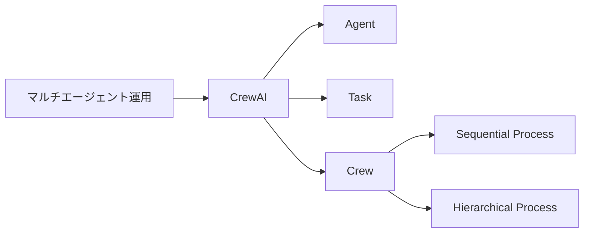

# CrewAI 体系ガイド：設計・選択・実践

> 📖 中級（概念・実践） | 前提: Python基礎 / LLMアプリの基本概念

---

## 1. CrewAIとは何か

- **目的**: 役割分担型のマルチエージェント協調フレームワーク。タスク分割・責務明確化・再現性ある自動化に強み。
- **特徴**: Agent/Task/Crew/Processの明示的設計。順次/階層型プロセス。OSSで拡張性あり。
- **主な適用領域**: 分業・レビュー・段階的品質向上・再現性重視の業務自動化。
- **バージョン**: 0.41.1+（2026-05時点）
- **公式**: https://docs.crewai.com/

### 他フレームワークとの違い
| フレームワーク | 構造 | 柔軟性 | 適用例 |
|---|---|---|---|
| CrewAI | 役割・タスク・プロセスを先に定義 | 高い再現性・運用性 | 本番運用・品質管理 |
| AutoGen | エージェント間の対話を柔軟に設計 | 柔軟な対話・探索 | 研究・PoC・対話型 |

---

## 2. 基本構造と設計パターン

### 構成要素
- **Agent**: 役割・目標・個別プロンプトを持つ実行主体
- **Task**: 期待出力・説明・担当Agentを持つ作業単位
- **Crew**: Agent/Task/Processを束ねるチーム
- **Process**: 実行順序（sequential/hierarchical）

### プロセス設計
- **sequential**: タスクを順番に実行。前段の出力を次段へ渡す。
- **hierarchical**: マネージャーAgentが全体を統括し、サブタスクを動的に割り当て。

#### Mermaid図（構造）


---

## 3. プロセス制御と拡張

### タスク分割・役割分担の設計指針
- ゴールを明確化し、責務ごとにAgent/Taskを分割
- レビュー・改善・検証など多段階化も容易

### 「繰り返し制御」の可否と実現方法
- CrewAI標準（sequential/hierarchical）は「定義したタスクを一度ずつ実行」する設計
- **自動ループ（基準を満たすまで繰り返す）**は標準APIでは未サポート

#### 実現パターン
1. **Python側でCrew実行をラップ**
    ```python
    while True:
        result = crew.kickoff()
        if 検証関数(result):
            break
    ```
2. **プロンプト工夫**
    - Agent/Taskの説明に「基準を満たすまで再実行・改善」と明記し、出力に合格判定・再依頼を促す
3. **hierarchical＋マネージャー型**
    - マネージャーAgentが合否判定し、必要に応じて再タスク生成（ただし現状は自動再生成は難しい）

---

## 4. 実装例

### 最小構成サンプル
（2エージェント・2タスク・sequentialプロセス）
```python
import os
from dotenv import load_dotenv
from crewai import Agent, Task, Crew, Process

load_dotenv()

def ensure_key() -> None:
    if not os.getenv("OPENAI_API_KEY"):
        raise RuntimeError("OPENAI_API_KEY が設定されていません")

def main() -> None:
    ensure_key()

    analyst = Agent(
        role="AWS Professional",
        goal="会社の新人向けに3時間で完結するAWSトレーニング計画を作成する",
        backstory="初心者向け説明が得意なAWSプロフェッショナル",
        verbose=True,
    )

    reviewer = Agent(
        role="Quality Reviewer",
        goal="トレーニング計画の抜け漏れや分かりにくい点を検出し、改善提案を行う",
        backstory="品質保証担当としてAWS教育の観点を持つ",
        verbose=True,
    )

    task1 = Task(
        description=(
            "会社の新入社員向けに、3時間で完結するAWSトレーニング計画を作成してください。"
            "各セッションのテーマ・所要時間・学習内容を箇条書きで示してください。"
        ),
        expected_output="3時間分のAWSトレーニング計画（セッションごとのテーマ・時間・内容）",
        agent=analyst,
    )

    task2 = Task(
        description="task1 の結果をレビューし、改善提案を3点以内で示してください。",
        expected_output="レビューコメントと改善版",
        agent=reviewer,
    )

    crew = Crew(
        agents=[analyst, reviewer],
        tasks=[task1, task2],
        process=Process.sequential,
        verbose=True,
    )

    result = crew.kickoff()

if __name__ == "__main__":
    main()
```

### Python: requirements.txt

- 役割: CrewAI教材の依存関係を固定
- 入力: なし
- 出力: インストール対象パッケージ一覧

```txt
crewai==0.41.1
python-dotenv==1.0.0
```

---

## セットアップ手順（推奨: uv 利用）
### 文字化け・cp932エラー対策（Windows）
CrewAIの出力には絵文字などのUnicode文字が含まれるため、Windows標準のcp932（Shift_JIS）環境ではエンコードエラーが発生します。下記のいずれかを実施してください。

### 1. 仮想環境の作成（Python 3.12系必須）
```bash
uv venv .venv
# Windowsの場合
.venv\Scripts\activate
# macOS/Linuxの場合
source .venv/bin/activate
```

### 2. 依存パッケージのインストール
```bash
uv pip install -r requirements.txt
```

### 3. 文字化け・cp932エラー対策（Windows）
CrewAIの出力にはUnicode文字が含まれるため、Windows標準のcp932環境ではエンコードエラーが発生します。下記のいずれかを実施してください。

```powershell
chcp 65001
$env:PYTHONIOENCODING="utf-8"
```

### 4. CrewAIサンプルの実行と証拠ファイル生成
```bash
python 01_basic-crew.py
```

### 5. 実行結果
```console
┌──────────────────────────────────────────────────────────── 🚀 Crew Execution Started ─────────────────────────────────────────────────────────────┐
│                                                                                                                                                    │
│  Crew Execution Started                                                                                                                            │
│  Name: crew                                                                                                                                        │
│  ID: a1a466a3-9e02-4629-97c9-de6aa1df25af                                                                                                          │
│                                                                                                                                                    │
│                                                                                                                                                    │
└────────────────────────────────────────────────────────────────────────────────────────────────────────────────────────────────────────────────────┘

┌───────────────────────────────────────────────────────────────── 📋 Task Started ──────────────────────────────────────────────────────────────────┐
│                                                                                                                                                    │
│  Task Started                                                                                                                                      │
│  Name:                                                                                                                                             │
│  会社の新入社員向けに、3時間で完結するAWSトレーニング計画を作成してください。各セッションのテーマ・所要時間・学習内容を箇条書きで示してください。  │
│  ID: b9cc19a1-b9cd-4eb3-bbac-0651e8cb8869                                                                                                          │
│                                                                                                                                                    │
│                                                                                                                                                    │
└────────────────────────────────────────────────────────────────────────────────────────────────────────────────────────────────────────────────────┘

┌───────────────────────────────────────────────────────────────── 🤖 Agent Started ─────────────────────────────────────────────────────────────────┐
│                                                                                                                                                    │
│  Agent: AWS Professional                                                                                                                           │
│                                                                                                                                                    │
│  Task:                                                                                                                                             │
│  会社の新入社員向けに、3時間で完結するAWSトレーニング計画を作成してください。各セッションのテーマ・所要時間・学習内容を箇条書きで示してください。  │
│                                                                                                                                                    │
└────────────────────────────────────────────────────────────────────────────────────────────────────────────────────────────────────────────────────┘

[Finalize] todos_count=0, todos_with_results=0
┌────────────────────────────────────────────────────────────── ✅ Agent Final Answer ───────────────────────────────────────────────────────────────┐
│                                                                                                                                                    │
│  Agent: AWS Professional                                                                                                                           │
│                                                                                                                                                    │
│  Final Answer:                                                                                                                                     │
│  【3時間で完結する新入社員向けAWSトレーニング計画】                                                                                                │
│                                                                                                                                                    │
│  ■趣旨                                                                                                                                             │
│  AWSの基礎を理解し、今後の業務で活用できる土台を作るための初心者向け研修。                                                                         │
│  実際に手を動かすハンズオンは時間の都合上省き、概念理解と主要サービスの全体像把握を中心に進める。                                                  │
│                                                                                                                                                    │
│  ---                                                                                                                                               │
│                                                                                                                                                    │
│  ### セッション① AWSとクラウド基礎理解                                                                                                             │
│  - 時間：40分                                                                                                                                      │
│  - 学習内容：                                                                                                                                      │
│    - クラウドコンピューティングとは何か（従来のオンプレミスとの違い、メリット）                                                                    │
│    - AWSの概要（歴史、グローバルインフラ、リージョン・アベイラビリティゾーンの概念）                                                               │
│    - AWSの料金体系と無料利用枠の説明                                                                                                               │
│    - AWS管理コンソールの紹介（画面構成、主要操作方法のイメージ）                                                                                   │
│                                                                                                                                                    │
│  ---                                                                                                                                               │
│                                                                                                                                                    │
│  ### セッション② 主要サービスとその用途理解                                                                                                        │
│  - 時間：70分                                                                                                                                      │
│  - 学習内容：                                                                                                                                      │
│    - コンピューティング系                                                                                                                          │
│      - Amazon EC2（仮想サーバーの概念、用途）                                                                                                      │
│      - AWS Lambda（サーバーレス実行の概念）                                                                                                        │
│    - ストレージ系                                                                                                                                  │
│      - Amazon S3（オブジェクトストレージの仕組みと特徴）                                                                                           │
│    - ネットワーク系                                                                                                                                │
│      - VPC（仮想ネットワークの概念）                                                                                                               │
│    - データベース系                                                                                                                                │
│      - Amazon RDS（マネージドデータベースの概要）                                                                                                  │
│    - セキュリティ系                                                                                                                                │
│      - IAM（認証と権限管理の基本）                                                                                                                 │
│    - 上記サービスを業務でどう使うかの簡単なケーススタディ・紹介                                                                                    │
│                                                                                                                                                    │
│  ---                                                                                                                                               │
│                                                                                                                                                    │
│  ### セッション③ AWSアカウント作成から簡単な操作紹介                                                                                               │
│  - 時間：50分                                                                                                                                      │
│  - 学習内容：                                                                                                                                      │
│    - AWSアカウント作成の流れ（注意点含む）                                                                                                         │
│    - AWS管理コンソールのログインとダッシュボード概要                                                                                               │
│    - IAMユーザーの作成と権限設定の基礎                                                                                                             │
│    - EC2インスタンス起動のデモ（実際に起動・停止・削除の流れを画面で見せる）                                                                       │
│    - S3バケット作成とファイルアップロードのデモ                                                                                                    │
│    - 質疑応答                                                                                                                                      │
│                                                                                                                                                    │
│  ---                                                                                                                                               │
│                                                                                                                                                    │
│  ### セッション④ 今後の学習指針とリソース紹介                                                                                                      │
│  - 時間：20分                                                                                                                                      │
│  - 学習内容：                                                                                                                                      │
│    - AWS 公式ドキュメントと無料トレーニング（AWS Skill Builder等）                                                                                 │
│    - よく使うAWS CLIの軽い紹介（触るタイミングについて）                                                                                           │
│    - AWS Well-Architected Frameworkの概要                                                                                                          │
│    - 社内でのAWS利用ルールやサポート体制の案内                                                                                                     │
│    - 今後推奨される学習ロードマップ案内（資格取得含む）                                                                                            │
│                                                                                                                                                    │
│  ---                                                                                                                                               │
│                                                                                                                                                    │
│  ### 合計時間：40 + 70 + 50 + 20 = 180分（3時間）                                                                                                  │
│                                                                                                                                                    │
│  ---                                                                                                                                               │
│                                                                                                                                                    │
│  【備考】                                                                                                                                          │
│  - 各セッションには随時質疑応答を入れて理解を促進する。                                                                                            │
│  - 実際の手を動かすハンズオンは後日別途実施推奨。                                                                                                  │
│  - 新入社員のITリテラシーに応じて、基礎用語の補足説明も随時行う。                                                                                  │
│                                                                                                                                                    │
└────────────────────────────────────────────────────────────────────────────────────────────────────────────────────────────────────────────────────┘

┌──────────────────────────────────────────────────────────────── 📋 Task Completion ────────────────────────────────────────────────────────────────┐
│                                                                                                                                                    │
│  Task Completed                                                                                                                                    │
│  Name:                                                                                                                                             │
│  会社の新入社員向けに、3時間で完結するAWSトレーニング計画を作成してください。各セッションのテーマ・所要時間・学習内容を箇条書きで示してください。  │
│  Agent: AWS Professional                                                                                                                           │
│                                                                                                                                                    │
│                                                                                                                                                    │
└────────────────────────────────────────────────────────────────────────────────────────────────────────────────────────────────────────────────────┘

┌───────────────────────────────────────────────────────────────── 📋 Task Started ──────────────────────────────────────────────────────────────────┐
│                                                                                                                                                    │
│  Task Started                                                                                                                                      │
│  Name: task1 の結果をレビューし、改善提案を3点以内で示してください。                                                                               │
│  ID: 503ed5a0-4ea5-48fb-9bf3-7a39d04262c5                                                                                                          │
│                                                                                                                                                    │
│                                                                                                                                                    │
└────────────────────────────────────────────────────────────────────────────────────────────────────────────────────────────────────────────────────┘

┌───────────────────────────────────────────────────────────────── 🤖 Agent Started ─────────────────────────────────────────────────────────────────┐
│                                                                                                                                                    │
│  Agent: Quality Reviewer                                                                                                                           │
│                                                                                                                                                    │
│  Task: task1 の結果をレビューし、改善提案を3点以内で示してください。                                                                               │
│                                                                                                                                                    │
└────────────────────────────────────────────────────────────────────────────────────────────────────────────────────────────────────────────────────┘

[Finalize] todos_count=0, todos_with_results=0
┌────────────────────────────────────────────────────────────── ✅ Agent Final Answer ───────────────────────────────────────────────────────────────┐
│                                                                                                                                                    │
│  Agent: Quality Reviewer                                                                                                                           │
│                                                                                                                                                    │
│  Final Answer:                                                                                                                                     │
│  【レビューコメント】                                                                                                                              │
│                                                                                                                                                    │
│  1. ハンズオン省略による理解促進の工夫不足                                                                                                         │
│  　本研修は時間の都合上ハンズオンを省略しているため、理解が抽象的になりやすく知識定着が懸念されます。コンソール画面の説明やデモはあるものの、参加  │
│  者が主体的に操作感を掴めない点を補う演習的な要素やインタラクティブ性が不足しています。簡易的なクイズや選択問題、インタラクションを取り入れて理解  │
│  度確認を行う仕掛けを設けることが望ましいです。                                                                                                    │
│                                                                                                                                                    │
│  2. AWS料金体系と無料利用枠の説明の具体性不足                                                                                                      │
│  　料金体系は参加者にとって理解が難しいテーマであり、セッション①で触れるものの「説明」とあるだけで具体的にどのような料金モデルがあるのか、どのリ   │
│  ソースが無料利用枠に該当するのかが不明確です。特に新入社員が誤解しやすい部分なので、料金計算の例示や無料利用枠の代表的サービスを図解や表で示した  │
│  方が分かりやすくなります。                                                                                                                        │
│                                                                                                                                                    │
│  3. セキュリティ系サービス（IAM）の説明・演習の充実不足                                                                                            │
│  　IAMはAWSのセキュリティの基礎中の基礎であり、最も重要なサービスの一つですが、セッション②では「認証と権限管理の基本」との記載に留まり、具体的な   │
│  権限設定の概念やベストプラクティスまで踏み込んでいません。セッション③でのIAMユーザー作成もデモに留まるため、最低限権限の原則（Least               │
│  Privilege）やグループ/ロール適用の考え方の説明や簡単な判断演習を加え、理解促進を図ることを推奨します。                                            │
│                                                                                                                                                    │
│  ---                                                                                                                                               │
│                                                                                                                                                    │
│  【改善版トレーニング計画抜粋（該当部分のみ修正）】                                                                                                │
│                                                                                                                                                    │
│  ---                                                                                                                                               │
│                                                                                                                                                    │
│  ### セッション① AWSとクラウド基礎理解                                                                                                             │
│  - 時間：40分                                                                                                                                      │
│  - 学習内容：                                                                                                                                      │
│    - クラウドコンピューティングとは何か（従来のオンプレミスとの違い、メリット）                                                                    │
│    - AWSの概要（歴史、グローバルインフラ、リージョン・アベイラビリティゾーンの概念）                                                               │
│    -                                                                                                                                               │
│  AWSの料金体系（料金モデルの種類：オンデマンド・リザーブド・スポット等の概要、料金計算例）と無料利用枠の詳細（主要サービスの対象範囲、無料利用枠   │
│  の使い方）                                                                                                                                        │
│      →【補足資料や図表を用いて視覚的に説明】                                                                                                       │
│    - AWS管理コンソールの紹介（画面構成、主要操作方法のイメージ）                                                                                   │
│    - 理解度確認クイズ（簡単な3問程度）を実施し、理解の確認と質疑応答へ活用                                                                         │
│                                                                                                                                                    │
│  ---                                                                                                                                               │
│                                                                                                                                                    │
│  ### セッション② 主要サービスとその用途理解                                                                                                        │
│  - 時間：70分                                                                                                                                      │
│  - 学習内容：                                                                                                                                      │
│    - コンピューティング系                                                                                                                          │
│      - Amazon EC2（仮想サーバーの概念、用途）                                                                                                      │
│      - AWS Lambda（サーバーレス実行の概念）                                                                                                        │
│    - ストレージ系                                                                                                                                  │
│      - Amazon S3（オブジェクトストレージの仕組みと特徴）                                                                                           │
│    - ネットワーク系                                                                                                                                │
│      - VPC（仮想ネットワークの概念）                                                                                                               │
│    - データベース系                                                                                                                                │
│      - Amazon RDS（マネージドデータベースの概要）                                                                                                  │
│    - セキュリティ系                                                                                                                                │
│      - IAM（認証と権限管理の基本と権限設定の概要、ベストプラクティスの紹介）                                                                       │
│        →【最小権限の原則、グループやロールの活用例を図解で説明】                                                                                   │
│    - 上記サービスを業務でどう使うかの簡単なケーススタディ・紹介                                                                                    │
│    - 理解促進のためのミニ演習（例：IAMユーザーに適切な権限を付与する選択問題）                                                                     │
│                                                                                                                                                    │
│  ---                                                                                                                                               │
│                                                                                                                                                    │
│  ### セッション③ AWSアカウント作成から簡単な操作紹介                                                                                               │
│  - 時間：50分                                                                                                                                      │
│  - 学習内容：                                                                                                                                      │
│    - AWSアカウント作成の流れ（注意点含む）                                                                                                         │
│    - AWS管理コンソールのログインとダッシュボード概要                                                                                               │
│    - IAMユーザーの作成と権限設定の基礎  → 【画面デモ＋演習問題やチェックリストを用意し、理解度向上支援】                                           │
│    - EC2インスタンス起動のデモ（実際に起動・停止・削除の流れを画面で見せる）                                                                       │
│    - S3バケット作成とファイルアップロードのデモ                                                                                                    │
│    - 質疑応答                                                                                                                                      │
│                                                                                                                                                    │
│  ---                                                                                                                                               │
│                                                                                                                                                    │
│  【備考】                                                                                                                                          │
│  - 各セッションでの質疑応答に加え、簡単な理解度チェックやインタラクションを盛り込み、参加者の習熟度を把握しながら進行する。                        │
│  - ハンズオンは後日実施推奨ではあるものの、その橋渡しとして演習問題や動画資料配布等の工夫を検討する。                                              │
│  - 新入社員のITリテラシーのばらつきを考慮し、基礎用語補足はスライドや資料でも補助。                                                                │
│                                                                                                                                                    │
│  ---                                                                                                                                               │
│                                                                                                                                                    │
│  以上、ご検討のほどよろしくお願いいたします。                                                                                                      │
│                                                                                                                                                    │
└────────────────────────────────────────────────────────────────────────────────────────────────────────────────────────────────────────────────────┘
┌──────────────────────────────────────────────────────────────── 📋 Task Completion ────────────────────────────────────────────────────────────────┐
│                                                                                                                                                    │
│  Task Completed                                                                                                                                    │
│  Name: task1 の結果をレビューし、改善提案を3点以内で示してください。                                                                               │
│  Agent: Quality Reviewer                                                                                                                           │
│                                                                                                                                                    │
│                                                                                                                                                    │
└────────────────────────────────────────────────────────────────────────────────────────────────────────────────────────────────────────────────────┘


┌───────────────────────────────────────────────────────────────── Crew Completion ──────────────────────────────────────────────────────────────────┐
│                                                                                                                                                    │
│  Crew Execution Completed                                                                                                                          │
│  Name: crew                                                                                                                                        │
│  ID: a1a466a3-9e02-4629-97c9-de6aa1df25af                                                                                                          │
│  Final Output: 【レビューコメント】                                                                                                                │
│                                                                                                                                                    │
│  1. ハンズオン省略による理解促進の工夫不足                                                                                                         │
│  　本研修は時間の都合上ハンズオンを省略しているため、理解が抽象的になりやすく知識定着が懸念されます。コンソール画面の説明やデモはあるものの、参加  │
│  者が主体的に操作感を掴めない点を補う演習的な要素やインタラクティブ性が不足しています。簡易的なクイズや選択問題、インタラクションを取り入れて理解  │
│  度確認を行う仕掛けを設けることが望ましいです。                                                                                                    │
│                                                                                                                                                    │
│  2. AWS料金体系と無料利用枠の説明の具体性不足                                                                                                      │
│  　料金体系は参加者にとって理解が難しいテーマであり、セッション①で触れるものの「説明」とあるだけで具体的にどのような料金モデルがあるのか、どのリ   │
│  ソースが無料利用枠に該当するのかが不明確です。特に新入社員が誤解しやすい部分なので、料金計算の例示や無料利用枠の代表的サービスを図解や表で示した  │
│  方が分かりやすくなります。                                                                                                                        │
│                                                                                                                                                    │
│  3. セキュリティ系サービス（IAM）の説明・演習の充実不足                                                                                            │
│  　IAMはAWSのセキュリティの基礎中の基礎であり、最も重要なサービスの一つですが、セッション②では「認証と権限管理の基本」との記載に留まり、具体的な   │
│  権限設定の概念やベストプラクティスまで踏み込んでいません。セッション③でのIAMユーザー作成もデモに留まるため、最低限権限の原則（Least               │
│  Privilege）やグループ/ロール適用の考え方の説明や簡単な判断演習を加え、理解促進を図ることを推奨します。                                            │
│                                                                                                                                                    │
│  ---                                                                                                                                               │
│                                                                                                                                                    │
│  【改善版トレーニング計画抜粋（該当部分のみ修正）】                                                                                                │
│                                                                                                                                                    │
│  ---                                                                                                                                               │
│                                                                                                                                                    │
│  ### セッション① AWSとクラウド基礎理解                                                                                                             │
│  - 時間：40分                                                                                                                                      │
│  - 学習内容：                                                                                                                                      │
│    - クラウドコンピューティングとは何か（従来のオンプレミスとの違い、メリット）                                                                    │
│    - AWSの概要（歴史、グローバルインフラ、リージョン・アベイラビリティゾーンの概念）                                                               │
│    -                                                                                                                                               │
│  AWSの料金体系（料金モデルの種類：オンデマンド・リザーブド・スポット等の概要、料金計算例）と無料利用枠の詳細（主要サービスの対象範囲、無料利用枠   │
│  の使い方）                                                                                                                                        │
│      →【補足資料や図表を用いて視覚的に説明】                                                                                                       │
│    - AWS管理コンソールの紹介（画面構成、主要操作方法のイメージ）                                                                                   │
│    - 理解度確認クイズ（簡単な3問程度）を実施し、理解の確認と質疑応答へ活用                                                                         │
│                                                                                                                                                    │
│  ---                                                                                                                                               │
│                                                                                                                                                    │
│  ### セッション② 主要サービスとその用途理解                                                                                                        │
│  - 時間：70分                                                                                                                                      │
│  - 学習内容：                                                                                                                                      │
│    - コンピューティング系                                                                                                                          │
│      - Amazon EC2（仮想サーバーの概念、用途）                                                                                                      │
│      - AWS Lambda（サーバーレス実行の概念）                                                                                                        │
│    - ストレージ系                                                                                                                                  │
│      - Amazon S3（オブジェクトストレージの仕組みと特徴）                                                                                           │
│    - ネットワーク系                                                                                                                                │
│      - VPC（仮想ネットワークの概念）                                                                                                               │
│    - データベース系                                                                                                                                │
│      - Amazon RDS（マネージドデータベースの概要）                                                                                                  │
│    - セキュリティ系                                                                                                                                │
│      - IAM（認証と権限管理の基本と権限設定の概要、ベストプラクティスの紹介）                                                                       │
│        →【最小権限の原則、グループやロールの活用例を図解で説明】                                                                                   │
│    - 上記サービスを業務でどう使うかの簡単なケーススタディ・紹介                                                                                    │
│    - 理解促進のためのミニ演習（例：IAMユーザーに適切な権限を付与する選択問題）                                                                     │
│                                                                                                                                                    │
│  ---                                                                                                                                               │
│                                                                                                                                                    │
│  ### セッション③ AWSアカウント作成から簡単な操作紹介                                                                                               │
│  - 時間：50分                                                                                                                                      │
│  - 学習内容：                                                                                                                                      │
│    - AWSアカウント作成の流れ（注意点含む）                                                                                                         │
│    - AWS管理コンソールのログインとダッシュボード概要                                                                                               │
│    - IAMユーザーの作成と権限設定の基礎  → 【画面デモ＋演習問題やチェックリストを用意し、理解度向上支援】                                           │
│    - EC2インスタンス起動のデモ（実際に起動・停止・削除の流れを画面で見せる）                                                                       │
│    - S3バケット作成とファイルアップロードのデモ                                                                                                    │
│    - 質疑応答                                                                                                                                      │
│                                                                                                                                                    │
│  ---                                                                                                                                               │
│                                                                                                                                                    │
│  【備考】                                                                                                                                          │
│  - 各セッションでの質疑応答に加え、簡単な理解度チェックやインタラクションを盛り込み、参加者の習熟度を把握しながら進行する。                        │
│  - ハンズオンは後日実施推奨ではあるものの、その橋渡しとして演習問題や動画資料配布等の工夫を検討する。                                              │
│  - 新入社員のITリテラシーのばらつきを考慮し、基礎用語補足はスライドや資料でも補助。                                                                │
│                                                                                                                                                    │
│  ---                                                                                                                                               │
│                                                                                                                                                    │
│  以上、ご検討のほどよろしくお願いいたします。                                                                                                      │
│                                                                                                                                                    │
│                                                                                                                                                    │
└────────────────────────────────────────────────────────────────────────────────────────────────────────────────────────────────────────────────────┘

┌────────────────────────────────────────────────────────────────── Tracing Status ──────────────────────────────────────────────────────────────────┐
│                                                                                                                                                    │
│  Info: Tracing is disabled.                                                                                                                        │
│                                                                                                                                                    │
│  To enable tracing, do any one of these:                                                                                                           │
│  • Set tracing=True in your Crew/Flow code                                                                                                         │
│  • Set CREWAI_TRACING_ENABLED=true in your project's .env file                                                                                     │
│  • Run: crewai traces enable                                                                                                                       │
│                                                                                                                                                    │
└────────────────────────────────────────────────────────────────────────────────────────────────────────────────────────────────────────────────────┘

```

## 5. 選択基準と比較

| 観点 | CrewAI | AutoGen |
|---|---|---|
| 設計 | 役割・タスク・プロセスを明示 | 柔軟な対話・動的設計 |
| 再現性 | 高い | 低め（対話に依存） |
| 運用性 | 本番向き | 研究・PoC向き |
| 拡張性 | OSSで拡張容易 | 柔軟だが複雑化しやすい |
| 適用例 | 品質管理・レビュー・分業 | 対話型探索・実験 |

### 適用/非適用ユースケース
- **CrewAIが向く**: 再現性・品質・分業・レビュー重視、本番運用、段階的改善
- **CrewAIが向かない**: 柔軟な対話・動的な探索が主目的の場合

---

## 6. Q&A・トラブルシュート

- Q. モデルを明示的に指定できる？
    - A. `Agent(..., model="gpt-4o-mini")` のように指定可能。未指定時は `OPENAI_MODEL_NAME` を参照。
- Q. Windowsで文字化けする
    - A. `chcp 65001` と `PYTHONIOENCODING="utf-8"` を設定
- Q. hierarchicalで自動ループできる？
    - A. 現状は自動再タスク生成は難しい。Python側でループ制御推奨。

---

## 7. 参考リンク・演習課題

- [CrewAI 公式ドキュメント](https://docs.crewai.com/)
- [CrewAI GitHub](https://github.com/joaomdmoura/crewai)
- [Agent クラスリファレンス](https://docs.crewai.com/core-concepts/Agents)
- [Task クラスリファレンス](https://docs.crewai.com/core-concepts/Tasks)
- [プロセス設定ガイド](https://docs.crewai.com/core-concepts/Processes)

### 演習課題
1. CrewAIを使う想定ユースケースを1つ定義し、入力・出力例を記録
2. 最小構成で動かし、設定を1つ変えて挙動差分を確認
3. CrewAIを使わない場合の代替手段と比較し、選択基準をまとめる

---

[← 前へ](01-agent-orchestration/03-autogen.md) | [次へ →](01-agent-orchestration/05-semantic-kernel.md)


