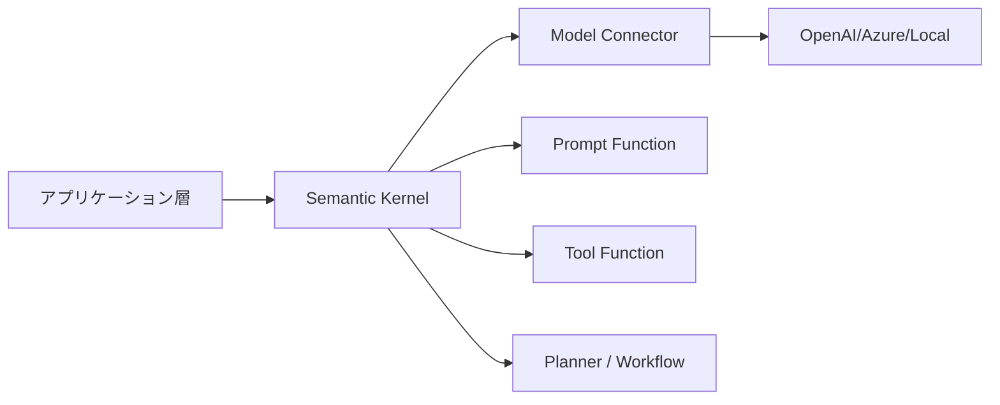
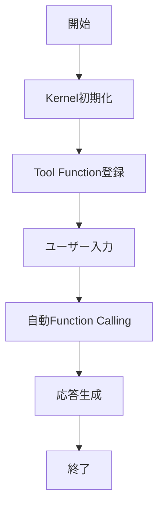

# Semantic Kernel 入門

> 📖 中級（概念・実践） | 前提: C# または Python 基礎 / LLMアプリの基本概念

## この教材で身につくこと

- Semantic Kernel の役割と設計思想
- Function Calling を使ったツール連携の基本
- プロンプト資産を関数として再利用する方法
- C# と Python の実装選択の観点

## 概要

Semantic Kernel は、LLM 機能を既存アプリへ組み込むためのOSS SDKです。  
モデル接続、プロンプト管理、関数呼び出し、メモリ連携を統一的に扱えます。

**バージョン**: OSS Docs準拠（2026-05時点）  
**公式ドキュメント**: https://learn.microsoft.com/semantic-kernel/overview/

## 位置づけ



Semantic Kernel は、LLMを直接呼ぶ実装をアプリ層から分離し、保守性を上げるための中間レイヤーとして機能します。

## 実行フロー



※この教材のサンプルは「暗黙的（自動）Function Calling」方式です。Prompt Function登録は省略し、ユーザー入力に応じて必要なTool Functionが自動選択・実行されます。

この教材では、最小構成で Prompt Function と Tool Function を組み合わせる流れを確認します。

## 最小セットアップ

### Python 環境（仮想環境 + uv/Python 3.12推奨）

1. 仮想環境を作成・有効化（Windows例）

```bash
python -m venv .venv
.venv\Scripts\activate
```

2. パッケージをインストール（uv推奨、なければpipでも可）

```bash
uv pip install -U semantic-kernel python-dotenv
# もしくは
pip install -U semantic-kernel python-dotenv
```

### C# 環境（任意）

```bash
dotnet add package Microsoft.SemanticKernel
dotnet add package Microsoft.SemanticKernel.Connectors.OpenAI
```

### 環境変数

`.env`
```bash
OPENAI_API_KEY=sk-your-key-here
OPENAI_MODEL=gpt-4o-mini
```

### 検証コマンド（Python）

```bash
python -c "import semantic_kernel as sk; print(sk.__version__)"
```

### 実行ステップ（最短）

1. `.env` を作成し、`OPENAI_API_KEY` を設定する
2. `python 01_semantic-kernel-function-calling.py` を実行する
3. `tool_result` と `assistant` の2種類の出力を確認する

## 実ソースコード（言語別に記載）

### Python: requirements.txt

- 役割: 教材の依存パッケージを固定
- 入力: なし
- 出力: pipインストール対象
- 実行: `pip install -r requirements.txt`

```txt
semantic-kernel>=1.0.0
python-dotenv>=1.0.0
```

### Python: 01_semantic-kernel-auto-tool-choice.py

- 役割: モデルに関数選択を委譲し、自然文の要求から必要ツールを自動選択
- 入力: ユーザー要求文（例: 「18と24を足して説明して」）
- 出力: 関数実行を反映した回答
- 実行: `python 02_semantic-kernel-auto-tool-choice.py`

```python
"""Semantic Kernel auto function choice sample (Python).

モデルが必要な関数を自動で選び、実行結果を回答に反映します。
"""

import asyncio
import os

from dotenv import load_dotenv
from semantic_kernel import Kernel
from semantic_kernel.connectors.ai.function_choice_behavior import FunctionChoiceBehavior
from semantic_kernel.connectors.ai.open_ai import OpenAIChatCompletion
from semantic_kernel.connectors.ai.open_ai.prompt_execution_settings.\
    open_ai_prompt_execution_settings import OpenAIPromptExecutionSettings
from semantic_kernel.contents.chat_history import ChatHistory
from semantic_kernel.functions import kernel_function


load_dotenv()


class MathPlugin:
    @kernel_function(name="add", description="2つの数値の合計を返す")
    def add(self, a: float, b: float) -> float:
        return a + b

    @kernel_function(name="multiply", description="2つの数値の積を返す")
    def multiply(self, a: float, b: float) -> float:
        return a * b


def require_env(name: str) -> str:
    value = os.getenv(name)
    if not value:
        raise RuntimeError(f"{name} が設定されていません")
    return value


def build_kernel() -> Kernel:
    kernel = Kernel()
    kernel.add_service(
        OpenAIChatCompletion(
            service_id="chat",
            api_key=require_env("OPENAI_API_KEY"),
            ai_model_id=os.getenv("OPENAI_MODEL", "gpt-4o-mini"),
        )
    )
    kernel.add_plugin(MathPlugin(), plugin_name="math")
    return kernel


async def main() -> None:
    kernel = build_kernel()
    chat = kernel.get_service("chat")

    settings = OpenAIPromptExecutionSettings(
        service_id="chat",
        temperature=0.2,
        function_choice_behavior=FunctionChoiceBehavior.Auto(),
    )

    history = ChatHistory()
    history.add_system_message(
        "あなたは日本語アシスタントです。"
        "計算が必要なら math プラグインを使って正確に答えてください。"
    )
    history.add_user_message("18と24を足して、その結果が何を意味するか1文で説明して")

    result = await chat.get_chat_message_content(
        chat_history=history,
        settings=settings,
        kernel=kernel,
    )

    print("=== Auto Tool Choice Demo ===")
    print(result)


if __name__ == "__main__":
    asyncio.run(main())
```

#### 実行例

```console
(.venv) PS C:\Dev\tutorials\generative-ai-oss-tutorials\sandbox\semantic-kernel>
python .\01_semantic-kernel-auto-tool-choice.py
=== Auto Tool Choice Demo ===
18と24を足すと42になります。これは、18と24の合計を示しており、例えば、18人と24人のグループを合わせたときの総人数を表しています。
```

### 自動Function Callingの使い分け

1. 手動実行（01）は、呼ぶ関数をアプリ側で厳密に制御したいときに使う
2. 自動選択（02）は、自然文入力ごとに必要な関数が変わるときに使う
3. 本番運用では、重要処理は手動、補助処理は自動という分離が安全

### 使い方の要点

1. Kernel に「モデル接続」と「プラグイン関数」を登録する
2. 計算や検索などの確定処理は Tool Function で実行する
3. 最終文面の整形は Prompt で行い、用途ごとにテンプレート化する
4. 失敗時は環境変数未設定、モデル名誤り、APIキー権限を先に確認する

## 演習課題

1. ツール関数を1つ追加し、既存関数と使い分けるプロンプトを作成してください。
2. 同じユースケースを C# または Python のどちらかで実装し、選定理由を3点に整理してください。
3. 失敗時の挙動を確認し、再試行方針を短く定義してください。


### 解答の目安

1. まず課題の目的を一文で明確化し、入力・出力を対応づけて記述します。
    確認ポイント: どの関数をなぜ追加したかを第三者が追えること。
2. 最小構成で一度実行し、言語を固定したうえで実装理由を3点に整理します。
    確認ポイント: 保守性、運用性、既存資産との整合を根拠付きで説明できること。
3. 失敗ケースを1つ決め、検知方法と再試行条件を短く定義します。
    確認ポイント: いつ再試行し、いつ停止するかを明示できること。

## 理解度チェック

1. Semantic Kernel を導入する主目的は何ですか。
2. Prompt Function と Tool Function の違いは何ですか。
3. Semantic Kernel が向くケースと向かないケースを1つずつ挙げてください。


### 解説の要点

1. 主目的は、モデル呼び出し・関数実行・プロンプト管理を分離して実装を運用しやすくすることです。
2. Prompt Function は自然文生成、Tool Function は確定処理（計算・検索・API呼び出し）に使い分けます。
3. 向くケースは外部連携や複数機能統合がある業務アプリ、向かないケースは単発プロンプト中心の小規模検証です。

---

## 参考リンク

- [Semantic Kernel Overview](https://learn.microsoft.com/semantic-kernel/overview/)
- [Semantic Kernel GitHub](https://github.com/microsoft/semantic-kernel)
- [Python SDK Getting Started](https://learn.microsoft.com/semantic-kernel/get-started/quick-start-guide?pivots=
    programming-language-python)
- [C# SDK Getting Started](https://learn.microsoft.com/semantic-kernel/get-started/quick-start-guide?pivots=
    programming-language-csharp)

---

[← 前へ](04-crewai.md) | [次へ →](../02-rag/01-llamaindex.md)
