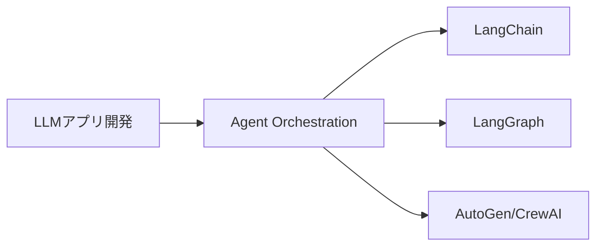
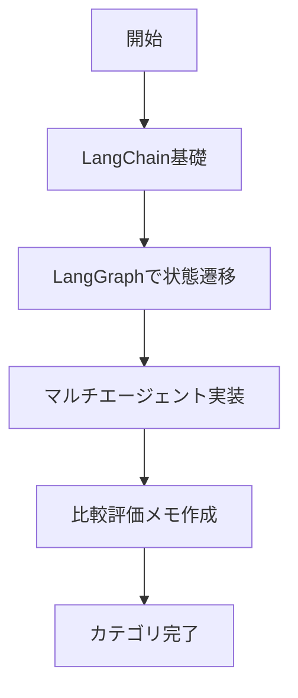

# エージェント・オーケストレーション

> 🔰 初級（カテゴリ導入） | 前提: -

複数のエージェントが協調してタスクを実行するフレームワークと、LLMアプリ開発の基盤ライブラリ。

## 位置づけ

## 学習フロー

## 含まれるOSS

- **LangChain**: LLMアプリ開発の標準ライブラリ
- **LangGraph**: 状態遷移をもつワークフロー実装
- **AutoGen**: 複数エージェント協調フレームワーク
- **CrewAI**: Roleベースのマルチエージェント
- **Semantic Kernel**: 企業向けAIワークフローSDK

## 学習順序

1. LangChain (基本)
2. LangGraph (ステップ処理)
3. AutoGen / CrewAI (複数エージェント)

## 教材リンク

- [01_langchain.md](./01_langchain.md)
- [02_langgraph.md](./02_langgraph.md)
- [03_autogen.md](./03_autogen.md)
- [04_crewai.md](./04_crewai.md)

## 完了条件

- カテゴリ内の主要OSSを3つ以上説明できる
- 最小サンプルを1件以上動作確認できる
- 選定観点（速度/運用性/拡張性）で比較メモを作成できる

---

[← 前へ](00_README.md) | [次へ →](01_agent-orchestration/01_langchain.md)

