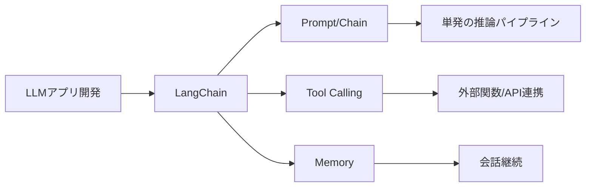
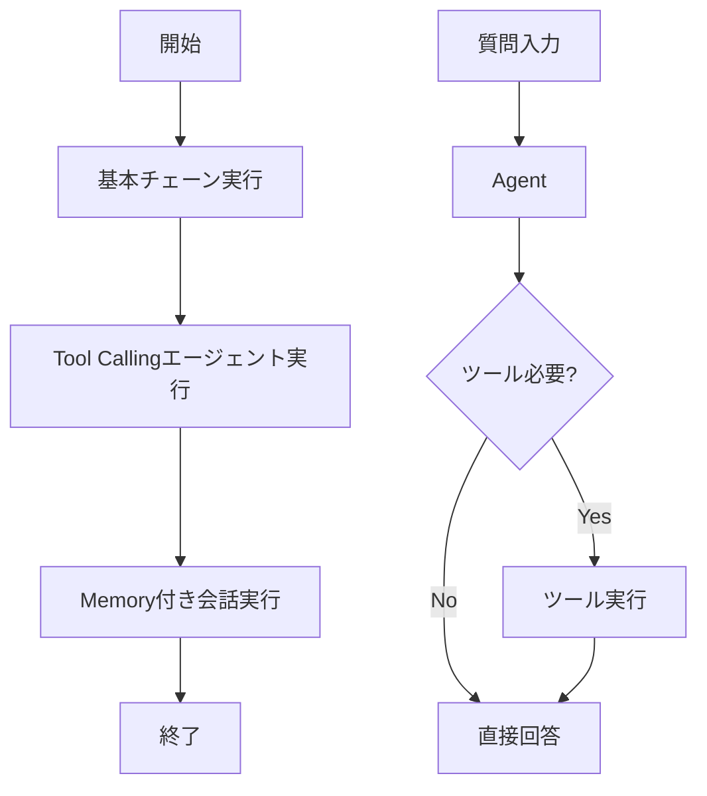

# LangChain - LLMアプリ開発の標準ライブラリ

> 📖 中級（概念・実践） | 前提: Python基礎 / LLMアプリの基本概念

## この教材で身につくこと

- 複数のLLMやツール操作を組み合わせた処理パイプライン
- LLMに関数実行やAPI呼び出しを命令
- 会話履歴やコンテキストを自動管理
- OpenAI、Anthropic、Ollama等に対応
- ドキュメント検索、ベクトル化を統合

**バージョン**: 0.1.0  
**公式ドキュメント**: https://python.langchain.com/

## 概要

**LangChain** は、LLMアプリ開発を簡単にするPython/JS ライブラリです。

### 主な機能

- **チェーン構築**: 複数のLLMやツール操作を組み合わせた処理パイプライン
- **ツール呼び出し**: LLMに関数実行やAPI呼び出しを命令
- **メモリ管理**: 会話履歴やコンテキストを自動管理
- **複数LLMサポート**: OpenAI、Anthropic、Ollama等に対応
- **RAG対応**: ドキュメント検索、ベクトル化を統合

---

## 詳細

### 用途

- LLMアプリの基本実装
- チャットボット構築
- 外部API連携（金融API、Weather API等）
- RAGシステムの基盤

### メリット

✅ 学習曲線が緩い（初心者向け）  
✅ ドキュメント充実  
✅ 複数LLM同時対応  
✅ コミュニティが大きい  

### デメリット

❌ 本番運用時にはオーバーヘッドがある  
❌ 設定項目が多い  
❌ バージョン更新が頻繁  

---

## 前提条件

### 必須スキル

- Python 基本（3.10以上推奨）
- 仮想環境の操作
- API キーの管理

### 環境

- Python 3.10+
- pip
- 仮想環境（venv推奨）

### インストール

```bash
pip install langchain langchain-openai python-dotenv
```

### API キーの設定

`.env`
```bash
OPENAI_API_KEY=sk-your-key-here
```

## 位置づけ（Mermaid）



LangChain は、LLMアプリの共通部品（Prompt、Model、Parser、Tool、Memory）を統一的に扱うための標準レイヤーです。まずは基本チェーン、次にツール呼び出し、最後に会話メモリへ進むと理解しやすくなります。

## 実行フロー（Mermaid）



この教材では、同じユースケースを Python と JavaScript で比較しながら、LangChain の中核機能を順に確認します。

## 補足

### Python: 01_basic-chain.py

- 役割: Prompt -> LLM -> Parser の最小チェーン
- 入力: topic
- 出力: 生成テキスト
- 実行: `python 01_basic-chain.py`

```python
"""LangChain Basic Chain Example.

実行前に .env へ OPENAI_API_KEY を設定してください。
"""

from dotenv import load_dotenv
from langchain_openai import ChatOpenAI
from langchain_core.prompts import ChatPromptTemplate
from langchain_core.output_parsers import StrOutputParser

# 環境変数読み込み
load_dotenv()

# 1. LLMモデルの初期化
# ChatOpenAI: OpenAI's GPT-4o / GPT-3.5を使用
llm = ChatOpenAI(
    model="gpt-3.5-turbo",
    temperature=0.7,  # 0-1: 低いほど決定的、高いほど創造的
)

# 2. プロンプトテンプレートの作成
# {topic} 部分が動的に置き換わる
prompt_template = ChatPromptTemplate.from_template(
    "以下のトピックについて、日本語で3行程度説明してください: {topic}"
)

# 3. チェーン構築
# Prompt -> LLM -> Output Parser の流れ
chain = prompt_template | llm | StrOutputParser()

# 4. チェーン実行
if __name__ == "__main__":
    topic = "生成AI"
    print(f"Topic: {topic}")
    print("-" * 50)

    result = chain.invoke({"topic": topic})

    print(f"Answer:\n{result}")
    print("-" * 50)

    # 別のトピックでも試す
    topic2 = "ベクトル検索"
    print(f"\nTopic: {topic2}")
    print("-" * 50)

    result2 = chain.invoke({"topic": topic2})
    print(f"Answer:\n{result2}")
```

### Python: 02_tool-use.py

- 役割: ツールを使うエージェント実装
- 入力: question
- 出力: ツール実行を含む最終回答
- 実行: `python 02_tool-use.py`

```python
"""LangChain tool calling example."""

from dotenv import load_dotenv
from langchain_openai import ChatOpenAI
from langchain_core.tools import tool
from langchain.agents import AgentExecutor, create_openai_tools_agent
from langchain_core.prompts import ChatPromptTemplate, MessagesPlaceholder

load_dotenv()

# ========== ツール定義 ==========
# @tool デコレータで関数をツール化

@tool
def get_stock_price(symbol: str) -> str:
    """株価を取得する（デモ用）。"""
    prices = {"AAPL": 180.5, "MSFT": 320.0, "7203": 1500.0}
    price = prices.get(symbol, "Not found")
    return f"株価情報: {symbol} = {price}"

@tool
def calculate_portfolio_return(initial: float, final: float) -> str:
    """収益率を計算する。"""
    if initial <= 0:
        return "初期投資額が不正です"

    return_rate = ((final - initial) / initial) * 100
    return f"収益率: {return_rate:.2f}%"

# ========== エージェント構築 ==========

tools = [get_stock_price, calculate_portfolio_return]

llm = ChatOpenAI(model="gpt-3.5-turbo", temperature=0)

prompt = ChatPromptTemplate.from_messages(
    [
        ("system", "あなたは金融アシスタントです。必要ならツールを使ってください。"),
        ("human", "{question}"),
        MessagesPlaceholder("agent_scratchpad"),
    ]
)

agent = create_openai_tools_agent(llm, tools, prompt)
agent_executor = AgentExecutor.from_agent_and_tools(
    agent=agent,
    tools=tools,
    verbose=True,
    max_iterations=5,
)

# ========== 実行 ==========

if __name__ == "__main__":
    questions = [
        "AAPLの現在の株価を教えてください",
        "1000ドル投資して1200ドルになった場合、収益率は何%ですか？",
    ]

    for question in questions:
        print(f"\nQuestion: {question}")
        print("-" * 60)

        result = agent_executor.invoke({"question": question})

        print(f"\nAnswer: {result['output']}")
        print("=" * 60)
```

### Python: 03_memory-persistence.py

- 役割: 会話履歴付きチェーンの実装
- 入力: question（複数ターン）
- 出力: 履歴を反映した回答
- 実行: `python 03_memory-persistence.py`

```python
"""LangChain memory example."""

import os
from pathlib import Path

from dotenv import load_dotenv
from langchain_openai import ChatOpenAI
from langchain_core.prompts import ChatPromptTemplate, MessagesPlaceholder
from langchain_core.messages import HumanMessage, AIMessage
from langchain_core.chat_history import InMemoryChatMessageHistory
from langchain_core.runnables.history import RunnableWithMessageHistory

env_path = Path(__file__).with_name(".env")
load_dotenv(dotenv_path=env_path, override=False)

if not os.getenv("OPENAI_API_KEY"):
    raise EnvironmentError(
        "OPENAI_API_KEY が見つかりません。"
        "このフォルダの .env.example を .env にコピーして設定してください。"
    )

# ========== メモリの初期化 ==========

# InMemoryChatMessageHistory: 会話履歴をメモリに保存（セッション終了で消失）
chat_history = InMemoryChatMessageHistory()

llm = ChatOpenAI(model="gpt-3.5-turbo", temperature=0.7)

# ========== プロンプトテンプレート作成 ==========

prompt = ChatPromptTemplate.from_messages([
    ("system", "あなたは親切なAIアシスタントです。ユーザーの前回の質問や回答を覚えて、会話を続けてください。"),

    # MessagesPlaceholder: 会話履歴が自動的に挿入される
    MessagesPlaceholder(variable_name="history"),

    ("human", "{question}"),
])

# ========== チェーン構築 ==========

chain = prompt | llm

# RunnableWithMessageHistory: 会話履歴を管理しながらチェーン実行
chain_with_history = RunnableWithMessageHistory(
    runnable=chain,
    get_session_history=lambda session_id: chat_history,
    input_messages_key="question",
    history_messages_key="history",
)

# ========== 実行 ==========

if __name__ == "__main__":
    print("Chat bot with memory")
    print("=" * 60)
    print("複数の質問を入力すると履歴を参照して回答します。")
    print("'exit' で終了します。")
    print("=" * 60)

    while True:
        user_input = input("\nYou: ").strip()

        if user_input.lower() == "exit":
            print("Bye")
            break

        if not user_input:
            continue

        # チェーン実行（会話履歴付き）
        response = chain_with_history.invoke(
            {"question": user_input},
            config={"configurable": {"session_id": "default"}},
        )

        print(f"Assistant: {response.content}")

        # 会話履歴を追加
        chat_history.add_messages([
            HumanMessage(content=user_input),
            AIMessage(content=response.content),
        ])

        # 現在の履歴を表示（デバッグ用）
        print(f"   [history: {len(chat_history.messages)} messages]")
```

### JavaScript: 01_basic-chain.js

- 役割: Node.js版の最小チェーン
- 入力: topic
- 出力: 生成テキスト
- 実行: `node 01_basic-chain.js`

```javascript
/**
 * LangChain JS Basic Chain Example
 *
 * Node.js での LangChain 基本使用法を示します。
 *
 * 実行方法:
 * npm install
 * npm start
 */

const { ChatOpenAI } = require("langchain/chat_models/openai");
const { ChatPromptTemplate } = require("langchain/prompts");
const { StringOutputParser } = require("langchain/schema/output_parser");
require("dotenv").config();

async function main() {
  // 1. LLM の初期化
  const llm = new ChatOpenAI({
    modelName: "gpt-3.5-turbo",
    temperature: 0.7,
  });

  // 2. プロンプトテンプレート作成
  const prompt = ChatPromptTemplate.fromTemplate(
    "以下のトピックについて、日本語で3行程度説明してください: {topic}"
  );

  // 3. チェーン構築
  const chain = prompt.pipe(llm).pipe(new StringOutputParser());

  // 4. チェーン実行
  const topic = "生成AI";
  console.log(`Topic: ${topic}`);
  console.log("-".repeat(50));

  const result = await chain.invoke({ topic });

  console.log(`Answer:\n${result}`);
  console.log("-".repeat(50));

  // 別のトピック
  const topic2 = "ベクトル検索";
  console.log(`\nTopic: ${topic2}`);
  console.log("-".repeat(50));

  const result2 = await chain.invoke({ topic: topic2 });
  console.log(`Answer:\n${result2}`);
}

// エラーハンドリング付き実行
main().catch((error) => {
  console.error("❌ エラーが発生しました:", error.message);
  process.exit(1);
});
```

### JavaScript: 02_tool-use.js

- 役割: JS版ツール呼び出しエージェント
- 入力: input
- 出力: ツール結果を反映した回答
- 実行: `node 02_tool-use.js`

```javascript
/**
 * LangChain JS Tool Use Example
 *
 * LLMにツール（関数）実行を命令する方法を示します。
 *
 * 実行方法:
 * npm install
 * node 02_tool-use.js
 */

const { ChatOpenAI } = require("langchain/chat_models/openai");
const { tool } = require("langchain/tools");
const { createOpenAIToolsAgent, AgentExecutor } = require("langchain/agents");
const { ChatPromptTemplate, MessagesPlaceholder } = require("langchain/prompts");
require("dotenv").config();

// ========== ツール定義 ==========

const getStockPriceTool = tool(
  async (symbol) => {
    // デモ用：ダミーデータ
    const prices = { AAPL: 180.5, MSFT: 320.0, "7203": 1500.0 };
    const price = prices[symbol] || "Not found";
    return `株価情報: ${symbol} = $${price}`;
  },
  {
    name: "get_stock_price",
    description: "銘柄コードから株価を取得します。",
    schema: {
      type: "object",
      properties: {
        symbol: {
          type: "string",
          description: "銘柄コード (例: AAPL, 7203)",
        },
      },
      required: ["symbol"],
    },
  }
);

const calculateReturnTool = tool(
  async ({ initial, final }) => {
    if (initial <= 0) return "初期投資額が不正です";
    const returnRate = ((final - initial) / initial) * 100;
    return `収益率: ${returnRate.toFixed(2)}%`;
  },
  {
    name: "calculate_return",
    description: "投資の収益率を計算します。",
    schema: {
      type: "object",
      properties: {
        initial: {
          type: "number",
          description: "初期投資額",
        },
        final: {
          type: "number",
          description: "最終価値",
        },
      },
      required: ["initial", "final"],
    },
  }
);

// ========== エージェント構築 ==========

async function main() {
  const tools = [getStockPriceTool, calculateReturnTool];

  const llm = new ChatOpenAI({
    modelName: "gpt-3.5-turbo",
    temperature: 0,
  });

  const prompt = ChatPromptTemplate.fromMessages([
    [
      "system",
      "You are a helpful financial assistant. Use the tools to answer questions.",
    ],
    new MessagesPlaceholder("chat_history"),
    ["human", "{input}"],
    new MessagesPlaceholder("agent_scratchpad"),
  ]);

  const agent = await createOpenAIToolsAgent({
    llm,
    tools,
    prompt,
  });

  const agentExecutor = new AgentExecutor({
    agent,
    tools,
    verbose: true,
  });

  // ========== 実行 ==========

  const questions = [
    "APPLの現在の株価は？",
    "1000ドル投資して1200ドルになった収益率は？",
  ];

  for (const question of questions) {
    console.log(`\nQuestion: ${question}`);
    console.log("-".repeat(60));

    const result = await agentExecutor.invoke({ input: question });

    console.log(`Answer: ${result.output}`);
    console.log("=".repeat(60));
  }
}

main().catch((error) => {
  console.error("❌ エラー:", error.message);
  process.exit(1);
});
```

### JavaScript: 03_memory-persistence.js

- 役割: JS版の会話履歴管理
- 入力: input（複数ターン）
- 出力: 履歴を反映した回答
- 実行: `node 03_memory-persistence.js`

```javascript
/**
 * LangChain JS Memory Example
 *
 * 会話履歴を持つシンプルなチャットループ。
 * 実行前に .env へ OPENAI_API_KEY を設定してください。
 */

const { ChatOpenAI } = require("langchain/chat_models/openai");
const {
  ChatPromptTemplate,
  MessagesPlaceholder,
} = require("langchain/prompts");
const {
  HumanMessage,
  AIMessage,
} = require("langchain/schema");
require("dotenv").config();

async function main() {
  const llm = new ChatOpenAI({
    modelName: "gpt-3.5-turbo",
    temperature: 0.4,
  });

  const prompt = ChatPromptTemplate.fromMessages([
    ["system", "あなたは丁寧な日本語アシスタントです。会話履歴を参照して答えてください。"],
    new MessagesPlaceholder("history"),
    ["human", "{input}"],
  ]);

  const history = [];

  const questions = [
    "私の名前は佐藤です。覚えてください。",
    "私の名前は何ですか？",
    "この会話でやったことを2行でまとめてください。",
  ];

  for (const q of questions) {
    const chainInput = await prompt.formatMessages({
      history,
      input: q,
    });

    const res = await llm.invoke(chainInput);

    console.log(`\nQ: ${q}`);
    console.log(`A: ${res.content}`);

    history.push(new HumanMessage(q));
    history.push(new AIMessage(res.content));
  }

  console.log(`\n履歴メッセージ数: ${history.length}`);
}

main().catch((e) => {
  console.error("Error:", e.message);
  process.exit(1);
});
```

---

## 補足

**Q. Langchainだけで本番環境運用できますか？**  
A. 基本的なアプリには十分ですが、本番向けには LangGraph や別のオーケストレーションツールとの組み合わせを推奨。

**Q. Llamaindex との違いは？**  
A. LangChain は汎用ライブラリ、LlamaIndex は RAG 特化。組み合わせて使うことが多いです。

**Q. ローカルLLMでも動きますか？**  
A. はい。Ollama + LangChain で完全ローカル環境構築可能。

---

## 参考リンク

- [LangChain 公式ドキュメント](https://python.langchain.com/)
- [GitHub Repository](https://github.com/langchain-ai/langchain)
- [日本語ガイド](https://note.com/npaka)


## 実ソースコード（言語別に記載）

### 主要サンプル
- この教材の実装例は、本文中の実行手順に対応しています。
- 必要に応じて、主要コードの抜粋をこのセクションへ追記してください。

## 演習課題

1. ``LangChain`` を使う想定ユースケースを1つ定義し、入力・出力の例を記録してください。
2. 最小構成で動かし、デフォルトから設定を1つ変えて挙動の差分を確認してください。
3. ``LangChain`` を使わない場合の代替手段と比較し、選ぶ基準をまとめてください。


### 解答の目安

1. まず課題の目的を一文で明確化し、入力・出力を対応づけて記述します。
   確認ポイント: 何を変えて何を確認する課題かを第三者が読んで理解できること。
2. 最小構成で一度実行し、設定や条件を1つ変更して差分を比較します。
   確認ポイント: 変更前後の挙動差を具体的に説明できること。
3. 適用条件と代替手段を整理し、選択基準を短くまとめます。
   確認ポイント: なぜその手段を選ぶかを根拠付きで示せること。
## 理解度チェック

1. ``LangChain`` の主な役割を1文で説明してください。
2. ``LangChain`` を導入する際の最大のメリットと注意点は何ですか？
3. ``LangChain`` が向かないユースケースとして、どのようなケースが考えられますか？


### 解説の要点

1. 主な役割は、その技術がどの工程を担い、何を改善するかで説明します。
2. メリットは再現性・拡張性・運用性の観点で整理し、注意点は導入コストや複雑性として示します。
3. 使い分けは要件、実装コスト、運用体制の3観点で判断します。
---

[← 前へ](01_agent-orchestration/00_README.md) | [次へ →](01_agent-orchestration/02_langgraph.md)


