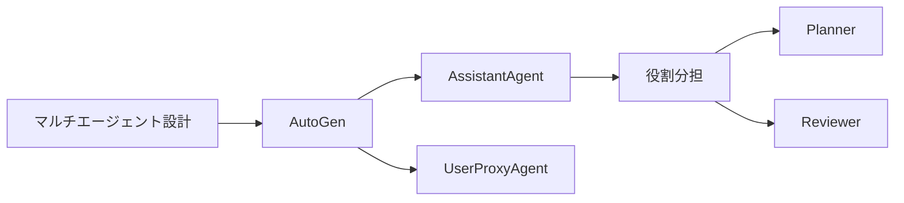
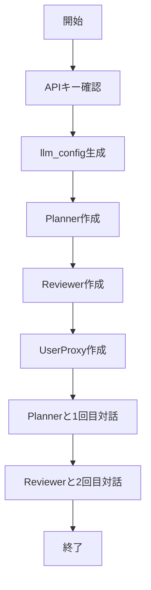

# AutoGen 入門

> 📖 中級（概念・実践） | 前提: Python基礎 / LLMアプリの基本概念

## この教材で身につくこと

- AutoGen 入門 の主な役割と適用場面を説明できる
- AutoGen 入門 を最小構成で動かす手順を実行できる
- 導入時のメリットと注意点を整理できる

## 概要
AutoGen は複数エージェントが協調してタスクを進めるフレームワークです。役割を分けた対話を作れるため、レビュー付き生成や議論型の自動化に向きます。

## 使いどころ
- 実装担当 + レビュー担当の2エージェント
- 要件整理 → 実装 → 検証の分離
- 長いタスクの分担

## 前提条件
- Python 3.10+
- OpenAI 互換 API キー

## 位置づけ（Mermaid）



AutoGen は、エージェント間の対話を直接設計したい場面で有効です。実装担当とレビュー担当を分けることで、1回の生成よりも品質を上げやすくなります。

## 実行フロー（Mermaid）



この教材では「計画生成 -> レビュー」の2ターン対話を最小構成で実装します。

## 実ソースコード（言語別に記載）
### Python: 00_requirements.txt

- 役割: 実行に必要な依存関係を固定
- 入力: なし
- 出力: pipでインストール可能なパッケージ一覧
- 実行: `pip install -r 00_requirements.txt`

```txt
pyautogen==0.2.34
python-dotenv==1.0.0
```

### Python: 01_two-agents-chat.py

- 役割: Planner/Reviewer の2エージェント対話を実行
- 入力: タスク文（RAG導入計画）
- 出力: 計画案とレビュー結果
- 実行: `python 01_two-agents-chat.py`

```python
"""
AutoGen Two Agents Chat

実装担当とレビュー担当の2エージェントで、
短い設計方針を作ってレビューする例です。
"""

import os
from dotenv import load_dotenv
import autogen


load_dotenv()


def main() -> None:
	api_key = os.getenv("OPENAI_API_KEY")
	if not api_key:
		raise RuntimeError("OPENAI_API_KEY が未設定です。.env を確認してください。")

	llm_config = {
		"config_list": [
			{
				"model": "gpt-3.5-turbo",
				"api_key": api_key,
			}
		],
		"temperature": 0.2,
	}

	planner = autogen.AssistantAgent(
		name="Planner",
		llm_config=llm_config,
		system_message=(
			"あなたは実装計画担当です。"
			"初心者にも分かる箇条書きで、短い計画を作成してください。"
		),
	)

	reviewer = autogen.AssistantAgent(
		name="Reviewer",
		llm_config=llm_config,
		system_message=(
			"あなたはレビュー担当です。"
			"計画の欠落点を2つまで指摘し、改善案を提案してください。"
		),
	)

	user_proxy = autogen.UserProxyAgent(
		name="UserProxy",
		human_input_mode="NEVER",
		max_consecutive_auto_reply=3,
		code_execution_config=False,
	)

	task = (
		"株式分析アプリにRAGを導入する計画を、"
		"1) 最初の1週間 2) 次の2週間 の2段階で作成してください。"
	)

	# 1回目: Planner が計画を提示
	user_proxy.initiate_chat(planner, message=task)

	# 2回目: Reviewer がレビュー
	user_proxy.initiate_chat(
		reviewer,
		message="上の計画をレビューして改善案を提示してください。",
	)


if __name__ == "__main__":
	main()
```

## 実行
```bash
cd 03_autogen-python
pip install -r 00_requirements.txt
python 01_two-agents-chat.py
```

## 演習課題

1. ``AutoGen 入門`` を使う想定ユースケースを1つ定義し、入力・出力の例を記録してください。
2. 最小構成で動かし、デフォルトから設定を1つ変えて挙動の差分を確認してください。
3. ``AutoGen 入門`` を使わない場合の代替手段と比較し、選ぶ基準をまとめてください。


### 解答の目安

1. まず課題の目的を一文で明確化し、入力・出力を対応づけて記述します。
   確認ポイント: 何を変えて何を確認する課題かを第三者が読んで理解できること。
2. 最小構成で一度実行し、設定や条件を1つ変更して差分を比較します。
   確認ポイント: 変更前後の挙動差を具体的に説明できること。
3. 適用条件と代替手段を整理し、選択基準を短くまとめます。
   確認ポイント: なぜその手段を選ぶかを根拠付きで示せること。
## 理解度チェック

1. ``AutoGen 入門`` の主な役割を1文で説明してください。
2. ``AutoGen 入門`` を導入する際の最大のメリットと注意点は何ですか？
3. ``AutoGen 入門`` が向かないユースケースとして、どのようなケースが考えられますか？


### 解説の要点

1. 主な役割は、その技術がどの工程を担い、何を改善するかで説明します。
2. メリットは再現性・拡張性・運用性の観点で整理し、注意点は導入コストや複雑性として示します。
3. 使い分けは要件、実装コスト、運用体制の3観点で判断します。
---

[← 前へ](01_agent-orchestration/02_langgraph.md) | [次へ →](01_agent-orchestration/04_crewai.md)


