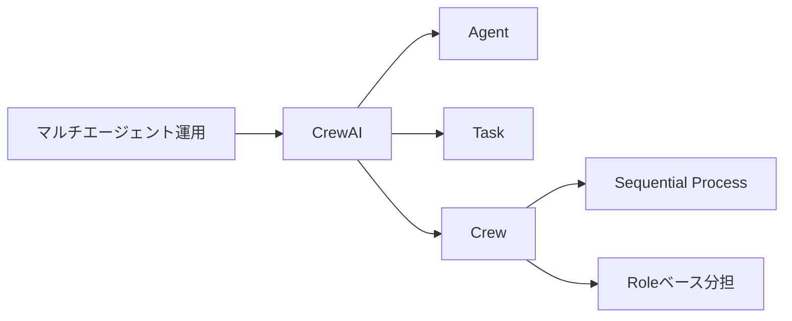
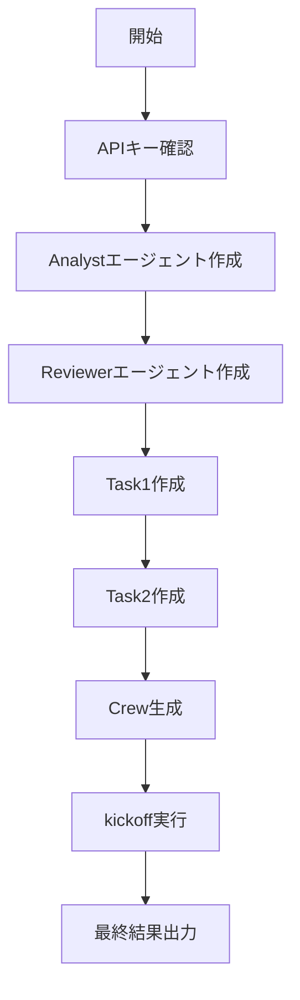

# CrewAI 入門

> 📖 中級（概念・実践） | 前提: Python基礎 / LLMアプリの基本概念

## この教材で身につくこと

- Role ベース設計
- タスク分割
- 複数エージェント協調

## 概要
CrewAI は役割を持ったエージェントチームを作り、タスクを分担して実行するフレームワークです。Planner / Researcher / Reviewer のように責務分離した設計に向きます。

## 詳細
- Role ベース設計
- タスク分割
- 複数エージェント協調

## 位置づけ（Mermaid）



CrewAI は、役割とタスクを先に定義してチーム運用するスタイルに向いています。誰が何をいつ実行するかを明示しやすいのが特徴です。

## 実行フロー（Mermaid）



この教材では、分析担当が計画を作り、レビュー担当が改善する2段階のワークフローを体験します。

## 実ソースコード（言語別に記載）
### Python: 00_requirements.txt

- 役割: CrewAI教材の依存関係を固定
- 入力: なし
- 出力: pipインストール対象
- 実行: `pip install -r 00_requirements.txt`

```txt
crewai==0.41.1
python-dotenv==1.0.0
```

### Python: 01_basic-crew.py

- 役割: 2エージェント・2タスクの最小Crew実行
- 入力: 学習計画作成タスク
- 出力: 計画とレビュー結果
- 実行: `python 01_basic-crew.py`

```python
"""CrewAI basic multi-agent example."""

import os
from dotenv import load_dotenv
from crewai import Agent, Task, Crew, Process


load_dotenv()


def ensure_key() -> None:
	if not os.getenv("OPENAI_API_KEY"):
		raise RuntimeError("OPENAI_API_KEY が設定されていません")


def main() -> None:
	ensure_key()

	analyst = Agent(
		role="Market Analyst",
		goal="ユーザー要件に合う投資学習計画を作る",
		backstory="初心者向け説明が得意なアナリスト",
		verbose=True,
	)

	reviewer = Agent(
		role="Quality Reviewer",
		goal="計画の抜け漏れを検出して改善する",
		backstory="品質保証担当としてチェック観点を持つ",
		verbose=True,
	)

	task1 = Task(
		description=(
			"株式投資初心者向けに、2週間の学習計画を作成してください。"
			"毎日の学習テーマを箇条書きで示してください。"
		),
		expected_output="2週間分の学習計画（14項目）",
		agent=analyst,
	)

	task2 = Task(
		description="task1 の結果をレビューし、改善提案を3点以内で示してください。",
		expected_output="レビューコメントと改善版",
		agent=reviewer,
	)

	crew = Crew(
		agents=[analyst, reviewer],
		tasks=[task1, task2],
		process=Process.sequential,
		verbose=True,
	)

	result = crew.kickoff()
	print("\n=== Final Result ===")
	print(result)


if __name__ == "__main__":
	main()
```

## 実行
```bash
cd 04_crewai-python
pip install -r 00_requirements.txt
python 01_basic-crew.py
```

## 演習課題

1. ``CrewAI 入門`` を使う想定ユースケースを1つ定義し、入力・出力の例を記録してください。
2. 最小構成で動かし、デフォルトから設定を1つ変えて挙動の差分を確認してください。
3. ``CrewAI 入門`` を使わない場合の代替手段と比較し、選ぶ基準をまとめてください。


### 解答の目安

1. まず課題の目的を一文で明確化し、入力・出力を対応づけて記述します。
   確認ポイント: 何を変えて何を確認する課題かを第三者が読んで理解できること。
2. 最小構成で一度実行し、設定や条件を1つ変更して差分を比較します。
   確認ポイント: 変更前後の挙動差を具体的に説明できること。
3. 適用条件と代替手段を整理し、選択基準を短くまとめます。
   確認ポイント: なぜその手段を選ぶかを根拠付きで示せること。
## 理解度チェック

1. ``CrewAI 入門`` の主な役割を1文で説明してください。
2. ``CrewAI 入門`` を導入する際の最大のメリットと注意点は何ですか？
3. ``CrewAI 入門`` が向かないユースケースとして、どのようなケースが考えられますか？


### 解説の要点

1. 主な役割は、その技術がどの工程を担い、何を改善するかで説明します。
2. メリットは再現性・拡張性・運用性の観点で整理し、注意点は導入コストや複雑性として示します。
3. 使い分けは要件、実装コスト、運用体制の3観点で判断します。
---

[← 前へ](01_agent-orchestration/03_autogen.md) | [次へ →](02_rag/00_README.md)


