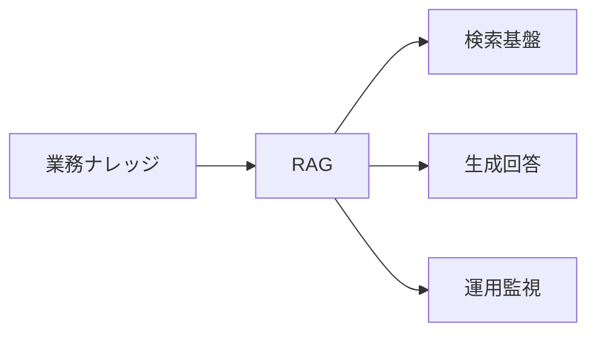
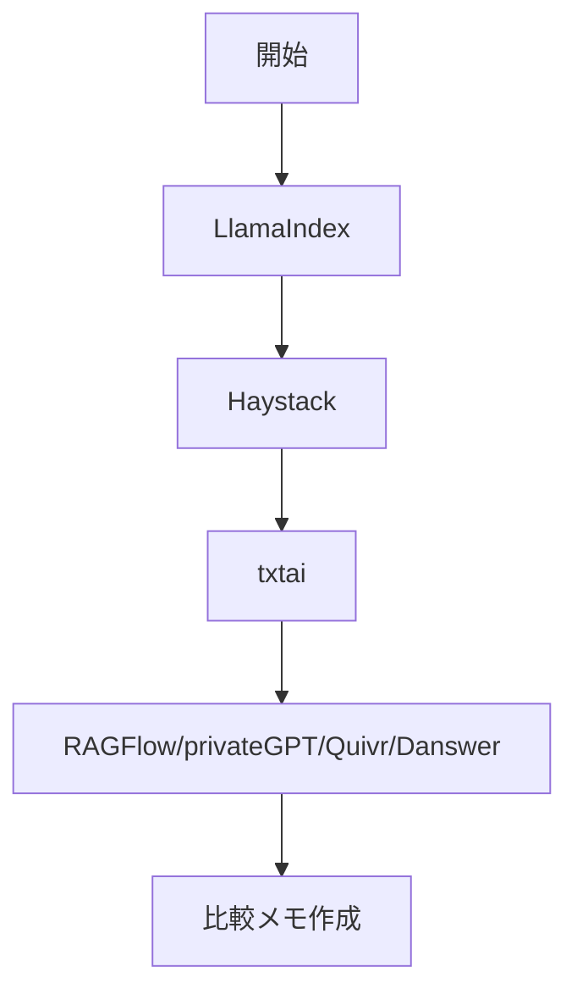

# RAG・ナレッジ検索

> 🔰 初級（カテゴリ導入） | 前提: -

ベクトル検索とLLMを組み合わせて、社内文書やナレッジからの質問応答を実現。

## 位置づけ



## 学習フロー



## 含まれるOSS

- **LlamaIndex**: データ接続と索引化に強いRAG基盤
- **Haystack**: 検索・生成パイプライン構築フレームワーク
- **txtai**: 軽量な埋め込み検索フレームワーク
- **RAGFlow**: RAG特化の実運用向けプラットフォーム
- **privateGPT**: ローカル文書向けプライベートQA
- **Quivr**: チーム向けナレッジアシスタント
- **Onyx**: 社内横断検索と生成回答

## 学習順序

1. LlamaIndex (基本的な文書索引・検索)
2. Haystack (パイプライン構築)
3. txtai (軽量検索)
4. RAGFlow (運用・監視)
5. privateGPT (ローカル閉域運用)
6. Quivr (チームナレッジ)
7. Onyx (エンタープライズ検索)

## 教材リンク

- [01-llamaindex.md](./01-llamaindex.md)
- [02-haystack.md](./02-haystack.md)
- [02_haystack-python](./02_haystack-python/)
- [03-txtai.md](./03-txtai.md)
- [04-ragflow.md](./04-ragflow.md)
- [05-privategpt.md](./05-privategpt.md)
- [06-quivr.md](./06-quivr.md)
- [07-onyx.md](./07-onyx.md)

## バージョン情報

2026年5月時点の主要 RAG フレームワークの最新情報です。

### LlamaIndex

- **最新バージョン**: 0.14.21
- **リリース日**: 2026年4月21日
- **PyPI**: https://pypi.org/project/llama-index/
- **ドキュメント**: https://developers.llamaindex.ai/python/framework/
- **GitHub**: https://github.com/run-llama/llama_index
- **備考**: starter パッケージと llama-index-core（カスタマイズ用）の2種類があります

### Haystack

#### Haystack 2.x（推奨 - 現在のメインライン）

- **最新バージョン**: 2.28.0
- **リリース日**: 2026年4月21日
- **パッケージ名**: `haystack-ai`
- **PyPI**: https://pypi.org/project/haystack-ai/
- **ドキュメント**: https://docs.haystack.deepset.ai/docs/intro
- **GitHub**: https://github.com/deepset-ai/haystack
- **特徴**: モダンな設計、70+の統合、プロダクション対応

#### Haystack 1.x（レガシー - EOL）

- **最新バージョン**: 1.26.4.post0
- **リリース日**: 2025年4月4日
- **パッケージ名**: `farm-haystack`
- **ステータス**: 2025年3月11日に End of Life (EOL)
- **PyPI**: https://pypi.org/project/farm-haystack/
- **移行ガイド**: https://docs.haystack.deepset.ai/docs/migration
- **備考**: Haystack 2.x へのアップグレードを強く推奨

### txtai

- **最新バージョン**: 9.8.0
- **リリース日**: 2026年4月30日
- **PyPI**: https://pypi.org/project/txtai/
- **ドキュメント**: https://neuml.github.io/txtai/
- **GitHub**: https://github.com/neuml/txtai
- **特徴**: セマンティック検索、LLM オーケストレーション、言語モデルワークフロー

### RAGFlow

- **最新バージョン**: 0.0.1
- **リリース日**: 2023年11月20日
- **PyPI**: https://pypi.org/project/ragflow/
- **GitHub**: https://github.com/infiniflow/ragflow
- **ドキュメント**: https://docs.ragflow.io/
- **備考**: PyPI バージョンは古い。GitHub リポジトリの最新リリースをご確認ください

### PrivateGPT

#### 新しいプロジェクト（推奨）

- **最新バージョン**: 0.6.2
- **リリース日**: 2024年8月8日
- **GitHub**: https://github.com/zylon-ai/private-gpt
- **ドキュメント**: https://docs.privategpt.dev/
- **Docker**: https://hub.docker.com/r/zylonai/private-gpt
- **特徴**: Ollama 統合、Google Gemini サポート、Milvus/Clickhouse 対応

#### レガシーパッケージ（非推奨）

- **バージョン**: 0.0.26
- **リリース日**: 2023年6月11日
- **PyPI**: https://pypi.org/project/privategpt/
- **備考**: 古いプロジェクト。zylon-ai/private-gpt が新しい公式リポジトリです

### Quivr

- **最新バージョン情報**: 入手不可（GitHub アクセス制限中）
- **GitHub**: https://github.com/quivr-ai/quivr
- **ドキュメント**: https://docs.quivr.app/
- **PyPI**: https://pypi.org/project/quivr/
- **備考**: 最新バージョン情報については GitHub リリースページをご確認ください

### Onyx（旧名: Danswer）

- **最新バージョン**: 3.3.2
- **リリース日**: 2026年5月9日
- **プロジェクト名**: Onyx（旧名: Danswer）
- **GitHub**: https://github.com/onyx-dot-app/onyx
- **ドキュメント**: https://docs.onyx.app/
- **Docker**: https://hub.docker.com/r/onyxdotapp/onyx
- **特徴**: エンタープライズレディなドキュメント AI、マルチモーダル対応

### 推奨事項

#### 新規プロジェクトの場合

- **Haystack**: 2.28.0（haystack-ai）- 最も成熟したフレームワーク
- **LlamaIndex**: 0.14.21 - データフレームワークとして強力
- **txtai**: 9.8.0 - all-in-one AI フレームワーク

#### 既存プロジェクトの場合

- **Haystack 1.x を使用**: 2.x への移行を計画してください
- **farm-haystack**: EOL のため、haystack-ai への移行をお勧めします

#### 特定のユースケース

- **ドキュメント AI**: Onyx 3.3.2
- **プライベート/オンプレ**: PrivateGPT 0.6.2
- **セマンティック検索**: txtai 9.8.0

### アップデート方法

```bash
# LlamaIndex
pip install --upgrade llama-index

# Haystack 2.x
pip install --upgrade haystack-ai

# txtai
pip install --upgrade txtai

# PrivateGPT (zylon-ai)
pip install --upgrade privategpt  # またはソースから

# Onyx
pip install --upgrade onyx  # または Docker イメージを使用
```


## 完了条件

- カテゴリ内の主要OSSを3つ以上説明できる
- 最小サンプルを1件以上動作確認できる
- 選定観点（速度/運用性/拡張性）で比較メモを作成できる

---

[← 前へ](01-agent-orchestration/05-semantic-kernel.md) | [次へ →](02-rag/01-llamaindex.md)


