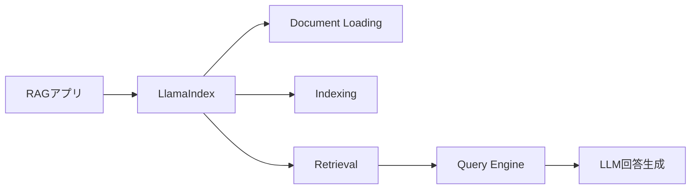
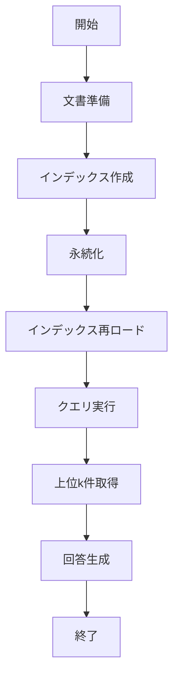

# LlamaIndex 入門

> 📖 中級（概念・実践） | 前提: Python基礎 / LLMアプリの基本概念

---

## OSS概要・公式情報（2026-05-23時点）
- **バージョン**: 0.14.21+
- **公式ドキュメント**: https://docs.llamaindex.ai/
- **GitHub**: https://github.com/run-llama/llama_index
- **FAQ/制約/リリースノート**: https://docs.llamaindex.ai/en/stable/getting_started/faq/
- **公式情報参照日**: 2026-05-23

---

## この教材で身につくこと
- LlamaIndexの主な役割・適用場面を説明できる
- 最小構成で動かす手順を実行できる
- 導入時のメリット・注意点を整理できる

---

## 特徴・できること
### 主な特徴
- RAG（Retrieval-Augmented Generation）特化のPython OSSライブラリ
- 多様なデータソース（ファイル、DB、API等）に対応
- LLM（OpenAI, Anthropic, Ollama等）と連携可能

### できること（Features）
- ドキュメントの自動分割・ベクトル化・索引化
- 類似度検索による関連ドキュメントの高速取得
- 複数データソースの統合・キャッシング・再利用
- LLMを用いたクエリ応答生成

### できないこと・制約事項（Limitations）
- 高度なUI機能は非搭載（UIは外部実装が必要）
- ベクトルDBやLLMのAPI制約に依存
- 大規模データ時はバッチ/非同期設計が推奨（[公式FAQ](https://docs.llamaindex.ai/en/stable/getting_started/faq/)より）

### 注意事項・推奨構成
- Python 3.10+、pip環境が必要
- LLM利用時はAPIキー必須
- 開発時はChroma、本番はPinecone/Weaviate等の利用推奨
- 公式Getting Started/FAQを参照し、バージョン互換性に注意

---

## 前提条件・インストール
### 必須スキル
- Python 基本
- ベクトル検索の概念理解


### 環境
- Python 3.12（3.12系を推奨）
- uv（高速パッケージマネージャ）
- OpenAI API キー（LLMが必要な場合）

### セットアップ例
```bash
# uv未導入の場合
pyhton -m pip install uv

# 仮想環境作成
uv venv .venv
# Windows: .venv\Scripts\activate
# macOS/Linux: source .venv/bin/activate

# パッケージインストール
uv pip install llama-index langchain-openai python-dotenv
```

---

## 仕組み・実行フロー
### 仕組み（全体像）
1. 目的と入力を定義し、対象データや利用モデルを準備
2. コア処理（検索・推論・生成・検証のいずれか）を実行
3. 実行結果を保存または表示し、次工程に渡せる形式へ整形
4. パラメータを調整して挙動差分を比較し、品質を確認
5. 運用を想定して再実行手順と確認ポイントを定着
## 前提条件

### 必須スキル

- Python 基本
- ベクトル検索の概念理解

### 環境

- Python 3.10+
- pip
- OpenAI API キー（LLMが必要な場合）

### インストール

```bash
pip install llama-index langchain-openai python-dotenv
```

## 位置づけ



LlamaIndex は、ドキュメント取り込みから索引化、検索、回答生成までを RAG の流れとしてまとめるための中心ライブラリです。

## 実行フロー



この教材は、`作成 -> 保存 -> 再利用 -> 高度取得`の順に進みます。実運用時はこの分割がそのままバッチ/API設計に対応します。


## 比較・選定ポイント
- RAG特化でシンプルな構成が可能
- LangChain等の汎用フレームワークと併用も多い
- 再現性・拡張性・運用性に優れるが、UIや大規模運用は追加設計が必要

---

## サンプルコード
（代表的なサンプルコードは下記「補足」セクションに掲載）

---

## 公式情報の参照・引用について
本教材の内容は公式サイト等の一次情報（[公式ドキュメント](https://docs.llamaindex.ai/)、[FAQ](https://docs.llamaindex.ai/en/stable/getting_started/faq/)等）を参照し、2026年5月時点で整理しています。

---

## 補足

### Python: 01_basic-indexing.py

- 役割: ドキュメントからベクトルインデックスを構築し永続化
- 入力: Document配列
- 出力: `./index_storage` に保存されたインデックス
- 実行: `python 01_basic-indexing.py`

```python
"""LlamaIndex basic indexing example."""

from dotenv import load_dotenv
from llama_index.core import Document, VectorStoreIndex
from llama_index.embeddings.openai import OpenAIEmbedding
from llama_index.llms.openai import OpenAI

load_dotenv()

# ========== ドキュメント準備 ==========

documents = [
  Document(
    text="生成AIとは、人工知能が新しいコンテンツを生成する技術です。テキスト生成、画像生成、コード生成など多岐にわたります。"
  ),
  Document(
    text="ベクトル検索は、テキストを数値ベクトルに変換して、その距離に基づいて類似度を計算する検索方法です。"
  ),
  Document(
    text="RAG（Retrieval-Augmented Generation）は、外部のナレッジベースから情報を取得してから生成するアプローチです。"
  ),
  Document(
    text="LangChain は LLM アプリ開発用のライブラリで、複数のツールとLLMを組み合わせてワークフローを構築できます。"
  ),
]

print(f"Prepared documents: {len(documents)}")
print("-" * 60)

# ========== 埋め込みモデルとLLMの設定 ==========

embed_model = OpenAIEmbedding(model="text-embedding-3-small")

llm = OpenAI(model="gpt-4o-mini", temperature=0.7)

# ========== インデックス作成 ==========

print("Building index...")
index = VectorStoreIndex.from_documents(
  documents,
  embed_model=embed_model,
  llm=llm,
  show_progress=True,
)

print("Index build completed")
print(f"Documents in index: {len(documents)}")
print("-" * 60)

# ========== 簡単なクエリテスト ==========

print("\nRun sample query\n")

test_query = "生成AIとは何ですか？"
print(f"Query: {test_query}")

query_engine = index.as_query_engine()
response = query_engine.query(test_query)

print(f"Answer:\n{response}")
print("-" * 60)

# インデックスをメモリに保存（後でロード可能）
print("\nPersisting index...")
index.storage_context.persist("./index_storage")
print("Saved to ./index_storage/")
```

#### 実行結果例（01_basic-indexing.py）

```text
Prepared documents: 4
------------------------------------------------------------
Building index...
Applying transformations: 100%|█████████████████████████████████████████████████████| 1/1 [00:00<00:00, 721.29it/s]
Generating embeddings: 100%|█████████████████████████████████████████████████████████| 4/4 [00:00<00:00,  4.47it/s]
Index build completed
Documents in index: 4
------------------------------------------------------------

Run sample query

Query: 生成AIとは何ですか？
Answer:
生成AIは、新しいコンテンツを生成するための人工知能技術です。
------------------------------------------------------------

Persisting index...
Saved to ./index_storage/
```

### Python: 02_query.py

- 役割: 永続化済みインデックスを読み込み、複数クエリを実行
- 入力: 質問テキスト配列
- 出力: 各質問への回答
- 実行: `python 02_query.py`

```python
"""LlamaIndex query example."""

from dotenv import load_dotenv
from llama_index.core import StorageContext, load_index_from_storage

load_dotenv()

# ========== インデックスのロード ==========

print("Loading index from disk...")

storage_context = StorageContext.from_defaults(
  persist_dir="./index_storage"
)

index = load_index_from_storage(storage_context)

print("Index loaded")
print("-" * 60)

# ========== 複数クエリ実行 ==========

queries = [
  "RAGとは何ですか？",
  "LangChainが解決する問題は？",
  "ベクトル検索の利点を教えてください",
]

query_engine = index.as_query_engine()

for i, query_text in enumerate(queries, 1):
  print(f"\n[Q{i}] {query_text}")
  print("-" * 60)

  response = query_engine.query(query_text)

  print(f"Answer:\n{response}")
  print("=" * 60)
```

#### 実行結果例（02_query.py）

```text
Loading index from disk...
Index loaded
------------------------------------------------------------

[Q1] RAGとは何ですか？
------------------------------------------------------------
Answer:
RAGは、外部のナレッジベースから情報を取得してから生成するアプローチです。
============================================================

[Q2] LangChainが解決する問題は？
------------------------------------------------------------
Answer:
LangChainは、外部のナレッジベースから情報を取得してから生成するアプローチであるRAG（Retrieval-Augmented Generation）において、ベクトル検索によって情報を取得する際に生じる問題を解決することができます。
============================================================

[Q3] ベクトル検索の利点を教えてください
------------------------------------------------------------
Answer:
ベクトル検索の利点は、テキストを数値ベクトルに変換することで、類似度を計算しやすくなる点です。これにより、検索精度が向上し、情報を効率的に取得できるようになります。
============================================================
```

### Python: 03_advanced-retrieval.py

- 役割: 上位k件取得とノードスコア確認
- 入力: クエリ文字列
- 出力: 回答と取得ノード詳細
- 実行: `python 03_advanced-retrieval.py`

```python
"""LlamaIndex advanced retrieval example."""

from dotenv import load_dotenv
from llama_index.core import StorageContext, load_index_from_storage, QueryBundle
from llama_index.embeddings.openai import OpenAIEmbedding
from llama_index.llms.openai import OpenAI

load_dotenv()

# ========== インデックスのロード ==========

print("Loading index...\n")

embed_model = OpenAIEmbedding(model="text-embedding-3-small")
llm = OpenAI(model="gpt-4o-mini", temperature=0.7)

storage_context = StorageContext.from_defaults(
  persist_dir="./index_storage"
)

index = load_index_from_storage(storage_context)

# ========== 戦略1: 類似度検索スコアを見る ==========

print("[Strategy1] Similarity search")
print("=" * 60)

query_engine = index.as_query_engine(similarity_top_k=2)
query_text = "LangChainとは？"
print(f"Query: {query_text}\n")

response = query_engine.query(query_text)
print(f"Answer:\n{response}\n")

# ========== 戦略2: 詳細な取得情報 ==========

print("[Strategy2] Retrieved nodes")
print("=" * 60)

retriever = index.as_retriever(similarity_top_k=2)
query_bundle = QueryBundle(query_text)
nodes = retriever.retrieve(query_bundle)

for i, node in enumerate(nodes, 1):
  print(f"ノード {i}:")
  print(f"  スコア: {node.score:.4f}")
  print(f"  テキスト: {node.get_content()[:100]}...")
  print()

print("=" * 60)
print("Advanced retrieval demo completed")
```

#### 実行結果例（03_advanced-retrieval.py）

```text
Loading index...

[Strategy1] Similarity search
============================================================
Query: LangChainとは？

Answer:
LangChainは、言語処理技術を活用して、複数の言語間で情報を連携させるための手法です。

[Strategy2] Retrieved nodes
============================================================
ノード 1:
  スコア: 0.0280
  テキスト: RAG（Retrieval-Augmented Generation）は、外部のナレッジベースから情報を取得してから生成するアプローチです。...

ノード 2:
  スコア: 0.0076
  テキスト: ベクトル検索は、テキストを数値ベクトルに変換して、その距離に基づいて類似度を計算する検索方法です。...

============================================================
Advanced retrieval demo completed
```

---

## 補足

**Q. LlamaIndex と LangChain の使い分けは？**  
A. LlamaIndex は RAG 特化、LangChain は汎用。多くの場合、両者を組み合わせます。

**Q. ベクトルDB は何を使えばいいですか？**  
A. 開発時は Chroma（メモリ内）、本番は Pinecone / Weaviate 推奨。

**Q. 大量の文書を高速に索引化できますか？**  
A. バッチ処理と非同期実行で対応可能ですが、事前にテストを推奨。

---

## 参考リンク

- [LlamaIndex 公式ドキュメント](https://docs.llamaindex.ai/)
- [GitHub Repository](https://github.com/run-llama/llama_index)


## サンプル

### 実行例

```bash
# この教材の最小構成を順に実行
# 具体的なコマンドは「最小セットアップ」または「実行フロー」を参照
```

### 検証

- コマンドがエラーなく完了する
- 想定した出力（画面表示・ファイル生成・回答）を確認できる
- 変更した設定に応じて結果差分を説明できる

## 実ソースコード（言語別に記載）
### 主要サンプル
- この教材の実装例は、本文中の実行手順に対応しています。
- 必要に応じて、主要コードの抜粋をこのセクションへ追記してください。

## 演習課題

1. ``LlamaIndex`` を使う想定ユースケースを1つ定義し、入力・出力の例を記録してください。
2. 最小構成で動かし、デフォルトから設定を1つ変えて挙動の差分を確認してください。
3. ``LlamaIndex`` を使わない場合の代替手段と比較し、選ぶ基準をまとめてください。


### 解答の目安

1. まず課題の目的を一文で明確化し、入力・出力を対応づけて記述します。
   確認ポイント: 何を変えて何を確認する課題かを第三者が読んで理解できること。
2. 最小構成で一度実行し、設定や条件を1つ変更して差分を比較します。
   確認ポイント: 変更前後の挙動差を具体的に説明できること。
3. 適用条件と代替手段を整理し、選択基準を短くまとめます。
   確認ポイント: なぜその手段を選ぶかを根拠付きで示せること。

## 理解度チェック

1. ``LlamaIndex`` の主な役割を1文で説明してください。
2. ``LlamaIndex`` を導入する際の最大のメリットと注意点は何ですか？
3. ``LlamaIndex`` が向かないユースケースとして、どのようなケースが考えられますか？


### 解説の要点

1. 主な役割は、その技術がどの工程を担い、何を改善するかで説明します。
2. メリットは再現性・拡張性・運用性の観点で整理し、注意点は導入コストや複雑性として示します。
3. 使い分けは要件、実装コスト、運用体制の3観点で判断します。
---

[← 前へ](02-rag/00-README.md) | [次へ →](02-rag/02-haystack.md)


