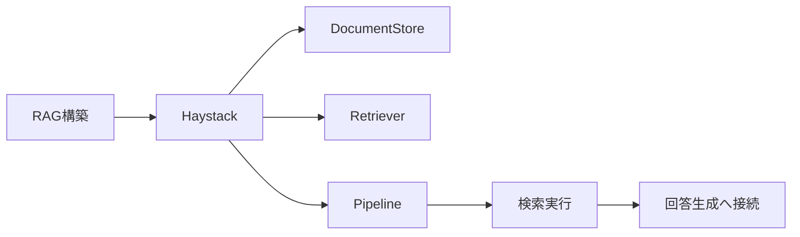
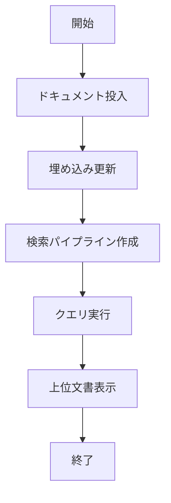

# Haystack 入門

> 📖 中級（概念・実践） | 前提: Python基礎 / LLMアプリの基本概念

## この教材で身につくこと

- Haystackの主な役割・適用場面を説明できる
- 最小構成で動かす手順を実行できる
- 導入時のメリット・注意点を整理できる

## 概要

**Haystack** は、検索と生成を組み合わせたRAGパイプライン構築フレームワークです。

**バージョン**: 2.28.0 推奨 / Haystack 1.x EOL（2026-05-23時点）  
**公式ドキュメント**: https://docs.haystack.deepset.ai/  
**GitHub**: https://github.com/deepset-ai/haystack  
**Migration Guide**: https://docs.haystack.deepset.ai/docs/migration-guide  
**Components Reference**: https://docs.haystack.deepset.ai/docs/components  
※本教材の内容は公式サイト等の一次情報を参照し、2026年5月時点で整理しています。

### 主な特徴

- DocumentStore、Retriever、Generator等の部品を組み合わせて柔軟なQAアプリを構築可能
- 2.x系はPipelineベース設計・@componentデコレータ導入で拡張性が高い
- 文書投入・前処理・埋め込み検索・パイプライン設計
- 検索結果を使った回答生成
- 複数ストア・Retriever・Generatorの組み合わせ

### 制約事項

- 1.x と 2.x で API 互換がないため、旧サンプルは原則そのまま動かない
- UI機能は非搭載（UIは外部実装が必要）
- 大規模運用ではストア選定やパイプライン設計の最適化が必要
- 新規導入は Haystack 2.x（haystack-ai）を推奨
- 移行時は公式 Migration Guide を先に確認

### 比較・選定ポイント

LlamaIndex等のRAG特化OSSと比べ、パイプライン設計の柔軟性が高い。1.x→2.xでAPIが大幅変更されているため、既存資産流用時は要注意。再現性・拡張性・運用性に優れるが、UIや大規模運用は追加設計が必要。

## 位置づけ

この例では、Haystack 入門 の基本的な利用手順を示します。サンプルコードの意図と、実行時に何が起こるのかを確認しながら読み進めると理解しやすくなります。



Haystack は、検索パイプラインを部品（Store/Retriever/Pipeline）として組み立てる設計に強いフレームワークです。

## 実行フロー



この教材はまず最小検索パイプラインを作り、次にクエリバリエーションで挙動を比較します。

## 最小セットアップ

Haystack 2.xの最小構成を動かすためのセットアップ手順です。

1. **uv（高速パッケージマネージャ）が未導入の場合**
	```bash
	python -m pip install uv
	```
2. **仮想環境の作成**
	```bash
	uv venv .venv
	# Windows: .venv\Scripts\activate
	# macOS/Linux: source .venv/bin/activate
	```
3. **必要パッケージのインストール**
	```bash
	uv pip install haystack-ai sentence-transformers python-dotenv
	```
	- 依存ライブラリをrequirements.txtで管理する場合は
	  ```bash
	  uv pip install -r requirements.txt
	  ```
4. **サンプル実行**
	```bash
	python 01_basic-pipeline.py
	```

## 実ソースコード

### 検証

- コマンドがエラーなく完了する
- 想定した出力（画面表示・ファイル生成・回答）を確認できる
- 変更した設定に応じて結果差分を説明できる

### Python: requirements.txt（Haystack 2.x対応例）

- 役割: 依存ライブラリを固定
- 入力: なし
- 出力: uvインストール対象
- 実行: `uv pip install -r requirements.txt`

```txt
haystack-ai==2.28.0
sentence-transformers==2.5.1
python-dotenv==1.0.0
```

### Python: 01_basic-pipeline.py（Haystack 2.x対応）

- 役割: インメモリ文書ストア＋埋め込み生成＋検索
- 入力: クエリ文字列
- 出力: 上位文書
- 実行: `python 01_basic-pipeline.py`

```python
from haystack import Document
from sentence_transformers import SentenceTransformer
from haystack.components.retrievers.in_memory import InMemoryEmbeddingRetriever
from haystack.document_stores.in_memory import InMemoryDocumentStore

docs = [
    Document(content="RAGは検索結果を使って回答生成の精度を上げる手法です。"),
    Document(content="HaystackはRetrieverとReader/Generatorを分けて構築できます。"),
    Document(content="株式分析では、決算資料やニュースを検索対象にできます。"),
]
# Use sentence-transformers directly to avoid haystack/sentence-transformers API mismatches
st_model = SentenceTransformer("sentence-transformers/all-MiniLM-L6-v2")
# for d in docs:
#     d.embedding = st_model.encode(d.content)
from dataclasses import replace
docs = [replace(d, embedding=st_model.encode(d.content).tolist()) for d in docs]

docs_with_embeddings = docs

doc_store = InMemoryDocumentStore()
doc_store.write_documents(docs_with_embeddings)
retriever = InMemoryEmbeddingRetriever(doc_store)

query = "RAGの利点は?"
query_embedding = st_model.encode(query).tolist()
if not query_embedding:
    raise ValueError(
        "query embedding is empty"
    )
result = retriever.run(query_embedding=query_embedding, top_k=2)

print("Query:", query)
print("Top documents:")
for i, d in enumerate(result["documents"], start=1):
    print(f"{i}. {d.content}")
```

#### 実行結果例（01_basic-pipeline.py）

```text
(.venv) PS C:\Dev\tutorials\generative-ai-oss-tutorials\sandbox\02-haystack> python .\01_basic-pipeline.py
Query: RAGの利点は?
Top documents:
1. RAGは検索結果を使って回答生成の精度を上げる手法です。
2. 株式分析では、決算資料やニュースを検索対象にできます。
(.venv) PS C:\Dev\tutorials\generative-ai-oss-tutorials\sandbox\02-haystack> 
```

> ⚠️ Haystack 2.xではAPI仕様が大きく変わっているため、旧1.x系サンプルは動作しません。依存パッケージのバージョン競合やモデルダウンロード環境によってはエラーが発生する場合があります。

### 実行例（まとめ）

```bash
cd 02_haystack-python
pip install -r requirements.txt
python 01_basic-pipeline.py
python 02_query-demo.py
```

## 演習課題

1. Haystack を使う想定ユースケースを1つ定義し、入力・出力の例を記録してください。
2. 最小構成で動かし、デフォルトから設定を1つ変えて挙動の差分を確認してください。
3. Haystack を使わない場合の代替手段と比較し、選ぶ基準をまとめてください。

### 解答の目安

1. まず課題の目的を一文で明確化し、入力・出力を対応づけて記述します。
   確認ポイント: 何を変えて何を確認する課題かを第三者が読んで理解できること。
2. 最小構成で一度実行し、設定や条件を1つ変更して差分を比較します。
   確認ポイント: 変更前後の挙動差を具体的に説明できること。
3. 適用条件と代替手段を整理し、選択基準を短くまとめます。
   確認ポイント: なぜその手段を選ぶかを根拠付きで示せること。

## 理解度チェック

1. Haystack の主な役割を1文で説明してください。
2. Haystack を導入する際の最大のメリットと注意点は何ですか？
3. Haystack が向かないユースケースとして、どのようなケースが考えられますか？

### 解説の要点

1. 主な役割は、その技術がどの工程を担い、何を改善するかで説明します。
2. メリットは再現性・拡張性・運用性の観点で整理し、注意点は導入コストや複雑性として示します。
3. 使い分けは要件、実装コスト、運用体制の3観点で判断します。

## 補足

**Q. Haystack 1.x から 2.x への移行は必須ですか？**  
A. はい。Haystack 1.x は 2025-03 に EOL となっているため、新規プロジェクトでは 2.x を推奨します。1.x から 2.x への移行ガイドは公式ドキュメントを参照してください。

**Q. Haystack 2.x の API は大きく変わったのか？**  
A. はい。`Pipeline` ベースと `@component` デコレータの導入により、大きく変更されています。詳細は公式ドキュメントを参照してください。

**Q. 既存の 1.x コードをそのまま実行できる？**  
A. いいえ。API に互換性がないため、コードの書き直しが必要です。移行ガイドを参照してください。

## 参考リンク

- [Haystack 公式ドキュメント（2.x）](https://docs.haystack.deepset.ai/)
- [Haystack GitHub](https://github.com/deepset-ai/haystack)
- [Migration Guide（1.x → 2.x）](https://docs.haystack.deepset.ai/docs/migration-guide)
- [Components Reference](https://docs.haystack.deepset.ai/docs/components)

---

[← 前へ](01-llamaindex.md) | [次へ →](03-txtai.md)
