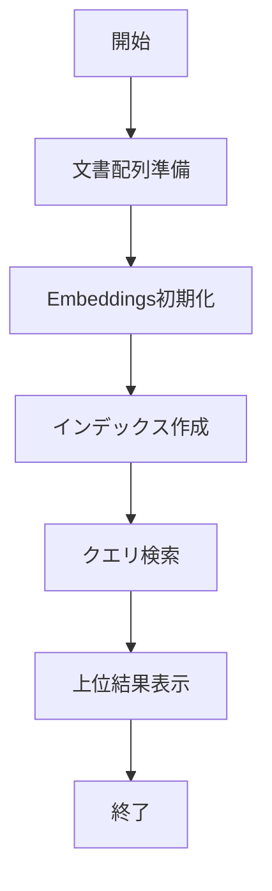

# txtai 入門

> 📖 中級（概念・実践） | 前提: Python基礎 / LLMアプリの基本概念

## この教材で身につくこと

- txtai 入門 の主な役割と適用場面を説明できる
- txtai 入門 を最小構成で動かす手順を実行できる
- 導入時のメリットと注意点を整理できる

## コンセプト
txtai は埋め込み検索と生成ワークフローをまとめて扱える軽量フレームワークです。

**バージョン**: 9.8.0+ / OSS準拠（2026-05時点）  
**公式ドキュメント**: https://neuml.github.io/txtai/

## 利用モデル

txtai は用途に応じて埋め込みモデルや生成モデルを切り替えられます。

- ローカルモデル（例: sentence-transformers / Ollama）
	- オフライン実行やデータ統制に向き、小規模検証を始めやすい
- クラウドモデル（例: OpenAI API）
	- 高性能モデルを利用しやすい一方、送信データとコスト管理が必要

この教材では、まずローカル構成で検索品質を確認し、
必要に応じてクラウド構成を比較して採用判断する流れを推奨します。

## 仕組み

1. 目的と入力を定義し、対象データや利用モデルを準備します。
2. コア処理（検索・推論・生成・検証のいずれか）を実行します。
3. 実行結果を保存または表示し、次工程に渡せる形式へ整えます。
4. パラメータを調整して挙動差分を比較し、品質を確認します。
5. 運用を想定して再実行手順と確認ポイントを定着させます。
## 位置づけ


txtai は最小コードで意味検索を始めたい場合に適した軽量フレームワークです。

## 実行フロー



この教材では setup ディレクトリにある最小ファイル一式をそのまま掲載し、リンク参照なしで再現できる形にします。

## サンプル

このサンプルでは、同じ文書集合・同じ質問を使って、
「ローカル埋め込み構成」と「クラウド埋め込み構成」の差分を確認します。

### 実行例

```bash
# 1) 最小環境を準備
pip install txtai sentence-transformers

# 2) 最小検索を実行
python 01_basic-search.py

# 3) 同じ質問で上位結果を確認
#    質問: RAGの基本

# 4) モデル構成を切り替えて再実行
#    - A: ローカル埋め込み（all-MiniLM-L6-v2）
#    - B: クラウド埋め込み（OpenAI Embeddings など）
```

### 期待される確認ポイント

- 上位結果の妥当性: 意図に合う文書が上位に来るか
- スコア傾向: 上位$k$件のスコア差が極端でないか
- 再現性: 同条件で同傾向の順位が得られるか
- 運用要件: レイテンシ・コスト・データ統制に適合するか

### 検証

- コマンドがエラーなく完了する
- 想定した出力（画面表示・ファイル生成・回答）を確認できる
- 変更した設定に応じて結果差分を説明できる

### 差分記録テンプレート

- 構成: ローカル埋め込み / クラウド埋め込み
- 質問: RAGの基本
- 上位結果: （上位3件を転記）
- 妥当性評価: 高 / 中 / 低
- 応答時間: xx 秒
- 判断メモ: 採用する構成と理由
## 実ソースコード（言語別に記載）
### Python: 00_requirements.txt

- 役割: txtaiデモの依存関係定義
- 入力: なし
- 出力: pipインストール対象
- 実行: `pip install -r 00_requirements.txt`

```txt
txtai==9.8.0
```

### Python: 01_basic-search.py

- 役割: 最小のセマンティック検索
- 入力: 文書配列と検索クエリ
- 出力: 上位検索結果
- 実行: `python 01_basic-search.py`

```python
"""txtai minimal semantic search demo."""

from txtai import Embeddings


def main() -> None:
	docs = [
		"RAGは検索結果を生成に使う手法",
		"LangChainはLLMアプリ開発フレームワーク",
		"株式分析ではニュース検索が重要",
	]

	embeddings = Embeddings({"path": "sentence-transformers/all-MiniLM-L6-v2"})
	embeddings.index([(i, text, None) for i, text in enumerate(docs)])

	for uid, score in embeddings.search("RAGの基本", 2):
		print(uid, round(score, 4), docs[uid])


if __name__ == "__main__":
	main()
```

## まず試す
```bash
pip install txtai sentence-transformers
python -c "from txtai import Embeddings; print('txtai ready')"
```

## 補足

**Q. txtai と LlamaIndex の使い分けは？**  
A. txtai は軽量・シンプル。LlamaIndex は機能豊富・拡張性重視。小規模プロジェクトは txtai、大規模・複雑な要件は LlamaIndex 推奨。

**Q. txtai でベクトル DB として使える？**  
A. はい。インメモリストアで十分な場合と、永続化が必要な場合で分けて考えます。永続化時は SQLite backend を使用可能。

**Q. オンプレミス環境で実行可能？**  
A. はい。依存関係が軽い（sentence-transformers など）ため、オンプレ環境での実行に向いています。

---

## 参考リンク

- [txtai 公式ドキュメント](https://neuml.github.io/txtai/)
- [txtai GitHub](https://github.com/neuml/txtai)
- [API Reference](https://neuml.github.io/txtai/api/)
- [Embeddings Guide](https://neuml.github.io/txtai/embeddings/)

---

## 演習課題

1. ``txtai 入門`` を使う想定ユースケースを1つ定義し、入力・出力の例を記録してください。
2. 最小構成で動かし、デフォルトから設定を1つ変えて挙動の差分を確認してください。
3. ``txtai 入門`` を使わない場合の代替手段と比較し、選ぶ基準をまとめてください。


### 解答の目安

1. まず課題の目的を一文で明確化し、入力・出力を対応づけて記述します。
   確認ポイント: 何を変えて何を確認する課題かを第三者が読んで理解できること。
2. 最小構成で一度実行し、設定や条件を1つ変更して差分を比較します。
   確認ポイント: 変更前後の挙動差を具体的に説明できること。
3. 適用条件と代替手段を整理し、選択基準を短くまとめます。
   確認ポイント: なぜその手段を選ぶかを根拠付きで示せること。
## 理解度チェック

1. ``txtai 入門`` の主な役割を1文で説明してください。
2. ``txtai 入門`` を導入する際の最大のメリットと注意点は何ですか？
3. ``txtai 入門`` が向かないユースケースとして、どのようなケースが考えられますか？


### 解説の要点

1. 主な役割は、その技術がどの工程を担い、何を改善するかで説明します。
2. メリットは再現性・拡張性・運用性の観点で整理し、注意点は導入コストや複雑性として示します。
3. 使い分けは要件、実装コスト、運用体制の3観点で判断します。
---

[← 前へ](02-rag/02-haystack.md) | [次へ →](02-rag/04-ragflow.md)


