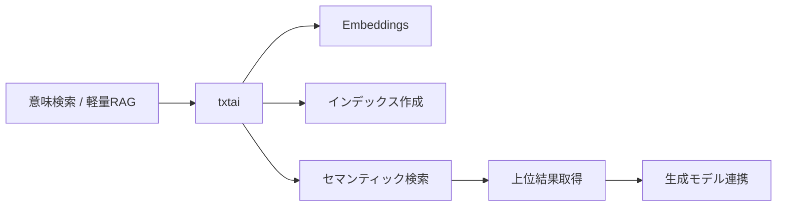
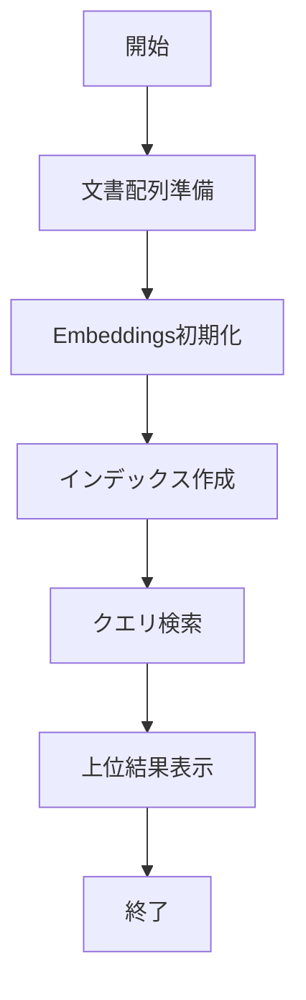

# txtai 入門

> 📖 中級（概念・実践） | 前提: Python基礎 / LLMアプリの基本概念

## この教材で身につくこと

- txtaiの主な役割・適用場面を説明できる
- 最小構成で動かす手順を実行できる
- 導入時のメリット・注意点を整理できる

## 概要

**txtai** は、埋め込み検索と生成ワークフローをまとめて扱える軽量フレームワークです。

**バージョン**: 9.8.0+（2026-05-23時点）  
**公式ドキュメント**: https://neuml.github.io/txtai/  
**GitHub**: https://github.com/neuml/txtai  
**FAQ/制約/リリースノート**: https://github.com/neuml/txtai/discussions  
※本教材の内容は公式サイト等の一次情報を参照し、2026年5月時点で整理しています。

### 主な特徴

- ローカル・クラウド両対応で、最小構成から意味検索を始めやすい
- Python中心で完結し、APIもシンプル
- 文書の埋め込み・意味検索・インデックス作成
- 生成モデルとの連携によるQAや要約
- ローカル/クラウドモデルの切り替え
- 軽量なAPIサーバーとしての運用

### 制約事項

- 高度なUI機能は非搭載（外部実装が必要）
- 大規模分散処理や商用DB連携は限定的
- 最新制約は公式FAQ・GitHub Discussionsの確認が前提
- Python 3.12（3.12系を推奨）
- 公式FAQ・リリースノートでバージョン互換性を確認

### 利用モデル

txtaiは用途に応じて埋め込みモデルや生成モデルを切り替えられます。

- ローカルモデル（例: sentence-transformers / Ollama）: オフライン実行やデータ統制に向く
- クラウドモデル（例: OpenAI API）: 高性能モデルを利用しやすい一方、送信データとコスト管理が必要

本教材では、まずローカル構成で検索品質を確認し、必要に応じてクラウド構成を比較して採用判断する流れを推奨します。

### 比較・選定ポイント

Pythonのみで完結し、最小限のコードで意味検索や生成ワークフローを実現できる軽量性が強み。ローカル/クラウド両対応で、データ統制重視と精度重視の選択が可能。APIがシンプルで学習コストが低く、PoCや小規模用途に適する。大規模分散や商用DB連携、UI機能は限定的（要件次第で他OSSと比較）。LlamaIndexやHaystack等と比較し、運用規模に応じて選定。

## 位置づけ



txtai は、ローカル/クラウド両対応で Python のみで完結する軽量な意味検索・生成ワークフロー基盤です。

## 実行フロー



この教材では、同じ文書集合・同じ質問を使って、「ローカル埋め込み構成」と「クラウド埋め込み構成」の差分を確認します。

## 最小セットアップ

```bash
# uv未導入の場合
python -m pip install uv

# 仮想環境作成
uv venv .venv
# Windows: .venv\Scripts\activate
# macOS/Linux: source .venv/bin/activate

# パッケージインストール
uv pip install txtai sentence-transformers

# 最小検索を実行
python 01_basic-search.py
```

## 実ソースコード（言語別）

### 実行例

```bash
# 1) 最小環境を準備
pip install txtai sentence-transformers

# 2) 最小検索を実行
python 01_basic-search.py

# 3) 同じ質問で上位結果を確認
#    質問: RAGの基本

# 4) モデル構成を切り替えて再実行
#    - A: ローカル埋め込み（all-MiniLM-L6-v2）
#    - B: クラウド埋め込み（OpenAI Embeddings など）
```

### 期待される確認ポイント

- 上位結果の妥当性: 意図に合う文書が上位に来るか
- スコア傾向: 上位$k$件のスコア差が極端でないか
- 再現性: 同条件で同傾向の順位が得られるか
- 運用要件: レイテンシ・コスト・データ統制に適合するか

### 差分記録テンプレート

- 構成: ローカル埋め込み / クラウド埋め込み
- 質問: RAGの基本
- 上位結果: （上位3件を転記）
- 妥当性評価: 高 / 中 / 低
- 応答時間: xx 秒
- 判断メモ: 採用する構成と理由

### Python: requirements.txt

- 役割: txtaiデモの依存関係定義
- 入力: なし
- 出力: インストール対象リスト
- 実行: `uv pip install -r requirements.txt`

```txt
txtai==9.8.0
```

### Python: 01_basic-search.py

- 役割: 最小のセマンティック検索
- 入力: 文書配列と検索クエリ
- 出力: 上位検索結果
- 実行: `python 01_basic-search.py`

```python
"""txtai minimal semantic search demo."""

from txtai import Embeddings


def main() -> None:
    docs = [
        "RAGは検索結果を生成に使う手法",
        "LangChainはLLMアプリ開発フレームワーク",
        "株式分析ではニュース検索が重要",
    ]

    embeddings = Embeddings({"path": "sentence-transformers/all-MiniLM-L6-v2"})
    embeddings.index([(i, text, None) for i, text in enumerate(docs)])

    for uid, score in embeddings.search("RAGの基本", 2):
        print(uid, round(score, 4), docs[uid])


if __name__ == "__main__":
    main()
```

## 演習課題

1. txtaiを使う想定ユースケースを1つ定義し、入力・出力の例を記録してください。
2. 最小構成で動かし、設定を1つ変えて挙動の差分を確認してください。
3. txtaiを使わない場合の代替手段と比較し、選ぶ基準をまとめてください。

### 解答の目安

1. まず課題の目的を一文で明確化し、入力・出力を対応づけて記述します。
   確認ポイント: 何を変えて何を確認する課題かを第三者が読んで理解できること。
2. 最小構成で一度実行し、設定や条件を1つ変更して差分を比較します。
   確認ポイント: 変更前後の挙動差を具体的に説明できること。
3. 適用条件と代替手段を整理し、選択基準を短くまとめます。
   確認ポイント: なぜその手段を選ぶかを根拠付きで示せること。

## 理解度チェック

1. txtaiの主な役割を1文で説明してください。
2. txtai導入時の最大のメリットと注意点は何ですか？
3. txtaiが向かないユースケースとして、どのようなケースが考えられますか？

### 解説の要点

1. 主な役割は、その技術がどの工程を担い、何を改善するかで説明します。
2. メリットは再現性・拡張性・運用性の観点で整理し、注意点は導入コストや複雑性として示します。
3. 使い分けは要件、実装コスト、運用体制の3観点で判断します。

## 補足

**Q. txtai と LlamaIndex の使い分けは？**  
A. txtai は軽量・シンプル。LlamaIndex は機能豊富・拡張性重視。小規模プロジェクトは txtai、大規模・複雑な要件は LlamaIndex 推奨です。

**Q. txtai でベクトルDBとして使える？**  
A. 可能です。インメモリで十分なケースと、永続化が必要なケースを分けて設計します。永続化時はSQLite backendの利用が可能です。

**Q. オンプレミス環境で実行可能？**  
A. 可能です。依存関係が比較的軽いため、オンプレ環境での検証・運用に向いています。

## 参考リンク

- [txtai 公式ドキュメント](https://neuml.github.io/txtai/)
- [txtai GitHub](https://github.com/neuml/txtai)
- [API Reference](https://neuml.github.io/txtai/api/)
- [Embeddings Guide](https://neuml.github.io/txtai/embeddings/)

---

[← 前へ](02-haystack.md) | [次へ →](04-ragflow.md)
