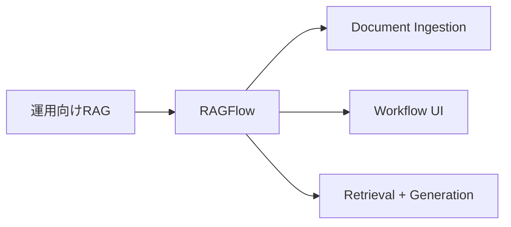
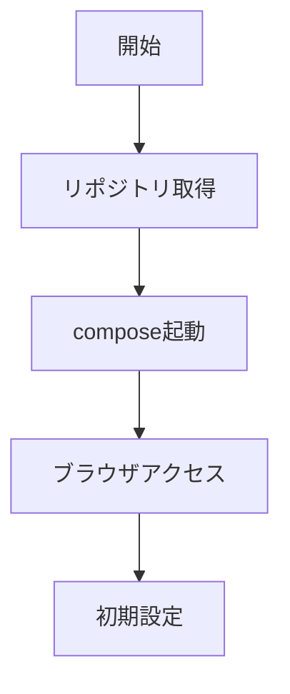

# RAGFlow 入門

> 📖 中級（概念・実践） | 前提: Python基礎 / LLMアプリの基本概念

## この教材で身につくこと

- RAGFlow 入門 の主な役割と適用場面を説明できる
- RAGFlow 入門 を最小構成で動かす手順を実行できる
- 導入時のメリットと注意点を整理できる

## コンセプト
RAGFlow は文書取り込み、検索、回答生成を運用向けに統合した RAG プラットフォームです。

**バージョン**: 最新版（GitHub 確認推奨） / OSS準拠（2026-05時点）  
**公式ドキュメント**: https://ragflow.io/

## 利用モデル

RAGFlow は利用モデルを固定せず、用途に応じて複数プロバイダを設定できます。

- ローカルLLM（例: Ollama）
	- データ外部送信を抑えやすく、機密文書の社内運用に向く
- クラウドLLM（例: OpenAI API）
	- モデル性能や運用機能を活用しやすい一方、送信データ統制が必要

この教材では、まずローカルLLM構成でRAGフローを確認し、
要件に応じてクラウドLLMを比較検証する流れを推奨します。

## 仕組み

1. 目的と入力を定義し、対象データや利用モデルを準備します。
2. コア処理（検索・推論・生成・検証のいずれか）を実行します。
3. 実行結果を保存または表示し、次工程に渡せる形式へ整えます。
4. パラメータを調整して挙動差分を比較し、品質を確認します。
5. 運用を想定して再実行手順と確認ポイントを定着させます。
## 位置づけ


RAGFlow は、RAGパイプラインをアプリとして運用するための統合基盤です。

## 実行フロー



## 最小セットアップ

### 起動（公式リポジトリの compose を利用）

```bash
git clone https://github.com/infiniflow/ragflow.git
cd ragflow
docker compose up -d
```

### アクセス

- http://localhost:9380


## サンプル

このサンプルでは、同一ナレッジベース・同一質問を使い、
「ローカルLLM構成」と「クラウドLLM構成」の差分を確認します。

### 実行例

```bash
# 1) RAGFlow を起動
git clone https://github.com/infiniflow/ragflow.git
cd ragflow
docker compose up -d

# 2) ブラウザで http://localhost:9380 にアクセス
# 3) 同じ文書を取り込み（例: docs/policy.md）
#    例: 「在宅勤務は週3日まで可能。申請は前日18時まで」

# 4) 同じ質問を実行
#    質問: 在宅勤務の上限日数と申請締切は？

# 5) モデル構成を切り替えて再実行
#    - A: ローカルLLM（Ollama など）
#    - B: OpenAI API などのクラウドLLM
```

### 期待される確認ポイント

- 回答の正確性: 「週3日」「前日18時まで」を正しく抽出できるか
- 再現性: 同条件で同傾向の回答が得られるか
- レイテンシ: 回答速度にどれくらい差があるか
- 運用適合性: セキュリティ・監査・コスト要件に合うか

### 検証

- コマンドがエラーなく完了する
- 想定した出力（画面表示・ファイル生成・回答）を確認できる
- 変更した設定に応じて結果差分を説明できる

### 差分記録テンプレート

- 構成: ローカルLLM / クラウドLLM
- 質問: 在宅勤務の上限日数と申請締切は？
- 回答: （そのまま転記）
- 正確性評価: 正 / 部分一致 / 誤り
- 応答時間: xx 秒
- 判断メモ: 本番運用で採用する構成と理由
## 実ソースコード（言語別に記載）
### 主要サンプル
- この教材の実装例は、本文中の実行手順に対応しています。
- 必要に応じて、主要コードの抜粋をこのセクションへ追記してください。

## 補足

**Q. RAGFlow は自社で運用可能？**  
A. はい。Docker Compose で完全にオンプレミス構成可能。ただし、リソース要件が大きい（メモリ 4GB 以上推奨）。

**Q. 複数LLMの切り替えは可能？**  
A. はい。UI から複数 LLM プロバイダ（OpenAI、Ollama など）を設定可能。

**Q. 大規模文書の索引化はどのくらい時間がかかる？**  
A. 実装形式により異なる。事前にテストで所要時間を確認推奨。

---

## 参考リンク

- [RAGFlow 公式サイト](https://ragflow.io/)
- [RAGFlow GitHub](https://github.com/infiniflow/ragflow)
- [Docker Compose セットアップ](https://github.com/infiniflow/ragflow/blob/main/docker-compose.yml)
- [設定ガイド](https://github.com/infiniflow/ragflow#configuration)

---

## 演習課題

1. ``RAGFlow 入門`` を使う想定ユースケースを1つ定義し、入力・出力の例を記録してください。
2. 最小構成で動かし、デフォルトから設定を1つ変えて挙動の差分を確認してください。
3. ``RAGFlow 入門`` を使わない場合の代替手段と比較し、選ぶ基準をまとめてください。


### 解答の目安

1. まず課題の目的を一文で明確化し、入力・出力を対応づけて記述します。
   確認ポイント: 何を変えて何を確認する課題かを第三者が読んで理解できること。
2. 最小構成で一度実行し、設定や条件を1つ変更して差分を比較します。
   確認ポイント: 変更前後の挙動差を具体的に説明できること。
3. 適用条件と代替手段を整理し、選択基準を短くまとめます。
   確認ポイント: なぜその手段を選ぶかを根拠付きで示せること。
## 理解度チェック

1. ``RAGFlow 入門`` の主な役割を1文で説明してください。
2. ``RAGFlow 入門`` を導入する際の最大のメリットと注意点は何ですか？
3. ``RAGFlow 入門`` が向かないユースケースとして、どのようなケースが考えられますか？


### 解説の要点

1. 主な役割は、その技術がどの工程を担い、何を改善するかで説明します。
2. メリットは再現性・拡張性・運用性の観点で整理し、注意点は導入コストや複雑性として示します。
3. 使い分けは要件、実装コスト、運用体制の3観点で判断します。
---

[← 前へ](02-rag/03-txtai.md) | [次へ →](02-rag/05-privategpt.md)


