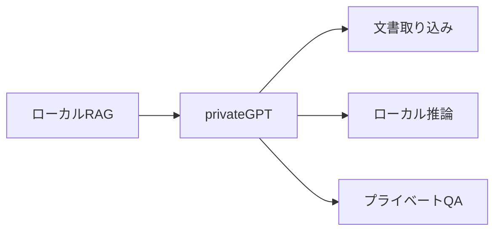
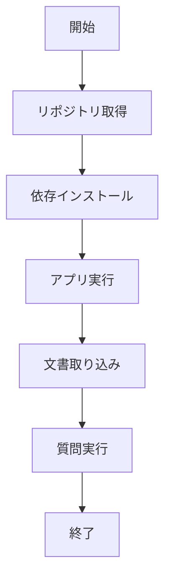

# privateGPT 入門

> 📖 中級（概念・実践） | 前提: Python基礎 / LLMアプリの基本概念

## この教材で身につくこと

- privateGPT の主な役割と適用場面を説明できる
- privateGPT を最小構成で動かす手順を実行できる
- 導入時のメリットと注意点を整理できる

## 概要

**privateGPT** は、ローカル文書に対するプライベートQAを実現するOSSです。

**バージョン**: 0.6.2+ / OSS準拠（2026-05-23時点）  
**公式ドキュメント**: https://docs.privategpt.dev/  
**GitHub**: https://github.com/zylon-ai/private-gpt  
※本教材の内容は公式サイト等の一次情報を参照し、2026年5月時点で整理しています。

### 主な特徴

- ローカルLLM/クラウドLLM両対応（Ollama, llama.cpp, OpenAI API等）
- 完全オンプレミス運用が可能
- PDF/Word/Text/Markdown等の多様な文書形式に対応

### 制約事項

- クラウドLLM利用時はデータ外部送信リスクあり
- 言語サポートや大規模運用時のリソース要件に注意
- 高度なカスタマイズや独自拡張は要ソース読解

### 利用モデル

privateGPT は利用モデルを固定せず、構成に応じて切り替えできます。

- ローカルLLM（例: Ollama, llama.cpp）: データを外部送信せずに運用しやすく、privateGPT の主目的に合致
- クラウドLLM（例: OpenAI API）: 高性能モデルを利用しやすい一方、外部送信に関する統制が必要

本教材では、プライバシー重視の観点からローカルLLM構成を基本とします。要件上必要な場合のみ、クラウドLLMを選択してください。

### 比較・選定ポイント

- **プライバシー重視**: データ外部送信なしで運用したい場合に最適
- **導入容易性**: Python 3.12 + uv で即試せる
- **他OSSとの違い**: RAGFlow等に比べ「完全ローカル・プライバシー特化」に強み
- **選定基準例**:
    - 社内運用/オンプレ要件 → ローカルLLM構成
    - 高性能モデル重視 → クラウドLLM構成
    - プライバシー最優先 → privateGPT

## 位置づけ



privateGPT は、データを外部に出さずに文書QAを実現したいケースに向いています。

## 実行フロー



プライバシー重視の構成では、すべての処理をローカル環境で完結できます。

## 最小セットアップ

1. 公式リポジトリを取得
2. 依存パッケージをインストール
3. アプリを起動

```bash
git clone https://github.com/zylon-ai/private-gpt.git
cd private-gpt
# uv未導入の場合
python -m pip install uv

# 仮想環境作成
uv venv .venv
# Windows: .venv\Scripts\activate
# macOS/Linux: source .venv/bin/activate


# パッケージインストール
uv pip install -r requirements.txt

# アプリ起動
python -m private_gpt
```

### Python: requirements.txt（最小構成例）

- 役割: privateGPTの依存関係定義
- 入力: なし
- 出力: uvインストール対象
- 実行: `uv pip install -r requirements.txt`

```txt
langchain>=0.1.0
chromadb>=0.4.24
python-dotenv>=1.0.0
tqdm>=4.65.0
openai>=1.0.0
llama-cpp-python>=0.2.60
ollama>=0.1.7
PyPDF2>=3.0.0
docx2txt>=0.8
markdown>=3.4.0
fastapi>=0.110.0
uvicorn>=0.29.0
```

ローカル文書を ingest してから質問します。

## 実ソースコード

同じ文書・同じ質問で「ローカルLLM構成」と「クラウドLLM構成」の違いを確認します。

### 実行例

```bash
# 1) privateGPT を起動
git clone https://github.com/zylon-ai/private-gpt.git
cd private-gpt
# uv未導入の場合
python -m pip install uv

# 仮想環境作成
uv venv .venv
# Windows: .venv\Scripts\activate
# macOS/Linux: source .venv/bin/activate

# パッケージインストール
uv pip install -r requirements.txt

# アプリ起動
python -m private_gpt
# 2) 起動後、UI または API から docs/policy.md を取り込み
#    例: 「在宅勤務は週3日まで可能。申請は前日18時まで」
# 3) 同じ質問を実行
#    質問: 在宅勤務の上限日数と申請締切は？
# 4) 構成を切り替えて再実行
#    - A: ローカルLLM（推奨）
#    - B: OpenAI API などのクラウドLLM
```

#### 期待される確認ポイント

- 回答の正確性: 「週3日」「前日18時まで」が抽出できるか
- 参照一貫性: 取り込んだ文書の内容に沿った回答か
- レイテンシ: 応答速度にどれくらい差があるか
- 運用要件: データ外部送信の有無、監査・統制要件に適合するか

#### 差分記録テンプレート

- 構成: ローカルLLM / クラウドLLM
- 質問: 在宅勤務の上限日数と申請締切は？
- 回答: （そのまま転記）
- 正確性評価: 正 / 部分一致 / 誤り
- 応答時間: xx 秒
- 判断メモ: どの要件ではどちらを採用するか

## 演習課題

1. privateGPT を使う想定ユースケースを1つ定義し、入力・出力の例を記録してください。
2. 最小構成で動かし、デフォルトから設定を1つ変えて挙動の差分を確認してください。
3. privateGPT を使わない場合の代替手段と比較し、選ぶ基準をまとめてください。

### 解答の目安

1. まず課題の目的を一文で明確化し、入力・出力を対応づけて記述します。
   確認ポイント: 何を変えて何を確認する課題かを第三者が読んで理解できること。
2. 最小構成で一度実行し、設定や条件を1つ変更して差分を比較します。
   確認ポイント: 変更前後の挙動差を具体的に説明できること。
3. 適用条件と代替手段を整理し、選択基準を短くまとめます。
   確認ポイント: なぜその手段を選ぶかを根拠付きで示せること。

## 理解度チェック

1. privateGPT の主な役割を1文で説明してください。
2. privateGPT を導入する際の最大のメリットと注意点は何ですか？
3. privateGPT が向かないユースケースとして、どのようなケースが考えられますか？

### 解説の要点

1. 主な役割は、その技術がどの工程を担い、何を改善するかで説明します。
2. メリットは再現性・拡張性・運用性の観点で整理し、注意点は導入コストや複雑性として示します。
3. 使い分けは要件、実装コスト、運用体制の3観点で判断します。

## 補足

**Q. privateGPT でクラウドLLM利用は可能？**  
A. はい。設定により OpenAI API なども利用できます。ただし、データ流出のリスクがあるため、本来の目的には合致しません。

**Q. Ollama や Llama2 ローカルとの連携は？**  
A. はい。Ollama などのローカル LLM と連携することで、完全プライベート構成にできます。

**Q. 対応ドキュメント形式は？**  
A. PDF、Word、Text、Markdown などに対応しています。ただし、言語サポートには制限があります。

## 参考リンク

- [PrivateGPT 公式ドキュメント](https://docs.privategpt.dev/)
- [PrivateGPT GitHub](https://github.com/zylon-ai/private-gpt)
- [Installation Guide](https://docs.privategpt.dev/installation)
- [Configuration](https://docs.privategpt.dev/config)

---

[← 前へ](04-ragflow.md) | [次へ →](06-quivr.md)
