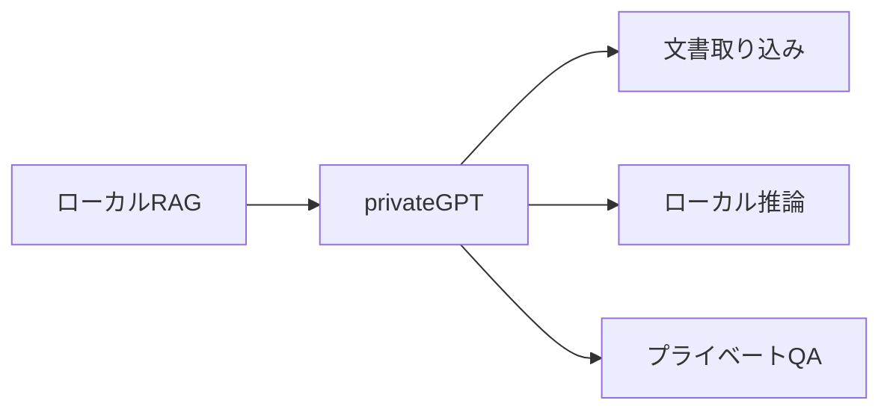
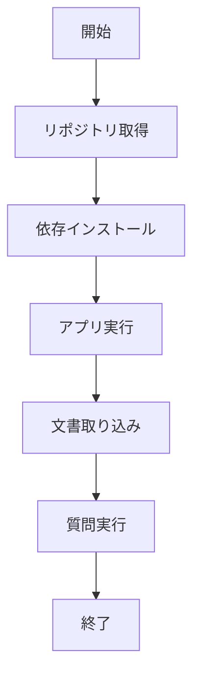

# privateGPT 入門

> 📖 中級（概念・実践） | 前提: Python基礎 / LLMアプリの基本概念

## この教材で身につくこと

- privateGPT 入門 の主な役割と適用場面を説明できる
- privateGPT 入門 を最小構成で動かす手順を実行できる
- 導入時のメリットと注意点を整理できる

## コンセプト
privateGPT はローカル文書に対するプライベートQAを実現するOSSです。

**バージョン**: 0.6.2+ / OSS準拠（2026-05時点）  
**公式ドキュメント**: https://docs.privategpt.dev/

## 利用モデル

privateGPT は利用モデルを固定せず、構成に応じて切り替えできます。

- ローカルLLM（例: Ollama, llama.cpp）
	- データを外部送信せずに運用しやすく、privateGPT の主目的に合致
- クラウドLLM（例: OpenAI API）
	- 高性能モデルを利用しやすい一方、外部送信に関する統制が必要

この教材では、プライバシー重視の観点からローカルLLM構成を基本とします。
要件上必要な場合のみ、クラウドLLMを選択してください。

## 仕組み

1. 目的と入力を定義し、対象データや利用モデルを準備します。
2. コア処理（検索・推論・生成・検証のいずれか）を実行します。
3. 実行結果を保存または表示し、次工程に渡せる形式へ整えます。
4. パラメータを調整して挙動差分を比較し、品質を確認します。
5. 運用を想定して再実行手順と確認ポイントを定着させます。
## 位置づけ


privateGPT は、データを外部に出さずに文書QAを実現したいケースに向いています。

## 実行フロー



## 最小セットアップ

```bash
git clone https://github.com/zylon-ai/private-gpt.git
cd private-gpt
pip install -r requirements.txt
python -m private_gpt
```

ローカル文書を ingest してから質問します。


## サンプル

このサンプルでは、同じ文書・同じ質問を使って、
「ローカルLLM構成」と「クラウドLLM構成」の違いを確認します。

### 実行例

```bash
# 1) privateGPT を起動
git clone https://github.com/zylon-ai/private-gpt.git
cd private-gpt
pip install -r requirements.txt
python -m private_gpt

# 2) 起動後、UI または API から docs/policy.md を取り込み
#    例: 「在宅勤務は週3日まで可能。申請は前日18時まで」

# 3) 同じ質問を実行
#    質問: 在宅勤務の上限日数と申請締切は？

# 4) 構成を切り替えて再実行
#    - A: ローカルLLM（推奨）
#    - B: OpenAI API などのクラウドLLM
```

### 期待される確認ポイント

- 回答の正確性: 「週3日」「前日18時まで」が抽出できるか
- 参照一貫性: 取り込んだ文書の内容に沿った回答か
- レイテンシ: 応答速度にどれくらい差があるか
- 運用要件: データ外部送信の有無、監査・統制要件に適合するか

### 検証

- コマンドがエラーなく完了する
- 想定した出力（画面表示・ファイル生成・回答）を確認できる
- 変更した設定に応じて結果差分を説明できる

### 差分記録テンプレート

- 構成: ローカルLLM / クラウドLLM
- 質問: 在宅勤務の上限日数と申請締切は？
- 回答: （そのまま転記）
- 正確性評価: 正 / 部分一致 / 誤り
- 応答時間: xx 秒
- 判断メモ: どの要件ではどちらを採用するか
## 実ソースコード（言語別に記載）
### 主要サンプル
- この教材の実装例は、本文中の実行手順に対応しています。
- 必要に応じて、主要コードの抜粋をこのセクションへ追記してください。

## 補足

**Q. privateGPT でクラウドLLM利用は可能？**  
A. 設定で OpenAI API 等も使用可能。ただしデータ流出のリスクがあるため、本来の目的には合致しません。

**Q. Ollama や Llama2 ローカルとの連携は？**  
A. はい。Ollama など local LLM と連携で、完全プライベート構成可能。

**Q. 対応ドキュメント形式は？**  
A. PDF、Word、Text、Markdown 等。ただし言語サポートに制限あり。

---

## 参考リンク

- [PrivateGPT 公式ドキュメント](https://docs.privategpt.dev/)
- [PrivateGPT GitHub](https://github.com/zylon-ai/private-gpt)
- [Installation Guide](https://docs.privategpt.dev/installation)
- [Configuration](https://docs.privategpt.dev/config)

---

## 演習課題

1. ``privateGPT 入門`` を使う想定ユースケースを1つ定義し、入力・出力の例を記録してください。
2. 最小構成で動かし、デフォルトから設定を1つ変えて挙動の差分を確認してください。
3. ``privateGPT 入門`` を使わない場合の代替手段と比較し、選ぶ基準をまとめてください。


### 解答の目安

1. まず課題の目的を一文で明確化し、入力・出力を対応づけて記述します。
   確認ポイント: 何を変えて何を確認する課題かを第三者が読んで理解できること。
2. 最小構成で一度実行し、設定や条件を1つ変更して差分を比較します。
   確認ポイント: 変更前後の挙動差を具体的に説明できること。
3. 適用条件と代替手段を整理し、選択基準を短くまとめます。
   確認ポイント: なぜその手段を選ぶかを根拠付きで示せること。

## 理解度チェック

1. ``privateGPT 入門`` の主な役割を1文で説明してください。
2. ``privateGPT 入門`` を導入する際の最大のメリットと注意点は何ですか？
3. ``privateGPT 入門`` が向かないユースケースとして、どのようなケースが考えられますか？


### 解説の要点

1. 主な役割は、その技術がどの工程を担い、何を改善するかで説明します。
2. メリットは再現性・拡張性・運用性の観点で整理し、注意点は導入コストや複雑性として示します。
3. 使い分けは要件、実装コスト、運用体制の3観点で判断します。
---

[← 前へ](02-rag/04-ragflow.md) | [次へ →](02-rag/06-quivr.md)


