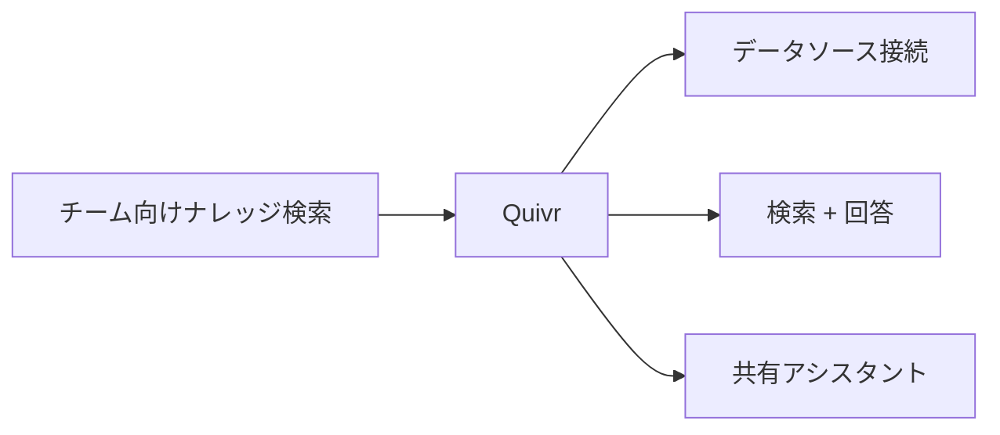
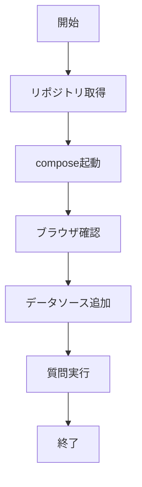

# Quivr 入門

> 📖 中級（概念・実践） | 前提: Python基礎 / LLMアプリの基本概念

## この教材で身につくこと

- Quivr の主な役割と適用場面を説明できる
- Quivr を最小構成で動かす手順を実行できる
- 導入時のメリットと注意点を整理できる

## 概要

**Quivr** は、個人・チーム向けナレッジアシスタントを構築するOSSです。

**バージョン**: 最新版（GitHub 確認推奨、2026-05-23時点）  
**公式ドキュメント**: https://quivr.com/  
**GitHub**: https://github.com/QuivrHQ/quivr  
※本教材の内容は公式サイト等の一次情報を参照し、2026年5月時点で整理しています。

### 主な特徴

- ローカルLLM/クラウドLLM両対応（Ollama, OpenAI API等）
- 複数データソース・コネクタ連携が可能
- Docker Composeによる簡易セットアップ

### 制約事項

- エンタープライズレベルの権限管理は限定的
- 初回セットアップや複数コネクタ連携に手間がかかる場合あり
- クラウドLLM利用時はデータ送信・コスト管理に注意

### 利用モデル

Quivr は利用モデルを固定せず、接続先に応じて切り替えできます。

- ローカルLLM（例: Ollama）: データを社内閉域で扱いやすく、プライバシー要件に適合しやすい
- クラウドLLM（例: OpenAI API）: 高性能モデルを利用しやすい一方、送信ポリシーとコスト管理が必要

本教材では、まずローカルLLMで基本動作を確認し、必要に応じてクラウドLLMへ切り替えて品質差分を比較します。

### 比較・選定ポイント

- **チーム運用重視**: 複数データソース・共有アシスタント用途に有力
- **導入容易性**: Docker Composeで即試せる
- **他OSSとの違い**: privateGPT等に比べ「チーム・共有・コネクタ連携」に強み
- **選定基準例**:
	- チーム/複数人運用 → Quivr
	- プライバシー最優先 → privateGPT
	- 権限管理重視 → Onyx等

## 位置づけ



Quivr は、複数データソースをつないだチーム用ナレッジアシスタントを比較的短時間で立ち上げる用途に向いています。

## 実行フロー



Docker Compose 起動後、ブラウザでデータソースを追加してチーム向けナレッジ検索を試せます。

## 最小セットアップ

1. 公式リポジトリを取得
2. Docker Compose で起動
3. ブラウザで起動確認後、データソースを追加

```bash
git clone https://github.com/QuivrHQ/quivr.git
cd quivr
docker compose up -d
```

## 実ソースコード

同一データソース・同一質問で「ローカルLLM構成」と「クラウドLLM構成」の差分を確認します。

### 実行例

```bash
# 1) Quivr を起動
git clone https://github.com/QuivrHQ/quivr.git
cd quivr
docker compose up -d
# 2) ブラウザで起動確認後、同じデータソースを接続
#    例: docs/policy.md
#    例: 「在宅勤務は週3日まで可能。申請は前日18時まで」
# 3) 同じ質問を実行
#    質問: 在宅勤務の上限日数と申請締切は？
# 4) モデル構成を切り替えて再実行
#    - A: ローカルLLM（Ollama など）
#    - B: OpenAI API などのクラウドLLM
```

#### 期待される確認ポイント

- 回答の正確性: 根拠文書と一致する回答が得られるか
- 参照安定性: 同一質問で回答の揺れが過大でないか
- レイテンシ: チーム利用時に許容できる応答時間か
- 運用要件: 権限・監査・コスト要件に適合するか

#### 差分記録テンプレート

- 構成: ローカルLLM / クラウドLLM
- 質問: 在宅勤務の上限日数と申請締切は？
- 回答: （そのまま転記）
- 正確性評価: 正 / 部分一致 / 誤り
- 応答時間: xx 秒
- 判断メモ: チーム運用で採用する構成と理由

## 演習課題

1. Quivr を使う想定ユースケースを1つ定義し、入力・出力の例を記録してください。
2. 最小構成で動かし、デフォルトから設定を1つ変えて挙動の差分を確認してください。
3. Quivr を使わない場合の代替手段と比較し、選ぶ基準をまとめてください。

### 解答の目安

1. まず課題の目的を一文で明確化し、入力・出力を対応づけて記述します。
   確認ポイント: 何を変えて何を確認する課題かを第三者が読んで理解できること。
2. 最小構成で一度実行し、設定や条件を1つ変更して差分を比較します。
   確認ポイント: 変更前後の挙動差を具体的に説明できること。
3. 適用条件と代替手段を整理し、選択基準を短くまとめます。
   確認ポイント: なぜその手段を選ぶかを根拠付きで示せること。

## 理解度チェック

1. Quivr の主な役割を1文で説明してください。
2. Quivr を導入する際の最大のメリットと注意点は何ですか？
3. Quivr が向かないユースケースとして、どのようなケースが考えられますか？

### 解説の要点

1. 主な役割は、その技術がどの工程を担い、何を改善するかで説明します。
2. メリットは再現性・拡張性・運用性の観点で整理し、注意点は導入コストや複雑性として示します。
3. 使い分けは要件、実装コスト、運用体制の3観点で判断します。

## 補足

**Q. Quivr は個人利用と企業利用で差別化？**  
A. Quivr Cloud は課金制（無料枠あり）で、GitHub 版は OSS として自社運用できます。要件に応じて選択してください。

**Q. 複数データソース（Drive、GitHub など）を同時に連携？**  
A. はい。複数コネクタを同時に接続できます。ただし、初回セットアップには手間がかかる場合があります。

**Q. チーム共有時の権限管理は？**  
A. 基本的な管理機能はありますが、エンタープライズレベルではありません。権限管理を重視する場合は Onyx を含めて比較してください。

## 参考リンク

- [Quivr 公式サイト](https://quivr.com/)
- [Quivr GitHub](https://github.com/QuivrHQ/quivr)
- [ドキュメント](https://docs.quivr.com/)
- [コネクタ一覧](https://docs.quivr.com/docs/integrations)

---

[← 前へ](05-privategpt.md) | [次へ →](07-onyx.md)
