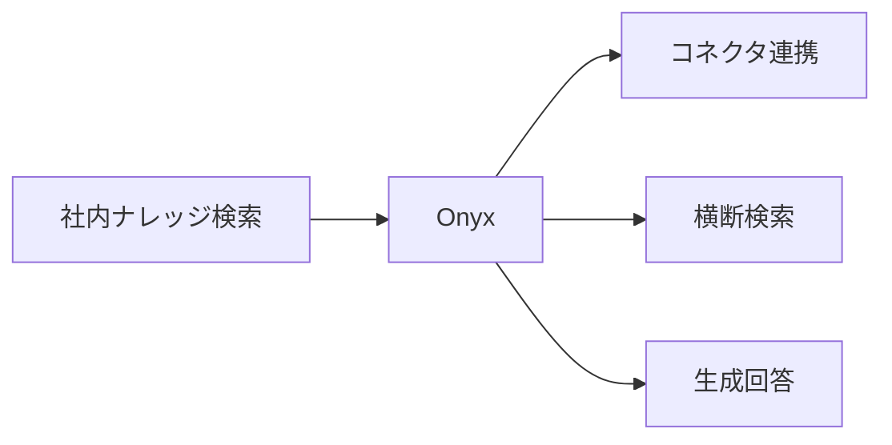
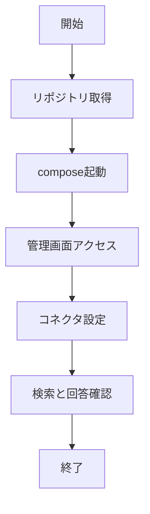

# Onyx 入門

> 📖 中級（概念・実践） | 前提: Python基礎 / LLMアプリの基本概念

## この教材で身につくこと

- Onyx 入門 の主な役割と適用場面を説明できる
- Onyx 入門 を最小構成で動かす手順を実行できる
- 導入時のメリットと注意点を整理できる

## コンセプト
Onyx（旧 Danswer）は社内横断検索と生成回答を提供するエンタープライズ向けOSSです。

**バージョン**: 3.3.2+ / OSS準拠（2026-05時点）  
**公式ドキュメント**: https://docs.onyx.app/

## 利用モデル

Onyx はモデルを固定せず、接続する推論基盤に応じて切り替えできます。

- ローカルLLM（例: Ollama 連携）
	- 社内閉域で運用しやすく、機密情報の統制に向く
- クラウドLLM（例: OpenAI API）
	- モデル性能を活用しやすい一方、送信ポリシーと監査要件の整備が必要

この教材では、まずローカル構成で社内検索の基本動作を確認し、
次にクラウド構成で品質・速度・コスト差分を比較する流れを推奨します。

## 仕組み

1. 目的と入力を定義し、対象データや利用モデルを準備します。
2. コア処理（検索・推論・生成・検証のいずれか）を実行します。
3. 実行結果を保存または表示し、次工程に渡せる形式へ整えます。
4. パラメータを調整して挙動差分を比較し、品質を確認します。
5. 運用を想定して再実行手順と確認ポイントを定着させます。
## 位置づけ


Onyx は、Confluence/Slack/Drive など複数システムを横断した企業内検索に適した構成です。

## 実行フロー



## 最小セットアップ

```bash
git clone https://github.com/onyx-dot-app/onyx.git
cd onyx
docker compose up -d
```

管理画面からコネクタ（Confluence, Slack, Google Drive等）を設定します。


## サンプル

このサンプルでは、同一コネクタ・同一質問を使って、
「ローカルLLM構成」と「クラウドLLM構成」の差分を確認します。

### 実行例

```bash
# 1) Onyx を起動
git clone https://github.com/onyx-dot-app/onyx.git
cd onyx
docker compose up -d

# 2) 管理画面で同じコネクタを設定
#    例: Confluence または Google Drive

# 3) 同じ質問を実行
#    質問: 在宅勤務の上限日数と申請締切は？

# 4) モデル構成を切り替えて再実行
#    - A: ローカルLLM（Ollama など）
#    - B: OpenAI API などのクラウドLLM
```

### 期待される確認ポイント

- 回答の正確性: 根拠情報に一致した回答が得られるか
- ソース追跡性: 参照元が明示され、確認可能か
- レイテンシ: 実運用で許容できる応答時間か
- 運用適合性: 権限管理・監査・コストの要件を満たすか

### 検証

- コマンドがエラーなく完了する
- 想定した出力（画面表示・ファイル生成・回答）を確認できる
- 変更した設定に応じて結果差分を説明できる

### 差分記録テンプレート

- 構成: ローカルLLM / クラウドLLM
- 質問: 在宅勤務の上限日数と申請締切は？
- 回答: （そのまま転記）
- 正確性評価: 正 / 部分一致 / 誤り
- 応答時間: xx 秒
- 判断メモ: 企業運用で採用する構成と理由
## 実ソースコード（言語別に記載）
### 主要サンプル
- この教材の実装例は、本文中の実行手順に対応しています。
- 必要に応じて、主要コードの抜粋をこのセクションへ追記してください。

## 補足

**Q. Onyx と Quivr の使い分けは？**  
A. Onyx はエンタープライズ向け（Slack/Confluence 等との深い統合）。Quivr はシンプルで導入が速い。大規模企業は Onyx、中小・スタートアップは Quivr 向き。

**Q. Danswer から Onyx へのリネームは何が変わった？**  
A. ブランド名と公式サイトが Onyx に移行しました。実運用のための中核機能は継続されています。

**Q. コスト比較: SaaS vs オンプレミスは？**  
A. Onyx Cloud（SaaS）vs self-hosted 自由選択。オンプレ時はリソース（DB、メモリ）コスト要検討。

---

## 参考リンク

- [Onyx 公式サイト](https://docs.onyx.app/)
- [Onyx GitHub](https://github.com/onyx-dot-app/onyx)
- [デプロイメントガイド](https://docs.onyx.app/deployment/overview.md)
- [コネクタドキュメント](https://docs.onyx.app/admins/connectors/overview.md)

---

## 演習課題

1. ``Onyx 入門`` を使う想定ユースケースを1つ定義し、入力・出力の例を記録してください。
2. 最小構成で動かし、デフォルトから設定を1つ変えて挙動の差分を確認してください。
3. ``Onyx 入門`` を使わない場合の代替手段と比較し、選ぶ基準をまとめてください。


### 解答の目安

1. まず課題の目的を一文で明確化し、入力・出力を対応づけて記述します。
   確認ポイント: 何を変えて何を確認する課題かを第三者が読んで理解できること。
2. 最小構成で一度実行し、設定や条件を1つ変更して差分を比較します。
   確認ポイント: 変更前後の挙動差を具体的に説明できること。
3. 適用条件と代替手段を整理し、選択基準を短くまとめます。
   確認ポイント: なぜその手段を選ぶかを根拠付きで示せること。

## 理解度チェック

1. ``Onyx 入門`` の主な役割を1文で説明してください。
2. ``Onyx 入門`` を導入する際の最大のメリットと注意点は何ですか？
3. ``Onyx 入門`` が向かないユースケースとして、どのようなケースが考えられますか？


### 解説の要点

1. 主な役割は、その技術がどの工程を担い、何を改善するかで説明します。
2. メリットは再現性・拡張性・運用性の観点で整理し、注意点は導入コストや複雑性として示します。
3. 使い分けは要件、実装コスト、運用体制の3観点で判断します。
---

[← 前へ](02-rag/06-quivr.md) | [次へ →](03-inference/00-README.md)


