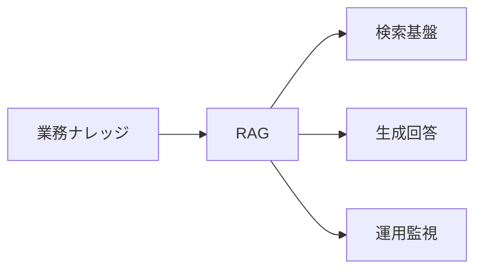
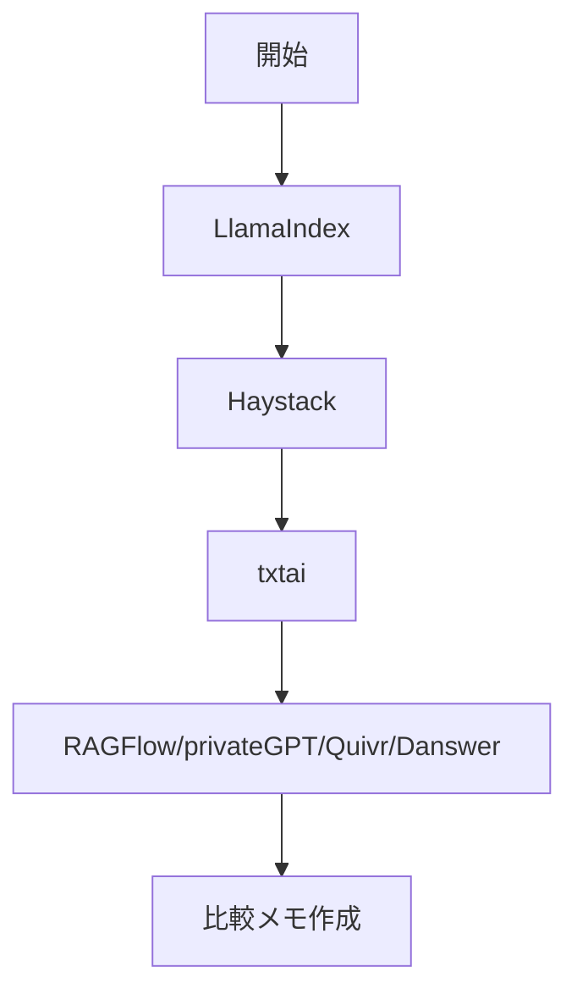

---
level: 🔰 初級（カテゴリ導入）
prereq: -
prev: 01_agent-orchestration/04_crewai.md
next: 02_rag/01_llamaindex.md
---

# RAG・ナレッジ検索

> 🔰 初級（カテゴリ導入） | 前提: -

ベクトル検索とLLMを組み合わせて、社内文書やナレッジからの質問応答を実現。

## 位置づけ（Mermaid）

## 学習フロー（Mermaid）

## 含まれるOSS

- **LlamaIndex**: データ接続と索引化に強いRAG基盤
- **Haystack**: 検索・生成パイプライン構築フレームワーク
- **txtai**: 軽量な埋め込み検索フレームワーク
- **RAGFlow**: RAG特化の実運用向けプラットフォーム
- **privateGPT**: ローカル文書向けプライベートQA
- **Quivr**: チーム向けナレッジアシスタント
- **Danswer**: 社内横断検索と生成回答

## 学習順序

1. LlamaIndex (基本的な文書索引・検索)
2. Haystack (パイプライン構築)
3. txtai (軽量検索)
4. RAGFlow (運用・監視)
5. privateGPT (ローカル閉域運用)
6. Quivr (チームナレッジ)
7. Danswer (エンタープライズ検索)

## 教材リンク

- [01_llamaindex.md](./01_llamaindex.md)
- [02_haystack.md](./02_haystack.md)
- [02_haystack-python](./02_haystack-python/)
- [03_txtai.md](./03_txtai.md)
- [04_ragflow.md](./04_ragflow.md)
- [05_privategpt.md](./05_privategpt.md)
- [06_quivr.md](./06_quivr.md)
- [07_danswer.md](./07_danswer.md)

## 完了条件

- カテゴリ内の主要OSSを3つ以上説明できる
- 最小サンプルを1件以上動作確認できる
- 選定観点（速度/運用性/拡張性）で比較メモを作成できる

---

[← 前へ](01_agent-orchestration/04_crewai.md) | [次へ →](02_rag/01_llamaindex.md)

