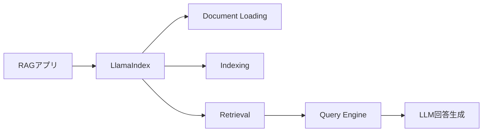
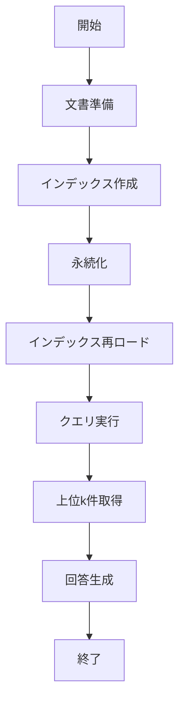

# LlamaIndex - RAG・社内文書検索の定番

> 📖 中級（概念・実践） | 前提: Python基礎 / LLMアプリの基本概念

## この教材で身につくこと

- PDFやテキストを自動で分割・ベクトル化
- クエリに関連するドキュメントを高速に検索
- OpenAI、Anthropic、Ollama等のLLMと連携
- ファイル、DB、API等から直接読み込み
- 索引を保存して再利用可能

**バージョン**: 0.9.0  
**公式ドキュメント**: https://docs.llamaindex.ai/

## 概要

**LlamaIndex** は、RAG（Retrieval-Augmented Generation）システムを簡単に構築するPythonライブラリです。

### 主な機能

- **ドキュメント索引化**: PDFやテキストを自動で分割・ベクトル化
- **類似度検索**: クエリに関連するドキュメントを高速に検索
- **マルチLLM対応**: OpenAI、Anthropic、Ollama等のLLMと連携
- **複数データソース対応**: ファイル、DB、API等から直接読み込み
- **キャッシング・再利用**: 索引を保存して再利用可能

---

## 詳細

### 用途

- 社内文書からの質問応答（Q&A）
- FAQ チャットボット
- 技術ドキュメント検索
- 複数ドキュメント統合分析

### メリット

✅ RAG構築がシンプル  
✅ ドキュメント処理が自動化  
✅ LangChainとの統合が容易  
✅ 多数のデータ接続器（コネクタ）提供  

### デメリット

❌ ベクトルDBセットアップが必要  
❌ 大規模ドキュメント処理は重い  
❌ 日本語処理の最適化が必要  

---

## 前提条件

### 必須スキル

- Python 基本
- ベクトル検索の概念理解

### 環境

- Python 3.10+
- pip
- OpenAI API キー（LLMが必要な場合）

### インストール

```bash
pip install llama-index langchain-openai python-dotenv
```

## 位置づけ



LlamaIndex は、ドキュメント取り込みから索引化、検索、回答生成までを RAG の流れとしてまとめるための中心ライブラリです。

## 実行フロー



この教材は、`作成 -> 保存 -> 再利用 -> 高度取得`の順に進みます。実運用時はこの分割がそのままバッチ/API設計に対応します。

## 補足

### Python: 01_basic-indexing.py

- 役割: ドキュメントからベクトルインデックスを構築し永続化
- 入力: Document配列
- 出力: `./index_storage` に保存されたインデックス
- 実行: `python 01_basic-indexing.py`

```python
"""LlamaIndex basic indexing example."""

from dotenv import load_dotenv
from llama_index.core import Document, VectorStoreIndex
from llama_index.embeddings.openai import OpenAIEmbedding
from llama_index.llms.openai import OpenAI

load_dotenv()

# ========== ドキュメント準備 ==========

documents = [
  Document(
    text="生成AIとは、人工知能が新しいコンテンツを生成する技術です。テキスト生成、画像生成、コード生成など多岐にわたります。"
  ),
  Document(
    text="ベクトル検索は、テキストを数値ベクトルに変換して、その距離に基づいて類似度を計算する検索方法です。"
  ),
  Document(
    text="RAG（Retrieval-Augmented Generation）は、外部のナレッジベースから情報を取得してから生成するアプローチです。"
  ),
  Document(
    text="LangChain は LLM アプリ開発用のライブラリで、複数のツールとLLMを組み合わせてワークフローを構築できます。"
  ),
]

print(f"Prepared documents: {len(documents)}")
print("-" * 60)

# ========== 埋め込みモデルとLLMの設定 ==========

embed_model = OpenAIEmbedding(model="text-embedding-3-small")

llm = OpenAI(model="gpt-3.5-turbo", temperature=0.7)

# ========== インデックス作成 ==========

print("Building index...")
index = VectorStoreIndex.from_documents(
  documents,
  embed_model=embed_model,
  llm=llm,
  show_progress=True,
)

print("Index build completed")
print(f"Documents in index: {len(documents)}")
print("-" * 60)

# ========== 簡単なクエリテスト ==========

print("\nRun sample query\n")

test_query = "生成AIとは何ですか？"
print(f"Query: {test_query}")

query_engine = index.as_query_engine()
response = query_engine.query(test_query)

print(f"Answer:\n{response}")
print("-" * 60)

# インデックスをメモリに保存（後でロード可能）
print("\nPersisting index...")
index.storage_context.persist("./index_storage")
print("Saved to ./index_storage/")
```

### Python: 02_query.py

- 役割: 永続化済みインデックスを読み込み、複数クエリを実行
- 入力: 質問テキスト配列
- 出力: 各質問への回答
- 実行: `python 02_query.py`

```python
"""LlamaIndex query example."""

from dotenv import load_dotenv
from llama_index.core import StorageContext, load_index_from_storage

load_dotenv()

# ========== インデックスのロード ==========

print("Loading index from disk...")

storage_context = StorageContext.from_defaults(
  persist_dir="./index_storage"
)

index = load_index_from_storage(storage_context)

print("Index loaded")
print("-" * 60)

# ========== 複数クエリ実行 ==========

queries = [
  "RAGとは何ですか？",
  "LangChainが解決する問題は？",
  "ベクトル検索の利点を教えてください",
]

query_engine = index.as_query_engine()

for i, query_text in enumerate(queries, 1):
  print(f"\n[Q{i}] {query_text}")
  print("-" * 60)

  response = query_engine.query(query_text)

  print(f"Answer:\n{response}")
  print("=" * 60)
```

### Python: 03_advanced-retrieval.py

- 役割: 上位k件取得とノードスコア確認
- 入力: クエリ文字列
- 出力: 回答と取得ノード詳細
- 実行: `python 03_advanced-retrieval.py`

```python
"""LlamaIndex advanced retrieval example."""

from dotenv import load_dotenv
from llama_index.core import StorageContext, load_index_from_storage, QueryBundle
from llama_index.embeddings.openai import OpenAIEmbedding
from llama_index.llms.openai import OpenAI

load_dotenv()

# ========== インデックスのロード ==========

print("Loading index...\n")

embed_model = OpenAIEmbedding(model="text-embedding-3-small")
llm = OpenAI(model="gpt-3.5-turbo", temperature=0.7)

storage_context = StorageContext.from_defaults(
  persist_dir="./index_storage"
)

index = load_index_from_storage(storage_context)

# ========== 戦略1: 類似度検索スコアを見る ==========

print("[Strategy1] Similarity search")
print("=" * 60)

query_engine = index.as_query_engine(similarity_top_k=2)
query_text = "LangChainとは？"
print(f"Query: {query_text}\n")

response = query_engine.query(query_text)
print(f"Answer:\n{response}\n")

# ========== 戦略2: 詳細な取得情報 ==========

print("[Strategy2] Retrieved nodes")
print("=" * 60)

retriever = index.as_retriever(similarity_top_k=2)
query_bundle = QueryBundle(query_text)
nodes = retriever.retrieve(query_bundle)

for i, node in enumerate(nodes, 1):
  print(f"ノード {i}:")
  print(f"  スコア: {node.score:.4f}")
  print(f"  テキスト: {node.get_content()[:100]}...")
  print()

print("=" * 60)
print("Advanced retrieval demo completed")
```

---

## 補足

**Q. LlamaIndex と LangChain の使い分けは？**  
A. LlamaIndex は RAG 特化、LangChain は汎用。多くの場合、両者を組み合わせます。

**Q. ベクトルDB は何を使えばいいですか？**  
A. 開発時は Chroma（メモリ内）、本番は Pinecone / Weaviate 推奨。

**Q. 大量の文書を高速に索引化できますか？**  
A. バッチ処理と非同期実行で対応可能ですが、事前にテストを推奨。

---

## 参考リンク

- [LlamaIndex 公式ドキュメント](https://docs.llamaindex.ai/)
- [GitHub Repository](https://github.com/run-llama/llama_index)


## 実ソースコード（言語別に記載）

### 主要サンプル
- この教材の実装例は、本文中の実行手順に対応しています。
- 必要に応じて、主要コードの抜粋をこのセクションへ追記してください。

## 演習課題

1. ``LlamaIndex`` を使う想定ユースケースを1つ定義し、入力・出力の例を記録してください。
2. 最小構成で動かし、デフォルトから設定を1つ変えて挙動の差分を確認してください。
3. ``LlamaIndex`` を使わない場合の代替手段と比較し、選ぶ基準をまとめてください。


### 解答の目安

1. まず課題の目的を一文で明確化し、入力・出力を対応づけて記述します。
   確認ポイント: 何を変えて何を確認する課題かを第三者が読んで理解できること。
2. 最小構成で一度実行し、設定や条件を1つ変更して差分を比較します。
   確認ポイント: 変更前後の挙動差を具体的に説明できること。
3. 適用条件と代替手段を整理し、選択基準を短くまとめます。
   確認ポイント: なぜその手段を選ぶかを根拠付きで示せること。
## 理解度チェック

1. ``LlamaIndex`` の主な役割を1文で説明してください。
2. ``LlamaIndex`` を導入する際の最大のメリットと注意点は何ですか？
3. ``LlamaIndex`` が向かないユースケースとして、どのようなケースが考えられますか？


### 解説の要点

1. 主な役割は、その技術がどの工程を担い、何を改善するかで説明します。
2. メリットは再現性・拡張性・運用性の観点で整理し、注意点は導入コストや複雑性として示します。
3. 使い分けは要件、実装コスト、運用体制の3観点で判断します。
---

[← 前へ](02_rag/00_README.md) | [次へ →](02_rag/02_haystack.md)


