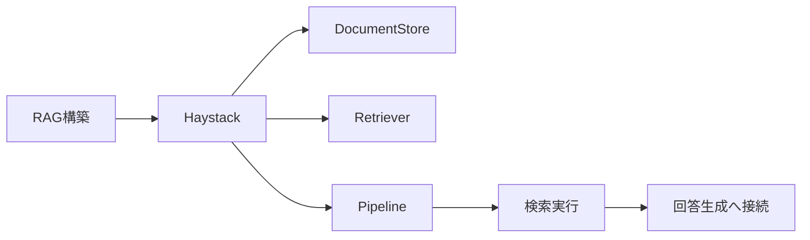
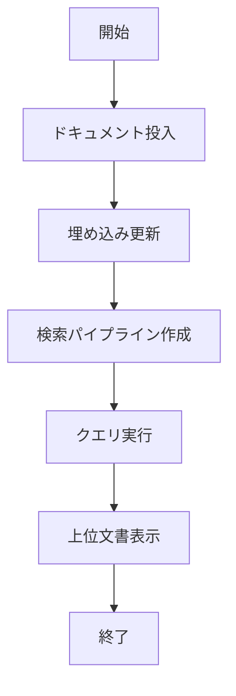

# Haystack 入門

> 📖 中級（概念・実践） | 前提: Python基礎 / LLMアプリの基本概念

## この教材で身につくこと

- 文書投入と前処理
- 埋め込み検索
- 検索結果を使った回答生成

## 概要
Haystack は検索と生成を組み合わせた RAG パイプラインを構築するフレームワークです。DocumentStore、Retriever、Generator を組み合わせて、文書QAアプリを段階的に作れます。

## 詳細
- 文書投入と前処理
- 埋め込み検索
- 検索結果を使った回答生成

## 前提条件
- Python 3.10+
- OpenAI API キー（またはローカルモデル）

## 位置づけ



Haystack は、検索パイプラインを部品（Store/Retriever/Pipeline）として組み立てる設計に強いフレームワークです。

## 実行フロー



この教材はまず最小検索パイプラインを作り、次にクエリバリエーションで挙動を比較します。

## 実ソースコード（言語別に記載）
### Python: 00_requirements.txt

- 役割: 依存ライブラリを固定
- 入力: なし
- 出力: pipインストール対象
- 実行: `pip install -r 00_requirements.txt`

```txt
farm-haystack==1.26.2
sentence-transformers==2.7.0
python-dotenv==1.0.0
```

### Python: 01_basic-pipeline.py

- 役割: インメモリ文書ストアで検索パイプラインを構築
- 入力: クエリ文字列
- 出力: 上位文書
- 実行: `python 01_basic-pipeline.py`

```python
"""Haystack basic indexing + retrieval demo."""

from haystack import Document
from haystack.document_stores import InMemoryDocumentStore
from haystack.nodes import EmbeddingRetriever
from haystack.pipelines import DocumentSearchPipeline


def build_documents():
	return [
		Document(content="RAGは検索結果を使って回答生成の精度を上げる手法です。"),
		Document(content="HaystackはRetrieverとReader/Generatorを分けて構築できます。"),
		Document(content="株式分析では、決算資料やニュースを検索対象にできます。"),
	]


def main() -> None:
	store = InMemoryDocumentStore(embedding_dim=384)
	docs = build_documents()
	store.write_documents(docs)

	retriever = EmbeddingRetriever(
		document_store=store,
		embedding_model="sentence-transformers/all-MiniLM-L6-v2",
		use_gpu=False,
	)

	store.update_embeddings(retriever)

	pipeline = DocumentSearchPipeline(retriever)

	query = "RAGの利点は?"
	out = pipeline.run(query=query, params={"Retriever": {"top_k": 2}})

	print("Query:", query)
	print("Top documents:")
	for i, d in enumerate(out["documents"], start=1):
		print(f"{i}. {d.content}")


if __name__ == "__main__":
	main()
```

### Python: 02_query-demo.py

- 役割: 複数クエリで取得結果を比較
- 入力: クエリ配列
- 出力: クエリごとの上位文書
- 実行: `python 02_query-demo.py`

```python
"""Haystack query variations demo."""

from haystack import Document
from haystack.document_stores import InMemoryDocumentStore
from haystack.nodes import EmbeddingRetriever


def setup_store() -> tuple[InMemoryDocumentStore, EmbeddingRetriever]:
	store = InMemoryDocumentStore(embedding_dim=384)
	store.write_documents(
		[
			Document(content="LangChainはLLMアプリ全般に使える。"),
			Document(content="LlamaIndexはRAGの索引化が得意。"),
			Document(content="Haystackは検索パイプラインを組みやすい。"),
		]
	)
	retriever = EmbeddingRetriever(
		document_store=store,
		embedding_model="sentence-transformers/all-MiniLM-L6-v2",
		use_gpu=False,
	)
	store.update_embeddings(retriever)
	return store, retriever


def main() -> None:
	store, retriever = setup_store()
	queries = [
		"RAGで索引化が得意なのは?",
		"検索パイプライン構築に向いたOSSは?",
	]

	for q in queries:
		docs = retriever.retrieve(q, top_k=2)
		print("\nQuery:", q)
		for i, d in enumerate(docs, start=1):
			print(f"{i}. {d.content}")


if __name__ == "__main__":
	main()
```

## 実行
```bash
cd 02_haystack-python
pip install -r 00_requirements.txt
python 01_basic-pipeline.py
python 02_query-demo.py
```

## 演習課題

1. ``Haystack 入門`` を使う想定ユースケースを1つ定義し、入力・出力の例を記録してください。
2. 最小構成で動かし、デフォルトから設定を1つ変えて挙動の差分を確認してください。
3. ``Haystack 入門`` を使わない場合の代替手段と比較し、選ぶ基準をまとめてください。


### 解答の目安

1. まず課題の目的を一文で明確化し、入力・出力を対応づけて記述します。
   確認ポイント: 何を変えて何を確認する課題かを第三者が読んで理解できること。
2. 最小構成で一度実行し、設定や条件を1つ変更して差分を比較します。
   確認ポイント: 変更前後の挙動差を具体的に説明できること。
3. 適用条件と代替手段を整理し、選択基準を短くまとめます。
   確認ポイント: なぜその手段を選ぶかを根拠付きで示せること。
## 理解度チェック

1. ``Haystack 入門`` の主な役割を1文で説明してください。
2. ``Haystack 入門`` を導入する際の最大のメリットと注意点は何ですか？
3. ``Haystack 入門`` が向かないユースケースとして、どのようなケースが考えられますか？


### 解説の要点

1. 主な役割は、その技術がどの工程を担い、何を改善するかで説明します。
2. メリットは再現性・拡張性・運用性の観点で整理し、注意点は導入コストや複雑性として示します。
3. 使い分けは要件、実装コスト、運用体制の3観点で判断します。
---

[← 前へ](02_rag/01_llamaindex.md) | [次へ →](02_rag/03_txtai.md)


