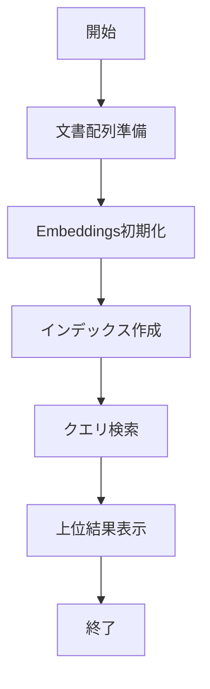

# txtai 入門

> 📖 中級（概念・実践） | 前提: Python基礎 / LLMアプリの基本概念

## この教材で身につくこと

- txtai 入門 の主な役割と適用場面を説明できる
- txtai 入門 を最小構成で動かす手順を実行できる
- 導入時のメリットと注意点を整理できる

## 概要
txtai は埋め込み検索と生成ワークフローをまとめて扱える軽量フレームワークです。

## 位置づけ


txtai は最小コードで意味検索を始めたい場合に適した軽量フレームワークです。

## 実行フロー



この教材では setup ディレクトリにある最小ファイル一式をそのまま掲載し、リンク参照なしで再現できる形にします。

## 実ソースコード（言語別に記載）
### Python: 00_requirements.txt

- 役割: txtaiデモの依存関係定義
- 入力: なし
- 出力: pipインストール対象
- 実行: `pip install -r 00_requirements.txt`

```txt
txtai==8.2.0
```

### Python: 01_basic-search.py

- 役割: 最小のセマンティック検索
- 入力: 文書配列と検索クエリ
- 出力: 上位検索結果
- 実行: `python 01_basic-search.py`

```python
"""txtai minimal semantic search demo."""

from txtai import Embeddings


def main() -> None:
	docs = [
		"RAGは検索結果を生成に使う手法",
		"LangChainはLLMアプリ開発フレームワーク",
		"株式分析ではニュース検索が重要",
	]

	embeddings = Embeddings({"path": "sentence-transformers/all-MiniLM-L6-v2"})
	embeddings.index([(i, text, None) for i, text in enumerate(docs)])

	for uid, score in embeddings.search("RAGの基本", 2):
		print(uid, round(score, 4), docs[uid])


if __name__ == "__main__":
	main()
```

## まず試す
```bash
pip install txtai sentence-transformers
python -c "from txtai import Embeddings; print('txtai ready')"
```

## 演習課題

1. ``txtai 入門`` を使う想定ユースケースを1つ定義し、入力・出力の例を記録してください。
2. 最小構成で動かし、デフォルトから設定を1つ変えて挙動の差分を確認してください。
3. ``txtai 入門`` を使わない場合の代替手段と比較し、選ぶ基準をまとめてください。


### 解答の目安

1. まず課題の目的を一文で明確化し、入力・出力を対応づけて記述します。
   確認ポイント: 何を変えて何を確認する課題かを第三者が読んで理解できること。
2. 最小構成で一度実行し、設定や条件を1つ変更して差分を比較します。
   確認ポイント: 変更前後の挙動差を具体的に説明できること。
3. 適用条件と代替手段を整理し、選択基準を短くまとめます。
   確認ポイント: なぜその手段を選ぶかを根拠付きで示せること。
## 理解度チェック

1. ``txtai 入門`` の主な役割を1文で説明してください。
2. ``txtai 入門`` を導入する際の最大のメリットと注意点は何ですか？
3. ``txtai 入門`` が向かないユースケースとして、どのようなケースが考えられますか？


### 解説の要点

1. 主な役割は、その技術がどの工程を担い、何を改善するかで説明します。
2. メリットは再現性・拡張性・運用性の観点で整理し、注意点は導入コストや複雑性として示します。
3. 使い分けは要件、実装コスト、運用体制の3観点で判断します。
---

[← 前へ](02_rag/02_haystack.md) | [次へ →](02_rag/04_ragflow.md)


