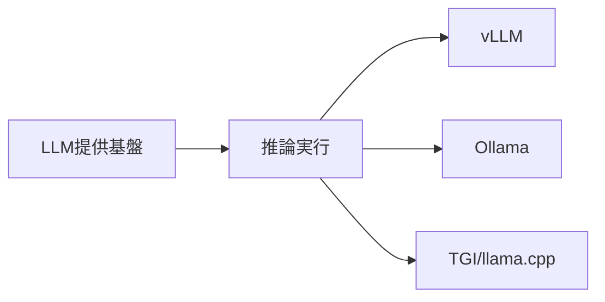
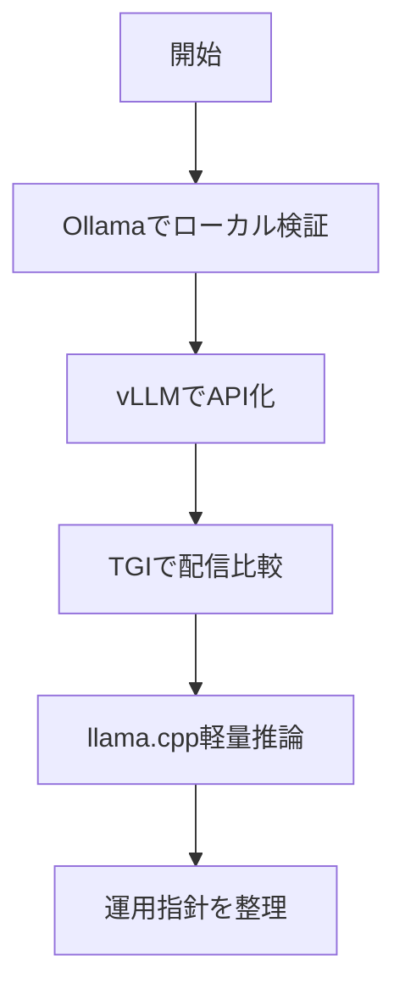

# 推論実行基盤（LLMサービング）

> 🔰 初級（カテゴリ導入） | 前提: -

高速で効率的なLLM推論を実現するサーバ・フレームワーク。本番API構築向け。

## 位置づけ

## 学習フロー

## 含まれるOSS

- **vLLM**: 高速・高効率なLLM推論サーバ
- **Ollama**: ローカルLLM実行の簡素化
- **TGI (Text Generation Inference)**: Hugging Face製推論サーバ
- **llama.cpp**: CPU/GPU軽量推論

## 学習順序

1. Ollama (開発・テスト向けローカル推論)
2. vLLM (本番推論API構築)
3. TGI (大規模モデル配信)

## 教材リンク

- [01-vllm.md](./01-vllm.md)
- [02-ollama.md](./02-ollama.md)
- [03-tgi.md](./03-tgi.md)
- [04-llama-cpp.md](./04-llama-cpp.md)
- [05-streaming.md](./05-streaming.md)

## 完了条件

- カテゴリ内の主要OSSを3つ以上説明できる
- 最小サンプルを1件以上動作確認できる
- 選定観点（速度/運用性/拡張性）で比較メモを作成できる

---

[← 前へ](02-rag/07-onyx.md) | [次へ →](03-inference/01-vllm.md)

