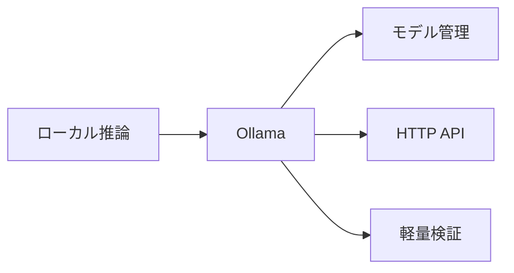
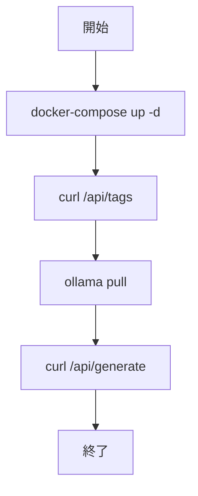

# Ollama 入門

> 📖 中級（概念・実践） | 前提: Python基礎 / LLMアプリの基本概念

## この教材で身につくこと

- ローカルLLM実行環境の最小構成
- モデル取得から推論確認までの基本手順
- API経由での生成テスト

## コンセプト
Ollama はローカルでLLMを簡単に実行するためのランタイムです。Dockerで立ち上げて、モデルを取得し、HTTP APIから推論を実行できます。

**バージョン**: 最新版 / OSS準拠（2026-05時点）  
**公式ドキュメント**: https://ollama.ai/

## 仕組み

1. Ollamaサーバを起動してローカルAPIエンドポイントを公開します。
2. 必要モデルを pull してローカルストレージへ配置します。
3. `/api/generate` や `/api/chat` にプロンプトを送信します。
4. 推論結果をアプリ側で受け取り、UIや業務処理へ連携します。
5. モデル差し替えやパラメータ調整で品質を最適化します。

## 位置づけ



## 実行フロー



## 最小セットアップ

### コンテナ定義

```yaml
version: "3.8"

services:
  ollama:
    image: ollama/ollama:latest
    container_name: ollama
    ports:
      - "11434:11434"
    volumes:
      - ollama_data:/root/.ollama
    restart: unless-stopped

volumes:
  ollama_data:
    driver: local
```

### 起動

```bash
docker-compose up -d
```

### 動作確認

```bash
curl http://localhost:11434/api/tags
```

### モデル取得

```bash
docker exec -it ollama ollama pull qwen2.5:3b
```

### 推論テスト

```bash
curl http://localhost:11434/api/generate \
  -d '{"model":"qwen2.5:3b","prompt":"生成AIを2行で説明して"}'
```

## PowerShell リクエスト例

```powershell
Write-Host "=== Ollama API Examples ==="

$body1 = @{
  model = "qwen2.5:3b"
  prompt = "RAGを初心者向けに説明して"
  stream = $false
} | ConvertTo-Json -Depth 3

Invoke-RestMethod -Uri "http://localhost:11434/api/generate" -Method Post -ContentType "application/json" -Body $body1

$body2 = @{
  model = "qwen2.5:3b"
  messages = @(
    @{ role = "system"; content = "あなたは日本語で簡潔に答えるAIです" },
    @{ role = "user"; content = "LangChainとLlamaIndexの違いは?" }
  )
  stream = $false
} | ConvertTo-Json -Depth 5

Invoke-RestMethod -Uri "http://localhost:11434/api/chat" -Method Post -ContentType "application/json" -Body $body2
```

## サンプル

### 実行例

```bash
docker-compose up -d
docker exec -it ollama ollama pull qwen2.5:3b
curl http://localhost:11434/api/generate -d '{"model":"qwen2.5:3b","prompt":"生成AIを2行で説明して"}'
```

### 検証

- `/api/tags` でモデル一覧が表示されるか確認する
- 生成応答に空文字が混ざらないか確認する


## 実ソースコード（言語別に記載）

### 主要サンプル
- この教材の実装例は、本文中の実行手順に対応しています。
- 必要に応じて、主要コードの抜粋をこのセクションへ追記してください。

## 演習課題

1. ``Ollama`` を使う想定ユースケースを1つ定義し、入力・出力の例を記録してください。
2. 最小構成で動かし、デフォルトから設定を1つ変えて挙動の差分を確認してください。
3. ``Ollama`` を使わない場合の代替手段と比較し、選ぶ基準をまとめてください。


### 解答の目安

1. まず課題の目的を一文で明確化し、入力・出力を対応づけて記述します。
   確認ポイント: 何を変えて何を確認する課題かを第三者が読んで理解できること。
2. 最小構成で一度実行し、設定や条件を1つ変更して差分を比較します。
   確認ポイント: 変更前後の挙動差を具体的に説明できること。
3. 適用条件と代替手段を整理し、選択基準を短くまとめます。
   確認ポイント: なぜその手段を選ぶかを根拠付きで示せること。
## 理解度チェック

1. ``Ollama`` の主な役割を1文で説明してください。
2. ``Ollama`` を導入する際の最大のメリットと注意点は何ですか？
3. ``Ollama`` が向かないユースケースとして、どのようなケースが考えられますか？


### 解説の要点

1. 主な役割は、その技術がどの工程を担い、何を改善するかで説明します。
2. メリットは再現性・拡張性・運用性の観点で整理し、注意点は導入コストや複雑性として示します。
3. 使い分けは要件、実装コスト、運用体制の3観点で判断します。
---

[← 前へ](03-inference/01-vllm.md) | [次へ →](03-inference/03-tgi.md)


