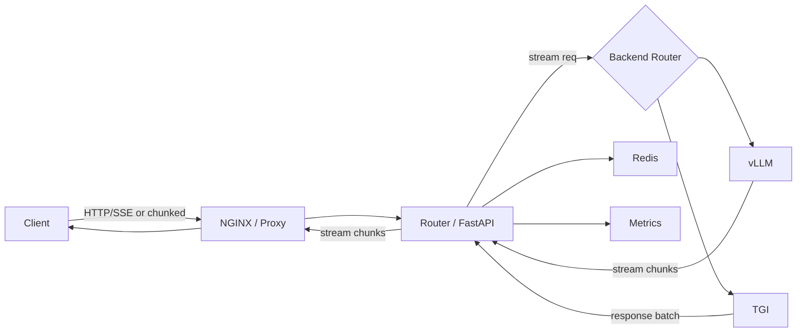

# ストリーミング推論（SSE / chunked / フレーミング）

---
このドキュメントは、対話型アプリケーションでトークンを逐次返却する「ストリーミング推論」について、設計上の判断や実装上の注意点、サンプル実装（NGINX + FastAPI）をまとめたものです。
---

## 目次

- [概要](#概要)
- [設計の決定フロー](#設計の決定フロー)
- [プロトコル比較](#プロトコル比較)
- [vLLM の挙動とAPI設計パターン](#vllm-の挙動とapi設計パターン)
- [アーキテクチャ図（概観）](#アーキテクチャ図概観)
- [実装上の注意点](#実装上の注意点)
- [サンプル実装と実行手順](#サンプル実装と実行手順)
- [導入チェックリスト](#導入チェックリスト)


## 概要

- 目的: 対話型アプリでトークンを逐次返却し、応答を低遅延でユーザに見せることでUXを向上させる。vLLMなどの生成バックエンドのストリーミング出力を、API層で透過的に扱うための設計指針とサンプルを示します。


## 設計の決定フロー

- 低遅延での逐次返却が主目的 → SSE / chunked（HTTP/1.1）を優先
- 双方向の制御やクライアントからのリアルタイム入力が必要 → WebSocket
- 高スループットかつ多重化が必要 → HTTP/2 / gRPC（ただしプロキシ経由で逐次到着が阻害される可能性あり）


## プロトコル比較

| プロトコル | 長所 | 短所 | 備考 |
|---|---:|---|---|
| SSE (EventSource) | ブラウザ互換性良、再接続機能あり | 単方向（サーバ→クライアント） | HTTP/1.1 環境で簡単に実装可能 |
| chunked (Transfer-Encoding: chunked) | 任意バイト列を分割送信可能、ndjson と相性良し | 明示的な再接続/再開ロジックが必要 | プロキシのバッファ設定に敏感 |
| HTTP/2 フレーミング | 多重化・流量制御に優れる | プロキシ/ロードバランサによっては逐次伝達が阻害される | gRPC ストリーミング用途に適する |
| WebSocket | 低レイテンシ・双方向 | 導入・負荷管理がやや複雑 | 双方向制御が必要な場合に選択 |


## vLLM の挙動と API 設計パターン

- vLLM は生成トークンを逐次出力するため、SSE もしくは ndjson/chunked 形式で受け取るのが実務的。
- 各チャンクに `delta`（生成トークン）や `finish_reason` 等のメタを付与するとクライアント実装が容易になります。

主な API 層設計パターン:

- パススルー（透過プロキシ）: バックエンドのストリームを解釈せずクライアントへそのまま流す。中間バッファは原則禁止。
- TGI フロント + vLLM ワーカー: クライアントは一貫した API を使い、内部で vLLM や他のモデルに委譲する構成。
- スマートルータ / サービスメッシュ: K8s + Ingress / Service Mesh で GPU 負荷やレイテンシに基づくルーティングを行う。


## アーキテクチャ図（概観）



上図は基本フローの概観です。エラー処理、再接続、HTTP/2 フレーミングに関する詳細は別図で補足してください。


## 図中ノードとリポジトリ内サンプルの対応

- `NGINX / Proxy`: サンプル NGINX 設定は sandbox/streaming-examples/nginx/nginx_streaming.conf。`proxy_buffering off` 等の設定で透過ストリーミングを実現します。
- `Router / FastAPI`: 透過プロキシのサンプルは sandbox/streaming-examples/fastapi_proxy/proxy.py。バックエンドへのストリーム転送とクライアント切断検知を行います。
- `vLLM`: ストリーミングバックエンド。サンプルでは `BACKEND_URL = http://vllm-host:8000/generate` を想定しています。
- `TGI`: バッチや複数モデル配信向けのバックエンド（オプション）。
- `Redis`: セッション/会話履歴の永続化に利用可能。再接続時に履歴を返す用途で使います。
- `Metrics`: Prometheus / Grafana 等でトークン/秒や切断率を計測してください。


## 実装上の注意点

- プロキシ側のバッファリングを無効化する（NGINX 例）:

```nginx
proxy_buffering off;
proxy_request_buffering off;
proxy_http_version 1.1;
proxy_set_header Connection "";
```

- ヘッダの転送: `Content-Type`、`Transfer-Encoding`、`Cache-Control: no-cache` 等を適切に伝搬する。
- クライアント切断検出時はバックエンド接続を速やかにキャンセルする（リソース保護）。
- セッション管理は Redis 等で一元化し、再接続時に会話履歴を復元できる設計を検討する。
- 監視対象: トークン/秒、チャンクレイテンシ、切断率、バックエンドエラー率。


## サンプル実装と実行手順

ローカル検証の最小構成として、NGINX（リバースプロキシ）＋FastAPI（透過プロキシ）＋モック vLLM を用意すると分かりやすいです。以下は教材に含めた最小サンプルと手順です。

### 1) FastAPI 透過プロキシ サンプル (sandbox/streaming-examples/fastapi_proxy/proxy.py)

```python
from fastapi import FastAPI, Request, Response
from fastapi.responses import StreamingResponse
import httpx
import asyncio

app = FastAPI()

# BACKEND_URL can be set via environment variable (used by Docker compose)
import os
BACKEND_URL = os.getenv("BACKEND_URL", "http://mock-vllm:8001/generate")


@app.post("/proxy")
async def proxy(request: Request):
    headers = {k: v for k, v in request.headers.items() if k.lower() != "host"}

    async def request_body_iterator():
        async for chunk in request.stream():
            yield chunk

    client = httpx.AsyncClient(timeout=None)
    # Stream request to backend and stream response back
    backend_cm = client.stream(
        "POST",
        BACKEND_URL,
        headers=headers,
        content=request_body_iterator(),
    )

    # Manually enter the async context so it stays open while we stream to the client
    backend_resp = await backend_cm.__aenter__()

    async def streamer():
        try:
            async for chunk in backend_resp.aiter_bytes():
                if not chunk:
                    continue
                # If client disconnected, stop and close backend
                if await request.is_disconnected():
                    break
                yield chunk
                await asyncio.sleep(0)
        finally:
            try:
                await backend_resp.aclose()
            except Exception:
                pass
            try:
                await backend_cm.__aexit__(None, None, None)
            except Exception:
                pass
            try:
                await client.aclose()
            except Exception:
                pass

    media_type = backend_resp.headers.get("content-type", "text/event-stream")
    return StreamingResponse(streamer(), media_type=media_type)
```

依存関係 (sandbox/streaming-examples/fastapi_proxy/requirements.txt):

```
fastapi>=0.95
uvicorn[standard]
httpx
anyio
```

ローカルでの実行例（Windows）:

```powershell
python -m venv .venv
.\.venv\Scripts\Activate.ps1
pip install -r sandbox/streaming-examples/fastapi_proxy/requirements.txt
uvicorn sandbox.streaming-examples.fastapi_proxy.proxy:app --host 0.0.0.0 --port 8080
```

### 2) NGINX 設定スニペット (sandbox/streaming-examples/nginx/nginx_streaming.conf)

```nginx
worker_processes auto;
events { worker_connections 1024; }

http {
	server {
		listen 80;
		location /proxy/ {
			proxy_pass http://127.0.0.1:8080/; # FastAPI proxy
			proxy_buffering off;
			proxy_request_buffering off;
			proxy_http_version 1.1;
			proxy_set_header Connection "";
			proxy_set_header Host $host;
			proxy_read_timeout 3600s;
			send_timeout 3600s;
		}
	}
}
```

Docker によるローカル検証（推奨）:

```bash
cd sandbox/streaming-examples
docker compose build
docker compose up
```

簡易確認 (ndjson を逐次受け取る確認):

```bash
curl -N -X POST "http://localhost:8080/proxy" -H "Content-Type: application/json" -d '{"prompt":"hello world from test"}'
```

期待される挙動: ndjson や SSE によるチャンクが逐次出力されること。


## 導入チェックリスト

- プロキシのバッファ無効化確認
- バックエンドの `Content-Type` (e.g. `text/event-stream`, `application/x-ndjson`) を確認
- タイムアウトと keep-alive の設定を適切に行う
- クライアントの再接続戦略とサーバ側のオフセット/履歴管理を設計


---

## 参考

- サンプル: sandbox/streaming-examples/fastapi_proxy/proxy.py
- NGINX スニペット: sandbox/streaming-examples/nginx/nginx_streaming.conf

（必要なら、HTTP/2 フレーミングや再接続の詳細図を追加します。要望があれば追記してください。）
