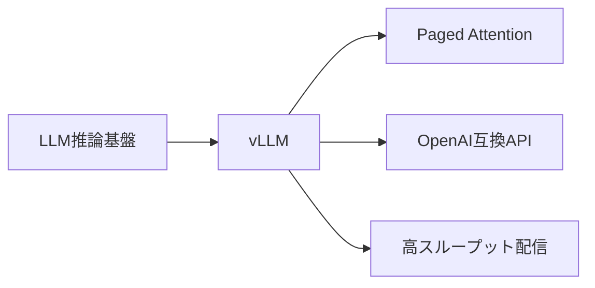
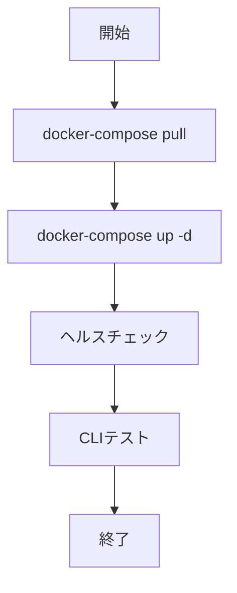

# vLLM - 高速LLM推論サーバ

> 📖 中級（概念・実践） | 前提: Python基礎 / LLMアプリの基本概念

## この教材で身につくこと

- Paged Attention などの最適化により大幅な高速化
- 複数リクエストを効率的に処理
- KVキャッシュの最適化で必要メモリを削減
- Llama、Mistral、Qwen等を直接サポート
- 既存のOpenAI APIコードがそのまま動作

**バージョン**: 0.3.0  
**公式ドキュメント**: https://docs.vllm.ai/

## 概要

**vLLM** は、LLMの推論を高速・高効率に実行するオープンソースサーバです。

### 主な特徴

- **高速推論**: Paged Attention などの最適化により大幅な高速化
- **バッチ処理**: 複数リクエストを効率的に処理
- **メモリ効率**: KVキャッシュの最適化で必要メモリを削減
- **複数モデル対応**: Llama、Mistral、Qwen等を直接サポート
- **OpenAI互換API**: 既存のOpenAI APIコードがそのまま動作

---

## 詳細

### 用途

- 本番環境のLLM推論API構築
- 高スループット処理
- GPU活用の効率化
- セルフホスト型のLLMサービング

### メリット

✅ 推論速度が非常に高速（OpenAI互換より10-40倍）  
✅ メモリ使用量が少ない  
✅ スケーラブル（複数GPUに対応）  
✅ オープンソース完全コントロール  

### デメリット

❌ GPU が必須（CPU版は遅い）  
❌ セットアップが少し複雑  
❌ CUDA 対応 GPU 必要  

---

## 前提条件



## 位置づけ



## 実ソースコード（言語別に記載）

### Setup: 00_docker-compose.yml

- 役割: vLLMサーバをGPU付きで起動
- 入力: Docker + NVIDIA Runtime
- 出力: `localhost:8000` でOpenAI互換API
- 実行: `docker-compose up -d`

```yaml
version: '3.8'

services:
  vllm:
    image: vllm/vllm-openai:latest
    container_name: vllm-server

    ports:
      - '8000:8000'

    environment:
      - CUDA_VISIBLE_DEVICES=0

    volumes:
      - model_cache:/root/.cache/huggingface

    deploy:
      resources:
        reservations:
          devices:
            - driver: nvidia
              count: 1
              capabilities: [gpu]

    command: >
      python -m vllm.entrypoints.openai.api_server
      --model meta-llama/Llama-2-7b-hf
      --host 0.0.0.0
      --port 8000
      --gpu-memory-utilization 0.9

volumes:
  model_cache:
    driver: local
```

### Setup: 01_setup-guide.md

- 役割: セットアップ手順とトラブルシュート
- 入力: Docker/GPU環境
- 出力: 起動確認済み vLLM
- 実行: `bash 02_cli-examples.sh`

```text
# vLLM セットアップガイド

## 前提条件
- Docker インストール済み
- NVIDIA GPU（推奨）
- 20GB以上のディスク空き容量

## セットアップ手順

1. Docker Image のダウンロード
docker-compose pull

2. vLLM サーバの起動
docker-compose up -d

3. ヘルスチェック
curl http://localhost:8000/v1/models

4. テスト実行
bash 02_cli-examples.sh
```

### Setup: 02_cli-examples.sh

- 役割: APIテスト用スクリプト
- 入力: なし
- 出力: （現状は空ファイル）

```bash

```

## 補足

**Q. どのモデルが推奨ですか？**  
A. Llama-2-7b / Mistral-7b が定番。7B がメモリ効率と性能のバランス最適。

**Q. GPU なしで動きますか？**  
A. 動きますが、極めて遅いです。本番用途はGPU推奨。

**Q. メモリ要件は？**  
A. 7Bモデル: 8GB GPU メモリ推奨。16GB あれば安定。

---

## 補足

- [02_cli-examples.sh](./02_cli-examples.sh) を実行してテスト
- Open WebUI や Dify と連携
- 本番用に Kubernetes 化を検討


## 演習課題

1. ``vLLM`` を使う想定ユースケースを1つ定義し、入力・出力の例を記録してください。
2. 最小構成で動かし、デフォルトから設定を1つ変えて挙動の差分を確認してください。
3. ``vLLM`` を使わない場合の代替手段と比較し、選ぶ基準をまとめてください。


### 解答の目安

1. まず課題の目的を一文で明確化し、入力・出力を対応づけて記述します。
   確認ポイント: 何を変えて何を確認する課題かを第三者が読んで理解できること。
2. 最小構成で一度実行し、設定や条件を1つ変更して差分を比較します。
   確認ポイント: 変更前後の挙動差を具体的に説明できること。
3. 適用条件と代替手段を整理し、選択基準を短くまとめます。
   確認ポイント: なぜその手段を選ぶかを根拠付きで示せること。
## 理解度チェック

1. ``vLLM`` の主な役割を1文で説明してください。
2. ``vLLM`` を導入する際の最大のメリットと注意点は何ですか？
3. ``vLLM`` が向かないユースケースとして、どのようなケースが考えられますか？


### 解説の要点

1. 主な役割は、その技術がどの工程を担い、何を改善するかで説明します。
2. メリットは再現性・拡張性・運用性の観点で整理し、注意点は導入コストや複雑性として示します。
3. 使い分けは要件、実装コスト、運用体制の3観点で判断します。
---

[← 前へ](03_inference/00_README.md) | [次へ →](03_inference/02_ollama.md)


