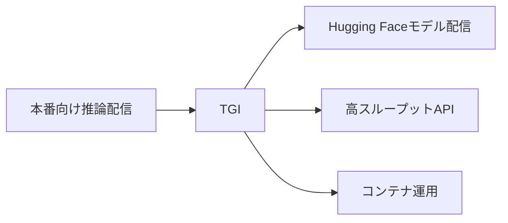
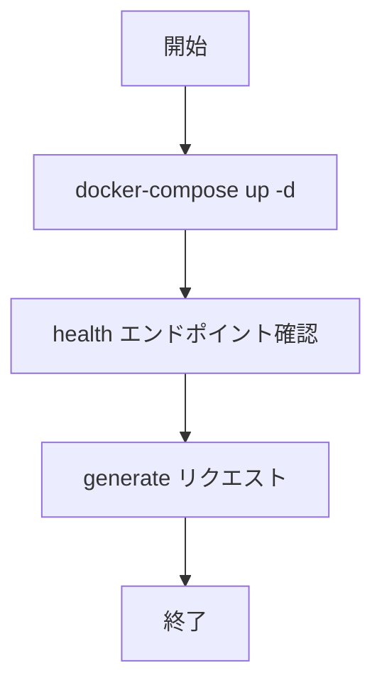

# TGI 入門

> 📖 中級（概念・実践） | 前提: Python基礎 / LLMアプリの基本概念

## この教材で身につくこと

- OpenAI互換の推論API提供
- 高スループット推論
- 複数GPUでの配信

## 概要
TGI（Text Generation Inference）は Hugging Face 製の推論サーバです。大規模モデルを本番運用しやすい構成を提供します。

## 詳細
- OpenAI互換の推論API提供
- 高スループット推論
- 複数GPUでの配信

## 位置づけ（Mermaid）



## 実行フロー（Mermaid）



## 実ソースコード（言語別に記載）
### Setup: 00_docker-compose.yml

- 役割: TGIコンテナ起動
- 入力: Docker実行環境
- 出力: `localhost:8080` 推論API
- 実行: `docker-compose up -d`

```yaml
version: "3.8"

services:
	tgi:
		image: ghcr.io/huggingface/text-generation-inference:latest
		container_name: tgi
		ports:
			- "8080:80"
		environment:
			- MODEL_ID=Qwen/Qwen2.5-3B-Instruct
		volumes:
			- tgi_cache:/data
		restart: unless-stopped

volumes:
	tgi_cache:
```

### Setup: 01_setup-guide.md

- 役割: 最小起動とAPI確認
- 入力: Docker実行環境
- 出力: API応答の確認

```text
# TGI セットアップガイド

## 起動
docker-compose up -d

## 動作確認
curl http://localhost:8080/health

## 推論テスト
curl http://localhost:8080/generate -X POST -H "Content-Type: application/json" -d '{"inputs":"RAGの基本を3行で説明して"}'
```

### Setup: 02_request-examples.ps1

- 役割: PowerShellからの推論リクエスト例
- 入力: プロンプト文字列
- 出力: JSON応答
- 実行: `pwsh ./02_request-examples.ps1`

```powershell
$body = @{ inputs = "分散投資の基本を2行で説明して" } | ConvertTo-Json
Invoke-RestMethod -Uri "http://localhost:8080/generate" -Method Post -ContentType "application/json" -Body $body
```

## 演習課題

1. ``TGI 入門`` を使う想定ユースケースを1つ定義し、入力・出力の例を記録してください。
2. 最小構成で動かし、デフォルトから設定を1つ変えて挙動の差分を確認してください。
3. ``TGI 入門`` を使わない場合の代替手段と比較し、選ぶ基準をまとめてください。


### 解答の目安

1. まず課題の目的を一文で明確化し、入力・出力を対応づけて記述します。
   確認ポイント: 何を変えて何を確認する課題かを第三者が読んで理解できること。
2. 最小構成で一度実行し、設定や条件を1つ変更して差分を比較します。
   確認ポイント: 変更前後の挙動差を具体的に説明できること。
3. 適用条件と代替手段を整理し、選択基準を短くまとめます。
   確認ポイント: なぜその手段を選ぶかを根拠付きで示せること。
## 理解度チェック

1. ``TGI 入門`` の主な役割を1文で説明してください。
2. ``TGI 入門`` を導入する際の最大のメリットと注意点は何ですか？
3. ``TGI 入門`` が向かないユースケースとして、どのようなケースが考えられますか？


### 解説の要点

1. 主な役割は、その技術がどの工程を担い、何を改善するかで説明します。
2. メリットは再現性・拡張性・運用性の観点で整理し、注意点は導入コストや複雑性として示します。
3. 使い分けは要件、実装コスト、運用体制の3観点で判断します。
---

[← 前へ](03_inference/02_ollama.md) | [次へ →](03_inference/04_llama-cpp.md)


