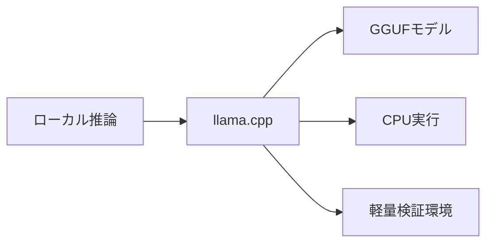
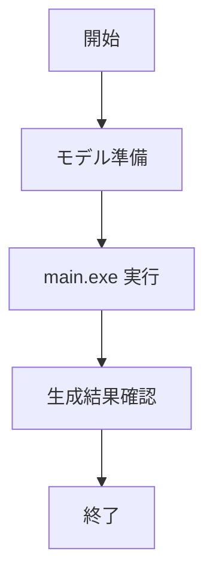

# llama.cpp 入門

> 📖 中級（概念・実践） | 前提: Python基礎 / LLMアプリの基本概念

## この教材で身につくこと

- ローカルでのLLM推論
- GGUFモデルの利用
- 低リソース環境での実行

## コンセプト
llama.cpp は軽量なローカル推論エンジンです。

**バージョン**: 最新版 / OSS準拠（2026-05時点）  
**公式ドキュメント**: https://github.com/ggerganov/llama.cpp

CPUでも動作するため、検証環境の立ち上げが容易です。

## 仕組み

1. GGUF形式モデルを読み込み、ローカル推論エンジンを起動します。
2. プロンプトをトークン化して逐次生成を実行します。
3. CPU/GPUオフロード設定で速度とメモリを調整します。
4. 標準出力へ生成結果を返し、アプリへ連携します。
5. 小型モデルから順に検証し、要件に合わせて拡張します。

## 位置づけ



## 実行フロー



## 実ソースコード（言語別に記載）
### Setup: 00_setup-guide.md

- 役割: Windowsでの最小実行手順
- 入力: GGUFモデルパスとプロンプト
- 出力: 標準出力への生成結果
- 実行: `./main.exe -m <model> -p <prompt>`

```text
# llama.cpp セットアップガイド

## 前提条件
- C++ ビルド環境
- もしくは配布バイナリ

## 実行例（Windows）
./main.exe -m ./models/qwen2.5-3b-instruct.gguf -p "RAGとは?"

## 補足
- まずは 3B〜7B の小型モデルで検証
- 推論速度はCPU/GPU構成で大きく変わります
```

## サンプル

### 実行例

```bash
./main.exe -m ./models/qwen2.5-3b-instruct.gguf -p "RAGとは?"
```

### 検証

- モデル読み込みエラーが出ないか確認する
- 同じプロンプトで再実行し、応答の一貫性を確認する

## 演習課題

1. ``llama.cpp 入門`` を使う想定ユースケースを1つ定義し、入力・出力の例を記録してください。
2. 最小構成で動かし、デフォルトから設定を1つ変えて挙動の差分を確認してください。
3. ``llama.cpp 入門`` を使わない場合の代替手段と比較し、選ぶ基準をまとめてください。


### 解答の目安

1. まず課題の目的を一文で明確化し、入力・出力を対応づけて記述します。
   確認ポイント: 何を変えて何を確認する課題かを第三者が読んで理解できること。
2. 最小構成で一度実行し、設定や条件を1つ変更して差分を比較します。
   確認ポイント: 変更前後の挙動差を具体的に説明できること。
3. 適用条件と代替手段を整理し、選択基準を短くまとめます。
   確認ポイント: なぜその手段を選ぶかを根拠付きで示せること。
## 理解度チェック

1. ``llama.cpp 入門`` の主な役割を1文で説明してください。
2. ``llama.cpp 入門`` を導入する際の最大のメリットと注意点は何ですか？
3. ``llama.cpp 入門`` が向かないユースケースとして、どのようなケースが考えられますか？


### 解説の要点

1. 主な役割は、その技術がどの工程を担い、何を改善するかで説明します。
2. メリットは再現性・拡張性・運用性の観点で整理し、注意点は導入コストや複雑性として示します。
3. 使い分けは要件、実装コスト、運用体制の3観点で判断します。
---

[← 前へ](03_inference/03_tgi.md) | [次へ →](04_ui/00_README.md)


