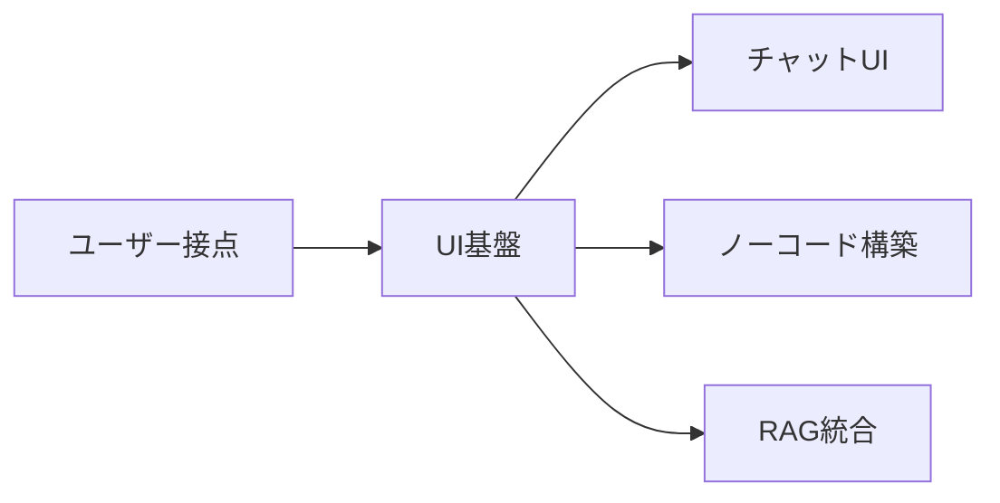
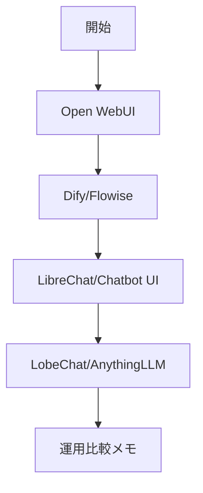

# UI・チャットアプリ基盤

> 🔰 初級（カテゴリ導入） | 前提: -

ユーザー向けのLLMチャットUIやノーコード/ローコード開発プラットフォーム。

## 位置づけ

## 学習フロー

## 含まれるOSS

- **Open WebUI**: ローカル/セルフホストのLLM Web UI
- **Dify**: ワークフロー・アプリ公開機能を持つプラットフォーム
- **Flowise**: ノードベースのLLMフロー構築ツール
- **LibreChat**: 複数LLMプロバイダ対応チャットUI
- **Chatbot UI**: シンプルなChatGPT風UI
- **LobeChat**: モダンなチャットクライアント
- **AnythingLLM**: 文書QA統合のオールインワンUI

## まず何で選ぶか

このカテゴリは、見た目が似ていても役割が異なる OSS をまとめています。最初に確認したいのは、次の 4 点です。

1. **主用途**: 日常チャット UI が欲しいのか、AI アプリやワークフローを作りたいのか
2. **外部連携**: Tool Call / MCP / API / RAG まで必要か、それとも単純な会話で十分か
3. **運用の重さ**: 単体起動で済むか、DB や認証、複数サービス構成まで許容できるか
4. **利用形態**: 個人検証なのか、チーム運用や複数ユーザー利用まで見据えるか

## 選定の目安

| OSS | 公式ポジショニング | 主用途 | 外部連携の重心 | 向いているケース |
| --- | --- | --- | --- | --- |
| Open WebUI | self-hosted AI interface | ローカル/セルフホストの統合チャット UI | モデル接続、ツール、RAG | まず自前環境で AI UI を持ちたい |
| Dify | agentic workflow platform | AI アプリ構築と公開 | Workflow、データソース、API | 業務向け AI アプリを組みたい |
| Flowise | AI agent / LLM workflow platform | ノードベースの設計と試行錯誤 | Assistant、Chatflow、Agentflow | フロー設計を可視化して検証したい |
| LibreChat | open-source AI platform | 複数 Provider と外部連携を持つ統合会話基盤 | Agents、Tools、MCP、Artifacts | Tool Call や外部環境連携を重視したい |
| Chatbot UI | open-source AI chat app | ChatGPT 風 UI の構築 | モデル接続中心 | シンプルな会話 UI を自分で育てたい |
| LobeChat | agent operator / collaborative agent platform | Agent 利用とモダンな操作体験 | Skills、MCP、Memory | Agent 活用を前面に使いたい |
| AnythingLLM | all-in-one private AI app | 文書中心の AI 利用基盤 | 文書取り込み、Agent、API | private-first で文書活用したい |

## 選び方のショートガイド

- **まずチャット UI を持ちたい**: Open WebUI
- **業務ワークフローやアプリ公開が主目的**: Dify
- **ノードで構成を試しながら設計したい**: Flowise
- **複数 Provider と Tool Call / MCP を同じ UI で扱いたい**: LibreChat
- **シンプルな ChatGPT 風 UI を自分で調整したい**: Chatbot UI
- **Agent 中心の体験や Skills/MCP を重視したい**: LobeChat
- **文書 QA や private-first の運用を重視したい**: AnythingLLM

## 学習順序

1. Open WebUI (チャットUI・セットアップ簡単)
2. Dify (ノーコードでAIアプリ構築・公開)
3. Flowise (ビジュアルフロー構築)
4. LibreChat (複数モデル運用)
5. Chatbot UI (軽量フロント)
6. LobeChat (モダンUX)
7. AnythingLLM (RAG統合)

実行前提: Windows + PowerShell

ハードコピー保管先ルール: `docs/04-ui/examples/{tool}/`

サンプル粒度ルール（02-dify.md 準拠）:

- 手順番号は `0-7` を基本形にする（準備→設定→起動確認→初期アクセス→機能設定→実行確認→完了判定→停止/再開）
- Docker のコマンド表記は `docker compose` を標準とし、`docker-compose` は使わない
- 各手順に「操作」「期待状態」「実行イメージ」を対応づける
- 各教材で `5.1` を設け、製品固有価値を示す追加確認を入れる
- `7. 停止・再開` では `stop/start/down` の使い分けを明示する

## 教材リンク

- [01-open-webui.md](./01-open-webui.md)
- [02-dify.md](./02-dify.md)
- [03-flowise.md](./03-flowise.md)
- [04-librechat.md](./04-librechat.md)
- [05-chatbot-ui.md](./05-chatbot-ui.md)
- [06-lobechat.md](./06-lobechat.md)
- [07-anythingllm.md](./07-anythingllm.md)

## 実行証跡サンプル

- [Open WebUI スクリーンショット一式](./examples/open-webui/)
- [Open WebUI 実行ログ](./examples/open-webui/run-log.txt)
- [Dify スクリーンショット一式](./examples/dify/)
- [Dify 実行ログ](./examples/dify/run-log.txt)
- [Flowise スクリーンショット一式](./examples/flowise/)
- [Flowise 実行ログ](./examples/flowise/run-log.txt)
- [LibreChat スクリーンショット一式](./examples/librechat/)
- [LibreChat 実行ログ](./examples/librechat/run-log.txt)
- [Chatbot UI スクリーンショット一式](./examples/chatbot-ui/)
- [Chatbot UI 実行ログ](./examples/chatbot-ui/run-log.txt)
- [LobeChat スクリーンショット一式](./examples/lobechat/)
- [LobeChat 実行ログ](./examples/lobechat/run-log.txt)
- [AnythingLLM スクリーンショット一式](./examples/anythingllm/)
- [AnythingLLM 実行ログ](./examples/anythingllm/run-log.txt)

## 完了条件

- カテゴリ内の主要OSSを3つ以上説明できる
- 最小サンプルを1件以上動作確認できる
- 1教材あたり最低6枚のハードコピーを取得・整理できる
- 選定観点（主用途/外部連携/運用の重さ/チーム利用）で比較メモを作成できる

---

[← 前へ](03-inference/04-llama-cpp.md) | [次へ →](04-ui/01-open-webui.md)

