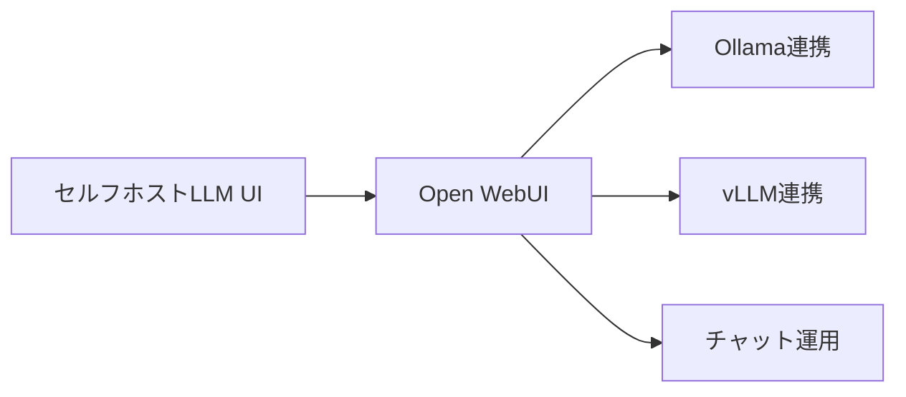
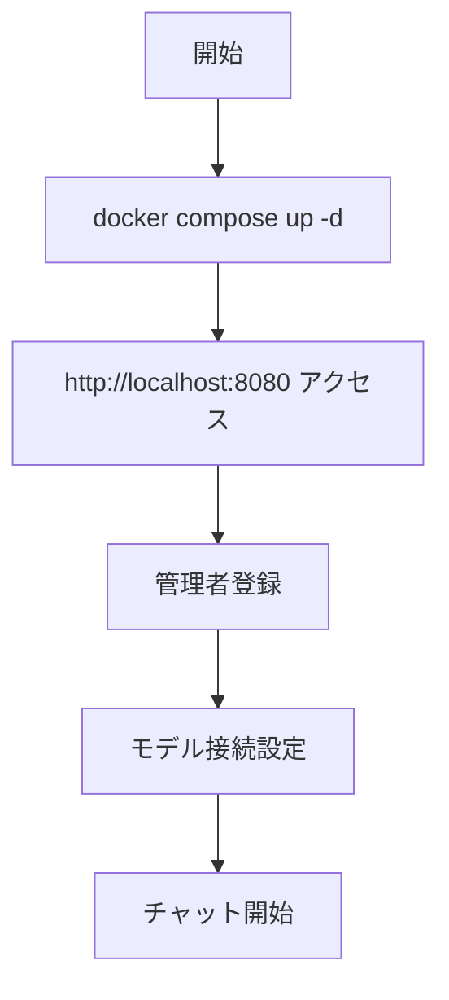
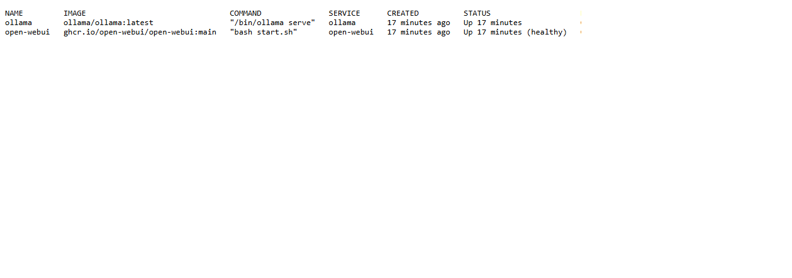
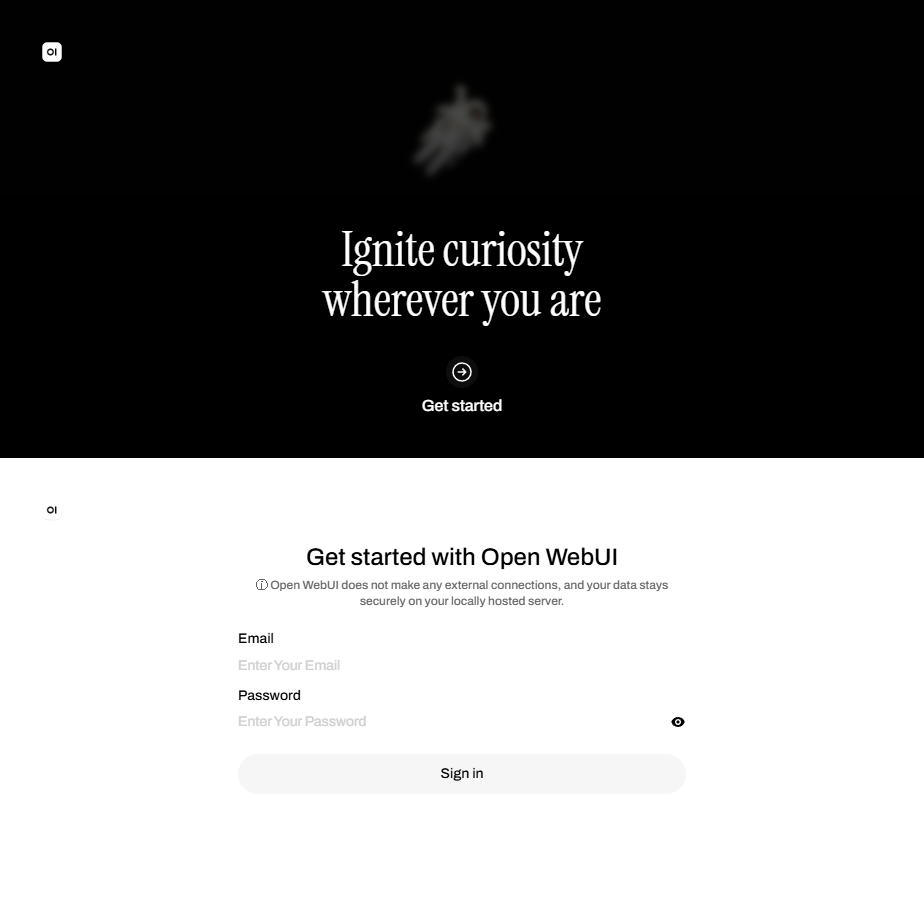
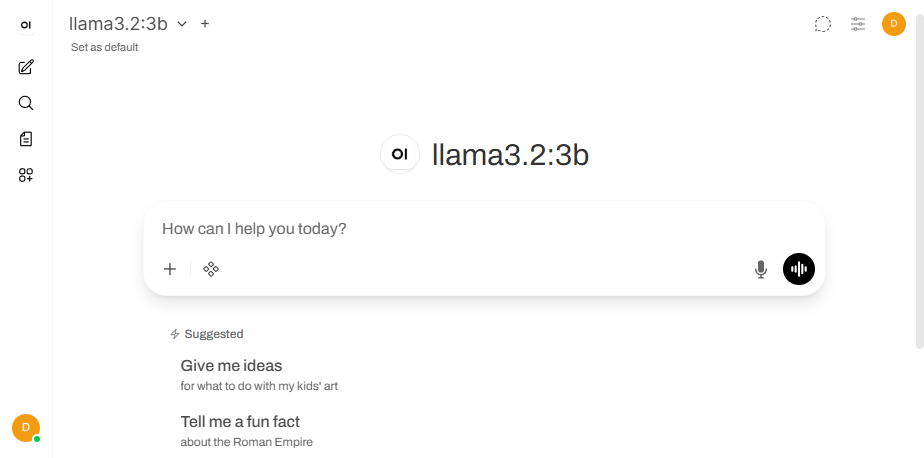
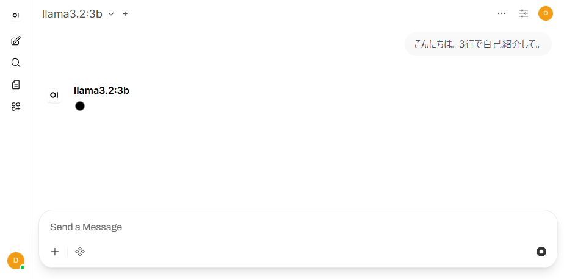
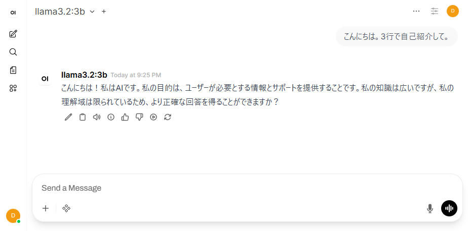
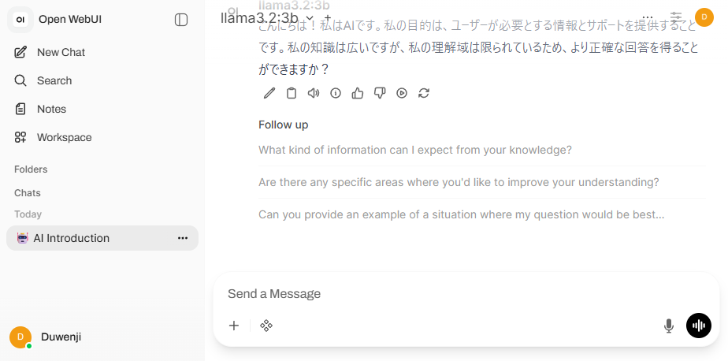

# Open WebUI - ローカル/セルフホスト型チャットUI

> 📖 中級（概念・実践） | 前提: Python基礎 / LLMアプリの基本概念

## この教材で身につくこと

- ChatGPT風の使いやすいインターフェース
- Ollama、vLLM 等と連携
- Docker 一つで起動可能
- インターネット接続不要でも動作
- プラグイン、RAG機能も搭載

**バージョン**: 最新版（公式 docs を参照）  
**公式ドキュメント**: https://docs.openwebui.com/
**公式リポジトリ**: https://github.com/open-webui/open-webui

## 公式ポジショニング
**Open WebUI** は、任意モデルを自前で接続し、ツール、RAG、ローカル/クラウド併用まで扱える self-hosted AI interface です。

## この OSS を選ぶべきケース

- まずセルフホスト前提の AI UI を自前環境に持ちたい
- Ollama などのローカルモデルと、OpenAI などのクラウドモデルを同じ UI で扱いたい
- チャット UI から始めつつ、RAG やツール連携まで段階的に広げたい
- 個人利用だけでなく、将来的に組織利用や運用ポリシーも見据えたい

## この OSS を選ばない方がよいケース

- 業務ワークフローや AI アプリ公開を主目的とする
- Tool Call / MCP を主価値として最初から強く検証したい
- 文書中心の private-first 利用を最優先にしたい

### 主な特徴

- **UI が美しい**: ChatGPT風の使いやすいインターフェース
- **複数LLMサポート**: Ollama、vLLM 等と連携
- **セットアップが簡単**: Docker 一つで起動可能
- **オフライン対応**: インターネット接続不要でも動作
- **拡張機能**: プラグイン、RAG機能も搭載

## 外部接続と拡張の考え方

- Open WebUI は単なるローカル UI ではなく、任意モデル接続を起点にツールや RAG まで広げられる構成です
- ローカル完結しやすい一方で、必要に応じてクラウド Provider も取り込めます
- 最小確認はチャット応答ですが、選定判断では「モデル接続の自由度」と「拡張余地」が重要です

---

## 仕組み

1. Open WebUI がチャット UI とセッション管理を提供します。
2. Ollama や外部 Provider に推論リクエストを転送します。
3. 応答を UI に表示し、会話履歴を保存します。
4. モデル切替や接続先設定を UI から変更できます。
5. 必要に応じてツール/RAG 機能を段階的に有効化できます。
## 前提条件

- Docker インストール済み
- CPU 2コア以上
- メモリ 4GB 以上

### クイックスタート

```bash
docker compose up -d
```
ブラウザで http://localhost:8080 にアクセス。

## 位置づけ



## 実行フロー



## サンプル

### 実行例

このセクションでは、Windows PowerShell 前提で Open WebUI と Ollama の最小構成を順に起動します。

#### 0. 作業ディレクトリ準備（PowerShell）

```powershell
New-Item -ItemType Directory -Path .\sandbox\open-webui -Force | Out-Null
Set-Location .\sandbox\open-webui
```

#### 1. docker-compose.yml を作成

```yaml
services:
	ollama:
		image: ollama/ollama:latest
		container_name: ollama
		ports:
			- "11434:11434"
		volumes:
			- ollama_data:/root/.ollama
		restart: unless-stopped

	open-webui:
		image: ghcr.io/open-webui/open-webui:main
		container_name: open-webui
		ports:
			- "8080:8080"
		environment:
			- OLLAMA_BASE_URL=http://ollama:11434
		volumes:
			- open_webui_data:/app/backend/data
		depends_on:
			- ollama
		restart: unless-stopped

volumes:
	ollama_data:
	open_webui_data:
```

#### 2. コンテナ起動と状態確認

```powershell
docker compose up -d
docker compose ps
docker compose logs open-webui --tail 50
```

期待状態:

- `open-webui` と `ollama` が `Up` になっている
- `open-webui` のログに致命的エラーが出ていない

実行イメージ:



#### 3. 使うモデルを Ollama に取得

```powershell
docker exec ollama ollama pull llama3.2:3b
docker exec ollama ollama list
```

期待状態:

- `ollama list` に `llama3.2:3b` が表示される

#### 4. Open WebUI 初期アクセス

```powershell
Start-Process "http://localhost:8080"
```

ブラウザ操作:

1. 初回アクセスで管理者アカウントを作成
2. モデル選択で `llama3.2:3b` を選ぶ
3. サイドバーと入力欄が表示され、チャット可能な状態になっていることを確認

実行イメージ（サインアップ）:



実行イメージ（モデル選択完了）:



#### 5. チャット確認

ブラウザ操作:

1. `こんにちは。3行で自己紹介して。` を送信
2. 入力状態を `04-first-chat-input.png`、応答状態を `05-first-chat-output.png` として撮影

実行イメージ（初回入力）:



実行イメージ（初回回答）:



#### 5.1 会話履歴と拡張余地の確認

ブラウザ操作:

1. サイドバーに会話履歴が保存されることを確認
2. 必要に応じて Settings でツール/RAG 関連メニューが参照可能であることを確認

実行イメージ（履歴サイドバー）:



#### 6. 基本機能の完了判定（最低ライン）

- UI からチャット送信できる
- ローカルモデルから応答が返る
- 会話履歴がサイドバーに保存される

#### 7. 停止・再開（検証用）

```powershell
docker compose stop
docker compose start
docker compose down
```

使い分け:

- `docker compose stop`: コンテナだけ停止します。次回は `docker compose start` で高速に再開できます。
- `docker compose down`: コンテナ停止に加えて、Compose 管理のネットワークも削除します。次回は `docker compose up -d` で再作成して起動します。
- データも初期化したい場合: `docker compose down -v`（ボリューム削除）

### 検証

- コマンドがエラーなく完了する
- 想定した出力（画面表示・ファイル生成・回答）を確認できる
- 変更した設定に応じて結果差分を説明できる


