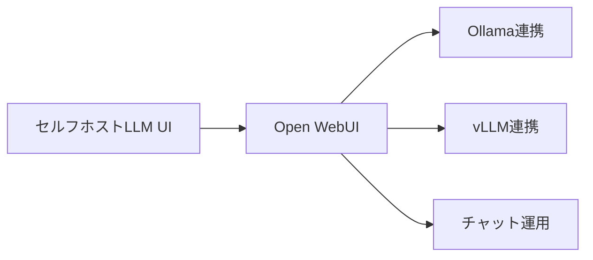
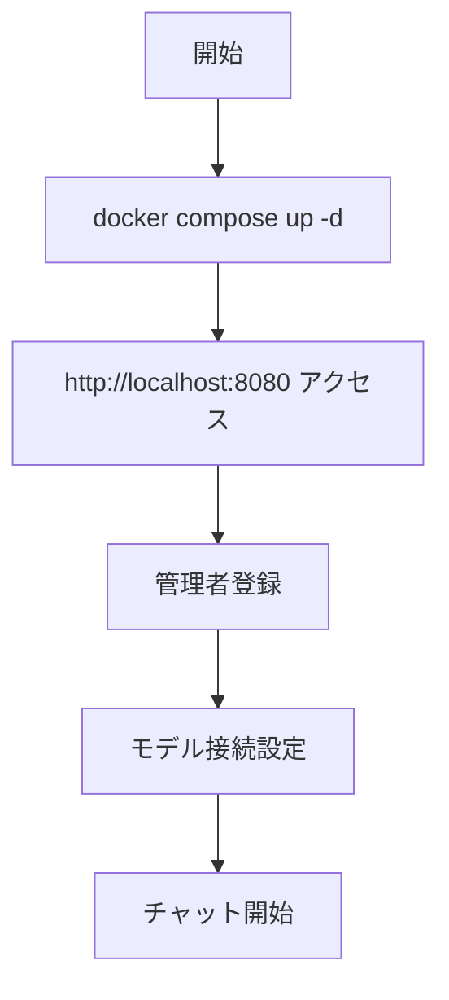

# Open WebUI - ローカル/セルフホスト型チャットUI

> 📖 中級（概念・実践） | 前提: Python基礎 / LLMアプリの基本概念

## この教材で身につくこと

- Docker 一つで Open WebUI をセルフホスト環境に立ち上げられる
- Ollama などのローカルモデルと OpenAI などのクラウドモデルを同じ UI で切り替えられる
- RAG やプラグインを段階的に有効化して機能拡張できる
- 会話履歴の管理と基本的な運用手順を説明できる
- Open WebUI を選ぶ判断基準を他の UI ツールと比較して述べられる

## 概要

**Open WebUI** は、任意モデルを自前で接続し、ツール、RAG、ローカル/クラウド併用まで扱える self-hosted AI interface です。

**バージョン**: 最新版（公式 docs を参照）  
**公式ドキュメント**: https://docs.openwebui.com/  
**公式リポジトリ**: https://github.com/open-webui/open-webui

### 主な特徴

- **UI が美しい**: ChatGPT風の使いやすいインターフェース
- **複数LLMサポート**: Ollama、vLLM 等と連携
- **セットアップが簡単**: Docker 一つで起動可能
- **オフライン対応**: インターネット接続不要でも動作
- **拡張機能**: プラグイン、RAG機能も搭載

### この OSS を選ぶべきケース

- まずセルフホスト前提の AI UI を自前環境に持ちたい
- Ollama などのローカルモデルと、OpenAI などのクラウドモデルを同じ UI で扱いたい
- チャット UI から始めつつ、RAG やツール連携まで段階的に広げたい
- 個人利用だけでなく、将来的に組織利用や運用ポリシーも見据えたい

### この OSS を選ばない方がよいケース

- 業務ワークフローや AI アプリ公開を主目的とする
- Tool Call / MCP を主価値として最初から強く検証したい
- 文書中心の private-first 利用を最優先にしたい

## 位置づけ



Open WebUI は、ローカルモデルからクラウド Provider まで任意モデル接続を起点に、ツールや RAG まで広げられる self-hosted AI interface です。まずはチャット疎通確認、次にモデル切替、最後に RAG/ツール拡張へ進むと理解しやすくなります。

## 実行フロー



処理の流れ:

1. Open WebUI がチャット UI とセッション管理を提供します。
2. Ollama や外部 Provider に推論リクエストを転送します。
3. 応答を UI に表示し、会話履歴を保存します。
4. モデル切替や接続先設定を UI から変更できます。
5. 必要に応じてツール/RAG 機能を段階的に有効化できます。

## 最小セットアップ

### 前提条件

- Docker インストール済み
- CPU 2コア以上
- メモリ 4GB 以上

### クイックスタート

```bash
docker compose up -d
```

ブラウザで http://localhost:8080 にアクセス。

### セキュリティ注意（必読）

- APIキーは `.env` で管理し、ソースコードや教材本文に直接書かない
- `.env` は Git にコミットしない（`.gitignore` に含める）
- APIキーを誤って共有した場合は、プロバイダ側で即時ローテーションする

## 実ソースコード

### 実行例

このセクションでは、Windows PowerShell 前提で Open WebUI と Ollama の最小構成を順に起動します。

#### 0. 作業ディレクトリ準備（PowerShell）

```powershell
New-Item -ItemType Directory -Path .\sandbox\open-webui -Force | Out-Null
Set-Location .\sandbox\open-webui
```

#### 1. docker-compose.yml を作成

```yaml
services:
    ollama:
        image: ollama/ollama:latest
        container_name: ollama
        ports:
            - "11434:11434"
        volumes:
            - ollama_data:/root/.ollama
        restart: unless-stopped

    open-webui:
        image: ghcr.io/open-webui/open-webui:main
        container_name: open-webui
        ports:
            - "8080:8080"
        environment:
            - OLLAMA_BASE_URL=http://ollama:11434
        volumes:
            - open_webui_data:/app/backend/data
        depends_on:
            - ollama
        restart: unless-stopped

volumes:
    ollama_data:
    open_webui_data:
```

#### 2. コンテナ起動と状態確認

```powershell
docker compose up -d
docker compose ps
docker compose logs open-webui --tail 50
```

期待状態:

- `open-webui` と `ollama` が `Up` になっている
- `open-webui` のログに致命的エラーが出ていない

実行イメージ:


#### 3. 使うモデルを Ollama に取得

```powershell
docker exec ollama ollama pull llama3.2:3b
docker exec ollama ollama list
```

期待状態:

- `ollama list` に `llama3.2:3b` が表示される

#### 4. Open WebUI 初期アクセス

```powershell
Start-Process "http://localhost:8080"
```

ブラウザ操作:

1. 初回アクセスで管理者アカウントを作成
2. モデル選択で `llama3.2:3b` を選ぶ
3. サイドバーと入力欄が表示され、チャット可能な状態になっていることを確認

実行イメージ（サインアップ）:


実行イメージ（モデル選択完了）:


#### 5. チャット確認

ブラウザ操作:

1. `こんにちは。3行で自己紹介して。` を送信
2. 入力状態を `04-first-chat-input.png`、応答状態を `05-first-chat-output.png` として撮影

実行イメージ（初回入力）:


実行イメージ（初回回答）:


#### 5.1 会話履歴と拡張余地の確認

ブラウザ操作:

1. サイドバーに会話履歴が保存されることを確認
2. 必要に応じて Settings でツール/RAG 関連メニューが参照可能であることを確認

実行イメージ（履歴サイドバー）:


#### 6. 基本機能の完了判定（最低ライン）

- UI からチャット送信できる
- ローカルモデルから応答が返る
- 会話履歴がサイドバーに保存される

#### 7. 停止・再開（検証用）

```powershell
docker compose stop
docker compose start
docker compose down
```

使い分け:

- `docker compose stop`: コンテナだけ停止します。次回は `docker compose start` で高速に再開できます。
- `docker compose down`: コンテナ停止に加えて、Compose 管理のネットワークも削除します。次回は `docker compose up -d` で再作成して起動します。
- データも初期化したい場合: `docker compose down -v`（ボリューム削除）

### 検証

- コマンドがエラーなく完了する
- 想定した出力（画面表示・ファイル生成・回答）を確認できる
- 変更した設定に応じて結果差分を説明できる

## 演習課題

1. Open WebUI を使う想定ユースケースを1つ定義し、使用するモデルと期待する出力の例を記録してください。
2. Ollama と OpenAI API の2つを接続候補として整理し、それぞれのメリットと切り替え手順をまとめてください。
3. Open WebUI を選ぶ理由と、代わりに LibreChat を選ぶ理由を UI 観点・運用観点で比較してください。

### 解答の目安

1. まず課題の目的を一文で明確化し、入力・出力を対応づけて記述します。
   確認ポイント: 何を変えて何を確認する課題かを第三者が読んで理解できること。
2. 最小構成で一度実行し、設定や条件を1つ変更して差分を比較します。
   確認ポイント: 変更前後の挙動差を具体的に説明できること。
3. 適用条件と代替手段を整理し、選択基準を短くまとめます。
   確認ポイント: なぜその手段を選ぶかを根拠付きで示せること。

## 理解度チェック

1. Open WebUI の主な役割を1文で説明してください。
2. Open WebUI を導入する際の最大のメリットと注意点は何ですか？
3. Open WebUI が向かないユースケースとして、どのようなケースが考えられますか？

### 解説の要点

1. 主な役割は、その技術がどの工程を担い、何を改善するかで説明します。
2. メリットは再現性・拡張性・運用性の観点で整理し、注意点は導入コストや複雑性として示します。
3. 使い分けは要件、実装コスト、運用体制の3観点で判断します。

## 参考リンク

- [Open WebUI 公式ドキュメント](https://docs.openwebui.com/)
- [Open WebUI GitHub リポジトリ](https://github.com/open-webui/open-webui)
- [Ollama 公式サイト](https://ollama.ai/)

---

[← 前へ](00-README.md) | [次へ →](02-dify.md)
