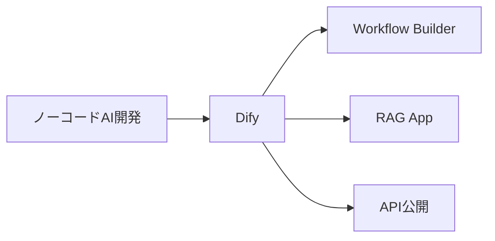
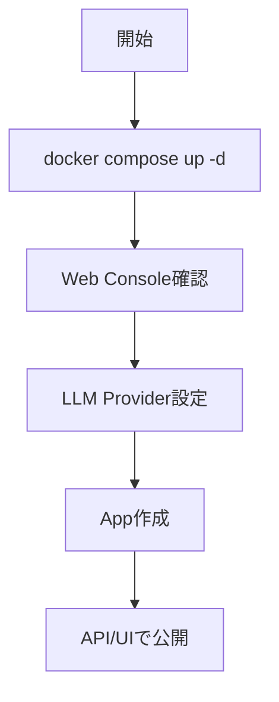

# Dify - ノーコード LLM アプリ開発プラットフォーム

> 📖 中級（概念・実践） | 前提: Python基礎 / LLMアプリの基本概念

## この教材で身につくこと

- ドラッグ&ドロップでワークフロー作成
- OpenAI、Anthropic、Ollama 等
- ドキュメントアップロードで即QA構築
- 作成したアプリを REST API として公開
- バージョン管理と A/B テスト

**バージョン**: 0.7.0+ / OSS準拠（2026-05時点）  
**公式ドキュメント**: https://docs.dify.ai/
**公式サイト**: https://dify.ai/

## 公式ポジショニング
**Dify** は、agentic workflow を視覚的に構築し、既存ツールやデータソースをつなぎ、AI アプリとして配備するためのプラットフォームです。

## この OSS を選ぶべきケース

- ノーコード/ローコードで AI アプリを素早く形にしたい
- Workflow、RAG、プロンプト管理、公開 API を一体で扱いたい
- 個人検証よりも、業務向けのアプリ化や運用移行を見据えている
- UI 表示だけでなく、アプリとしての公開や管理を重視する

## この OSS を選ばない方がよいケース

- 単純なチャット UI をまず 1 つ立てたい
- ノード単位の自由な試行錯誤や細かい接続確認を優先したい
- Tool Call / MCP を主軸に、会話 UI の延長で検証したい

### 主な特徴

- **ビジュアルフロー構築**: ドラッグ&ドロップでワークフロー作成
- **複数LLM対応**: OpenAI、Anthropic、Ollama 等
- **RAG統合**: ドキュメントアップロードで即QA構築
- **API公開**: 作成したアプリを REST API として公開
- **プロンプト管理**: バージョン管理と A/B テスト

## Flowise との見分け方

- Dify は「フローを作る」だけでなく、「アプリとして公開して運用する」ところまでが主眼です
- Flowise がノード設計の試行錯誤に強いのに対し、Dify はアプリ化、管理、配備の導線が強みです
- 選定時は、PoC の自由度よりも、業務利用へ持っていく一貫性を重視するかで判断します

---

## 仕組み

1. 目的と入力を定義し、対象データや利用モデルを準備します。
2. コア処理（検索・推論・生成・検証のいずれか）を実行します。
3. 実行結果を保存または表示し、次工程に渡せる形式へ整えます。
4. パラメータを調整して挙動差分を比較し、品質を確認します。
5. 運用を想定して再実行手順と確認ポイントを定着させます。

## 前提条件

### 前提条件

- Docker インストール済み
- PostgreSQL（Docker Compose に含む）
- メモリ 8GB 以上推奨

### クイックスタート

```bash
docker compose up -d
```
初期セットアップが自動実行されます。

## 位置づけ



## 実行フロー



## サンプル

### 実行例

このセクションでは、Windows PowerShell 前提で Dify の最小構成を順に起動します。

#### 0. 作業ディレクトリ準備（PowerShell）

```powershell
New-Item -ItemType Directory -Path .\sandbox\dify -Force | Out-Null
Set-Location .\sandbox\dify
```

#### 1. docker-compose.yml を作成

```yaml
version: "3.8"

services:
  dify:
    image: langgenius/dify-api:latest
    container_name: dify-api
    ports:
      - "8081:5001"
    environment:
      - MODE=api
      - SECRET_KEY=change-me
      - CONSOLE_WEB_URL=http://localhost:3000
      - DB_HOST=postgres
      - DB_PORT=5432
      - DB_USERNAME=postgres
      - DB_PASSWORD=postgres
      - DB_DATABASE=dify
      - REDIS_HOST=redis
      - REDIS_PORT=6379
    depends_on:
      - postgres
      - redis

  dify-web:
    image: langgenius/dify-web:latest
    container_name: dify-web
    ports:
      - "3000:3000"
    environment:
      - CONSOLE_API_URL=http://localhost:8081

  postgres:
    image: postgres:15
    container_name: dify-postgres
    environment:
      - POSTGRES_USER=postgres
      - POSTGRES_PASSWORD=postgres
      - POSTGRES_DB=dify
    volumes:
      - dify_postgres:/var/lib/postgresql/data

  redis:
    image: redis:7-alpine
    container_name: dify-redis
    volumes:
      - dify_redis:/data

volumes:
  dify_postgres:
  dify_redis:
```

#### 2. コンテナ起動と状態確認

```powershell
docker compose up -d
docker compose ps
docker compose logs dify-api --tail 50
```

期待状態:

- `dify-api`、`dify-web`、`dify-postgres`、`dify-redis` が `Up` になっている
- `dify-api` のログに致命的エラーが出ていない

実行イメージ:


#### 3. 管理者アカウント作成

```powershell
Start-Process "http://localhost:3000"
```

ブラウザ操作:

1. 初回アクセスで管理者アカウントを作成
2. メールアドレスとパスワードを設定して登録

実行イメージ（セットアップ画面）:


#### 4. LLM Provider 設定

ブラウザ操作:

1. 右上のアカウントメニュー → **Settings** → **Model Provider** を開く
2. OpenAI または Ollama の API エンドポイントを設定
   - OpenAI: API キーを入力
   - Ollama: `http://host.docker.internal:11434` を URL に設定

実行イメージ（LLM Provider 設定）:


#### 5. アプリ作成・チャット確認

ブラウザ操作:

1. **Studio** → **Create App** → **Chatbot** を選択
2. LLM ノードで登録済みのモデルを選択
3. **Publish** してプレビューを開く
4. 「こんにちは。3行で自己紹介して。」を送信

実行イメージ（アプリ作成）:


実行イメージ（チャット入力）:


実行イメージ（チャット回答）:


#### 5.1 Workflow Builder（ドラッグ&ドロップ）

ブラウザ操作:

1. **Studio** → **Create from Blank** → **Workflow** を選択
2. ノードパネルから **LLM** と **End** を追加し、`Start -> LLM -> End` を構成
3. キャンバス上でノードをドラッグ&ドロップして配置を調整

実行イメージ（Workflow 作成）:


#### 6. 基本機能の完了判定（最低ライン）

- 管理画面 (http://localhost:3000) にログインできる
- LLM Provider が正常に登録されている
- チャットボットアプリから応答が返る

#### 7. 停止・再開（検証用）

```powershell
docker compose stop
docker compose start
docker compose down
```

使い分け:

- `docker compose stop`: コンテナだけ停止します。次回は `docker compose start` で高速に再開できます。
- `docker compose down`: コンテナ停止に加えて、Compose 管理のネットワークも削除します。次回は `docker compose up -d` で再作成して起動します。
- データも初期化したい場合: `docker compose down -v`（ボリューム削除）

### 検証

- コマンドがエラーなく完了する
- 想定した出力（画面表示・ファイル生成・回答）を確認できる
- 変更した設定に応じて結果差分を説明できる


