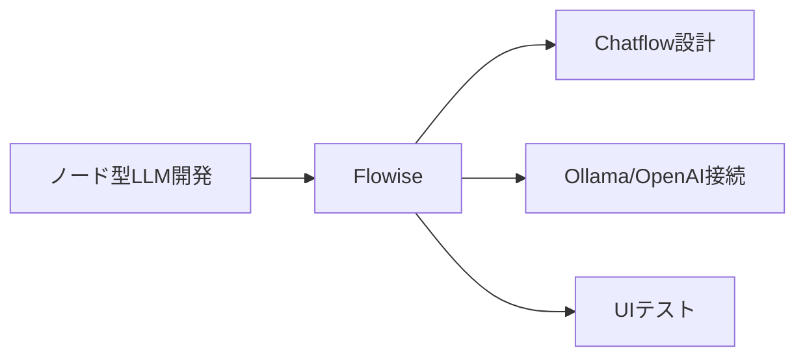
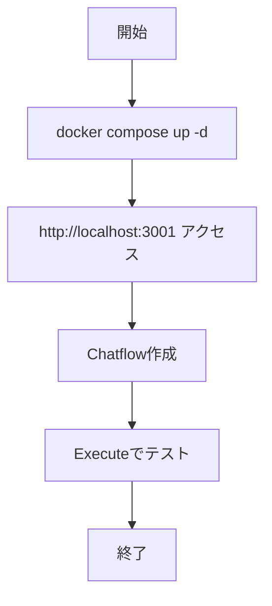
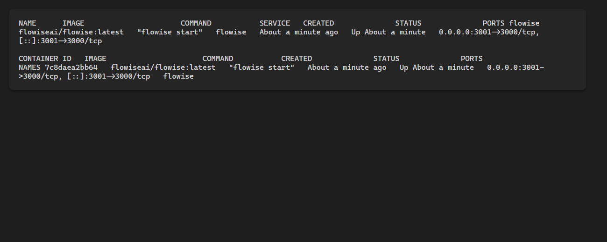
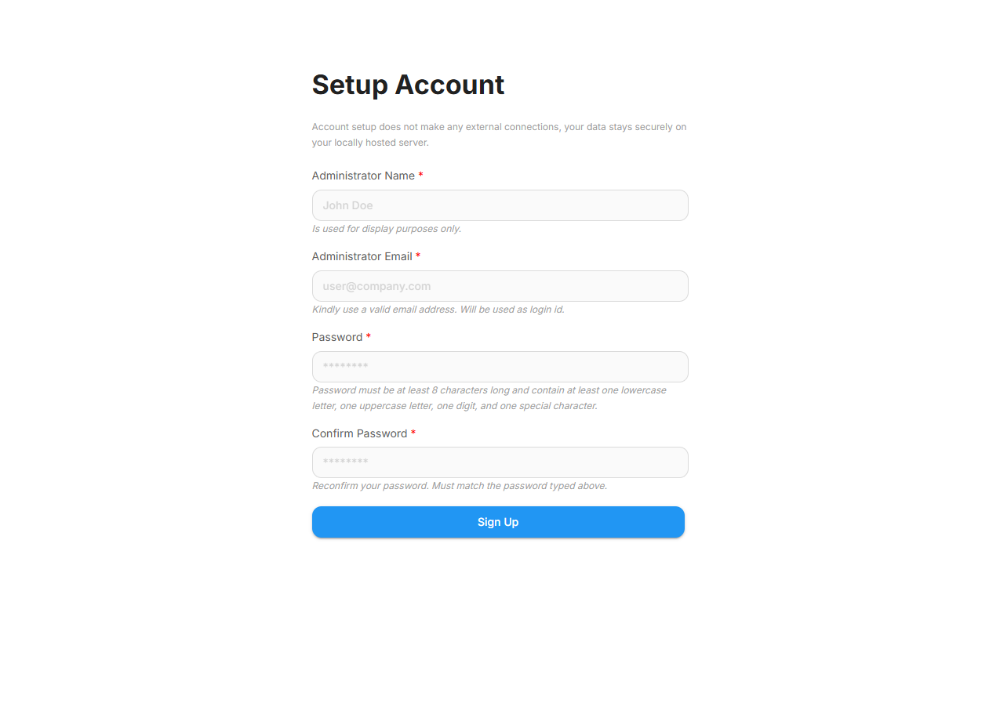
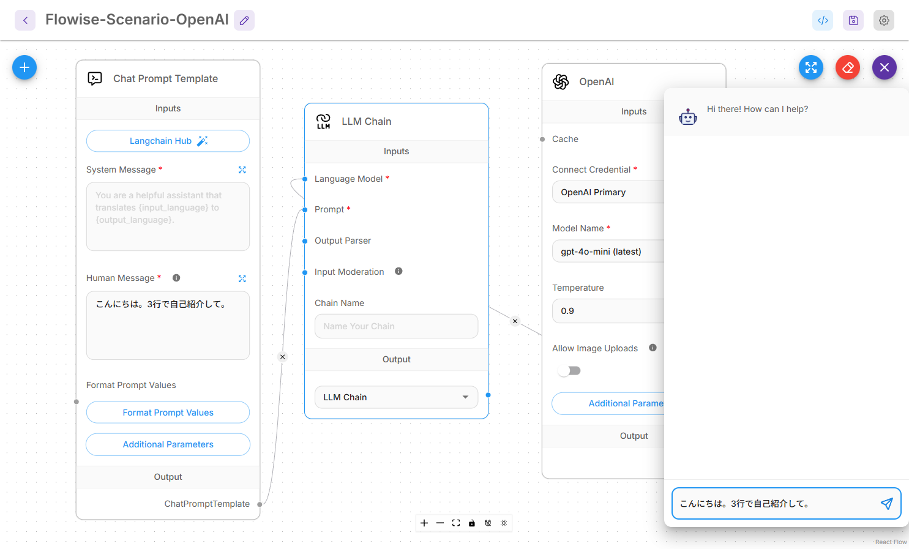
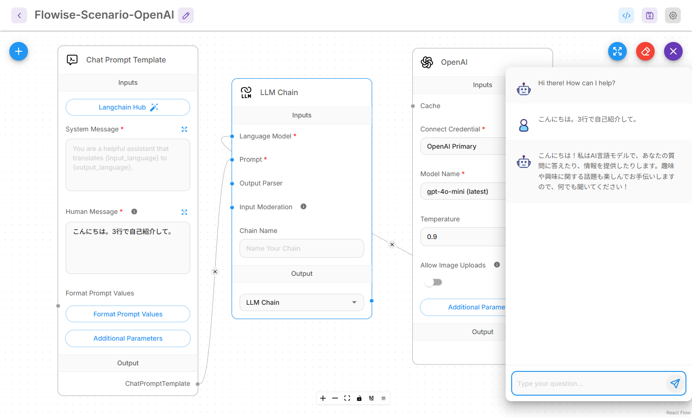

# Flowise 入門

> 📖 中級（概念・実践） | 前提: Python基礎 / LLMアプリの基本概念

## この教材で身につくこと

- ノード接続でのワークフロー設計
- Chatflow の公開とテスト
- OpenAI/Ollama 等との接続
- Windows + PowerShell での再現手順
- 実行証跡（ハードコピー）運用

## 公式ポジショニング
Flowise は、AI Agents と LLM workflows を構築する
オープンソース開発基盤です。
Assistant、Chatflow、Agentflow という複数の作り方を持ち、
ノードベースで構成を試しながら設計できます。

**バージョン**: 1.5.0+ / OSS準拠（2026-05時点）  
**公式ドキュメント**: https://docs.flowiseai.com/

## この OSS を選ぶべきケース

- ノード単位で接続関係を見ながら、構成を試行錯誤したい
- Chatflow や Agentflow を使い分けて、段階的に複雑な構成へ広げたい
- PoC や検証段階で、入力・接続・出力の関係を画面で確認したい
- Dify よりも、まずフロー設計と実行の感触を重視したい

## この OSS を選ばない方がよいケース

- AI アプリの公開や管理運用までを一体で進めたい
- 単純なチャット UI だけを素早く立ち上げたい
- 文書中心の private-first UI を主目的とする

## Dify との見分け方

- Flowise は構成の理解と試行錯誤に強く、どのノードをどうつなぐかを可視化しやすいのが利点です
- Dify はアプリ公開や運用導線まで含めて整理されている一方、Flowise は設計と検証の自由度が高いです
- 選定時は、まず作って試すことを優先するか、公開して運用することを優先するかで判断します

## 仕組み

1. ノードを配置して Chatflow/Agentflow を定義します。
2. Provider ノードに API キーや接続先を設定します。
3. ノード間を接続して実行経路を作ります。
4. 実行パネルで入力を送り、応答やエラーを検証します。
5. フローを保存・再実行し、構成差分を比較します。

## 前提条件

- Windows 11 + PowerShell 7 推奨
- Docker Desktop（Compose v2 有効）
- CPU 2コア以上
- メモリ 4GB 以上

### 事前チェック（PowerShell）

```powershell
docker --version
docker compose version
```

### クイックスタート

```powershell
docker compose up -d
```

ブラウザで http://localhost:3001 にアクセス。

## 位置づけ



## 実行フロー



## サンプル

### 実行例

このセクションでは、Windows PowerShell 前提で Flowise の最小構成を順に起動します。

#### 0. 作業ディレクトリ準備（PowerShell）

```powershell
New-Item -ItemType Directory -Path .\sandbox\flowise -Force | Out-Null
Set-Location .\sandbox\flowise
```

#### 1. docker-compose.yml を作成

```yaml
services:
	flowise:
		image: flowiseai/flowise:latest
		container_name: flowise
		ports:
			- "3001:3000"
		environment:
			- PORT=3000
			- FLOWISE_USERNAME=admin
			- FLOWISE_PASSWORD=admin123
		volumes:
			- flowise_data:/root/.flowise
		restart: unless-stopped

volumes:
	flowise_data:
```

#### 2. コンテナ起動と状態確認

```powershell
docker compose up -d
docker compose ps
docker compose logs flowise --tail 50
```

期待状態:

- `flowise` が `Up` になっている
- `flowise` のログに致命的エラーが出ていない

実行イメージ:



#### 3. 初期アクセス

```powershell
Start-Process "http://localhost:3001"
```

ブラウザ操作:

1. ログイン画面で `admin / admin123` を入力
2. ダッシュボード表示を確認

実行イメージ（ログイン画面）:



#### 4. Chatflow 作成

ブラウザ操作:

1. **New Chatflow** をクリック
2. **Prompt Template**、**OpenAI (Chat Model)**、**LLM Chain** の3ノードを追加
3. `Prompt Template -> LLM Chain (Prompt)`、`OpenAI -> LLM Chain (Language Model)` を接続
4. 3ノードが同時に見える位置へ配置して保存

実行イメージ（Chatflow 作成）:


#### 5. Provider 設定とテスト実行

ブラウザ操作:

1. OpenAI ノードで Provider を選択
	 - OpenAI: API キーを設定
	 - Ollama: Base URL に `http://host.docker.internal:11434` を設定
2. Prompt Template の Human Message に `こんにちは。3行で自己紹介して。` を入力
3. LLM Chain ノードに Prompt / Language Model の接続が成立していることを確認
4. 実行前に入力値が見えている状態を確認してから撮影する
5. 右下のチャット実行パネルで送信し、応答または明確なエラーが見えてから結果画面を撮影する

実行イメージ（プロバイダ設定）:


実行イメージ（テスト入力）:



実行イメージ（テスト出力）:



#### 5.1 Builder モード選択の確認

ブラウザ操作:

1. 作成対象が Chatflow であることを確認し、Assistant / Agentflow と使い分ける意図をメモする
2. 今回の構成が `Prompt Template + Chat Model + LLM Chain` の最小検証であることを run-log に記録する

確認ポイント:

- 検証目的（最小疎通か、複雑フロー検証か）に応じてモード選択を説明できる

品質メモ:

- `05-test-input.png` は入力値が見える実行前画面のみ採用します。
- `06-test-output.png` は応答または追跡可能な実行エラーが見える実行後画面のみ採用します。

#### 6. 基本機能の完了判定（最低ライン）

- 管理画面にログインできる
- Chatflow を保存できる
- LLM 応答が 1 件以上返る

#### 7. 停止・再開（検証用）

```powershell
docker compose stop
docker compose start
docker compose down
```

使い分け:

- `docker compose stop`: コンテナだけ停止します。次回は `docker compose start` で高速に再開できます。
- `docker compose down`: コンテナ停止に加えて、Compose 管理のネットワークも削除します。次回は `docker compose up -d` で再作成して起動します。
- データも初期化したい場合: `docker compose down -v`（ボリューム削除）

### 検証

- コマンドがエラーなく完了する
- 想定した出力（画面表示・ファイル生成・回答）を確認できる
- 変更した設定に応じて結果差分を説明できる

## よくある質問

**Q. `host.docker.internal` で Ollama に接続できません。**  
A. Docker Desktop のバージョンが古いと、
名前解決に失敗する場合があります。
`docker run --rm alpine nslookup host.docker.internal` で確認し、
失敗する場合は Docker Desktop を更新してください。

**Q. 初回起動で画面が白くなります。**  
A. `docker compose logs flowise --tail 100` を確認し、ポート重複や初回セットアップの完了待ちを確認してください。

**Q. どの Provider から始めるべきですか。**  
A. まずは OpenAI か Ollama のどちらか 1 つに絞って接続し、動作確認後に複数 Provider へ拡張するのが安全です。

## 演習課題

1. FAQ ボット向け Chatflow を1つ作成し、入力・出力の例を3件記録してください。
2. OpenAI と Ollama のどちらか一方で同じ Prompt を実行し、応答速度と回答品質の差分を比較してください。
3. Dify と比較して、Flowise を選ぶ判断基準を3点でまとめてください。


### 解答の目安

1. まず課題の目的を一文で明確化し、入力・出力を対応づけて記述します。
   確認ポイント: 何を変えて何を確認する課題かを第三者が読んで理解できること。
2. 最小構成で一度実行し、設定や条件を1つ変更して差分を比較します。
   確認ポイント: 変更前後の挙動差を具体的に説明できること。
3. 適用条件と代替手段を整理し、選択基準を短くまとめます。
   確認ポイント: なぜその手段を選ぶかを根拠付きで示せること。

## 理解度チェック

1. Flowise の主な役割を 1 文で説明してください。
2. ノードベース設計のメリットと運用上の注意点は何ですか？
3. Flowise が向かないユースケースを 1 つ挙げて理由を述べてください。


### 解説の要点

1. 主な役割は、その技術がどの工程を担い、何を改善するかで説明します。
2. メリットは再現性・拡張性・運用性の観点で整理し、注意点は導入コストや複雑性として示します。
3. 使い分けは要件、実装コスト、運用体制の3観点で判断します。
---

[← 前へ](04-ui/02-dify.md) | [次へ →](04-ui/04-librechat.md)


