# LibreChat - 複数LLMプロバイダ対応セルフホストチャット基盤

> 📖 中級（概念・実践） | 前提: Python基礎 / LLMアプリの基本概念

## この教材で身につくこと

- 複数 LLM プロバイダを 1 つの UI で切り替えて操作できる
- Tool Call / MCP を含む外部連携型チャット基盤を構築・確認できる
- Windows + PowerShell での最小起動手順を実行できる
- `.env` を使った設定の基本を理解できる
- 通常チャットと外部連携確認を分けて説明できる

## 概要

**LibreChat** は、複数モデルを 1 つの UI で扱うだけでなく、Agents、Tools、MCP、Code Interpreter、Artifacts まで統合できるオープンソース AI プラットフォームです。

**バージョン**: 最新版 / OSS準拠（2026-05時点）  
**公式ドキュメント**: https://www.librechat.ai/

### 主な特徴

- OpenAI、Azure OpenAI、Anthropic、Google、Ollama など複数 Provider を 1 つの UI から切り替えて扱える
- Agents、MCP、Tools、Artifacts などの拡張機能を同じ画面基盤で扱える
- 会話履歴、検索、プリセット、複数ユーザー認証など運用向け機能がそろっている
- セルフホスト前提のため、接続先と保存先を自分で管理しやすい

### この OSS を選ぶべきケース

- 複数 Provider を横断しつつ、同じ UI 上で運用したい
- 単純なチャット UI ではなく、将来的に Tool Call / MCP / Agent 連携まで育てたい
- 会話、認証、履歴、検索、外部連携を 1 つの基盤で管理したい
- 外部環境とやり取りする機能を、セルフホスト前提で検証したい

### この OSS を選ばない方がよいケース

- 単にローカル LLM と会話するだけで十分で、外部連携や運用機能が不要
- ノードベースのワークフロー設計を主目的とする
- 最小構成の軽いチャット UI を短時間で立ち上げたい

### 外部接続と拡張の考え方

- Provider 接続は `.env` の API キー設定が入口で、通常チャットは接続確認の最低ラインです
- LibreChat の価値は、そこから Agents / Tools / MCP / Code Interpreter へ段階的に拡張できる点にあります
- 外部連携を採用する場合は、利用モデルの応答だけでなく、どのツールが呼ばれ、どの結果が返ったかを追跡できることが重要です
- 本教材では通常チャットを疎通確認、Tool Call / MCP を価値確認として扱います

## 位置づけ

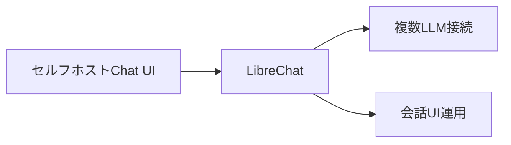

LibreChat は、複数 Provider を 1 つの UI 基盤で統合し、Agents や MCP まで段階的に拡張できるセルフホスト AI プラットフォームです。まずは通常チャット疎通、次に Provider 切替、最後に Tool Call / MCP 価値確認へ進むと理解しやすくなります。

## 実行フロー

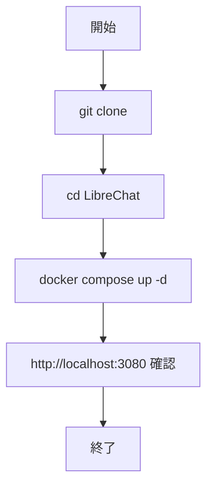

処理の流れ:

1. 目的と入力を定義し、対象データや利用モデルを準備します。
2. コア処理（検索・推論・生成・検証のいずれか）を実行します。
3. 実行結果を保存または表示し、次工程に渡せる形式へ整えます。
4. パラメータを調整して挙動差分を比較し、品質を確認します。
5. 運用を想定して再実行手順と確認ポイントを定着させます。

最小実行で確認すべき本質:

1. 単一 Provider のチャット応答が成功すること
2. 利用するモデルや Provider 文脈が UI 上で確認できること
3. Tool Call / MCP を有効にした構成では、外部連携の実行痕跡か結果が UI 上で追えること
4. 通常チャットと外部連携の違いを、実行証跡として説明できること

## 最小セットアップ

### 前提条件

- Windows 11 + PowerShell 7 推奨
- Git
- Docker Desktop（Compose v2 有効）
- メモリ 8GB 以上推奨

### 事前チェック（PowerShell）

```powershell
git --version
docker --version
docker compose version
```

### クイックスタート

```powershell
git clone https://github.com/danny-avila/LibreChat.git
Set-Location .\LibreChat
Copy-Item .env.example .env
docker compose up -d
```

ブラウザで http://localhost:3080 にアクセス。

### セキュリティ注意（必読）

- APIキーは `.env` で管理し、ソースコードや教材本文に直接書かない
- `.env` は Git にコミットしない（`.gitignore` に含める）
- APIキーを誤って共有した場合は、プロバイダ側で即時ローテーションする

## 実ソースコード

### 実行例

このセクションでは、Windows PowerShell 前提で LibreChat の最小構成を順に起動します。

#### 0. 作業ディレクトリ準備（PowerShell）

```powershell
New-Item -ItemType Directory -Path .\sandbox -Force | Out-Null
Set-Location .\sandbox
```

#### 1. docker-compose.yml と設定ファイルを準備

`docker-compose.yml`:

```yaml
services:
    api:
        container_name: LibreChat
        ports:
            - "${PORT}:${PORT}"
        depends_on:
            - mongodb
            - rag_api
        image: registry.librechat.ai/danny-avila/librechat-dev:latest
        restart: always
        extra_hosts:
            - "host.docker.internal:host-gateway"
        environment:
            - HOST=0.0.0.0
            - MONGO_URI=mongodb://mongodb:27017/LibreChat
            - MEILI_HOST=http://meilisearch:7700
            - RAG_PORT=${RAG_PORT:-8000}
            - RAG_API_URL=http://rag_api:${RAG_PORT:-8000}
        volumes:
            - type: bind
              source: ./.env
              target: /app/.env
            - ./images:/app/client/public/images
            - ./uploads:/app/uploads
            - ./logs:/app/logs

    mongodb:
        container_name: chat-mongodb
        image: mongo:8.0.20
        restart: always
        volumes:
            - ./data-node:/data/db
        command: mongod --noauth

    meilisearch:
        container_name: chat-meilisearch
        image: getmeili/meilisearch:v1.35.1
        restart: always
        environment:
            - MEILI_HOST=http://meilisearch:7700
            - MEILI_NO_ANALYTICS=true
            - MEILI_MASTER_KEY=${MEILI_MASTER_KEY}
        volumes:
            - ./meili_data_v1.35.1:/meili_data

    vectordb:
        container_name: vectordb
        image: pgvector/pgvector:0.8.0-pg15-trixie
        environment:
            POSTGRES_DB: mydatabase
            POSTGRES_USER: myuser
            POSTGRES_PASSWORD: mypassword
        restart: always
        volumes:
            - pgdata2:/var/lib/postgresql/data

    rag_api:
        container_name: rag_api
        image: registry.librechat.ai/danny-avila/librechat-rag-api-dev-lite:latest
        environment:
            - DB_HOST=vectordb
            - RAG_PORT=${RAG_PORT:-8000}
        restart: always
        depends_on:
            - vectordb
        env_file:
            - .env

volumes:
    pgdata2:
```

```powershell
git clone https://github.com/danny-avila/LibreChat.git
Set-Location .\LibreChat
Copy-Item .env.example .env
```

実行イメージ（.env 作成）:

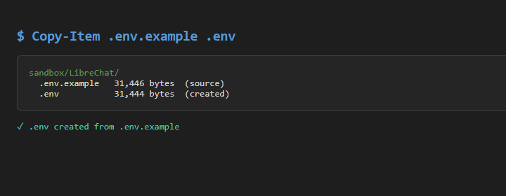

#### 2. 必須環境変数を最小設定

`.env` の最低限の確認項目:

- `HOST=0.0.0.0`
- `PORT=3080`
- 利用する Provider の API キー（例: `OPENAI_API_KEY=`）
- `ALLOW_EMAIL_LOGIN=true`
- `ALLOW_REGISTRATION=true`

補足:

- Windows では `docker compose up -d` 時に `UID` / `GID` の警告が出ることがありますが、起動継続できる場合は直ちに致命傷ではありません
- 初回のイメージ pull は大きいため、数分単位で待つことがあります

実行イメージ（env edited）:

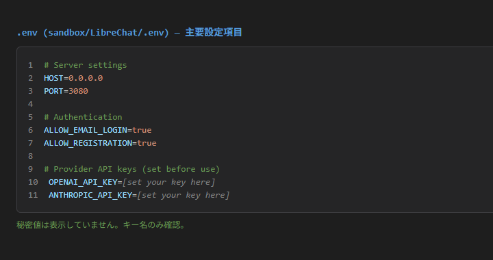

#### 3. コンテナ起動と状態確認

```powershell
docker compose up -d
docker compose ps
docker compose logs --tail 80
```

期待状態:

- `librechat` 関連コンテナが `Up` になっている
- 致命的エラーがログに出ていない

実行イメージ（docker compose ps）:

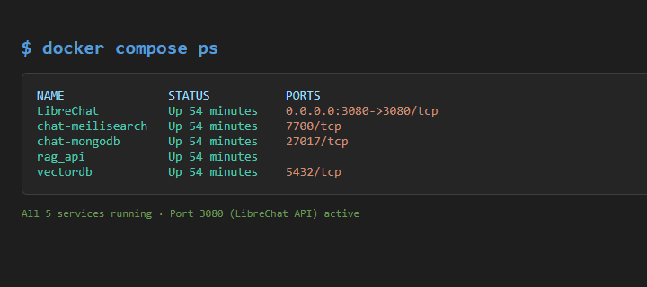

#### 4. 初期アクセス

```powershell
Start-Process "http://localhost:3080"
```

ブラウザ操作:

1. サインアップまたはログイン
2. モデル選択欄に Provider が表示されることを確認
3. 画面がローディング完了後であることを確認してから撮影する

実行イメージ（signup/login）:

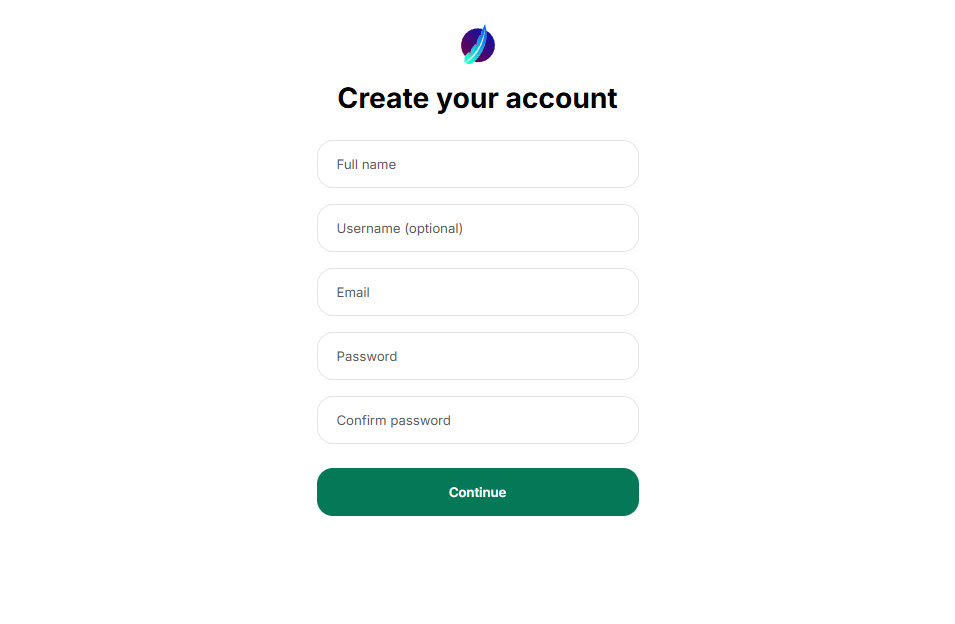

#### 5. チャット確認

ブラウザ操作:

1. モデルを選択
2. `こんにちは。3行で自己紹介して。` を送信
3. 送信前の入力状態を `05-chat-input.png` として撮影
4. 応答が返ることを確認し、通常チャットの疎通確認を行う
5. 送信後の結果を `06-chat-output.png` として撮影する

品質メモ:

- `05-chat-input.png` は送信前であること
- `06-chat-output.png` は送信後であること
- 単なる設定画面やローディング中画面で代用しないこと

実行イメージ（chat input）:

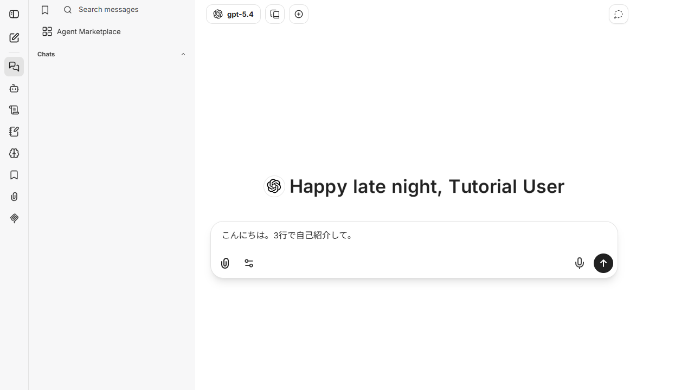

実行イメージ（chat output）:

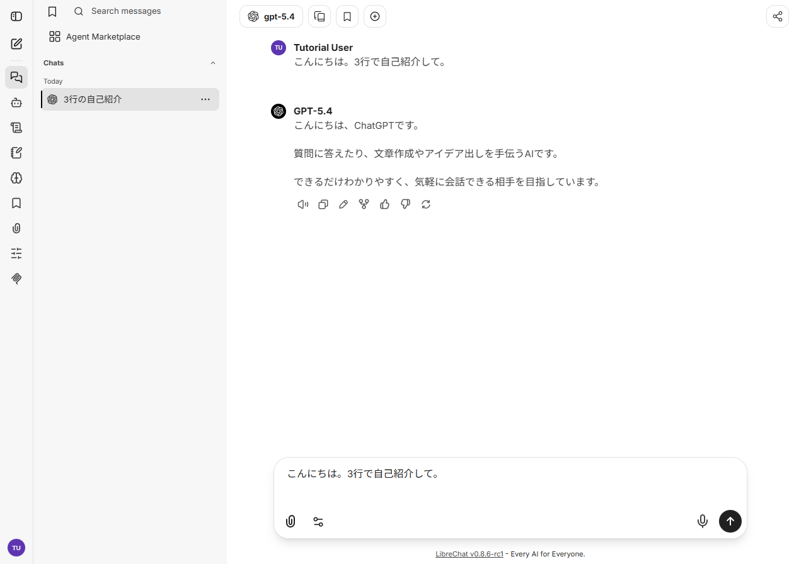

#### 5.1 Tool Call / MCP 価値確認

事前準備（推奨）:

```powershell
Set-Location .\sandbox\LibreChat
Set-Content .\uploads\mcp-test-1.txt "Test content 1"
Set-Content .\uploads\mcp-test-2.txt "Test content 2"
```

補足:

- `filesystem` の対象ディレクトリが空の場合、Tool Call は実行されても結果表示が `(No response)` になることがあります
- 教材では再現性のため、上記のようにサンプルファイルを置いた状態で 5.1 を実施してください

ブラウザ操作:

1. Agent / Tools / MCP を有効にした構成で、外部連携を伴う問い合わせを実行
2. ツール名、実行ログ、結果、失敗理由のいずれかが UI 上で追跡できることを確認
3. Tool Call / MCP 未実施の場合は、その理由と未実施範囲を `run-log.txt` に記録

実行イメージ（toolcall / mcp settings）:

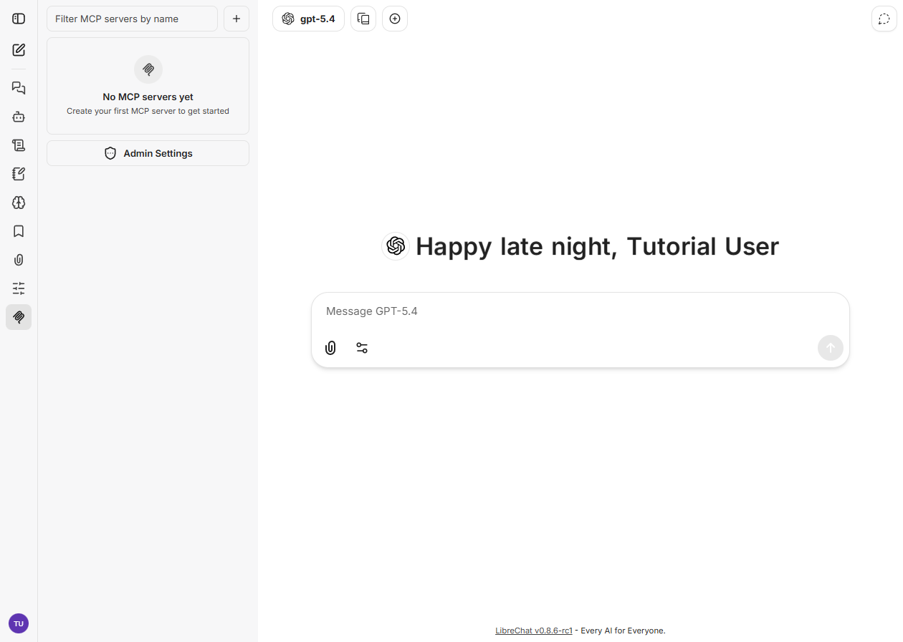

実行イメージ（mcp connected）:

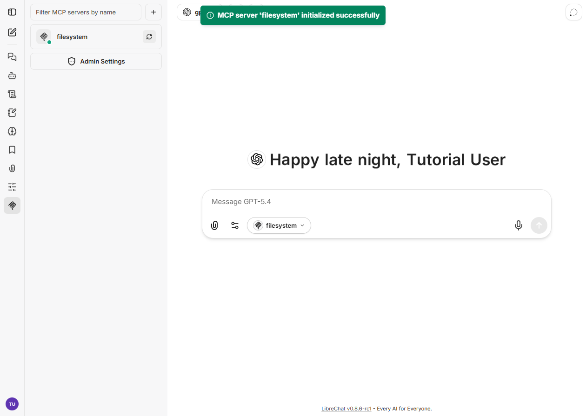

実行イメージ（toolcall output）:

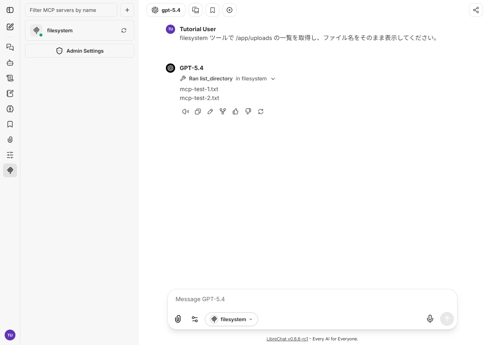

確認ポイント:

- 通常チャット疎通と、外部連携を伴う価値確認を分けて説明できる
- 08 の採用画像が MCP 接続状態の説明に使える
- 09 の採用画像が Tool Call 実行結果または失敗理由の説明に使える
- 09 で `(No response)` が出る場合は、まず `uploads` 配下にテストファイルを置いて再実行し、結果差分を記録できる

#### 6. 基本機能の完了判定（最低ライン）

- 管理画面へアクセスできる
- プロバイダ経由で応答が返る
- 会話履歴が保持される
- Tool Call / MCP を使う構成では、外部連携の実行結果または失敗理由が追跡できる

#### 7. 停止・再開（検証用）

```powershell
docker compose stop
docker compose start
docker compose down
```

使い分け:

- `docker compose stop`: コンテナだけ停止します。次回は `docker compose start` で高速に再開できます。
- `docker compose down`: コンテナ停止に加えて、Compose 管理のネットワークも削除します。次回は `docker compose up -d` で再作成して起動します。
- データも初期化したい場合: `docker compose down -v`（ボリューム削除）

### 検証

- コマンドがエラーなく完了する
- 想定した出力（画面表示・ファイル生成・回答）を確認できる
- 変更した設定に応じて結果差分を説明できる

## 演習課題

1. OpenAI と Ollama の 2 つを接続候補として整理し、運用時の選定条件をまとめてください。
2. `.env` の 1 項目を変更し、挙動差分を `run-log.txt` に記録してください。
3. Open WebUI との違いを UI 観点・運用観点・外部連携観点で比較してください。

### 解答の目安

1. まず課題の目的を一文で明確化し、入力・出力を対応づけて記述します。
   確認ポイント: 何を変えて何を確認する課題かを第三者が読んで理解できること。
2. 最小構成で一度実行し、設定や条件を1つ変更して差分を比較します。
   確認ポイント: 変更前後の挙動差を具体的に説明できること。
3. 適用条件と代替手段を整理し、選択基準を短くまとめます。
   確認ポイント: なぜその手段を選ぶかを根拠付きで示せること。

## 理解度チェック

1. LibreChat の主な役割を 1 文で説明してください。
2. 複数 Provider 対応のメリットと注意点は何ですか？
3. LibreChat で通常チャット確認と Tool Call / MCP 確認を分けて考える理由は何ですか？
4. LibreChat が向かないユースケースを 1 つ挙げて理由を述べてください。

### 解説の要点

1. 主な役割は、その技術がどの工程を担い、何を改善するかで説明します。
2. メリットは再現性・拡張性・運用性の観点で整理し、注意点は導入コストや複雑性として示します。
3. 使い分けは要件、実装コスト、運用体制の3観点で判断します。

## 補足

**Q. 起動後に 502/503 が出ます。**  
A. 初回は依存コンテナの起動に時間がかかります。`docker compose logs --tail 120` を確認し、数分待って再読込してください。

**Q. モデル一覧が空です。**  
A. `.env` の API キー設定が未完了の可能性があります。Provider のキーを設定して `docker compose up -d` を再実行してください。

**Q. 05 と 06 の違いが分かりにくいです。**  
A. 05 は送信前入力、06 は送信後結果です。Tool Call / MCP を使う構成では、06 に少なくとも実行結果、ツール名、失敗理由のいずれかが見える必要があります。

**Q. Tool Call / MCP まで必ず確認すべきですか。**  
A. LibreChat の選定価値を確認する観点では優先度が高いです。通常チャットだけでも最小起動は確認できますが、本教材では外部連携まで確認できる証跡を優先採用します。

**Q. filesystem の Tool Call で `(No response)` が出ます。**  
A. MCP 接続自体は成功していても、対象ディレクトリが空だと応答本文が空になる場合があります。`uploads` 配下にサンプルファイルを作成して再実行し、`[FILE] ...` の出力が返ることを確認してください。

**Q. ポート 3080 が使えません。**  
A. `.env` の `PORT` を別番号に変更し、再起動してください。

## 参考リンク

- [LibreChat 公式ドキュメント](https://www.librechat.ai/)
- [LibreChat GitHub リポジトリ](https://github.com/danny-avila/LibreChat)

---

[← 前へ](03-flowise.md) | [次へ →](05-chatbot-ui.md)
