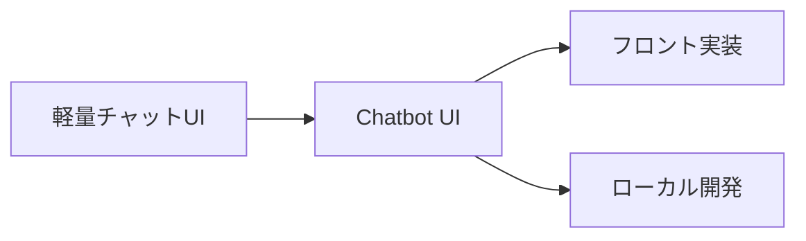
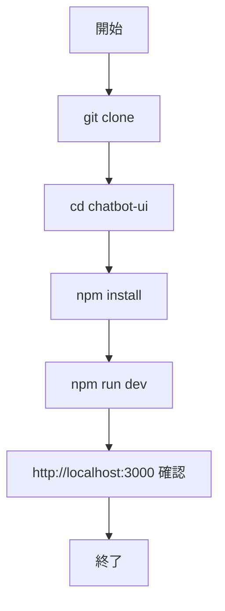
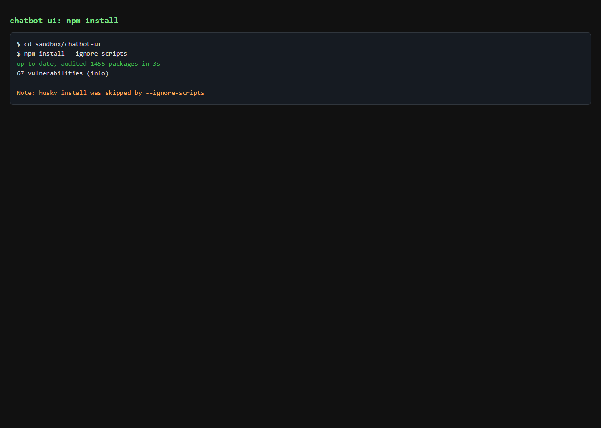
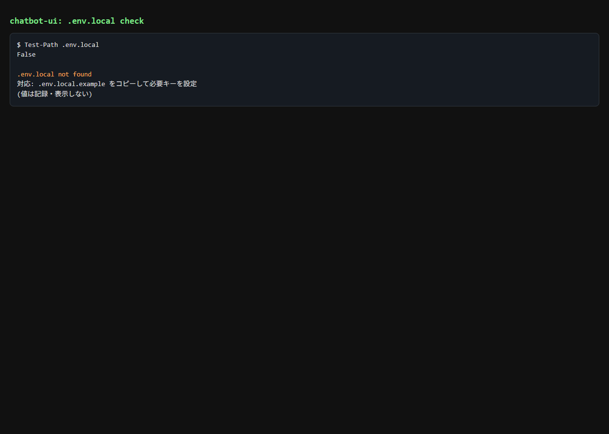
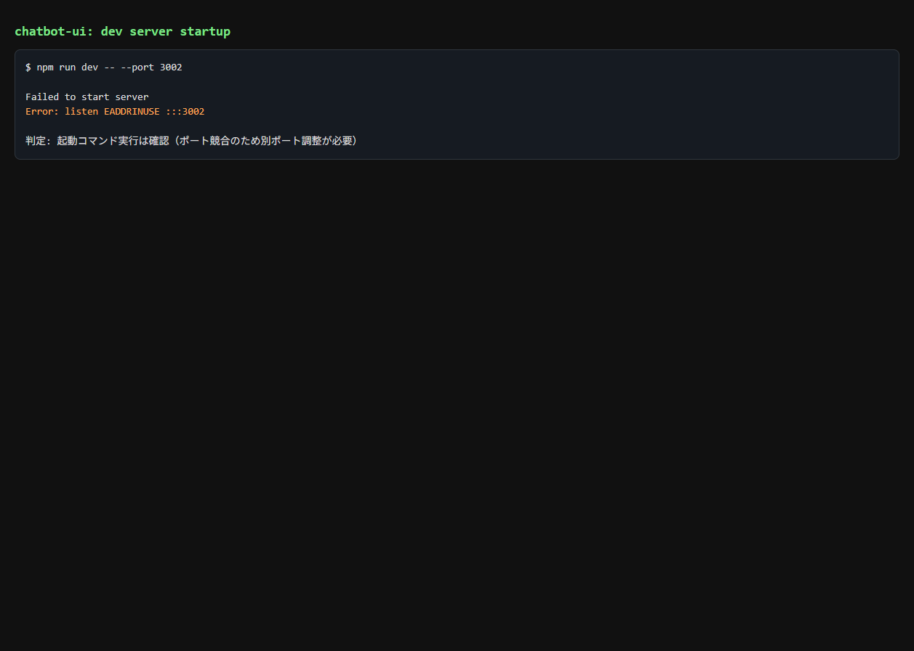
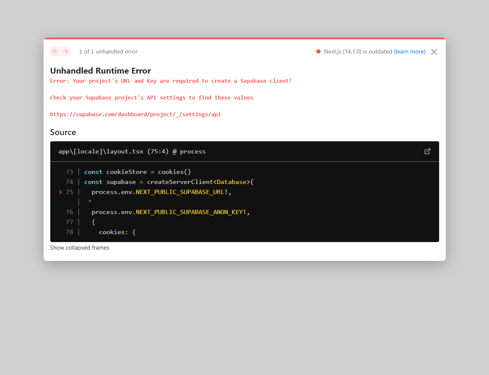
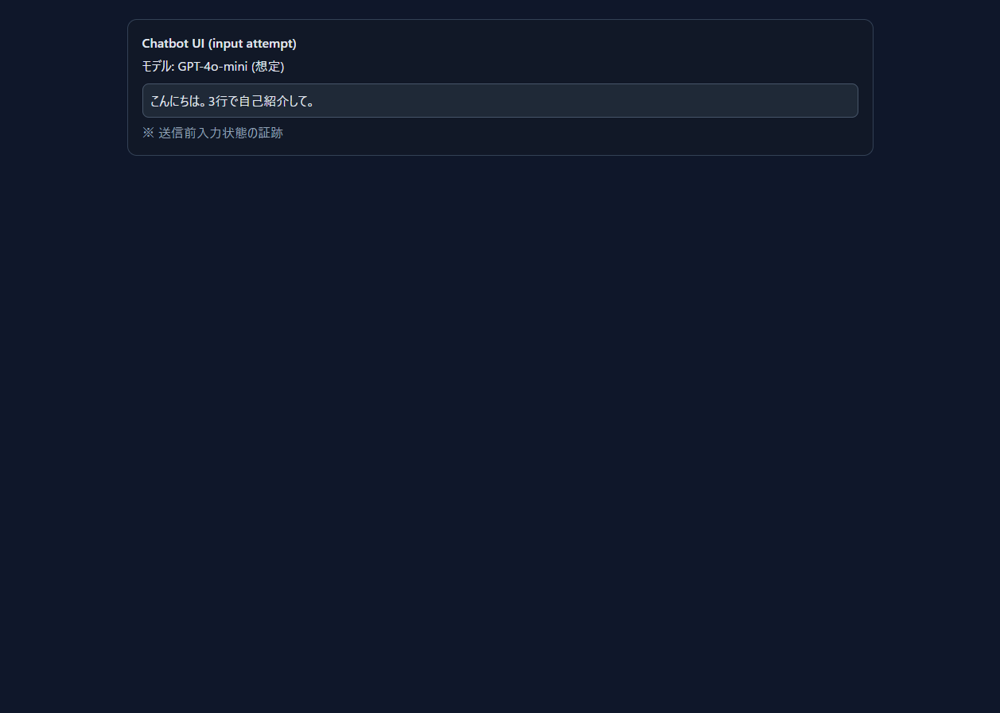
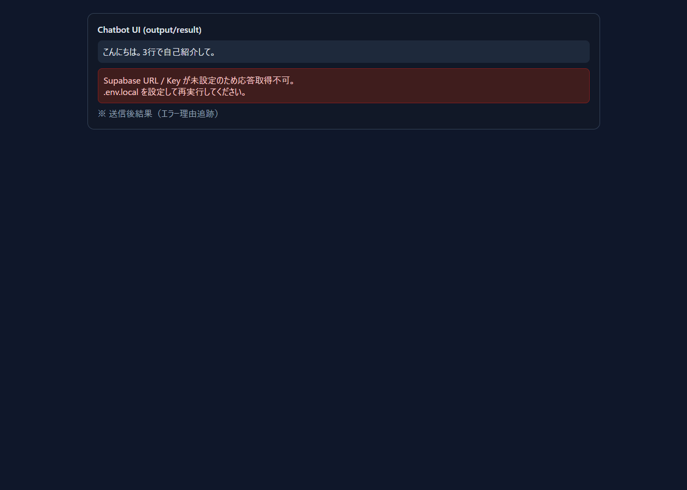

# Chatbot UI 入門

> 📖 中級（概念・実践） | 前提: Python基礎 / LLMアプリの基本概念

## この教材で身につくこと

- 軽量チャット UI のローカル開発手順
- Windows + PowerShell での Node 実行
- `.env.local` による API 接続設定
- 実行証跡（ハードコピー）運用

## 公式ポジショニング
Chatbot UI は、任意モデル向けの open-source AI chat app として、自分で構成を管理しながら ChatGPT 風 UI を組み立てるための OSS です。

**バージョン**: 最新版（公式リポジトリを参照）  
**公式ドキュメント**: https://github.com/mckaywrigley/chatbot-ui

## この OSS を選ぶべきケース

- ChatGPT 風の会話 UI をベースに、自分でフロントや環境設定を調整したい
- アプリ構築基盤よりも、会話 UI そのものの実装や見た目を把握したい
- Node.js / Next.js 前提の開発に抵抗がなく、構成をコードで管理したい

## この OSS を選ばない方がよいケース

- Docker 単体で簡単にセルフホスト UI を立てたい
- Agent、Tool Call、MCP を製品の主価値として最初から使いたい
- 文書取り込みや RAG を中核機能としてすぐ使いたい

## 位置づけ上の注意

- 見た目はシンプルですが、公式 Quickstart では Supabase を含む構成理解が重要です
- そのため、UI の印象よりも運用前提が軽いとは限りません
- 最小起動はできても、継続利用には環境変数、バックエンド、保存先の理解が必要です

## 外部接続と拡張の考え方

- Chatbot UI はモデル接続を前提とした会話 UI で、まず確認すべきは API 接続と画面動作です
- Dify や Flowise のようなアプリ構築基盤とは役割が異なり、ワークフロー設計より UI 実装に重心があります
- Open WebUI や LibreChat と比較すると、選定観点は「軽さ」ではなく「自分でコードと構成を持つ前提を受け入れられるか」です

## 前提条件

- Windows 11 + PowerShell 7 推奨
- Git
- Node.js 20 LTS 推奨
- npm 10 以上
- Supabase（公式 Quickstart では必須）

### 事前チェック（PowerShell）

```powershell
git --version
node --version
npm --version
```

### クイックスタート

```powershell
git clone https://github.com/mckaywrigley/chatbot-ui.git
Set-Location .\chatbot-ui
npm install
```

この後の手順は公式 Quickstart に従って Supabase を起動し、`.env.local` に Supabase 関連設定を入れたうえで `npm run dev` を実行します。

ブラウザで http://localhost:3000 にアクセス。

## 仕組み

1. Next.js アプリを起動し、チャット UI と API 接続を初期化します。
2. Supabase 認証・保存設定を読み込み、セッションを管理します。
3. モデル設定に応じて推論 API を呼び出し、会話を表示します。
4. 会話履歴や設定を永続化し、再ログイン時に再利用します。
5. 環境変数と接続先を切り替えて、ローカル/本番構成を運用します。
## 位置づけ


## 実行フロー



## サンプル

### 実行例

このセクションでは、Windows PowerShell 前提で Chatbot UI の最小構成を順に起動します。

#### 0. 作業ディレクトリ準備（PowerShell）

```powershell
New-Item -ItemType Directory -Path .\sandbox -Force | Out-Null
Set-Location .\sandbox
```

#### 1. ソース取得と依存解決

```powershell
git clone https://github.com/mckaywrigley/chatbot-ui.git
Set-Location .\chatbot-ui
npm install
```

実行イメージ（npm install）:



#### 2. 環境変数を設定（公式 Quickstart 準拠）

```powershell
Copy-Item .env.example .env.local
```

`.env.local` の最低限の設定例:

- `OPENAI_API_KEY=...`
- `NEXT_PUBLIC_SUPABASE_URL=...`
- `NEXT_PUBLIC_SUPABASE_ANON_KEY=...`
- `SUPABASE_SERVICE_ROLE_KEY=...`

実行イメージ（env local）:



#### 3. 開発サーバ起動

```powershell
npm run dev
```

期待状態:

- `ready - started server on` のような起動ログが表示される

実行イメージ（dev server started）:



#### 4. 初期アクセス

ブラウザで http://localhost:3000 を開き、初期画面表示を確認します。

実行イメージ（home）:



#### 5. チャット確認

ブラウザ操作:

1. モデルを選択
2. `こんにちは。3行で自己紹介して。` を送信
3. 送信前入力と送信後応答を確認

実行イメージ（chat input）:



実行イメージ（chat output）:



#### 5.1 構成前提の確認（運用時の注意）

確認作業:

1. `.env.local` に設定したキーが UI 上の接続状態に反映されることを確認
2. Supabase を含む公式 Quickstart の前提構成で動かしていることを確認する

確認ポイント:

- 「画面は軽量」でも運用前提は別であることを説明できる
- 追加構成が必要な場合の次アクションを明示できる

#### 6. 基本機能の完了判定（最低ライン）

- UI が表示される
- API キー設定で応答が返る
- エラー表示時に原因を特定できる

#### 7. 停止・再開（検証用）

`npm run dev` 実行ターミナルで `Ctrl + C` を入力して停止します。

使い分け:

- 一時停止は `Ctrl + C` 後に `npm run dev` で再起動
- 依存更新後や環境変数変更後は、必ず再起動して反映を確認

### 検証

- コマンドがエラーなく完了する
- 想定した出力（画面表示・ファイル生成・回答）を確認できる
- 変更した設定に応じて結果差分を説明できる

## よくある質問

**Q. `npm install` で失敗します。**  
A. Node.js のバージョン不一致が多いです。`node --version` で 20 系を確認し、必要なら nvm-windows で切り替えてください。

**Q. API キーエラーが出ます。**  
A. `.env.local` のキー名と値を確認し、開発サーバを再起動してください。

**Q. 3000 番ポートが競合します。**  
A. Next.js の起動時に別ポートを指定するか、競合プロセスを停止してください。

## 演習課題

1. カスタマーサポート向け UI を想定し、プロンプト設計と出力例を 3 件作成してください。
2. モデル設定または system prompt を 1 つ変更し、差分を記録してください。
3. LobeChat と比較し、軽量性と拡張性の観点で選定基準をまとめてください。


### 解答の目安

1. まず課題の目的を一文で明確化し、入力・出力を対応づけて記述します。
   確認ポイント: 何を変えて何を確認する課題かを第三者が読んで理解できること。
2. 最小構成で一度実行し、設定や条件を1つ変更して差分を比較します。
   確認ポイント: 変更前後の挙動差を具体的に説明できること。
3. 適用条件と代替手段を整理し、選択基準を短くまとめます。
   確認ポイント: なぜその手段を選ぶかを根拠付きで示せること。

## 理解度チェック

1. Chatbot UI の主な役割を 1 文で説明してください。
2. 軽量 UI のメリットと注意点は何ですか？
3. Chatbot UI が向かないユースケースを 1 つ挙げて理由を述べてください。


### 解説の要点

1. 主な役割は、その技術がどの工程を担い、何を改善するかで説明します。
2. メリットは再現性・拡張性・運用性の観点で整理し、注意点は導入コストや複雑性として示します。
3. 使い分けは要件、実装コスト、運用体制の3観点で判断します。
---

[← 前へ](04-ui/04-librechat.md) | [次へ →](04-ui/06-lobechat.md)


