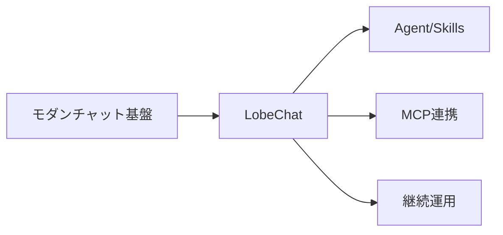
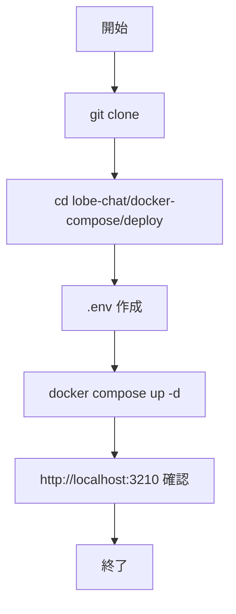

# LobeChat - Agent・MCP 対応モダンチャット基盤

> 📖 中級（概念・実践） | 前提: Python基礎 / LLMアプリの基本概念

## この教材で身につくこと

- Windows + PowerShell での最小セットアップを実行できる
- `.env` による Provider 設定を理解して適用できる
- チャット応答と Agent/Skills/MCP の動作を確認できる
- LobeChat を選ぶ判断基準を Chatbot UI など他ツールと比較して述べられる

## 概要

**LobeChat** は、Agent・Skills・MCP・Memory を扱える OSS チャット基盤です。モダンな UI で、拡張しながら継続利用する体験に向いています。

**公式ドキュメント**: https://lobechat.com/

### 主な特徴

- Agent・Skills・MCP・Memory を統合したモダン UI
- Docker Compose による容易なセルフホスト
- OpenAI など複数 Provider に対応
- 継続的な拡張・運用に向いた設計

### この OSS を選ぶべきケース

- Agent を中心に使いたい
- Skills / MCP で機能を拡張したい
- UI/UX を重視して継続運用したい

### この OSS を選ばない方がよいケース

- 軽量な最小チャットだけを最短で試したい
- ノードベースのワークフロー設計を主目的にしている

## 位置づけ

この例では、LobeChat - Agent・MCP 対応モダンチャット基盤 の基本的な利用手順を示します。サンプルコードの意図と、実行時に何が起こるのかを確認しながら読み進めると理解しやすくなります。



LobeChat は、Agent・Skills・MCP を統合したモダンな UI でセルフホスト運用できるチャット基盤です。まずは基本チャット確認、次に Provider 設定、最後に Agent/MCP 拡張へ進むと理解しやすくなります。

## 実行フロー



処理の流れ:

1. リポジトリを取得し、Docker Compose 設定ファイルを配置します。
2. `.env` に Provider API キーと認証用シークレット値を設定します。
3. `docker compose up -d` でコンテナを起動します。
4. ブラウザで http://localhost:3210 にアクセスし、チャット応答を確認します。
5. Agent または Skills/MCP メニューの表示を確認します。

## 最小セットアップ

### 前提条件

- Windows 11
- PowerShell 7
- Git
- Docker Desktop（Compose v2）

### 事前チェック（PowerShell）

```powershell
git --version
docker --version
docker compose version
```

### クイックスタート

```powershell
git clone https://github.com/lobehub/lobe-chat.git
Set-Location .\lobe-chat\docker-compose\deploy
Copy-Item .env.example .env
docker compose up -d
docker compose ps
```

ブラウザで http://localhost:3210 にアクセスします。

`.env` の最低限設定例:

- `OPENAI_API_KEY=...`
- `BETTER_AUTH_SECRET=<32文字以上のランダム値>`
- `AUTH_SECRET=<ランダム値>`
- `KEY_VAULTS_SECRET=<ランダム値>`

### セキュリティ注意（必読）

- 秘密値は教材本文に直接書かず、ローカル端末側で設定する
- 古いガイドの `NEXTAUTH_SKIP_ENV_VALIDATION` 追加は行わない
- `.env` は Git にコミットしない（`.gitignore` に含める）

## 実ソースコード

### 画面イメージ（この順で確認）

1. 初期画面（または `/signin` 到達）


2. チャット入力前（未送信）


3. 同一スレッドの送信後応答


4. Agent / 拡張メニューの可視状態


5. Skills または MCP の可視状態


### 完了判定（最低ライン）

- 初期画面（または `/signin`）に到達できる
- 1往復以上のチャット応答が返る
- Agent または Skills/MCP の表示を確認できる

### 停止・再開（検証用）

```powershell
docker compose stop
docker compose start
docker compose down
```

使い分け:

- `docker compose stop`: コンテナだけ停止し、`docker compose start` で高速再開
- `docker compose down`: コンテナ停止 + ネットワーク削除
- データ初期化も必要な場合: `docker compose down -v`

## 演習課題

1. 1つの業務ユースケースを定義し、必要なプロンプトと期待出力を整理してください。
2. モデルまたは system prompt を 1 つ変更し、回答差分を記録してください。
3. Chatbot UI と比較し、LobeChat を選ぶ基準を 3 点でまとめてください。

### 解答の目安

1. まず課題の目的を一文で明確化し、入力・出力を対応づけて記述します。
   確認ポイント: 何を変えて何を確認する課題かを第三者が読んで理解できること。
2. 最小構成で一度実行し、設定や条件を1つ変更して差分を比較します。
   確認ポイント: 変更前後の挙動差を具体的に説明できること。
3. 適用条件と代替手段を整理し、選択基準を短くまとめます。
   確認ポイント: なぜその手段を選ぶかを根拠付きで示せること。

## 理解度チェック

1. LobeChat の主な役割を 1 文で説明してください。
2. モダン UI を採用するメリットと注意点は何ですか？
3. LobeChat が向かないユースケースを 1 つ挙げて理由を述べてください。

### 解説の要点

1. 主な役割は、その技術がどの工程を担い、何を改善するかで説明します。
2. メリットは再現性・拡張性・運用性の観点で整理し、注意点は導入コストや複雑性として示します。
3. 使い分けは要件、実装コスト、運用体制の3観点で判断します。

## 参考リンク

- [LobeChat 公式サイト](https://lobechat.com/)
- [LobeChat GitHub リポジトリ](https://github.com/lobehub/lobe-chat)

---

[← 前へ](05-chatbot-ui.md) | [次へ →](07-anythingllm.md)
