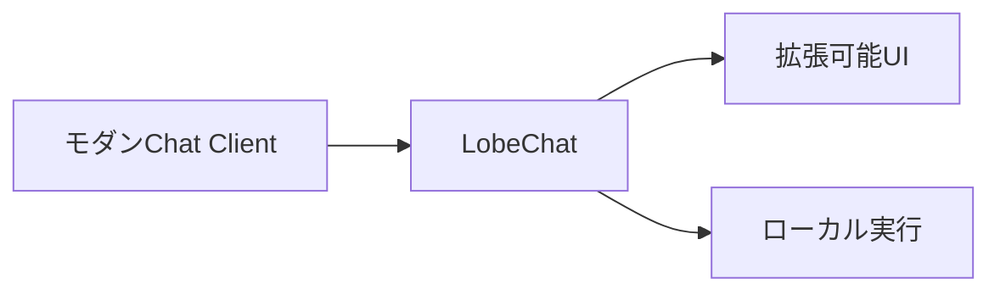
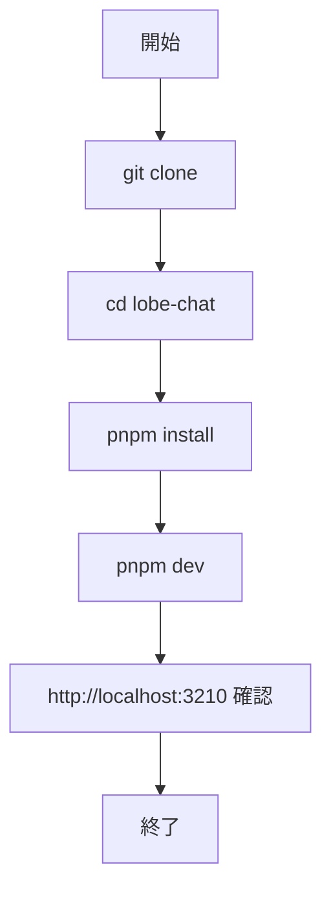
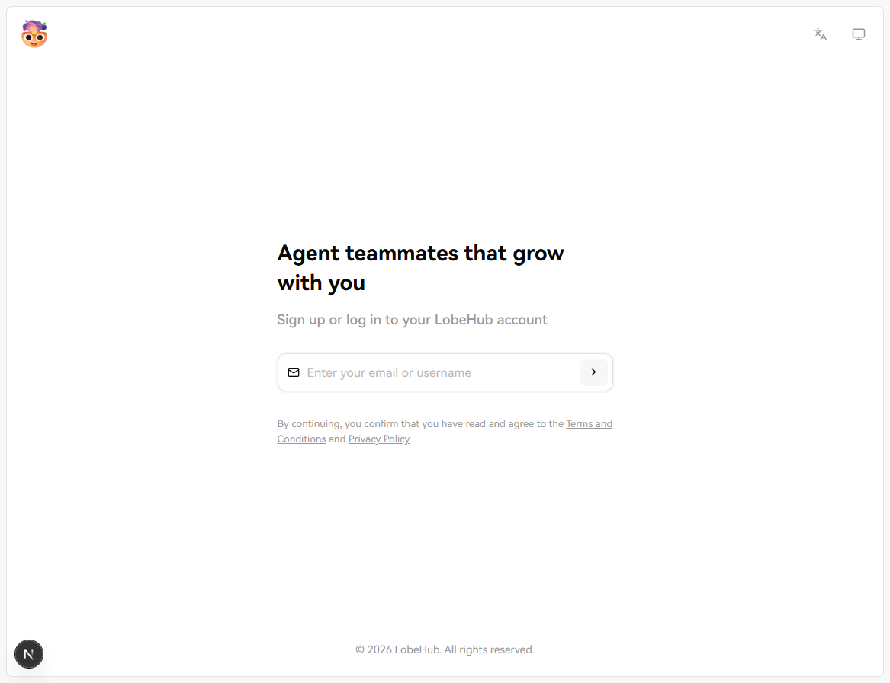
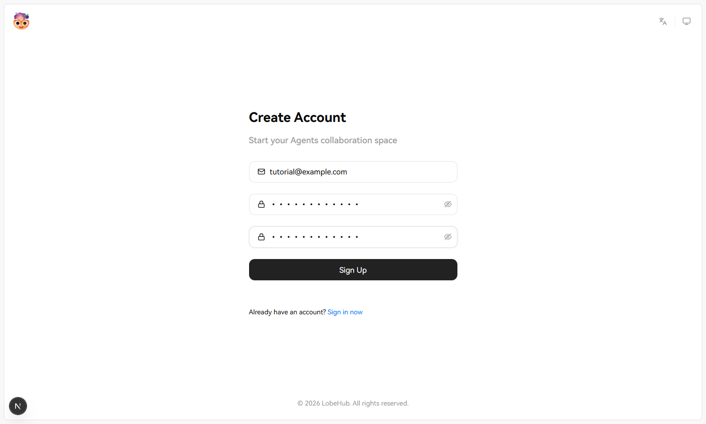

# LobeChat 入門

> 📖 中級（概念・実践） | 前提: Python基礎 / LLMアプリの基本概念

## この教材で身につくこと

- モダンなチャット UI のセットアップ手順
- Windows + PowerShell での pnpm 実行
- `.env.local` による Provider 設定
- 実行証跡（ハードコピー）運用

## 公式ポジショニング
LobeChat は、Agent、Skills、MCP、Memory を扱える collaborative agent platform として、モダンな操作体験の上で AI 活用を進めるための OSS です。

**バージョン**: 最新版 / OSS準拠（2026-05時点）  
**公式ドキュメント**: https://lobechat.com/

## この OSS を選ぶべきケース

- Agent を中心に据えた操作体験を重視したい
- Skills や MCP を組み合わせて、拡張しながら使いたい
- チャット UI の見た目だけでなく、継続的な Agent 活用や協働を意識している
- モダンな UI/UX を維持しつつ、複数モデルや外部接続へ広げたい

## この OSS を選ばない方がよいケース

- 最小構成の軽いチャット UI を短時間で立ち上げたい
- ノードベースのワークフロー設計を主目的とする
- 文書取り込み中心の private-first 運用を最優先にしたい

## LibreChat との見分け方

- LibreChat は統合 AI 会話基盤として Provider、Tool Call、MCP、認証を広く扱う方向が強いです
- LobeChat は Agent 活用、Skills、Memory、操作体験を前面に出している点が特徴です
- 選定時は、外部連携の統合基盤を重視するか、Agent を日常的に使う体験を重視するかで判断します

## 前提条件

### 前提条件

- Windows 11 + PowerShell 7 推奨
- Git
- Node.js 20 LTS 推奨
- pnpm 9 以上

### 事前チェック（PowerShell）

```powershell
git --version
node --version
pnpm --version
```

`pnpm` が未導入の場合:

```powershell
npm install -g pnpm@latest
```

### クイックスタート

```powershell
git clone https://github.com/lobehub/lobe-chat.git
Set-Location .\lobe-chat
pnpm install
pnpm dev
```

ブラウザで http://localhost:3210 にアクセス。

## 仕組み

1. 目的と入力を定義し、対象データや利用モデルを準備します。
2. コア処理（検索・推論・生成・検証のいずれか）を実行します。
3. 実行結果を保存または表示し、次工程に渡せる形式へ整えます。
4. パラメータを調整して挙動差分を比較し、品質を確認します。
5. 運用を想定して再実行手順と確認ポイントを定着させます。
## 位置づけ


## 実行フロー



## サンプル

### 実行例

このセクションでは、Windows PowerShell 前提で LobeChat の最小構成を順に起動します。

#### 0. 作業ディレクトリ準備（PowerShell）

```powershell
New-Item -ItemType Directory -Path .\sandbox -Force | Out-Null
Set-Location .\sandbox
```

#### 1. ソース取得と依存解決

```powershell
git clone https://github.com/lobehub/lobe-chat.git
Set-Location .\lobe-chat
pnpm install
```

実行イメージ（pnpm install）:


#### 2. 環境変数を設定

```powershell
Copy-Item .env.example .env.local
```

`.env.local` の最低限の設定例:

- `OPENAI_API_KEY=...`

実行イメージ（env local）:


#### 3. 開発サーバ起動

```powershell
pnpm dev
```

期待状態:

- 起動ログに `ready` が表示される

実行イメージ（dev server started）:


#### 4. 初期アクセス

ブラウザで http://localhost:3210 を開き、初期画面表示を確認します。

実行イメージ（home）:



#### 5. チャット確認

ブラウザ操作:

1. モデルを選択
2. `こんにちは。3行で自己紹介して。` を送信
3. 送信前入力と送信後応答を確認

実行イメージ（chat input）:



実行イメージ（chat output）:


#### 5.1 Agent / Skills / MCP の可視確認

ブラウザ操作:

1. Agent または拡張機能メニューを開き、利用可能な機能が参照できることを確認
2. Skills/MCP を使う構成の場合は、有効化した機能名を `run-log.txt` に記録

確認ポイント:

- 通常チャット確認と、Agent 拡張確認を分けて説明できる
- 後続で Tool/Skill を使う準備状態が画面で確認できる

#### 6. 基本機能の完了判定（最低ライン）

- UI が表示される
- API キー設定で応答が返る
- 設定変更時の差分を説明できる

#### 7. 停止・再開（検証用）

`pnpm dev` 実行ターミナルで `Ctrl + C` を入力して停止します。

使い分け:

- 一時停止は `Ctrl + C` 後に `pnpm dev` で再起動
- 依存更新後や環境変数変更後は、必ず再起動して反映を確認

### 検証

- コマンドがエラーなく完了する
- 想定した出力（画面表示・ファイル生成・回答）を確認できる
- 変更した設定に応じて結果差分を説明できる

## よくある質問

**Q. `pnpm` コマンドが見つかりません。**  
A. `npm install -g pnpm@latest` で導入し、新しいターミナルで再実行してください。

**Q. 起動時に Node バージョン警告が出ます。**  
A. `node --version` を確認し、20 系 LTS に合わせてください。

**Q. API キー設定が反映されません。**  
A. `.env.local` の編集後に `pnpm dev` を再起動してください。

## 演習課題

1. 1つの業務ユースケースを定義し、必要なプロンプトと期待出力を整理してください。
2. モデルまたは system prompt を変更し、回答差分を記録してください。
3. Chatbot UI と比較し、LobeChat を選ぶ基準を 3 点でまとめてください。


### 解答の目安

1. まず課題の目的を一文で明確化し、入力・出力を対応づけて記述します。
   確認ポイント: 何を変えて何を確認する課題かを第三者が読んで理解できること。
2. 最小構成で一度実行し、設定や条件を1つ変更して差分を比較します。
   確認ポイント: 変更前後の挙動差を具体的に説明できること。
3. 適用条件と代替手段を整理し、選択基準を短くまとめます。
   確認ポイント: なぜその手段を選ぶかを根拠付きで示せること。

## 理解度チェック

1. LobeChat の主な役割を 1 文で説明してください。
2. モダン UI を採用するメリットと注意点は何ですか？
3. LobeChat が向かないユースケースを 1 つ挙げて理由を述べてください。


### 解説の要点

1. 主な役割は、その技術がどの工程を担い、何を改善するかで説明します。
2. メリットは再現性・拡張性・運用性の観点で整理し、注意点は導入コストや複雑性として示します。
3. 使い分けは要件、実装コスト、運用体制の3観点で判断します。
---

[← 前へ](04-ui/05-chatbot-ui.md) | [次へ →](04-ui/07-anythingllm.md)


