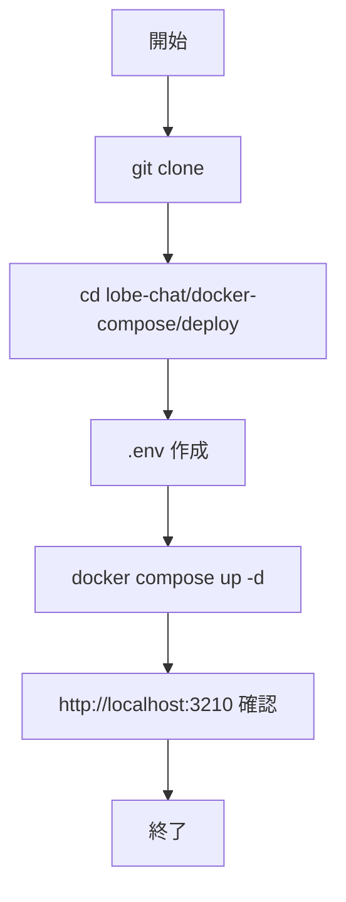
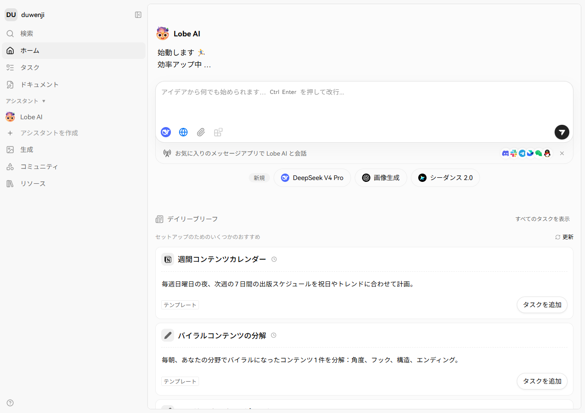
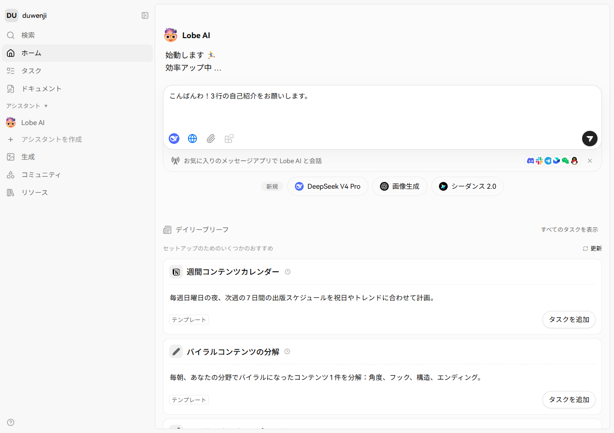
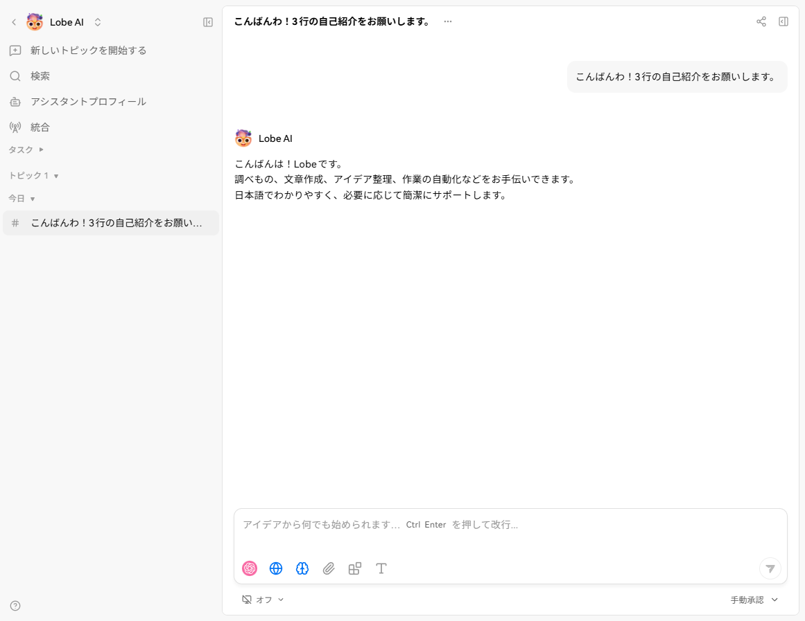
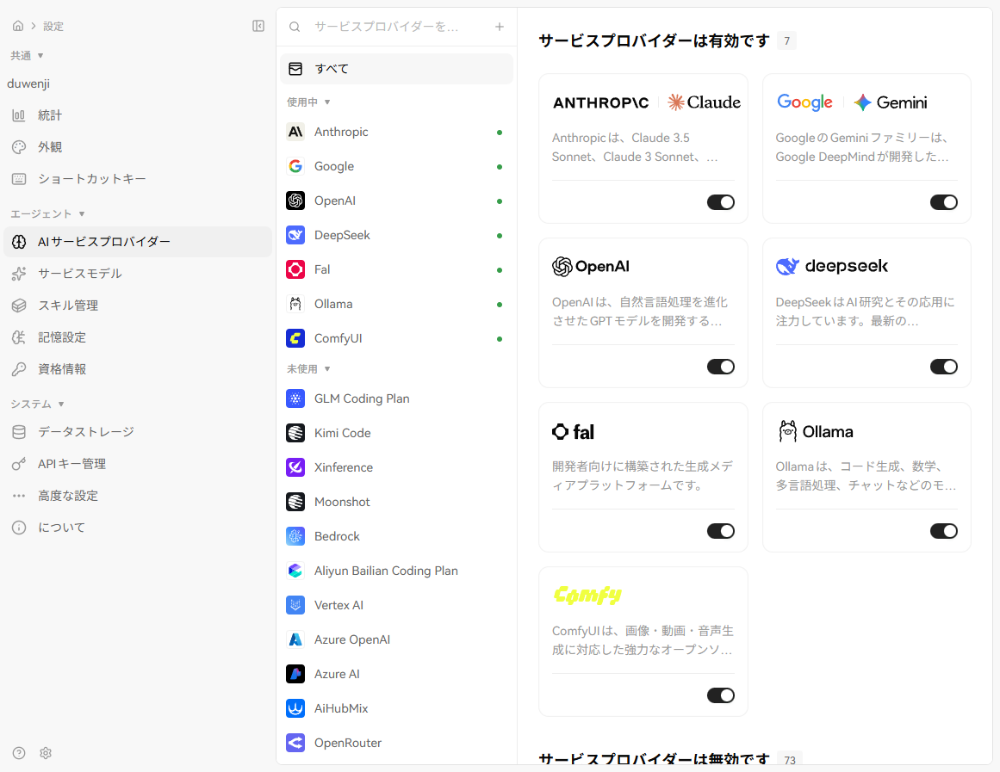
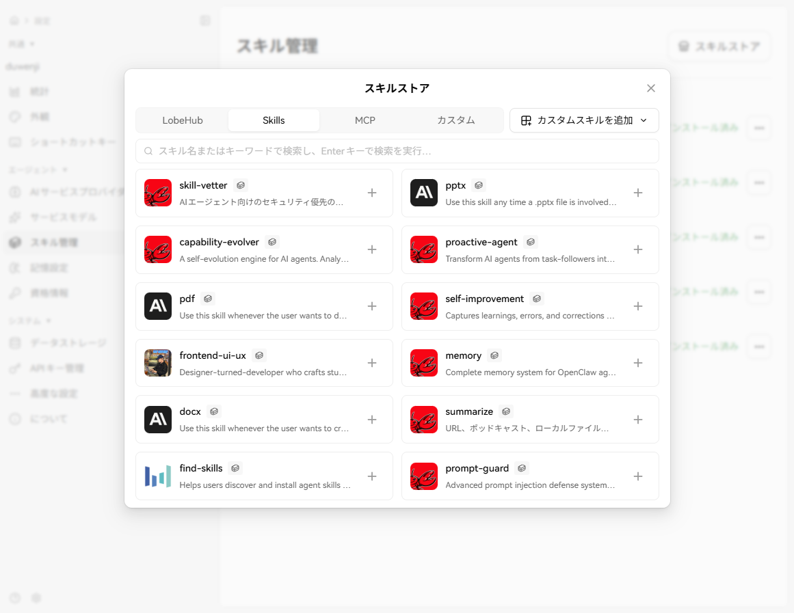

# LobeChat 入門

> 📖 中級（概念・実践） | 前提: Python基礎 / LLMアプリの基本概念

## この教材で身につくこと

- Windows + PowerShell での最小セットアップ
- `.env` による Provider 設定
- チャット応答と Agent/Skills/MCP の確認

## LobeChat の位置づけ

LobeChat は、Agent・Skills・MCP・Memory を扱える OSS チャット基盤です。  
モダンな UI で、拡張しながら継続利用する体験に向いています。

**公式ドキュメント**: https://lobechat.com/

## 選定の目安

向いているケース:

- Agent を中心に使いたい
- Skills / MCP で機能を拡張したい
- UI/UX を重視して継続運用したい

向かないケース:

- 軽量な最小チャットだけを最短で試したい
- ノードベースのワークフロー設計を主目的にしている

## 前提条件

- Windows 11
- PowerShell 7
- Git
- Docker Desktop（Compose v2）

事前チェック:

```powershell
git --version
docker --version
docker compose version
```

## クイックスタート

```powershell
git clone https://github.com/lobehub/lobe-chat.git
Set-Location .\lobe-chat\docker-compose\deploy
Copy-Item .env.example .env
docker compose up -d
docker compose ps
```

ブラウザで http://localhost:3210 にアクセスします。

`.env` の最低限設定例:

- `OPENAI_API_KEY=...`
- `BETTER_AUTH_SECRET=<32文字以上のランダム値>`
- `AUTH_SECRET=<ランダム値>`
- `KEY_VAULTS_SECRET=<ランダム値>`

注意:

- 秘密値は教材本文に直接書かず、ローカル端末側で設定する
- 古いガイドの `NEXTAUTH_SKIP_ENV_VALIDATION` 追加は行わない

## 実行フロー



## 画面イメージ（この順で確認）

1. 初期画面（または `/signin` 到達）



2. チャット入力前（未送信）



3. 同一スレッドの送信後応答



4. Agent / 拡張メニューの可視状態



5. Skills または MCP の可視状態



## 完了判定（最低ライン）

- 初期画面（または `/signin`）に到達できる
- 1往復以上のチャット応答が返る
- Agent または Skills/MCP の表示を確認できる

## 停止・再開（検証用）

```powershell
docker compose stop
docker compose start
docker compose down
```

使い分け:

- `docker compose stop`: コンテナだけ停止し、`docker compose start` で高速再開
- `docker compose down`: コンテナ停止 + ネットワーク削除
- データ初期化も必要な場合: `docker compose down -v`

## 演習課題

1. 1つの業務ユースケースを定義し、必要なプロンプトと期待出力を整理してください。
2. モデルまたは system prompt を 1 つ変更し、回答差分を記録してください。
3. Chatbot UI と比較し、LobeChat を選ぶ基準を 3 点でまとめてください。

## 理解度チェック

1. LobeChat の主な役割を 1 文で説明してください。
2. モダン UI を採用するメリットと注意点は何ですか？
3. LobeChat が向かないユースケースを 1 つ挙げて理由を述べてください。

---

[← 前へ](04-ui/05-chatbot-ui.md) | [次へ →](04-ui/07-anythingllm.md)