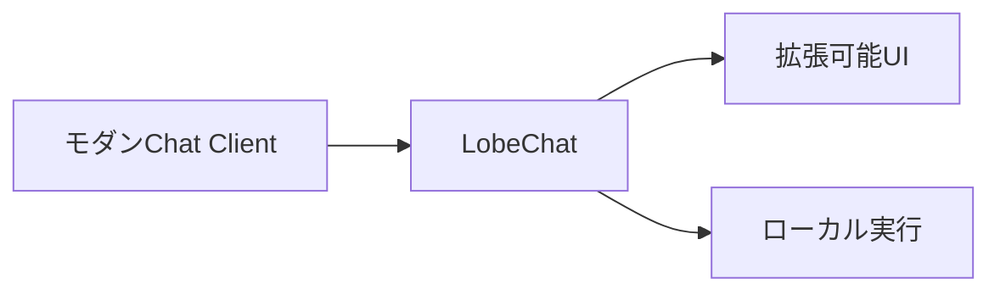
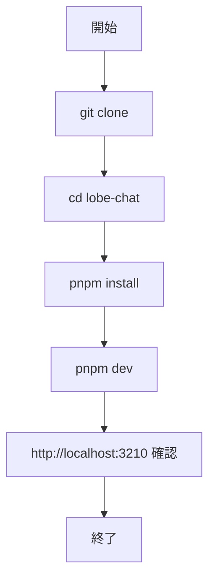

# LobeChat 入門

> 📖 中級（概念・実践） | 前提: Python基礎 / LLMアプリの基本概念

## この教材で身につくこと

- LobeChat 入門 の主な役割と適用場面を説明できる
- LobeChat 入門 を最小構成で動かす手順を実行できる
- 導入時のメリットと注意点を整理できる

## コンセプト
LobeChat はモダンなUIと拡張性を持つチャットクライアントです。
**バージョン**: 最新版 / OSS準拠（2026-05時点）  
**公式ドキュメント**: https://lobechat.com/
## 仕組み

1. 目的と入力を定義し、対象データや利用モデルを準備します。
2. コア処理（検索・推論・生成・検証のいずれか）を実行します。
3. 実行結果を保存または表示し、次工程に渡せる形式へ整えます。
4. パラメータを調整して挙動差分を比較し、品質を確認します。
5. 運用を想定して再実行手順と確認ポイントを定着させます。
## 位置づけ


## 実行フロー



## サンプル

### 実行例

```bash
# この教材の最小構成を順に実行
# 具体的なコマンドは「最小セットアップ」または「実行フロー」を参照
```

### 検証

- コマンドがエラーなく完了する
- 想定した出力（画面表示・ファイル生成・回答）を確認できる
- 変更した設定に応じて結果差分を説明できる

## 実ソースコード（言語別に記載）
### Setup: 00_setup-guide.md

```text
# LobeChat セットアップガイド

git clone https://github.com/lobehub/lobe-chat.git
cd lobe-chat
pnpm install
pnpm dev

http://localhost:3210 を確認します。
```

## 演習課題

1. ``LobeChat 入門`` を使う想定ユースケースを1つ定義し、入力・出力の例を記録してください。
2. 最小構成で動かし、デフォルトから設定を1つ変えて挙動の差分を確認してください。
3. ``LobeChat 入門`` を使わない場合の代替手段と比較し、選ぶ基準をまとめてください。


### 解答の目安

1. まず課題の目的を一文で明確化し、入力・出力を対応づけて記述します。
   確認ポイント: 何を変えて何を確認する課題かを第三者が読んで理解できること。
2. 最小構成で一度実行し、設定や条件を1つ変更して差分を比較します。
   確認ポイント: 変更前後の挙動差を具体的に説明できること。
3. 適用条件と代替手段を整理し、選択基準を短くまとめます。
   確認ポイント: なぜその手段を選ぶかを根拠付きで示せること。

## 理解度チェック

1. ``LobeChat 入門`` の主な役割を1文で説明してください。
2. ``LobeChat 入門`` を導入する際の最大のメリットと注意点は何ですか？
3. ``LobeChat 入門`` が向かないユースケースとして、どのようなケースが考えられますか？


### 解説の要点

1. 主な役割は、その技術がどの工程を担い、何を改善するかで説明します。
2. メリットは再現性・拡張性・運用性の観点で整理し、注意点は導入コストや複雑性として示します。
3. 使い分けは要件、実装コスト、運用体制の3観点で判断します。
---

[← 前へ](04-ui/05-chatbot-ui.md) | [次へ →](04-ui/07-anythingllm.md)


