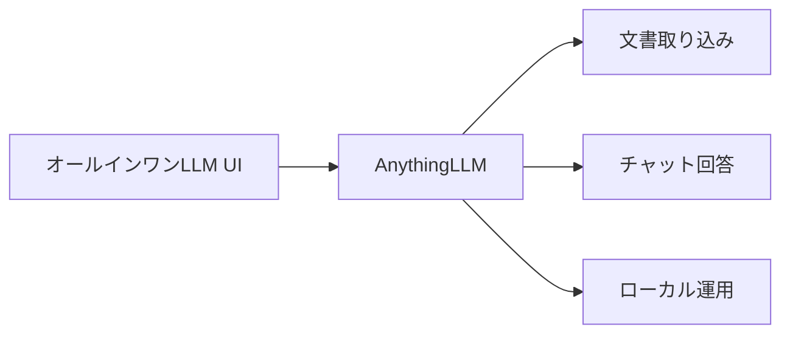
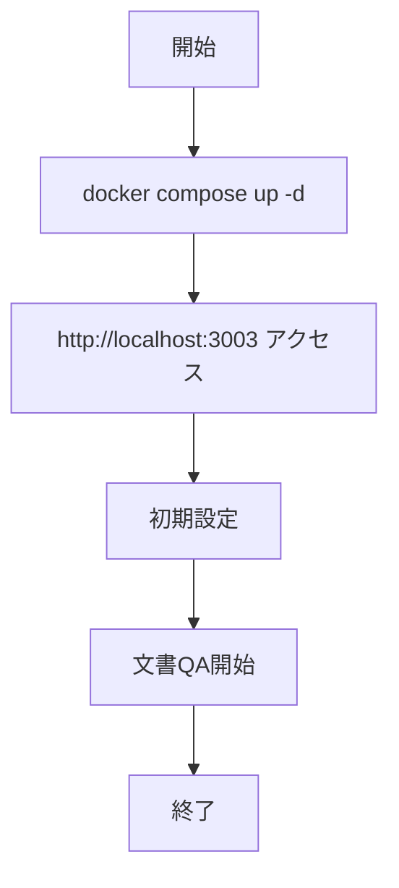
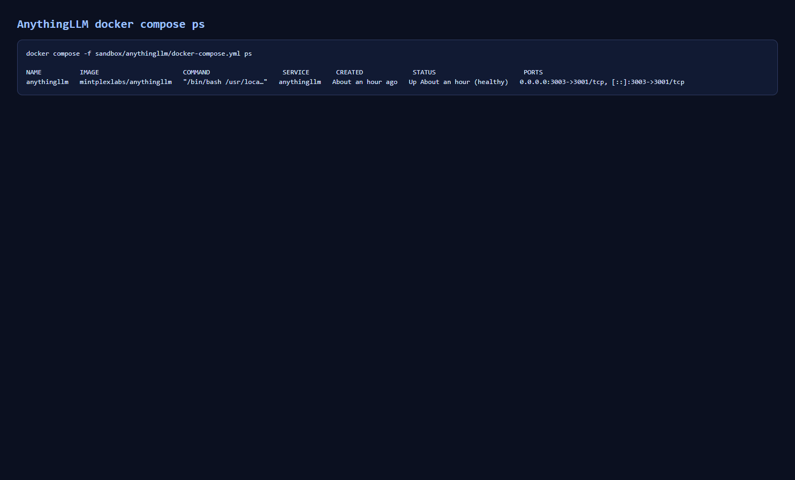
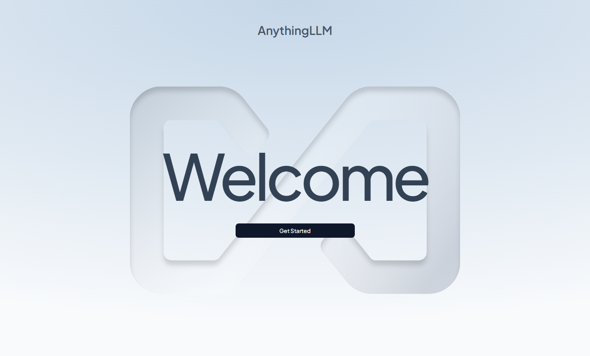
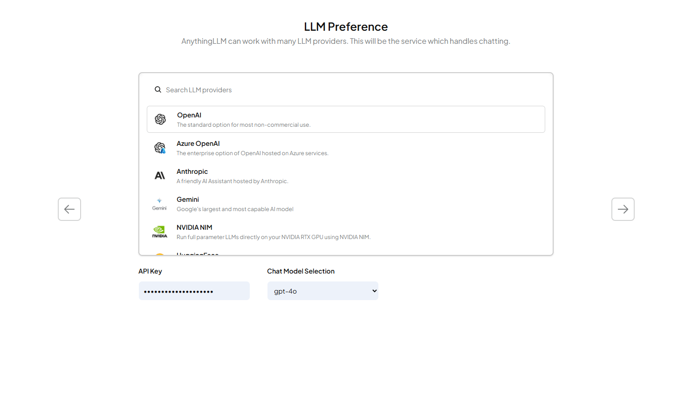
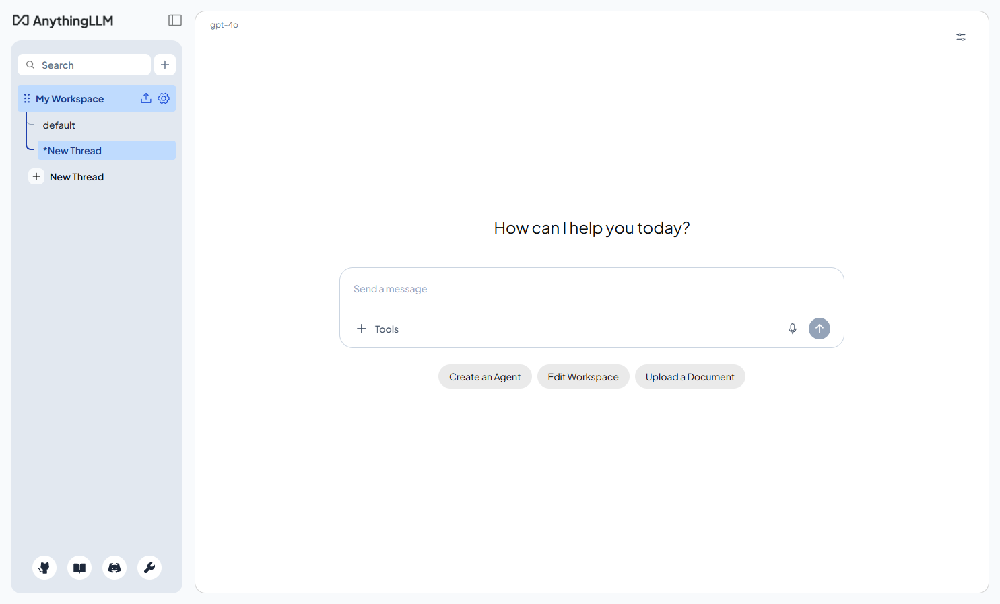
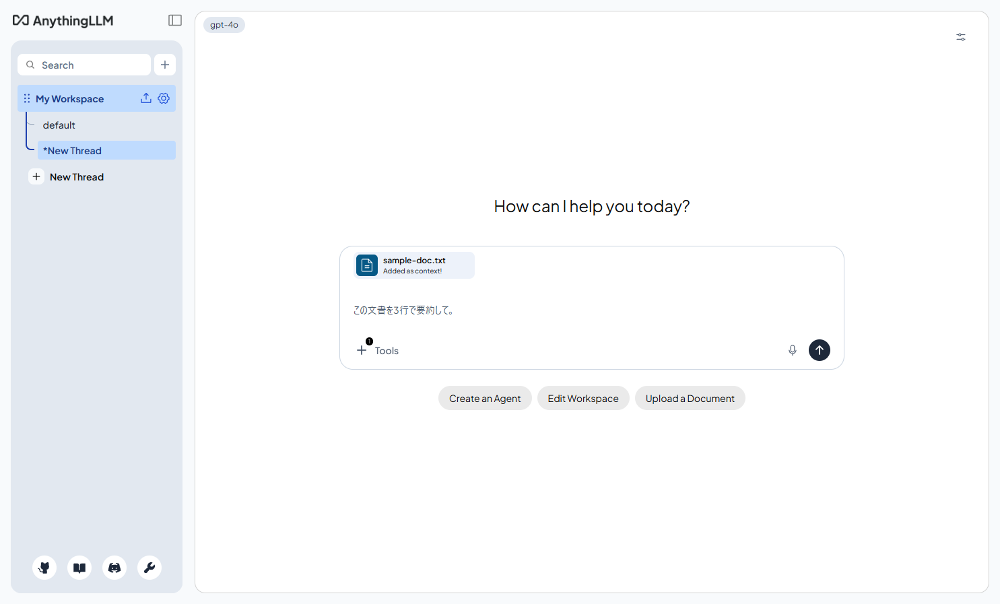
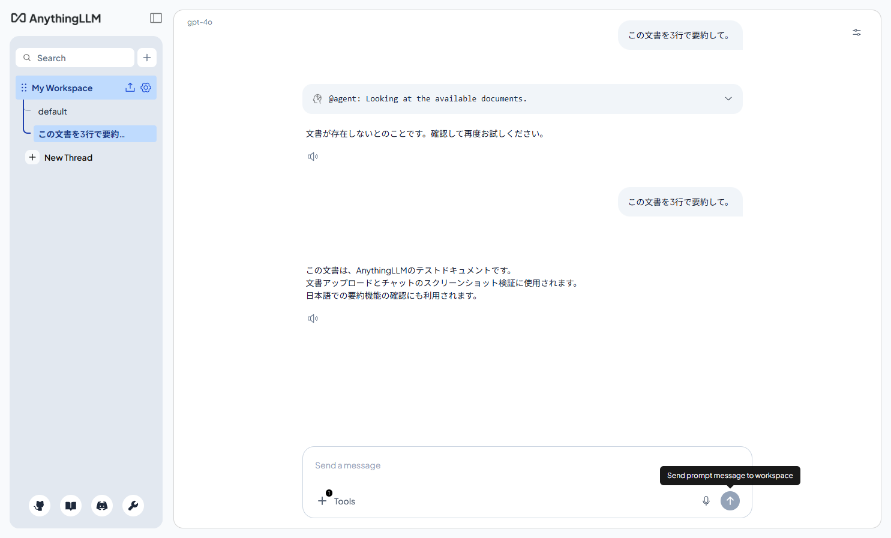

# AnythingLLM - オールインワン文書中心 AI アプリケーション

> 📖 中級（概念・実践） | 前提: Python基礎 / LLMアプリの基本概念

## この教材で身につくこと

- オールインワン型 UI の最小構成を Docker で立ち上げられる
- Windows + PowerShell での Docker 実行手順を説明できる
- LLM Provider とワークスペースの初期設定を実施できる
- 文書をアップロードして RAG チャットの動作を確認できる
- AnythingLLM を選ぶ判断基準を Dify など他ツールと比較して述べられる

## 概要

**AnythingLLM** は、any LLM、any document、any agent を 1 つにまとめ、private-first で使える all-in-one AI application です。

**バージョン**: 最新版 / OSS準拠（2026-05時点）  
**公式ドキュメント**: https://anythingllm.com/

### 主な特徴

- 文書を取り込んでワークスペース単位で管理できる
- OpenAI、Ollama など複数 Provider に対応
- private-first のローカル運用に向いた設計
- チャット、要約、QA を統合したオールインワン UI

### この OSS を選ぶべきケース

- 文書を取り込み、要約、検索、QA をすぐ始めたい
- ローカル優先、private-first の運用を重視したい
- 単なるチャット UI ではなく、ワークスペース単位で文書と会話を管理したい
- 個人利用からチーム利用まで、文書活用を中心に広げたい

### この OSS を選ばない方がよいケース

- ノード接続でワークフローを細かく設計したい
- AI アプリ公開や workflow 配備を主目的とする
- Agent や Tool Call よりも、まずチャット UI の軽さを優先したい

### Dify / Flowise との見分け方

- AnythingLLM はフロー設計よりも、文書を起点にした利用体験を早く作ることに向いています
- Dify や Flowise が構築基盤であるのに対し、AnythingLLM は文書中心の利用基盤として捉えると分かりやすいです
- 選定時は、アプリを作りたいのか、文書と会話の利用環境を整えたいのかで判断します

## 位置づけ

この例では、AnythingLLM - オールインワン文書中心 AI アプリケーション の基本的な利用手順を示します。サンプルコードの意図と、実行時に何が起こるのかを確認しながら読み進めると理解しやすくなります。



AnythingLLM は、文書取り込みから QA・要約まで private-first で一体管理できるオールインワン AI アプリケーションです。まずはワークスペース作成と Provider 設定、次に文書アップロード、最後に文書参照 QA の確認へ進むと理解しやすくなります。

## 実行フロー



処理の流れ:

1. ワークスペースを作成し、文書の保存先を初期化します。
2. Provider を設定して LLM 接続を確立します。
3. 文書を取り込み、埋め込みと検索インデックスを作成します。
4. チャット画面から文書参照付きで質問し、回答を確認します。
5. 取り込み直後の遅延や再送を含めて運用手順を固めます。

## 最小セットアップ

### 前提条件

- Windows 11 + PowerShell 7 推奨
- Docker Desktop（Compose v2 有効）
- メモリ 8GB 以上推奨

### 事前チェック（PowerShell）

```powershell
docker --version
docker compose version
```

### クイックスタート

```powershell
docker compose up -d
```

ブラウザで http://localhost:3003 にアクセス。

### セキュリティ注意（必読）

- APIキーは `.env` で管理し、ソースコードや教材本文に直接書かない
- `.env` は Git にコミットしない（`.gitignore` に含める）
- APIキーを誤って共有した場合は、プロバイダ側で即時ローテーションする

## 実ソースコード

### 実行例

このセクションでは、Windows PowerShell 前提で AnythingLLM の最小構成を順に起動します。

#### 0. 作業ディレクトリ準備（PowerShell）

```powershell
New-Item -ItemType Directory -Path .\sandbox\anythingllm -Force | Out-Null
Set-Location .\sandbox\anythingllm
```

#### 1. docker-compose.yml を作成

```yaml
services:
    anythingllm:
        image: mintplexlabs/anythingllm:latest
        container_name: anythingllm
        ports:
            - "3003:3001"
        environment:
            - STORAGE_DIR=/app/server/storage
            - OPEN_AI_KEY=${OPENAI_API_KEY}
        volumes:
            - anythingllm_data:/app/server/storage
        restart: unless-stopped

volumes:
    anythingllm_data:
```

#### 2. コンテナ起動と状態確認

```powershell
docker compose up -d
docker compose ps
docker compose logs anythingllm --tail 80
```

期待状態:

- `anythingllm` が `Up` になっている
- ログに致命的エラーが出ていない

実行イメージ:



#### 3. 初期アクセス

```powershell
Start-Process "http://localhost:3003"
```

ブラウザ操作:

1. 初回セットアップ画面を開く
2. ワークスペース名を設定

実行イメージ（setup）:



#### 4. LLM Provider 設定

ブラウザ操作:

1. Settings から Provider を選択
2. OpenAI または Ollama を設定
   - Ollama の場合は `http://host.docker.internal:11434` を利用

実行イメージ（provider settings）:



#### 5. ドキュメント登録とチャット確認

ブラウザ操作:

1. テスト用テキストファイルを 1 つアップロード
2. `この文書を3行で要約して。` を送信
3. 応答を確認（取り込み直後に未検出エラーが出る場合は数秒待って再送）

実行イメージ（workspace created）:



実行イメージ（chat input）:



実行イメージ（chat output）:



#### 5.1 インデックス完了と再送確認

ブラウザ操作:

1. 取り込み直後に未検出エラーが出た場合は数秒待って再送する
2. 再送後に同じ質問で回答が返ることを確認する
3. 初回失敗と再送成功の有無を `run-log.txt` に記録する

確認ポイント:

- 文書取り込み直後の揺らぎを手順として説明できる
- 最終的に文書由来の回答が返ったことを証跡化できる

#### 6. 基本機能の完了判定（最低ライン）

- ワークスペース作成が完了する
- Provider 設定で応答が返る
- 1ファイル以上を取り込んで回答できる

#### 7. 停止・再開（検証用）

```powershell
docker compose stop
docker compose start
docker compose down
```

使い分け:

- `docker compose stop`: コンテナだけ停止します。次回は `docker compose start` で高速に再開できます。
- `docker compose down`: コンテナ停止に加えて、Compose 管理のネットワークも削除します。次回は `docker compose up -d` で再作成して起動します。
- データも初期化したい場合: `docker compose down -v`（ボリューム削除）

### 検証

- コマンドがエラーなく完了する
- 想定した出力（画面表示・ファイル生成・回答）を確認できる
- 変更した設定に応じて結果差分を説明できる

## 演習課題

1. 1つのドキュメントQAユースケースを定義し、期待する回答形式を記述してください。
2. Provider または埋め込み設定を 1 つ変更し、応答差分を記録してください。
3. Dify の RAG と比較し、AnythingLLM を選ぶ基準を 3 点でまとめてください。

### 解答の目安

1. まず課題の目的を一文で明確化し、入力・出力を対応づけて記述します。
   確認ポイント: 何を変えて何を確認する課題かを第三者が読んで理解できること。
2. 最小構成で一度実行し、設定や条件を1つ変更して差分を比較します。
   確認ポイント: 変更前後の挙動差を具体的に説明できること。
3. 適用条件と代替手段を整理し、選択基準を短くまとめます。
   確認ポイント: なぜその手段を選ぶかを根拠付きで示せること。

## 理解度チェック

1. AnythingLLM の主な役割を 1 文で説明してください。
2. オールインワン UI のメリットと注意点は何ですか？
3. AnythingLLM が向かないユースケースを 1 つ挙げて理由を述べてください。

### 解説の要点

1. 主な役割は、その技術がどの工程を担い、何を改善するかで説明します。
2. メリットは再現性・拡張性・運用性の観点で整理し、注意点は導入コストや複雑性として示します。
3. 使い分けは要件、実装コスト、運用体制の3観点で判断します。

## 補足

**Q. 初期画面が表示されません。**  
A. `docker compose ps` で `Up` を確認し、`docker compose logs anythingllm --tail 120` で起動ログを確認してください。

**Q. Ollama 接続に失敗します。**  
A. URL を `http://host.docker.internal:11434` に設定し、Ollama 側でモデルが pull 済みか確認してください。

**Q. 文書をアップロードしても回答に反映されません。**  
A. 取り込み完了まで時間がかかる場合があります。インデックス完了後に再質問してください。

## 参考リンク

- [AnythingLLM 公式サイト](https://anythingllm.com/)
- [AnythingLLM GitHub リポジトリ](https://github.com/Mintplex-Labs/anything-llm)

---

[← 前へ](06-lobechat.md) | [次へ →](../05-evaluation/01-promptfoo.md)
