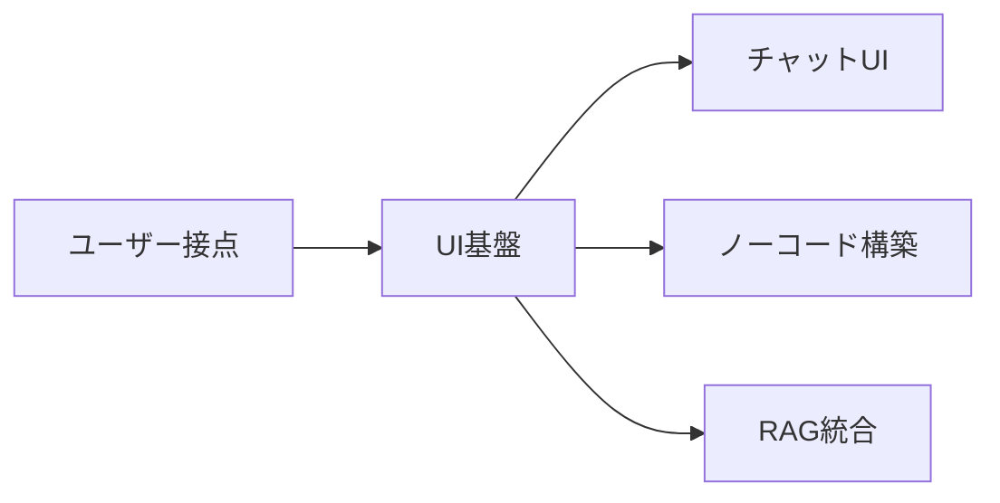
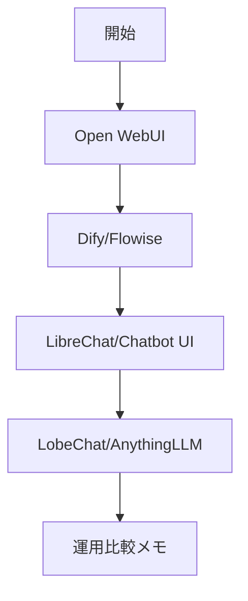

---
level: 🔰 初級（カテゴリ導入）
prereq: -
prev: 03_inference/04_llama-cpp.md
next: 04_ui/01_open-webui.md
---

# UI・チャットアプリ基盤

> 🔰 初級（カテゴリ導入） | 前提: -

ユーザー向けのLLMチャットUIやノーコード/ローコード開発プラットフォーム。

## 位置づけ（Mermaid）

## 学習フロー（Mermaid）

## 含まれるOSS

- **Open WebUI**: ローカル/セルフホストのLLM Web UI
- **Dify**: ワークフロー・アプリ公開機能を持つプラットフォーム
- **Flowise**: ノードベースのLLMフロー構築ツール
- **LibreChat**: 複数LLMプロバイダ対応チャットUI
- **Chatbot UI**: シンプルなChatGPT風UI
- **LobeChat**: モダンなチャットクライアント
- **AnythingLLM**: 文書QA統合のオールインワンUI

## 学習順序

1. Open WebUI (チャットUI・セットアップ簡単)
2. Dify (ノーコードでAIアプリ構築・公開)
3. Flowise (ビジュアルフロー構築)
4. LibreChat (複数モデル運用)
5. Chatbot UI (軽量フロント)
6. LobeChat (モダンUX)
7. AnythingLLM (RAG統合)

## 教材リンク

- [01_open-webui.md](./01_open-webui.md)
- [02_dify.md](./02_dify.md)
- [03_flowise.md](./03_flowise.md)
- [04_librechat.md](./04_librechat.md)
- [05_chatbot-ui.md](./05_chatbot-ui.md)
- [06_lobechat.md](./06_lobechat.md)
- [07_anythingllm.md](./07_anythingllm.md)

## 完了条件

- カテゴリ内の主要OSSを3つ以上説明できる
- 最小サンプルを1件以上動作確認できる
- 選定観点（速度/運用性/拡張性）で比較メモを作成できる

---

[← 前へ](03_inference/04_llama-cpp.md) | [次へ →](04_ui/01_open-webui.md)

