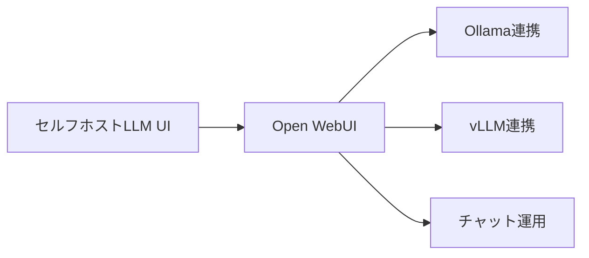
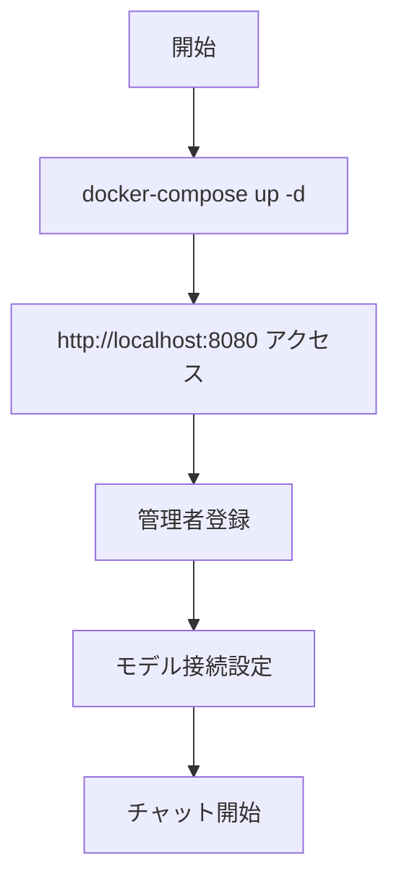

# Open WebUI - ローカル/セルフホスト型チャットUI

> 📖 中級（概念・実践） | 前提: Python基礎 / LLMアプリの基本概念

## この教材で身につくこと

- ChatGPT風の使いやすいインターフェース
- Ollama、vLLM 等と連携
- Docker 一つで起動可能
- インターネット接続不要でも動作
- プラグイン、RAG機能も搭載

**バージョン**: 0.1.0  
**公式ドキュメント**: https://github.com/open-webui/open-webui

## 概要

**Open WebUI** は、セルフホスト型のLLM チャットアプリケーションです。

### 主な特徴

- **UI が美しい**: ChatGPT風の使いやすいインターフェース
- **複数LLMサポート**: Ollama、vLLM 等と連携
- **セットアップが簡単**: Docker 一つで起動可能
- **オフライン対応**: インターネット接続不要でも動作
- **拡張機能**: プラグイン、RAG機能も搭載

---

## 詳細

### 用途

- 社内用チャットボット UI
- ローカル LLM の管理画面
- LLM の複数モデル切り替え
- Ollama + Open WebUI の組み合わせ

### メリット

✅ セットアップが簡単（Docker で2分）  
✅ UI が綺麗で直感的  
✅ 複数LLM管理が容易  
✅ オンプレミス対応  

### デメリット

❌ 本格的なカスタマイズには技術が必要  
❌ コミュニティサポートが限定的  

---

## 前提条件

### 前提条件

- Docker インストール済み
- CPU 2コア以上
- メモリ 4GB 以上

### クイックスタート

```bash
docker-compose up -d
```
ブラウザで http://localhost:8080 にアクセス。

## 位置づけ



## 実行フロー



## 実ソースコード（言語別に記載）
### Source: 01_open-webui.md（tutorials側）

- 役割: Open WebUIの最小セットアップ記述
- 入力: Docker実行環境
- 出力: Open WebUI起動状態

```text
## 前提条件

### 前提条件
- Docker インストール済み
- CPU 2コア以上
- メモリ 4GB 以上

### クイックスタート
docker-compose up -d

ブラウザで http://localhost:8080 にアクセス。
```

---

## 実行方法
### 1. ユーザー登録

初回アクセス時に管理者アカウントを作成します。

### 2. モデル接続

- **Ollama を使用**: Ollama サーバの URL を設定
- **vLLM を使用**: vLLM エンドポイントを設定
- **OpenAI API**: API キーで接続

### 3. チャット開始

モデルを選択して、チャット開始。

---

## よくある質問

**Q. ローカル LLM を接続するには？**  
A. Ollama と組み合わせるのが定番。docker-compose で両方起動できます。

**Q. データは外部に送信されますか？**  
A. いいえ。オンプレミスで完全にクローズドな環境構築可能。

---

## 補足

- [GitHub](https://github.com/open-webui/open-webui)
- [Ollama連携ガイド](https://github.com/open-webui/open-webui/wiki)

## 演習課題

1. ``Open WebUI`` を使う想定ユースケースを1つ定義し、入力・出力の例を記録してください。
2. 最小構成で動かし、デフォルトから設定を1つ変えて挙動の差分を確認してください。
3. ``Open WebUI`` を使わない場合の代替手段と比較し、選ぶ基準をまとめてください。


### 解答の目安

1. まず課題の目的を一文で明確化し、入力・出力を対応づけて記述します。
   確認ポイント: 何を変えて何を確認する課題かを第三者が読んで理解できること。
2. 最小構成で一度実行し、設定や条件を1つ変更して差分を比較します。
   確認ポイント: 変更前後の挙動差を具体的に説明できること。
3. 適用条件と代替手段を整理し、選択基準を短くまとめます。
   確認ポイント: なぜその手段を選ぶかを根拠付きで示せること。
## 理解度チェック

1. ``Open WebUI`` の主な役割を1文で説明してください。
2. ``Open WebUI`` を導入する際の最大のメリットと注意点は何ですか？
3. ``Open WebUI`` が向かないユースケースとして、どのようなケースが考えられますか？


### 解説の要点

1. 主な役割は、その技術がどの工程を担い、何を改善するかで説明します。
2. メリットは再現性・拡張性・運用性の観点で整理し、注意点は導入コストや複雑性として示します。
3. 使い分けは要件、実装コスト、運用体制の3観点で判断します。
---

[← 前へ](04_ui/00_README.md) | [次へ →](04_ui/02_dify.md)


