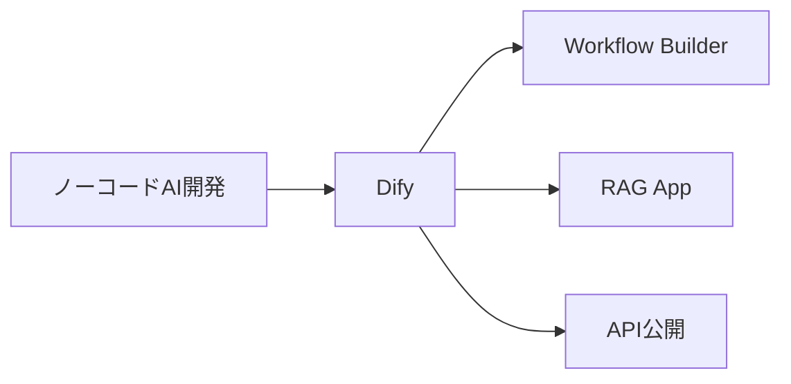
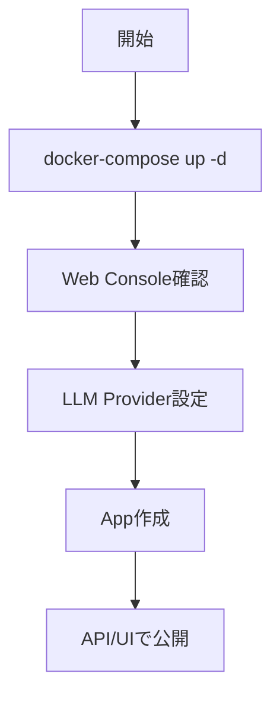

# Dify - ノーコード LLM アプリ開発プラットフォーム

> 📖 中級（概念・実践） | 前提: Python基礎 / LLMアプリの基本概念

## この教材で身につくこと

- ドラッグ&ドロップでワークフロー作成
- OpenAI、Anthropic、Ollama 等
- ドキュメントアップロードで即QA構築
- 作成したアプリを REST API として公開
- バージョン管理と A/B テスト

**バージョン**: 0.3.0  
**公式ドキュメント**: https://docs.dify.ai/

## 概要

**Dify** は、LLMアプリケーションをノーコード/ローコードで開発・デプロイするプラットフォームです。

### 主な特徴

- **ビジュアルフロー構築**: ドラッグ&ドロップでワークフロー作成
- **複数LLM対応**: OpenAI、Anthropic、Ollama 等
- **RAG統合**: ドキュメントアップロードで即QA構築
- **API公開**: 作成したアプリを REST API として公開
- **プロンプト管理**: バージョン管理と A/B テスト

---

## 詳細

### 用途

- 社内AI アプリの高速プロトタイピング
- FAQ チャットボット構築
- ワークフロー自動化
- AI 機能を既存システムに追加

### メリット

✅ コード不要で AI アプリ構築  
✅ 複数ユーザーで並行開発可能  
✅ RAG 機能が充実  
✅ 運用サポート機能（ログ、解析）  

### デメリット

❌ 複雑なロジックにはコード実装が必要  
❌ パフォーマンスチューニングに技術が必要  

---

## 前提条件

### 前提条件

- Docker インストール済み
- PostgreSQL（docker-compose に含む）
- メモリ 8GB 以上推奨

### クイックスタート

```bash
docker-compose up -d
```
初期セットアップが自動実行されます。

## 位置づけ（Mermaid）



## 実行フロー（Mermaid）



## 実ソースコード（言語別に記載）
### Setup: 00_docker-compose.yml

```yaml
version: "3.8"

services:
	dify:
		image: langgenius/dify-api:latest
		container_name: dify-api
		ports:
			- "8081:5001"
		environment:
			- MODE=api
			- SECRET_KEY=change-me
			- CONSOLE_WEB_URL=http://localhost:3000
			- DB_HOST=postgres
			- DB_PORT=5432
			- DB_USERNAME=postgres
			- DB_PASSWORD=postgres
			- DB_DATABASE=dify
			- REDIS_HOST=redis
			- REDIS_PORT=6379
		depends_on:
			- postgres
			- redis

	dify-web:
		image: langgenius/dify-web:latest
		container_name: dify-web
		ports:
			- "3000:3000"
		environment:
			- CONSOLE_API_URL=http://localhost:8081

	postgres:
		image: postgres:15
		container_name: dify-postgres
		environment:
			- POSTGRES_USER=postgres
			- POSTGRES_PASSWORD=postgres
			- POSTGRES_DB=dify
		volumes:
			- dify_postgres:/var/lib/postgresql/data

	redis:
		image: redis:7-alpine
		container_name: dify-redis
		volumes:
			- dify_redis:/data

volumes:
	dify_postgres:
	dify_redis:
```

### Setup: 01_setup-guide.md

```text
# Dify セットアップガイド

## 前提条件
- Docker / Docker Compose
- メモリ 8GB 以上推奨

## 起動
docker-compose up -d

## アクセス先
- 管理画面: http://localhost:3000
- API: http://localhost:8081

## 初期設定
1. 管理者アカウント作成
2. LLM Provider で OpenAI または Ollama を設定
3. 新規 App を作成してチャット開始
```

### Setup: 02_config-examples.md

```text
# Dify 設定例

## 概要
- App Type: Chatbot
- Prompt:
	- あなたは株式分析の初学者向けアシスタントです
	- 専門用語は短く補足を入れてください

## 詳細
1. Knowledge に PDF/Markdown を登録
2. Retriever ノードで top_k=3
3. LLM ノードで回答生成
4. 最後に Citation を有効化
```

---

## 実行方法
### 1. アプリケーション作成

"Create app" ボタンから新規作成。

### 2. ワークフロー構築

- **Input ノード**: ユーザーからの入力
- **LLM ノード**: テキスト生成
- **Output ノード**: 結果出力

### 3. 公開

作成したアプリケーションを API または Web UI として公開。

---

## よくある質問

**Q. どの LLM を選ぶべき？**  
A. 開発時は OpenAI GPT-3.5、本番は Ollama + Llama2 が推奨。

**Q. ドキュメントアップロードに制限はありますか？**  
A. ディスク容量による。大容量の場合は外部 DB 活用推奨。

---

## 補足

- [Dify ドキュメント](https://docs.dify.ai/)
- [GitHub](https://github.com/langgenius/dify)

## 演習課題

1. ``Dify`` を使う想定ユースケースを1つ定義し、入力・出力の例を記録してください。
2. 最小構成で動かし、デフォルトから設定を1つ変えて挙動の差分を確認してください。
3. ``Dify`` を使わない場合の代替手段と比較し、選ぶ基準をまとめてください。


### 解答の目安

1. まず課題の目的を一文で明確化し、入力・出力を対応づけて記述します。
   確認ポイント: 何を変えて何を確認する課題かを第三者が読んで理解できること。
2. 最小構成で一度実行し、設定や条件を1つ変更して差分を比較します。
   確認ポイント: 変更前後の挙動差を具体的に説明できること。
3. 適用条件と代替手段を整理し、選択基準を短くまとめます。
   確認ポイント: なぜその手段を選ぶかを根拠付きで示せること。
## 理解度チェック

1. ``Dify`` の主な役割を1文で説明してください。
2. ``Dify`` を導入する際の最大のメリットと注意点は何ですか？
3. ``Dify`` が向かないユースケースとして、どのようなケースが考えられますか？


### 解説の要点

1. 主な役割は、その技術がどの工程を担い、何を改善するかで説明します。
2. メリットは再現性・拡張性・運用性の観点で整理し、注意点は導入コストや複雑性として示します。
3. 使い分けは要件、実装コスト、運用体制の3観点で判断します。
---

[← 前へ](04_ui/01_open-webui.md) | [次へ →](04_ui/03_flowise.md)


