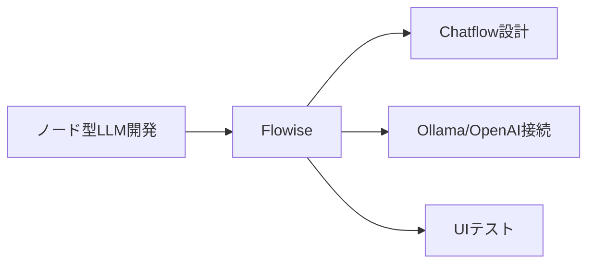
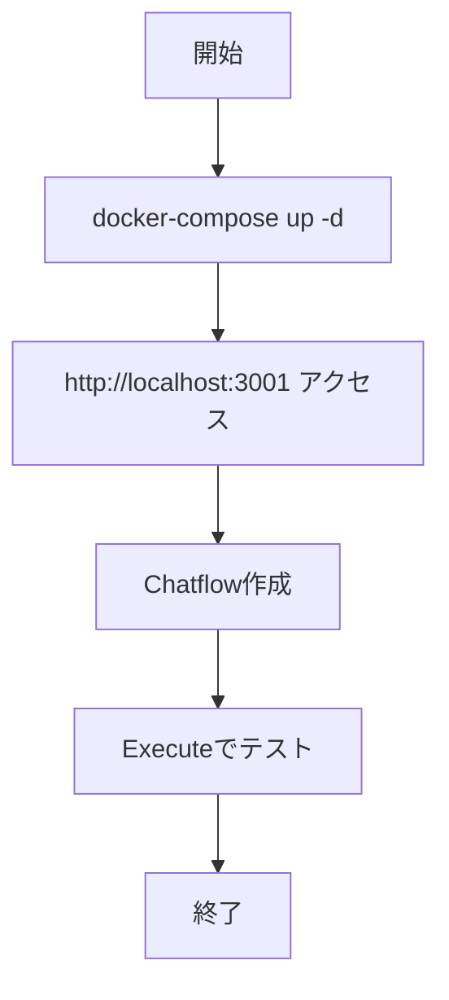

# Flowise 入門

> 📖 中級（概念・実践） | 前提: Python基礎 / LLMアプリの基本概念

## この教材で身につくこと

- ノード接続でのワークフロー設計
- チャットフロー公開
- OpenAI/Ollama 等との接続

## 概要
Flowise はノードベースで LLM ワークフローを作るツールです。コードを書かずにプロンプト、Retriever、LLM の接続を試せるので PoC に向きます。

## 詳細
- ノード接続でのワークフロー設計
- チャットフロー公開
- OpenAI/Ollama 等との接続

## 位置づけ（Mermaid）



## 実行フロー（Mermaid）



## 実ソースコード（言語別に記載）
### Setup: 00_docker-compose.yml

```yaml
version: "3.8"

services:
	flowise:
		image: flowiseai/flowise:latest
		container_name: flowise
		ports:
			- "3001:3000"
		environment:
			- PORT=3000
			- FLOWISE_USERNAME=admin
			- FLOWISE_PASSWORD=admin123
		volumes:
			- flowise_data:/root/.flowise
		restart: unless-stopped

volumes:
	flowise_data:
```

### Setup: 01_setup-guide.md

```text
# Flowise セットアップガイド

## 前提条件
- Docker / Docker Compose

## 起動
docker-compose up -d

## アクセス
- URL: http://localhost:3001
- User: admin
- Password: admin123

## 最初のフロー作成
1. New Chatflow を作成
2. ChatOpenAI か Ollama ノードを追加
3. Prompt Template ノードを接続
4. 保存して Execute でテスト
```

## 演習課題

1. ``Flowise 入門`` を使う想定ユースケースを1つ定義し、入力・出力の例を記録してください。
2. 最小構成で動かし、デフォルトから設定を1つ変えて挙動の差分を確認してください。
3. ``Flowise 入門`` を使わない場合の代替手段と比較し、選ぶ基準をまとめてください。


### 解答の目安

1. まず課題の目的を一文で明確化し、入力・出力を対応づけて記述します。
   確認ポイント: 何を変えて何を確認する課題かを第三者が読んで理解できること。
2. 最小構成で一度実行し、設定や条件を1つ変更して差分を比較します。
   確認ポイント: 変更前後の挙動差を具体的に説明できること。
3. 適用条件と代替手段を整理し、選択基準を短くまとめます。
   確認ポイント: なぜその手段を選ぶかを根拠付きで示せること。
## 理解度チェック

1. ``Flowise 入門`` の主な役割を1文で説明してください。
2. ``Flowise 入門`` を導入する際の最大のメリットと注意点は何ですか？
3. ``Flowise 入門`` が向かないユースケースとして、どのようなケースが考えられますか？


### 解説の要点

1. 主な役割は、その技術がどの工程を担い、何を改善するかで説明します。
2. メリットは再現性・拡張性・運用性の観点で整理し、注意点は導入コストや複雑性として示します。
3. 使い分けは要件、実装コスト、運用体制の3観点で判断します。
---

[← 前へ](04_ui/02_dify.md) | [次へ →](04_ui/04_librechat.md)


