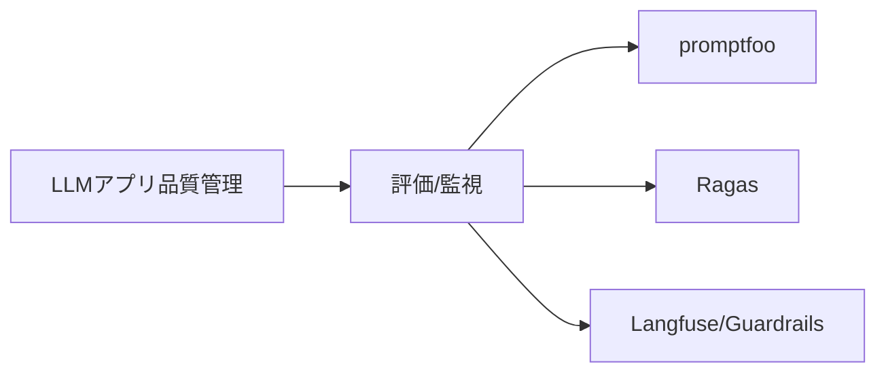
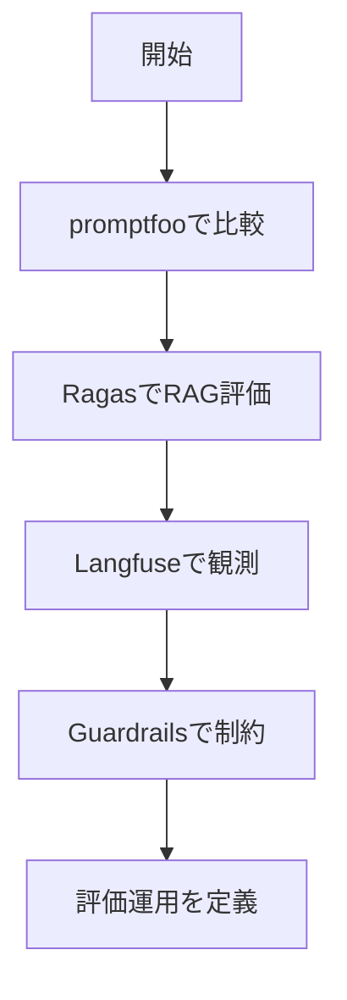

# 評価・ガードレール・監視

> 🔰 初級（カテゴリ導入） | 前提: -

LLMアプリの出力品質を測定し、安全性・信頼性を確保。

## 位置づけ

## 学習フロー

## 含まれるOSS

- **promptfoo**: プロンプト/モデル比較評価
- **Ragas**: RAG品質の自動評価
- **Langfuse**: LLMアプリの観測性・トレーシング
- **Guardrails**: 出力検証と制約付与

## 学習順序

1. promptfoo (プロンプト比較)
2. Ragas (RAG品質測定)
3. Langfuse (本番モニタリング)

## 教材リンク

- [01-promptfoo.md](./01-promptfoo.md)
- [01_promptfoo-samples](./01_promptfoo-samples/)
- [02-ragas.md](./02-ragas.md)
- [02-ragas-python](./02-ragas-python/)
- [03-langfuse.md](./03-langfuse.md)
- [04-guardrails.md](./04-guardrails.md)
- [04_guardrails-python](./04_guardrails-python/)

## 完了条件

- カテゴリ内の主要OSSを3つ以上説明できる
- 最小サンプルを1件以上動作確認できる
- 選定観点（速度/運用性/拡張性）で比較メモを作成できる

---

[← 前へ](04-ui/07-anythingllm.md) | [次へ →](05-evaluation/01-promptfoo.md)

