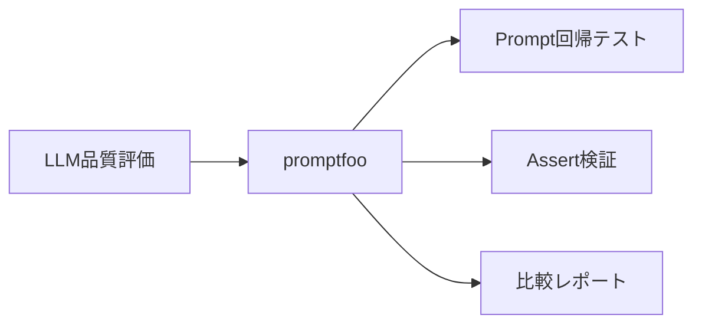
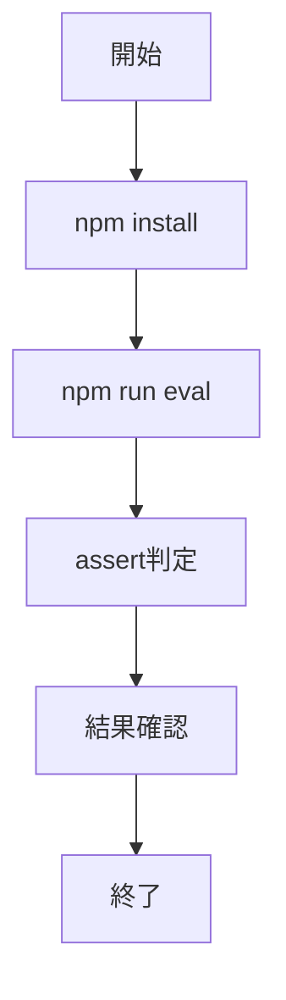

# promptfoo - プロンプト品質を定量評価するCLIツール

> 📖 中級（概念・実践） | 前提: Python基礎 / LLMアプリの基本概念

## この教材で身につくこと

- 複数プロンプトを一括評価できる
- assertによる品質判定を設定できる
- 回帰テストとしてプロンプト変更の影響を検知できる
- 評価結果レポートを解釈して改善点を特定できる

## 概要

**promptfoo** は、LLM（大規模言語モデル）へのプロンプト（入力文）に対する出力結果を、効率的かつ定量的に評価・比較するためのCLIツールです。複数のプロンプトやモデルの出力品質を自動でテスト・検証し、継続的な改善や回帰テストを容易にします。

設定ファイルで評価したいプロンプトやテストケース、判定基準（assert条件）を定義し、CLIコマンドで一括実行します。各プロンプトに対してモデル出力を取得し、事前に決めた基準で自動判定・比較レポートを生成します。これにより、プロンプトやモデルの変更による品質の変化を素早く把握できます。

**バージョン**: 0.75.0+ / OSS準拠（2026-05時点）  
**公式ドキュメント**: https://www.promptfoo.dev/

## 位置づけ



promptfoo は、LLMアプリ開発における評価フェーズを担うツールです。プロンプト設計 → 評価 → 改善のループを自動化し、手動レビューでは気づきにくい品質劣化を継続的に検知します。

## 実行フロー



処理の流れ:

1. 目的と入力を定義し、対象データや利用モデルを準備します。
2. 設定ファイル（YAML）でプロンプト・テストケース・assert条件を記述します。
3. `npm run eval` で一括評価を実行します。
4. assert判定結果を確認し、失敗傾向からプロンプトを改善します。
5. 改善後に再実行して品質差分を比較します。

## 最小セットアップ

このサンプルは `providers: openai:gpt-3.5-turbo` を利用するため、実行前に `OPENAI_API_KEY` の設定が必要です。

```powershell
# PowerShell（現在のセッションのみ有効）
$env:OPENAI_API_KEY = "<YOUR_OPENAI_API_KEY>"
```

`--env-file .env` を使う場合は、実行ディレクトリに `.env` を作成してから実行します。

```env
OPENAI_API_KEY=<YOUR_OPENAI_API_KEY>
```

必要に応じて、互換エンドポイントを使う場合は `OPENAI_API_BASE_URL` も設定してください。

```bash
cd examples/promptfoo
npm install
npm run eval
```

## 実ソースコード

### JSON: examples/promptfoo/package.json

- 役割: promptfoo実行用の npm スクリプト定義
- 入力: なし
- 出力: `npm run eval` で評価実行

```json
{
  "name": "promptfoo-samples",
  "private": true,
  "version": "1.0.0",
  "engines": {
    "node": ">=20 <25"
  },
  "scripts": {
    "eval": "promptfoo eval -c 00_promptfooconfig.yaml"
  },
  "devDependencies": {
    "promptfoo": "^0.121.11"
  }
}
```

### YAML: examples/promptfoo/00_promptfooconfig.yaml

- 役割: 評価対象プロンプト・テストケース・assert条件をまとめる設定ファイル
- 入力: `tests.vars.question`
- 出力: 評価結果（CLI実行時）

```yaml
description: Beginner prompt regression test
providers:
  - id: openai:gpt-3.5-turbo
prompts:
  - "あなたは投資学習アシスタントです。{{question}} を初心者向けに3行で説明してください。"
  - "{{question}} を中学生にもわかる言葉で2行で説明してください。"
tests:
  - vars:
      question: "RAG"
    assert:
      - type: contains
        value: "検索"
  - vars:
      question: "分散投資"
    assert:
      - type: llm-rubric
        value: "初心者向けで、専門用語に短い補足がある"
```

#### assert type の意味と代表的な値一覧

promptfoo の `assert` には複数の type があり、出力の自動判定に使います。

#### 代表的な type

- `contains`: 出力に特定の文字列が含まれているか判定します。
  - 例: `contains: "検索"` → 出力に「検索」という語が含まれていれば合格
- `llm-rubric`: LLM自身にルーブリック（採点基準）で自己評価させます。
  - 例: `llm-rubric: "初心者向けで、専門用語に短い補足がある"`
    → LLMが基準を満たしているか自己判定し、理由とスコアを返します。

#### その他の主な type（2024年5月時点）

- `equals`: 完全一致判定
- `not-contains`: 指定語が含まれていないか
- `javascript`: JS式でカスタム判定
- `python`: Python式でカスタム判定
- `regex`: 正規表現マッチ
- `llm-classify`: LLMによる分類判定
- `llm-judge`: LLMによる比較判定

詳細は公式ドキュメント: https://www.promptfoo.dev/docs/reference/asserts を参照してください。

### 実行結果（評価観点）

- 実行結果: 4テストを実行し、0 passed / 4 failed / 0 errors
- 失敗傾向1: `contains: "検索"` が未一致（RAG を投資用語として解釈する回答が出るケースあり）
- 失敗傾向2: `llm-rubric` が未達（初心者向け補足や行数制約の満たし方が不十分）

この結果から、改善の主対象は環境設定ではなく、プロンプト設計と `assert` 条件の調整です。

#### 実行結果の詳細（JSON抜粋）

実際の評価出力例：

```json
{
  "results": [
    {
      "error": "Expected output to contain '検索'",
      "response": {
        "output": "RAG（Risk, Appetite, and Goals）は投資文脈の用語として解釈される場合があり、この回答では検索拡張生成としてのRAGを説明できていません。"
      },
      "testCase": {
        "vars": { "question": "RAG" },
        "assert": [ { "type": "contains", "value": "検索" } ]
      }
    },
    {
      "error": "初心者向け説明は概ね良好です。『分散投資』には補足がありますが、『ポートフォリオ』などの専門用語に短い補足がなく、初心者にはやや分かりにくい可能性があります。",
      "response": {
        "output": "分散投資とは、複数の異なる資産に投資することです。これにより、リスクを分散しポートフォリオ全体の安定性を高めることができます。初心者にとってはリスク管理の一つの方法として有効です。"
      },
      "testCase": {
        "vars": { "question": "分散投資" },
        "assert": [ { "type": "llm-rubric", "value": "初心者向けで、専門用語に短い補足がある" } ]
      }
    }
  ]
}
```

## 演習課題

1. 比較したいプロンプトを2つ作り、どの観点で優劣を判定するか決めてください。
2. assertを1つ追加し、評価結果がどう変わるか確認してください。
3. この評価をPR前チェックに組み込む場合の手順を書き出してください。

### 解答の目安

1. まず課題の目的を一文で明確化し、入力・出力を対応づけて記述します。
   確認ポイント: 何を変えて何を確認する課題かを第三者が読んで理解できること。
2. 最小構成で一度実行し、設定や条件を1つ変更して差分を比較します。
   確認ポイント: 変更前後の挙動差を具体的に説明できること。
3. 適用条件と代替手段を整理し、選択基準を短くまとめます。
   確認ポイント: なぜその手段を選ぶかを根拠付きで示せること。

## 理解度チェック

1. promptfoo の主な役割を1文で説明してください。
2. assert を使う利点は何ですか？
3. 手動レビューのみと比べたときの限界は何ですか？

### 解説の要点

1. 主な役割は、その技術がどの工程を担い、何を改善するかで説明します。
2. メリットは再現性・拡張性・運用性の観点で整理し、注意点は導入コストや複雑性として示します。
3. 使い分けは要件、実装コスト、運用体制の3観点で判断します。

## 参考リンク

- [promptfoo 公式ドキュメント](https://www.promptfoo.dev/)
- [assert type 一覧](https://www.promptfoo.dev/docs/reference/asserts)
- [GitHub Repository](https://github.com/promptfoo/promptfoo)

---

[← 前へ](00-README.md) | [次へ →](02-ragas.md)
