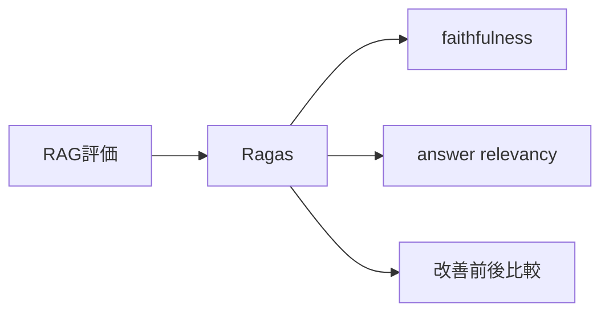
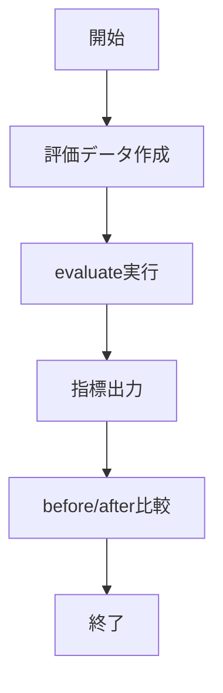

# Ragas - RAG出力品質を定量評価するOSSライブラリ

> 📖 中級（概念・実践） | 前提: Python基礎 / LLMアプリの基本概念

## この教材で身につくこと

- 評価データセットを作成できる
- RAG指標（faithfulness, relevancy等）でスコアを測定できる
- before/afterのスコア比較で改善効果を定量化できる
- 実験ループを構築して継続的な品質改善を回せる

## 概要

**Ragas** は、RAG（検索拡張生成）やAIエージェントの出力品質を、実験ベースで定量評価・比較できるOSSライブラリです。faithfulnessやanswer relevancyなど多様な指標で品質を可視化し、継続的な改善ループを実現します。

「実験ファースト」な評価設計を推奨し、手動評価の限界を克服します。カスタム指標や豊富な既存指標、LangChain/LlamaIndex等との連携も容易です。データセット・指標・実験単位で評価設計し、コア関数（evaluate）で一括スコアを算出します。

**バージョン**: 0.1.0+ / OSS準拠（2026-05時点）  
**公式ドキュメント**: https://docs.ragas.io/

## 位置づけ



Ragas は、RAGパイプラインの評価フェーズを担うライブラリです。検索品質と生成品質の両面を定量指標で測定し、プロンプトやチャンク設定の変更効果を客観的に比較できます。

## 実行フロー



処理の流れ:

1. 目的と入力を定義し、対象データや利用モデルを準備します。
2. question・answer・contexts・ground_truthを含む評価データセットを作成します。
3. `evaluate()` 関数で指標を一括スコア算出します。
4. before/after比較で改善効果を確認します。
5. 運用を想定して再実行手順と確認ポイントを定着させます。

## 最小セットアップ

必要パッケージ: ragas, datasets, pandas, langchain-openai, python-dotenv

```txt
ragas==0.1.10
datasets==2.19.1
pandas==2.2.2
langchain-openai==0.1.0
python-dotenv==1.0.0
```

```bash
# 仮想環境作成・パッケージインストール
python -m venv .venv
source .venv/bin/activate  # Windowsは .venv\Scripts\activate
pip install -r requirements.txt
```

## 実ソースコード

### 01_basic-ragas-eval.py

基本的なRAG評価例。faithfulness, answer relevancyの2指標でスコアを算出。

```python
"""Ragas basic evaluation example."""
from dotenv import load_dotenv
from datasets import Dataset
from ragas import evaluate
from ragas.metrics import faithfulness, answer_relevancy

load_dotenv()

def build_dataset():
    data = {
        "question": [
            "RAGとは何ですか?",
            "分散投資の基本を教えて",
        ],
        "answer": [
            "RAGは検索で見つけた情報を使って回答を作る手法です。",
            "分散投資は資産を複数に分けてリスクを下げる考え方です。",
        ],
        "contexts": [
            ["RAGはRetrieval-Augmented Generationの略で、検索結果を生成時に参照する。"],
            ["分散投資は複数資産へ配分して価格変動リスクを抑える。"],
        ],
        "ground_truth": [
            "RAGは検索結果を参照して回答精度を上げる手法。",
            "分散投資は資産配分でリスクを軽減する。",
        ],
    }
    return Dataset.from_dict(data)

def main():
    dataset = build_dataset()
    result = evaluate(
        dataset,
        metrics=[faithfulness, answer_relevancy],
    )
    print("Ragas scores")
    print(result)

if __name__ == "__main__":
    main()
```

### 02_compare-runs.py

before/afterのスコア比較例。pandasで差分を算出。

```python
"""Compare two dummy RAG runs by simple table output."""
import pandas as pd

def main():
    before = pd.DataFrame(
        {
            "metric": ["faithfulness", "answer_relevancy"],
            "score": [0.71, 0.68],
        }
    )
    after = pd.DataFrame(
        {
            "metric": ["faithfulness", "answer_relevancy"],
            "score": [0.80, 0.77],
        }
    )
    merged = before.merge(after, on="metric", suffixes=("_before", "_after"))
    merged["delta"] = merged["score_after"] - merged["score_before"]
    print("Comparison")
    print(merged.to_string(index=False))

if __name__ == "__main__":
    main()
```

実行方法:

```bash
pip install -r 00_requirements.txt
python 01_basic-ragas-eval.py
```

## 演習課題

1. Ragas を使う想定ユースケースを1つ定義し、入力・出力の例を記録してください。
2. 最小構成で動かし、デフォルトから設定を1つ変えて挙動の差分を確認してください。
3. Ragas を使わない場合の代替手段と比較し、選ぶ基準をまとめてください。

### 解答の目安

1. まず課題の目的を一文で明確化し、入力・出力を対応づけて記述します。
   確認ポイント: 何を変えて何を確認する課題かを第三者が読んで理解できること。
2. 最小構成で一度実行し、設定や条件を1つ変更して差分を比較します。
   確認ポイント: 変更前後の挙動差を具体的に説明できること。
3. 適用条件と代替手段を整理し、選択基準を短くまとめます。
   確認ポイント: なぜその手段を選ぶかを根拠付きで示せること。

## 理解度チェック

1. Ragas の主な役割を1文で説明してください。
2. Ragas を導入する際の最大のメリットと注意点は何ですか？
3. Ragas が向かないユースケースとして、どのようなケースが考えられますか？

### 解説の要点

1. 主な役割は、その技術がどの工程を担い、何を改善するかで説明します。
2. メリットは再現性・拡張性・運用性の観点で整理し、注意点は導入コストや複雑性として示します。
3. 使い分けは要件、実装コスト、運用体制の3観点で判断します。

## 参考リンク

- [Ragas 公式ドキュメント](https://docs.ragas.io/)
- [GitHub Repository](https://github.com/explodinggradients/ragas)

---

[← 前へ](01-promptfoo.md) | [次へ →](03-langfuse.md)
