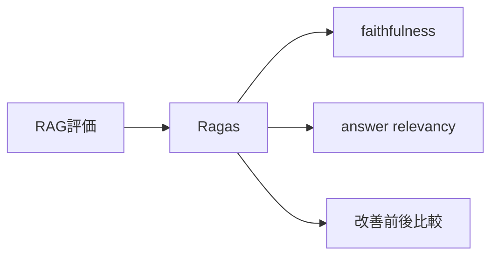
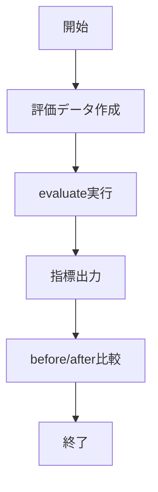

# Ragas 入門

> 📖 中級（概念・実践） | 前提: Python基礎 / LLMアプリの基本概念

## この教材で身につくこと

- 評価データセット作成
- RAG指標の測定
- スコア比較

## コンセプト
Ragas は RAG の回答品質を定量評価するライブラリです。faithfulness や answer relevancy などの指標で、改善前後を比較できます。

**バージョン**: 0.1.0+ / OSS準拠（2026-05時点）  
**公式ドキュメント**: https://docs.ragas.io/

## 仕組み

1. 目的と入力を定義し、対象データや利用モデルを準備します。
2. コア処理（検索・推論・生成・検証のいずれか）を実行します。
3. 実行結果を保存または表示し、次工程に渡せる形式へ整えます。
4. パラメータを調整して挙動差分を比較し、品質を確認します。
5. 運用を想定して再実行手順と確認ポイントを定着させます。
## 位置づけ



## 実行フロー



## サンプル

### 実行例

```bash
# この教材の最小構成を順に実行
# 具体的なコマンドは「最小セットアップ」または「実行フロー」を参照
```

### 検証

- コマンドがエラーなく完了する
- 想定した出力（画面表示・ファイル生成・回答）を確認できる
- 変更した設定に応じて結果差分を説明できる
## 実ソースコード（言語別に記載）
### 00_requirements.txt

```txt
ragas==0.1.10
datasets==2.19.1
pandas==2.2.2
langchain-openai==0.1.0
python-dotenv==1.0.0
```

### 01_basic-ragas-eval.py

```python
"""Ragas basic evaluation example."""

from dotenv import load_dotenv
from datasets import Dataset
from ragas import evaluate
from ragas.metrics import faithfulness, answer_relevancy


load_dotenv()


def build_dataset() -> Dataset:
	data = {
		"question": [
			"RAGとは何ですか?",
			"分散投資の基本を教えて",
		],
		"answer": [
			"RAGは検索で見つけた情報を使って回答を作る手法です。",
			"分散投資は資産を複数に分けてリスクを下げる考え方です。",
		],
		"contexts": [
			["RAGはRetrieval-Augmented Generationの略で、検索結果を生成時に参照する。"],
			["分散投資は複数資産へ配分して価格変動リスクを抑える。"],
		],
		"ground_truth": [
			"RAGは検索結果を参照して回答精度を上げる手法。",
			"分散投資は資産配分でリスクを軽減する。",
		],
	}
	return Dataset.from_dict(data)


def main() -> None:
	dataset = build_dataset()
	result = evaluate(
		dataset,
		metrics=[faithfulness, answer_relevancy],
	)

	print("Ragas scores")
	print(result)


if __name__ == "__main__":
	main()
```

### 02_compare-runs.py

```python
"""Compare two dummy RAG runs by simple table output."""

import pandas as pd


def main() -> None:
	before = pd.DataFrame(
		{
			"metric": ["faithfulness", "answer_relevancy"],
			"score": [0.71, 0.68],
		}
	)
	after = pd.DataFrame(
		{
			"metric": ["faithfulness", "answer_relevancy"],
			"score": [0.80, 0.77],
		}
	)

	merged = before.merge(after, on="metric", suffixes=("_before", "_after"))
	merged["delta"] = merged["score_after"] - merged["score_before"]

	print("Comparison")
	print(merged.to_string(index=False))


if __name__ == "__main__":
	main()
```

## 実行
```bash
cd 02-ragas-python
pip install -r 00_requirements.txt
python 01_basic-ragas-eval.py
```

## 演習課題

1. ``Ragas 入門`` を使う想定ユースケースを1つ定義し、入力・出力の例を記録してください。
2. 最小構成で動かし、デフォルトから設定を1つ変えて挙動の差分を確認してください。
3. ``Ragas 入門`` を使わない場合の代替手段と比較し、選ぶ基準をまとめてください。


### 解答の目安

1. まず課題の目的を一文で明確化し、入力・出力を対応づけて記述します。
   確認ポイント: 何を変えて何を確認する課題かを第三者が読んで理解できること。
2. 最小構成で一度実行し、設定や条件を1つ変更して差分を比較します。
   確認ポイント: 変更前後の挙動差を具体的に説明できること。
3. 適用条件と代替手段を整理し、選択基準を短くまとめます。
   確認ポイント: なぜその手段を選ぶかを根拠付きで示せること。
## 理解度チェック

1. ``Ragas 入門`` の主な役割を1文で説明してください。
2. ``Ragas 入門`` を導入する際の最大のメリットと注意点は何ですか？
3. ``Ragas 入門`` が向かないユースケースとして、どのようなケースが考えられますか？


### 解説の要点

1. 主な役割は、その技術がどの工程を担い、何を改善するかで説明します。
2. メリットは再現性・拡張性・運用性の観点で整理し、注意点は導入コストや複雑性として示します。
3. 使い分けは要件、実装コスト、運用体制の3観点で判断します。
---

[← 前へ](05-evaluation/01-promptfoo.md) | [次へ →](05-evaluation/03-langfuse.md)


